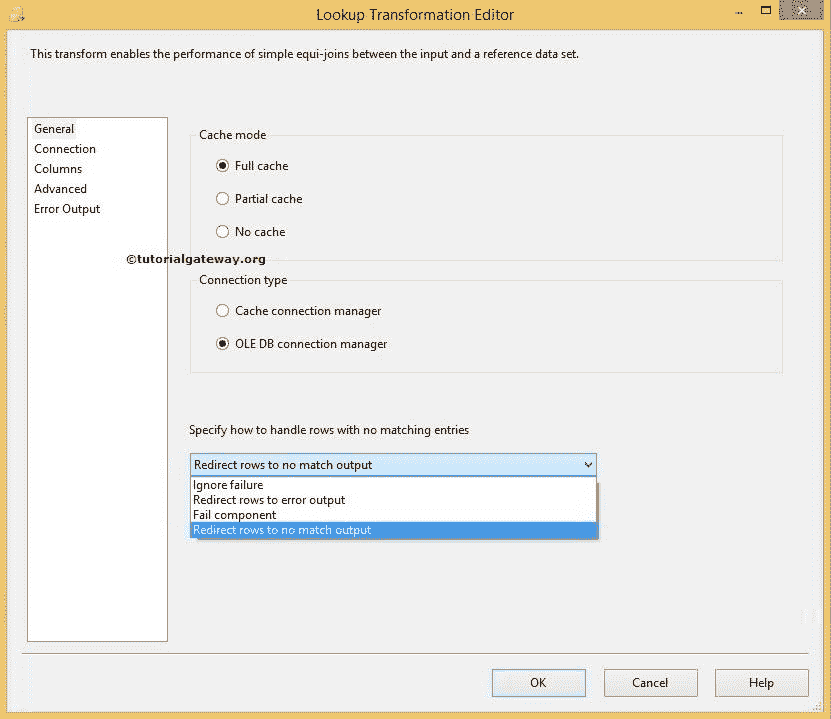

# 在 SSIS 查找

> 原文：<https://www.tutorialgateway.org/lookup-in-ssis/>

SSIS 查找是最有用的转换之一，用于将源数据与参考表(或查找表)中的现有数据进行比较，并找到匹配的数据。对于不匹配的行，我们可以进一步做一些更多的工作。

查找转换中的区分大小写:在 SSIS 查找区分大小写、区分假名、区分重音。即使源数据库和目标数据库设置不区分大小写，查找转换也没有关系。因此，如果您的 SSIS 数据不正确，建议您将查找表和源数据转换为大写或小写。请参考[查找转换区分大小写](https://www.tutorialgateway.org/ssis-lookup-transformation-case-sensitivity/)一文，以便更好的理解。

## 在 SSIS 配置查找所涉及的步骤

双击 SSIS 的查找将打开查找转换编辑器进行配置。在“常规”页面中，它为我们提供了设置缓存模式、连接类型和指定如何处理没有匹配条目的行选项的选项。

在 SSIS 查找仅支持两种类型的连接管理器:

*   OLE DB 连接管理器:查找转换使用 [OLE DB 连接管理器](https://www.tutorialgateway.org/ole-db-connection-manager-in-ssis/)来访问存在于 [SQL Server](https://www.tutorialgateway.org/sql/) 、Oracle 和 DB2 中的引用表。请参考 SSIS 文章中的[查找转换，了解如何使用 OLE DB 连接管理器配置查找转换。](https://www.tutorialgateway.org/lookup-transformation-in-ssis/)
*   缓存连接管理器:默认情况下，SSIS 查找使用 OLE DB 连接管理器来连接引用表。其他来源可以使用，但必须通过[缓存转换](https://www.tutorialgateway.org/cache-transformation-in-ssis/)间接使用。例如，我们可以使用缓存连接管理器将文本文件或 Excel 文件用作查找表。请参考[全缓存模式下的查找转换](https://www.tutorialgateway.org/ssis-lookup-transformation-in-full-cache-mode/)文章，了解如何使用[缓存连接管理器](https://www.tutorialgateway.org/cache-connection-manager-in-ssis/)配置查找转换

### 在 SSIS 缓存模式下查找

SSIS 查找缓存模式有三个选项:

*   全缓存模式:这是查找转换中最常用的方法。如果我们选择了这个选项，整个查找(或引用)表将被预加载到缓存(内存)中。SSIS 查找转换将从内存而不是数据集执行查找。当查找表中的行数较少时，它工作得很好。
*   部分缓存模式:如果我们选择了此选项，SSIS 查找转换会以空缓存开始转换。当数据流中出现新行时，查找转换首先检查其缓存中的匹配值。如果在缓存中找不到它，它将检查查找表。如果没有找到匹配，它会查询查找表。如果匹配位于查找表中，则下次缓存(存储在内存中)该值。如果查找表很大，我们可以使用这种 SSIS 方法。
*   无缓存模式:如果我们选择了此选项，查找转换将不会在任何阶段使用缓存来存储查找表。当数据流中出现新行时，SSIS 查找会直接在查找表中检查匹配的值。

### SSIS 查找中的错误处理

此页面上的最后一个选项是指定如何处理没有匹配条目的行。 [SSIS](https://www.tutorialgateway.org/ssis/) 查找转换为您提供了四个选项:

*   失败组件(默认):当一个新行从数据流传递到查找时。如果在查找表中找不到任何匹配的行，SSIS 查找将使包失败。
*   忽略失败:如果我们选择了此选项，当从数据流传递新行时，查找转换将继续处理，即使它在查找表中找不到任何匹配的行。
*   将行重定向到不匹配输出:如果我们选择了此选项，查找转换会将查找表中找不到任何匹配行的行定向到不匹配。实时情况下，我们通常使用此选项。
*   将行重定向到错误输出:如果我们选择了此选项，SSIS 查找转换会将查找表中找不到任何匹配行的行定向到标准错误输出。

提示:在高级页面中，我们调整了查找转换的缓存属性。