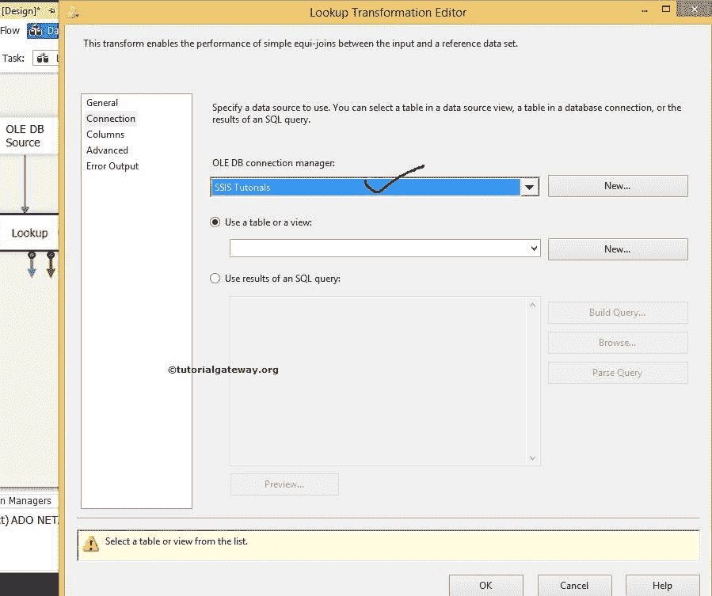
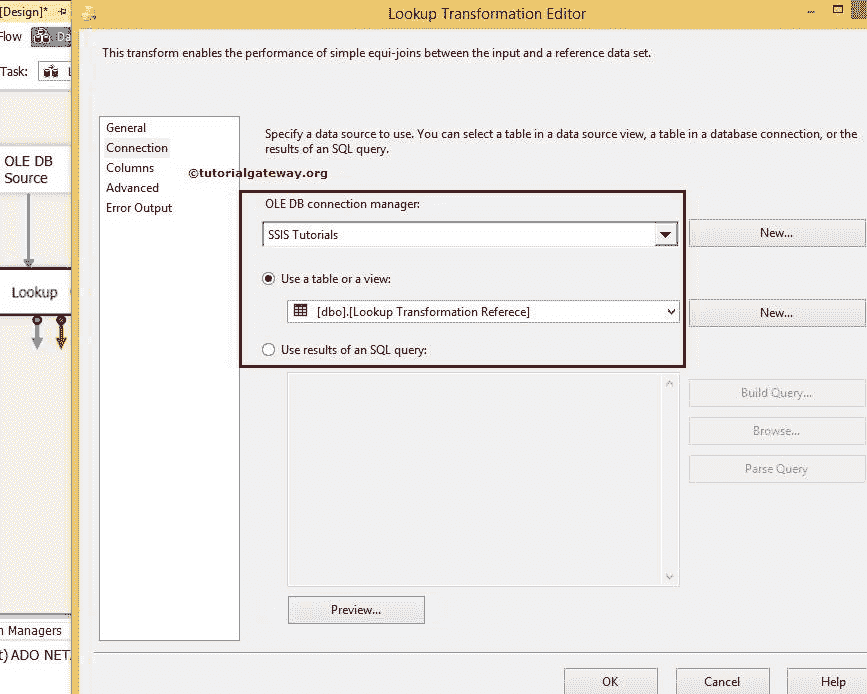
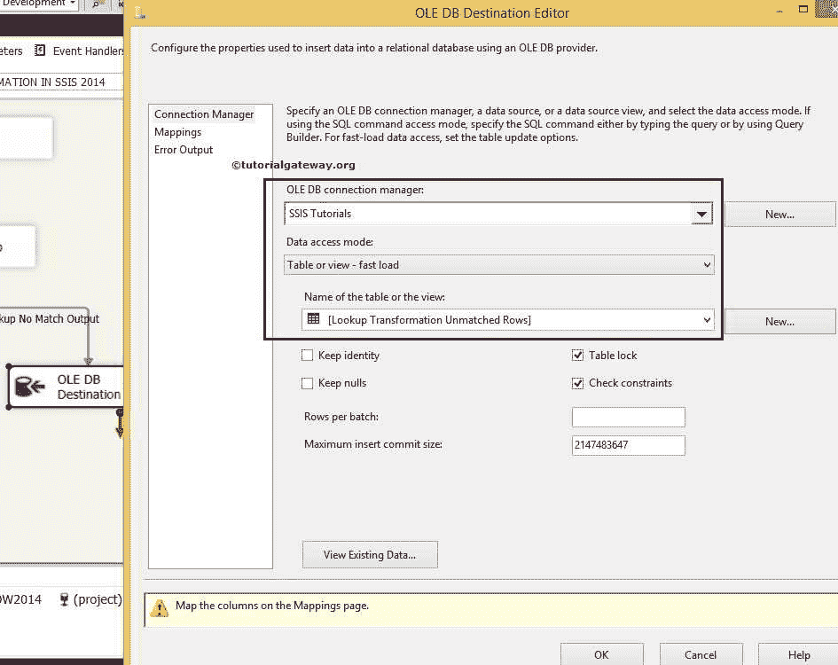

# SSIS 的查找转换

> 原文：<https://www.tutorialgateway.org/lookup-transformation-in-ssis/>

在本文中，我们将通过一个例子来解释如何使用 OLE DB 连接管理器在 SSIS 执行查找转换。在本例中，我们将使用 OLE-DB 连接来连接到 SQL Server 并执行 SSIS 查找操作。

提示:请参考 SSIS 的[查找](https://www.tutorialgateway.org/lookup-in-ssis/)文章，了解 SSIS 查找转换中可用的属性

在我们开始创建 SSIS 查找转换包之前，让我们看看查找表及其数据。

现在我们也来看看源数据。

## 在 SSIS 配置查找转换

步骤 1:将数据流任务从工具箱拖放到控制流区域。接下来，在 SSIS 将其重命名为查找转换。

双击它，它将打开数据流选项卡。

第二步:将 [OLE DB 源](https://www.tutorialgateway.org/ole-db-source-in-ssis/)从工具箱拖放到数据流区域。双击数据流区域中的 OLE DB 源将打开[连接管理器](https://www.tutorialgateway.org/ole-db-connection-manager-in-ssis/)设置

从上面的截图可以观察到，我们在 [SQL Server](https://www.tutorialgateway.org/sql/) 中选择了【SSIS 教程】数据库作为源数据库，【查找转换源】作为源表

第 3 步:单击列选项卡验证列。在此选项卡中，我们还可以取消选中不需要的列。

单击确定并将 SSIS 查找转换从工具箱拖到数据流选项卡。

步骤 4:双击 SSIS 查找转换将打开查找转换编辑器。使用此选项配置查找表(参考表)。

在“SSIS 查找转换常规”选项卡的“指定如何处理没有匹配条目的行”下将默认的“失败组件”更改为“将行重定向到不匹配的输出”选项。更改此选项，将所有不匹配的行重定向到“不匹配”输出。否则，包将失败。

在 SSIS 查找转换连接类型部分，我们选择了 OLE DB 连接管理器，因为我们使用 SQL Server 表作为参考表。

如果您正在使用任何缓存文件(。然后使用缓存连接管理器。请参考[全缓存模式下的 SSIS 查找转换](https://www.tutorialgateway.org/ssis-lookup-transformation-in-full-cache-mode/)文章，了解如何在 SSIS 使用缓存文件执行查找操作

单击 SSIS 查找转换的连接选项卡

第五步:如果已经创建了 [OLE DB 连接管理器](https://www.tutorialgateway.org/ole-db-connection-manager-in-ssis/)，则从列表中选择，否则，单击新建按钮进行配置。在这里，我们决定了 SSIS 教程数据库。

对于本例，我们使用[查找转换引用]表作为查找表或引用表。源数据将与本表中的数据进行比较。

提示:我们不应该将整个表用作 SSIS 查找的参考表。也许您应该使用 SQL 命令来选择您想要引用的所需列名。

第六步:点击可用输入栏。并拖动到可用的查阅列，在两个数据集之间创建一个联接。

源数据中的国家/地区列将与查找表中的[国家/地区名称]列进行核对。

*   如果源数据中“国家/地区”列的每一行都与查找表[国家/地区名称]列的任何一行匹配，该行将传递到匹配输出。
*   如果它与查找表中[国家/地区名称]列的任何一行不匹配，则该行将被传递到“不匹配输出”。

有时，我们可能会在查找表中有一些额外的列，我们希望将其传递给匹配的输出。在这些情况下，我们会在“可用查找列”中选中该列，就像我们对“Cid”列所做的那样。

第七步:将两个 [OLE DB 目标](https://www.tutorialgateway.org/ssis-ole-db-destination/)拖放到数据流区域，然后将输出箭头拖动到这个新的 OLE-DB 目标。将出现一个弹出窗口，输入输出选择窗口，提示您选择输入输出类型:查找匹配输出或查找不匹配输出。选择查找匹配输出，然后单击确定。

当您将另一个输出箭头拖到 OLE 数据库目标 1 时，它将自动为其分配查找不匹配输出。

第八步:双击 [OLE DB 目标](https://www.tutorialgateway.org/ssis-ole-db-destination/)打开 OLE DB 目标编辑器。选择 OLE-DB 连接管理器，并在[SSIS 教程]数据库中选择[查找转换匹配行]表来存储匹配行数据。

步骤 9:单击映射选项卡，检查 SSIS 查找转换源列是否正确映射到目标列。

步骤 10:现在双击 [OLE 数据库目标](https://www.tutorialgateway.org/ssis-ole-db-destination/) 1 来配置不匹配输出。在这里，我们将选择[SSIS 教程]数据库中的[查找转换不匹配行]表来存储不匹配行数据。

重复步骤 9，然后单击确定完成创建 SSIS 查找转换包。

在解决方案资源管理器中右键单击 SSIS 包中的查找转换，然后选择执行包。

正如您所看到的，我们在 SSIS 包中的查找转换已经成功执行。让我们打开 [SQL Server](https://www.tutorialgateway.org/sql/) 管理工作室，查看 SSIS 查找转换匹配行数据。

让我们看看 SSIS 查找转换不匹配行数据。

