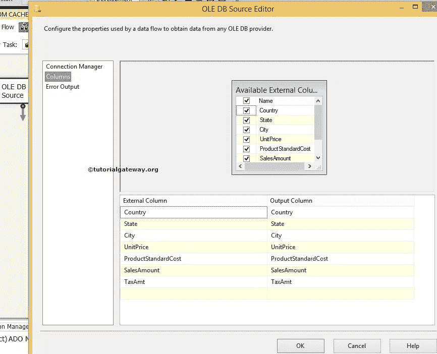
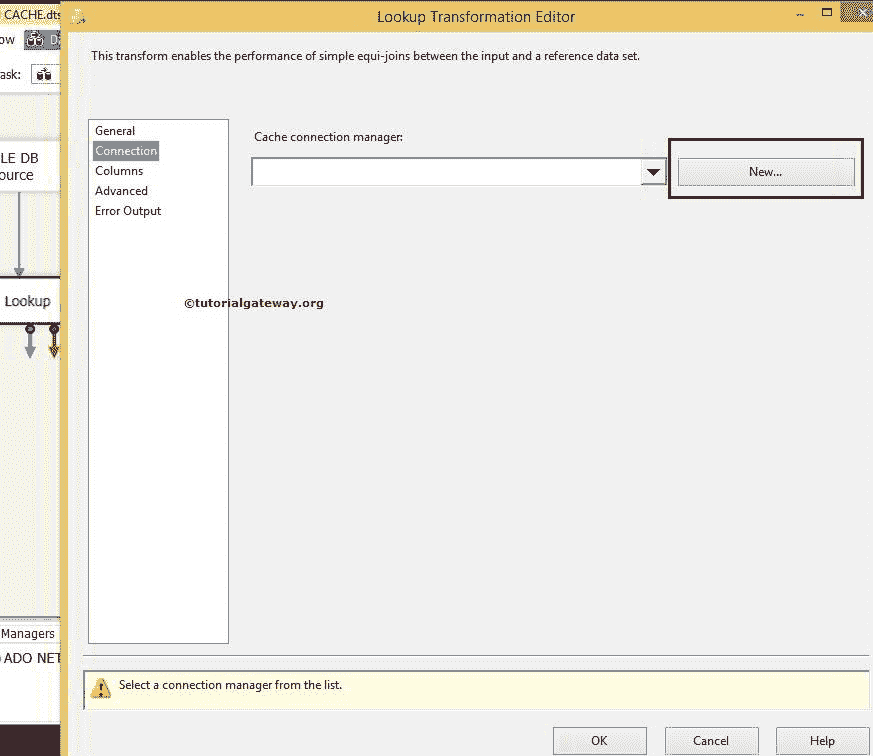
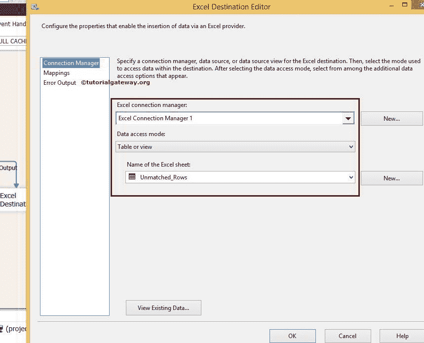
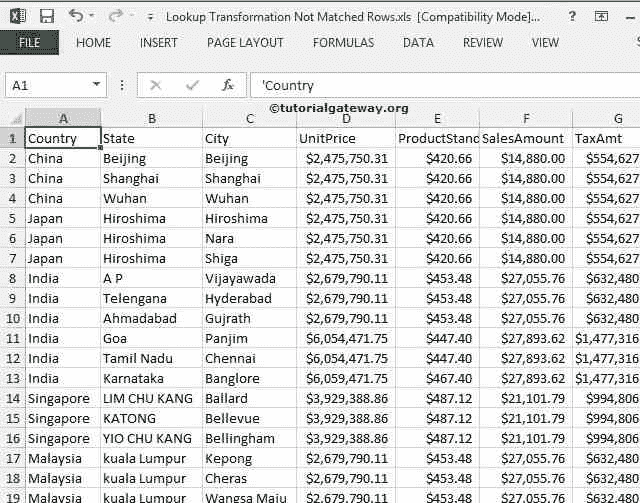

# 全缓存模式下的 SSIS 查找转换

> 原文：<https://www.tutorialgateway.org/ssis-lookup-transformation-in-full-cache-mode/>

在本文中，我们将通过一个示例来解释如何在全缓存模式下执行 SSIS 查找转换。要使用完全缓存模式，我们必须使用缓存连接管理器和 SSIS 查找转换。

在开始创建全缓存模式下的 SSIS 查找转换包之前，请参考[查找](https://www.tutorialgateway.org/lookup-in-ssis/)一文来了解属性。

提示:请参考 SSIS 的[查找转换](https://www.tutorialgateway.org/lookup-transformation-in-ssis/)文章，了解 SSIS 查找将如何使用 SSIS 的 [OLE DB 连接管理器](https://www.tutorialgateway.org/ole-db-connection-manager-in-ssis/)在 SQL Server、Oracle 和 DB2 服务器等数据库上运行。

在开始创建包之前，让我们看看我们的 [SQL Server](https://www.tutorialgateway.org/sql/) 中的查找源表及其数据。

```
SELECT [Country]
      ,[State]
      ,[City]
      ,[UnitPrice]
      ,[ProductStandardCost]
      ,[SalesAmount]
      ,[TaxAmt]
  FROM [SSIS Tutorials].[dbo].[Lookup Transformation Source]
```


## 在完全缓存模式下配置 SSIS 查找转换

步骤 1:为了 SSIS 查找全缓存模式，首先从工具箱中拖放数据流任务到控制流区域，并将其重命名为全缓存模式下的查找转换。


双击它将打开数据流选项卡。

第二步:将 [OLE DB 源](https://www.tutorialgateway.org/ole-db-source-in-ssis/)从工具箱拖放到数据流区域。双击数据流区域中的 OLE DB 源将打开


连接管理器

从上面的截图中，您可以看到我们选择了[SSIS 教程]数据库中的[查找转换源]表

步骤 3:单击列选项卡检查列。在此选项卡中，我们可以取消选中不需要的列。



步骤 4:向数据流选项卡添加查找转换。右键单击 SSIS 查找转换以配置完全缓存模式。


在常规选项卡的连接类型部分下，将连接类型从 OLE DB 连接管理器更改为缓存连接管理器，因为我们正在使用缓存文件()。caw)。


在“指定如何处理没有匹配条目的行”下将默认的“失败组件”更改为“将行重定向到不匹配的输出”选项。通过更改此选项，不匹配的行将重定向到不匹配输出。否则，包将失败。

步骤 5:单击连接选项卡来配置缓存连接管理器。单击新建按钮选择本地文件系统中的缓存文件。



单击新建按钮将打开缓存连接管理器编辑器。在这里，点击浏览按钮浏览本地硬盘。


这里我们从文件系统中选择了我们在 SSIS 的[缓存转换](https://www.tutorialgateway.org/cache-transformation-in-ssis/)文章中创建的缓存查找. caw 文件。

单击缓存连接管理器编辑器


中的列选项卡

检查查找列的索引位置(这里是国家名称)。如果为 0，则将其更改为 1。

单击“确定”完成 SSIS 查找转换缓存连接管理器的配置。现在单击查找转换编辑器中的列选项卡

第六步:点击可用输入栏。接下来，将源列拖动到可用的查阅列，以在两个数据集之间创建连接。


从上面可以看到，源数据中的国家/地区列将与查找表中的[国家/地区名称]列进行核对。

*   如果源数据中“国家/地区”列的每一行都与查找表中“国家/地区名称”列的任何一行匹配，则该行将传递到匹配输出。
*   如果源数据中国家/地区列的每一行与查找表中[国家/地区名称]列的任何一行都不匹配，则该行被传递到“不匹配输出”。

有时，我们可能会在查找表中有一些额外的列，我们希望将其传递给匹配的输出。在这些情况下，我们会在“可用查找列”中选中该列，就像我们在“国家/地区代码”列中所做的那样。

步骤 7:将两个 Excel 目标拖到“数据流”选项卡上，然后将“查找转换输出”箭头拖到其中一个 Excel 目标上。将出现一个弹出窗口输入输出选择，提示您选择输入输出类型:查找匹配输出或查找不匹配输出。

选择查找匹配输出，然后单击确定。


当您将另一个输出箭头拖到 Excel 目标 1 时，它会自动为其分配查找不匹配输出。


第八步:双击 Excel 目标将打开 Excel 目标编辑器。单击 Excel 连接管理器旁边的新建按钮来配置 Excel 连接管理器。


从上面的截图中，您可以看到我们正在浏览查找转换匹配行. xls 文件，该文件位于我们的本地硬盘上，是我们的目标文件。


现在，如果您已经在 excel 文件中创建了表或工作表，请对其进行配置。或者点击新按钮在这里进行配置。


这里我们选择了匹配行作为 excel 表

步骤 9:单击“映射”选项卡，验证源列是否完全映射到目标列。


步骤 10:现在双击 Excel 目标 1 来配置不匹配输出。在这里，我们将选择位于本地硬盘上的查找转换不匹配行. xls 文件作为存储不匹配行数据的目标文件。


现在配置表，如果你已经在 excel 文件中创建或点击一个新的按钮来配置这里。



这里，我们选择了“不匹配的行”表作为目标 excel 表。

第十一步:重复第九步


右键单击解决方案资源管理器中的 SSIS 查找转换包，然后选择执行包。


从上面的截图中，您可以观察到我们的全缓存模式 SSIS 查找转换包已经成功执行。让我们打开 Excel 文件，查看匹配的数据和不匹配的数据。首先，让我们打开查找转换匹配行. xls 文件来查看匹配行。


从上面的截图中，您可以观察到国家代码列来自缓存中的查找表。

让我们打开查找转换不匹配行. xls 文件来查看不匹配的行。

