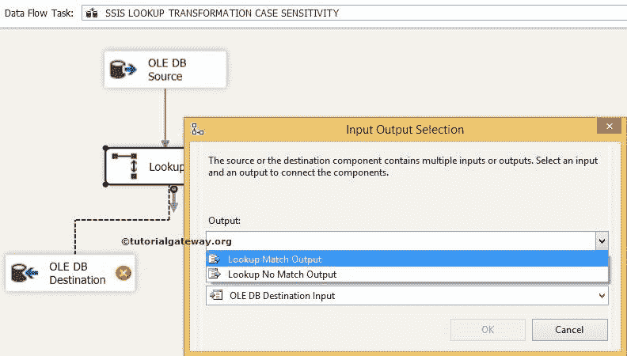

# SSIS 查找转换区分大小写

> 原文：<https://www.tutorialgateway.org/ssis-lookup-transformation-case-sensitivity/>

在本文中，我们将通过一个示例向您解释使用 SSIS 查找转换时出现的区分大小写问题。在本例中，我们将使用 OLE DB 连接来连接到 SQL Server。

在开始创建 SSIS 查找区分大小写包之前，让我们看看 SQL Server 中的查找表及其数据

现在我们也来看看源数据。

如果观察查找表和源表，数据是相同的，但大小写不同。

提示:请参考[查找转换](https://www.tutorialgateway.org/lookup-transformation-in-ssis/)文章，了解 SSIS [查找](https://www.tutorialgateway.org/lookup-in-ssis/)将如何使用 SSIS 的 [OLE DB 连接管理器](https://www.tutorialgateway.org/ole-db-connection-manager-in-ssis/)在像 [SQL Server](https://www.tutorialgateway.org/sql/) 、Oracle 和 DB2 服务器这样的数据库上运行。

## 配置 SSIS 查找转换

步骤 1:将数据流任务从工具箱拖放到控制流区域。并将其重命名为 SSIS 查找转换区分大小写。

双击它将打开数据流选项卡。

步骤 2:将 OLE DB 源从工具箱拖放到数据流区域。双击数据流区域中的 OLE DB 源打开

连接管理器设置

从上面的截图可以看到，我们选择了【员工】数据库作为源数据库，选择了【查找转换源】作为源表

第 3 步:单击列选项卡验证列。在这里，我们可以取消选中不需要的列。

单击确定并将查找转换从工具箱拖到数据流选项卡。

步骤 4:双击查找转换来配置查找表(引用表)。

在常规选项卡中的“指定如何处理没有匹配条目的行”下。将默认的“失败组件”更改为“将行重定向到不匹配的输出”选项。通过更改此选项，不匹配的行被重定向到不匹配输出。否则，包将失败。

在连接类型部分，我们选择了 SSIS 的 [OLE DB 连接管理器](https://www.tutorialgateway.org/ole-db-connection-manager-in-ssis/)，因为我们使用的是 SQL Server 表作为参考表。如果您正在使用任何缓存文件(。使用缓存连接管理器。

单击连接选项卡

步骤 5:如果您已经创建了 OLE DB 连接管理器，请从列表中选择。否则，单击“新建”按钮并进行配置。这里我们选择了员工数据库。

对于本例，我们使用[查阅表格]表格作为查阅表格或参考表格。源数据与本表中的数据进行了比较。

提示:我们不应该用整张表作为参考表。也许您应该使用 SQL 命令来选择您想要引用的所需列名。

第六步:点击可用输入栏。接下来，拖动到可用的查阅列，在两个数据集之间创建连接。

源数据中的名称列将与查找表中的[引用名称]列进行核对。

*   如果源数据中“名称”列的每一行都与查找表中“引用名称”列的任何一行匹配，则该行将被传递到匹配输出。
*   如果源数据中“名称”列的每一行与查找表中“引用名称”列的任何一行都不匹配，该行将传递到“不匹配输出”。

有时，我们可能会在查找表中有一些额外的列，我们希望将其传递给匹配的输出。在这些情况下，我们必须在“可用查找列”中选中该列。

步骤 7:将两个 OLE 数据库目标拖放到数据流区域。接下来，将输出箭头拖到这个新的 OLE DB 目标位置。将出现一个弹出窗口“输入输出选择”，提示您选择输入输出类型:“查找匹配输出”或“查找不匹配输出”。选择查找匹配输出，然后单击确定。

当您将另一个输出箭头拖到 OLE 数据库目标 1 时，它会自动为其分配查找不匹配输出。

步骤 8:双击 OLE DB 目标，并选择 OLE DB 连接管理器。接下来，选择[员工]数据库中的[查找转换中的案例匹配行]表来存储匹配行数据。

步骤 9:单击映射选项卡，检查源列是否映射到目标列。

步骤 10:现在双击 OLE DB 目标 1 来配置不匹配输出。在这里，我们将选择[员工]数据库中的[查找转换中的案例不匹配]表来存储不匹配的行数据。

重复步骤 9，然后单击确定完成创建 SSIS 查找转换区分大小写包。

右键单击解决方案资源管理器中的 SSIS 查找转换区分大小写包，然后选择执行包。

让我们打开 [SQL Server](https://www.tutorialgateway.org/sql/) 管理工作室，查看 SSIS 查找转换区分大小写包的匹配数据。尽管源数据中的每一行都与查找表匹配，但它只显示一行匹配数据。要摆脱这些情况，使用 SSIS[字符映射转换](https://www.tutorialgateway.org/character-map-transformation-in-ssis/)将所有源数据转换为小写或大写。

让我们看看无与伦比的数据

从上面的截图来看，所有的行，无论大小写，都被视为不匹配的输出。