# SSIS 的合并转型

> 原文：<https://www.tutorialgateway.org/merge-transformation-in-ssis/>

SSIS 的合并转换用于合并两个输入(如表或文件)并产生一个输出。当我们想要组合错误路径数据(处理错误后)和正常数据时，合并转换非常有用。这个 SSIS 合并转换使用键列值将数据插入目标列。

例如，我们根据条件使用[条件分割](https://www.tutorialgateway.org/conditional-split-transformation-in-ssis/)来分割数据。在对它们执行一些操作后，如果我们想要将它们合并回来，会怎么样？。在这些情况下，我们可以使用 SSIS 合并转换将它们合并回来。

注意:SSIS 合并转换将只产生一个输出，它不支持错误输出。

## 合并与联合全转换的区别

[SSIS](https://www.tutorialgateway.org/ssis/) 合并转型类似于[SSIS 联合所有](https://www.tutorialgateway.org/union-all-transformation-in-ssis/)，但合并有一些限制:

| SSIS 的合并转型 | SSIS 的全联盟转换 |
| 在应用合并转换之前，数据应该按顺序排列 | 不需要对数据进行排序 |
| 合并转换的输出将产生排序的数据 | 输出将是未排序的数据。 |
| 它只接受 2 个输入 | 它可能需要两个以上的输入 |

## SSIS 的合并转换示例

我们将产品的销售数据存储在两个不同的 [SQL Server](https://www.tutorialgateway.org/sql/) 表中，如销售 2、销售 3。我们希望将所有相关信息合并到一个数据库表中。

第一步:将数据流任务从工具箱拖放到控制流区域，并在 SSIS

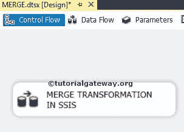

将其重命名为合并转换

双击数据流任务会将我们带到数据流区域。

步骤 2:将两个 OLE 数据库源从工具箱拖放到数据流区域。然后双击数据流区域中的第一个 OLE 数据库源，打开连接管理器设置，并提供一个选项来选择保存源数据的表。这里我们选择 Sales2 表作为来源

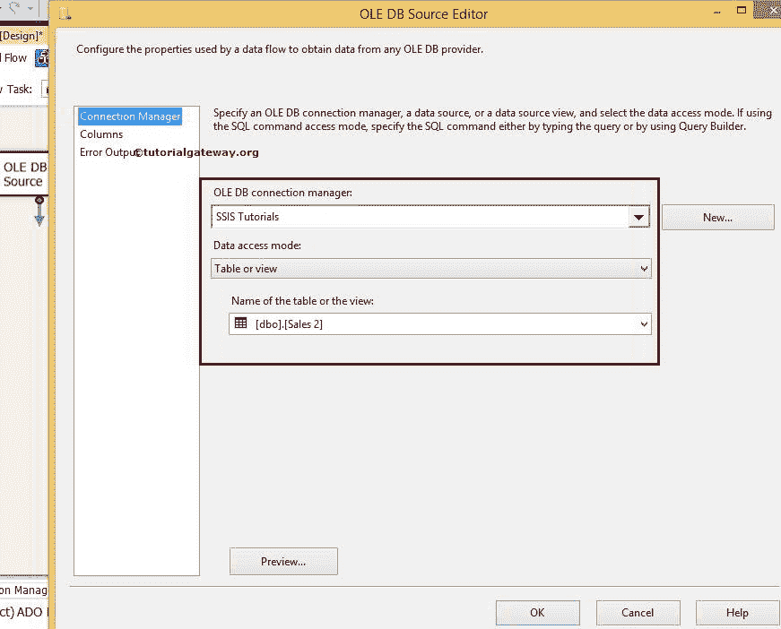

第 3 步:单击列选项卡验证列。在此选项卡中，我们还可以取消选中不需要的列。

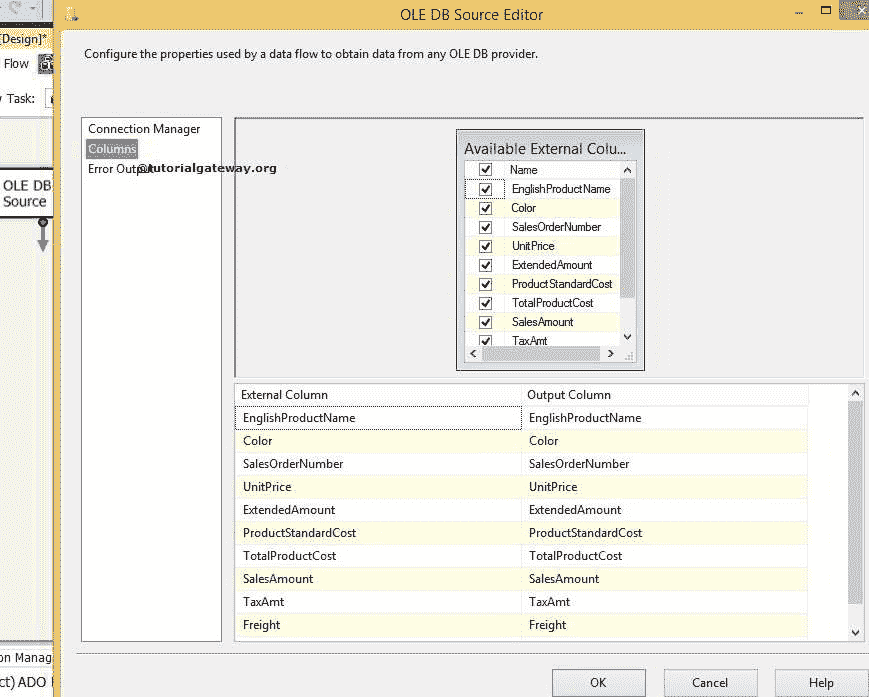

双击第二个 OLE 数据库源，用 SQL Server 中的销售 2 表对其进行配置。

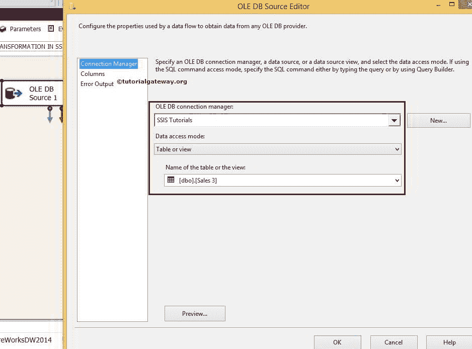

重复步骤 3 以验证列

步骤 4:拖放两个排序转换来排序 SQL Server 表的输入。请参考 SSIS 文章中[分拣改造了解](https://www.tutorialgateway.org/sort-transformation-in-ssis/)

[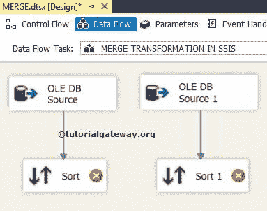](https://www.tutorialgateway.org/sort-transformation-in-ssis/)

[分拣改造的配置](https://www.tutorialgateway.org/sort-transformation-in-ssis/)

步骤 5:双击排序转换进行配置。这里我们先按颜色排序，然后按英文产品名称升序

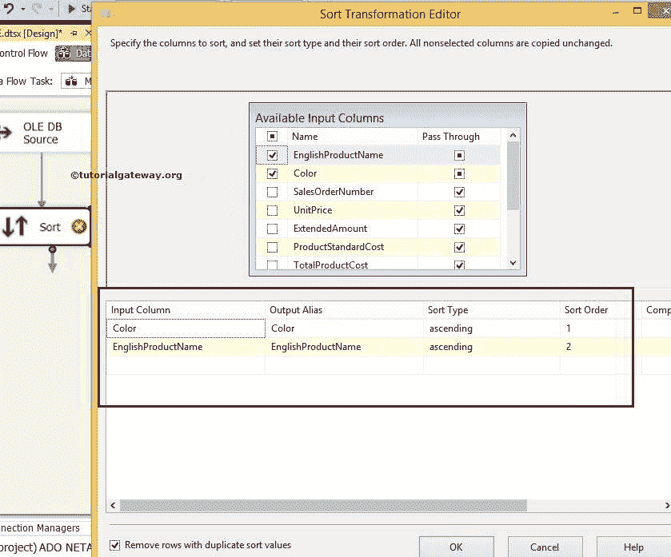

提示:如果不对输入行进行排序，SSIS 合并转换将不起作用。因此，在合并之前，排序转换是强制性的

对排序转换 1 也进行同样的操作。

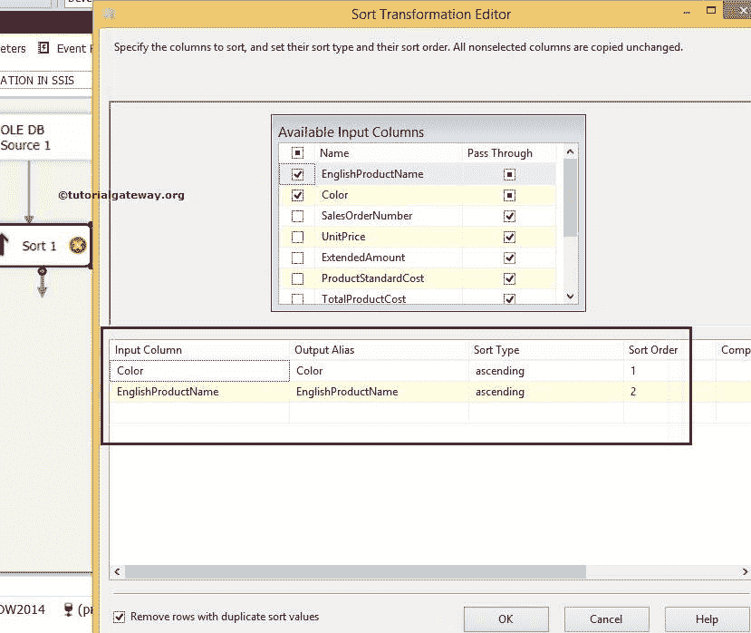

步骤 6:现在拖放 SSIS 合并转换，将排序的表合并成一个表

当你将排序转换的输出箭头拖动到合并转换时，会出现一个输入输出选择窗口，选择是合并输入 1 还是合并输入 2，如下图截图

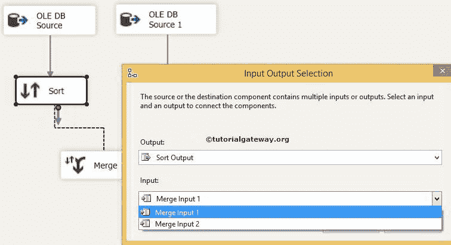

单击确定并拖放排序转换 1 的输出箭头。这里合并输入 2 由智能自动选择。

步骤 7:双击 SSIS 合并转换并配置它。基于“颜色”和“英文产品名称”列插入目标表的数据。

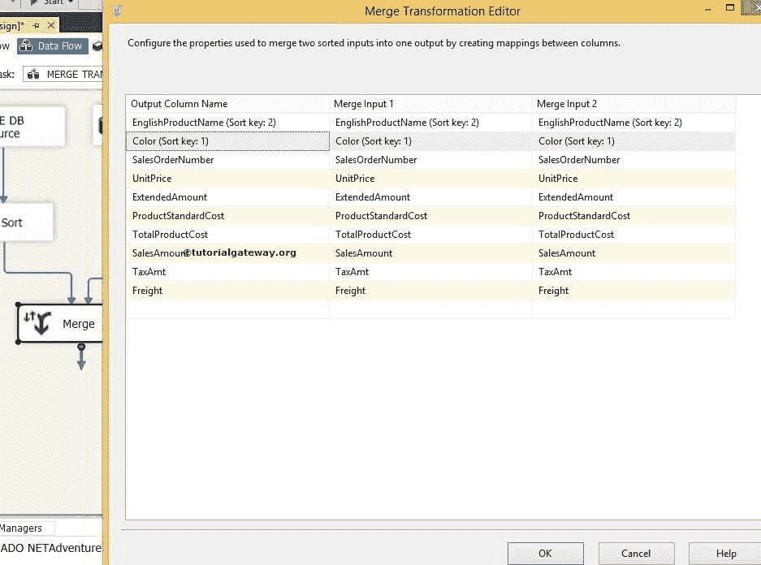

第八步:将 OLE DB 目的地拖放到数据流区域，双击配置目的地服务器和目的地表，存储合并转换输出

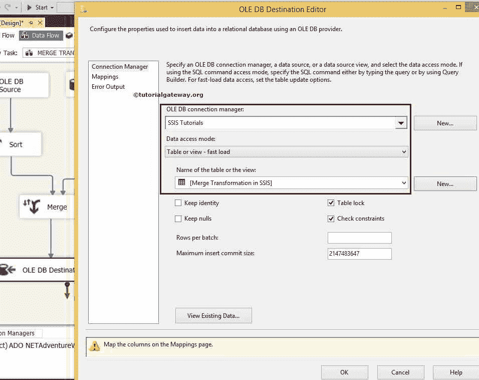

这里我们选择了[SSIS 教程]作为数据库和[SSIS 的合并转换]作为目标表

步骤 9:使用映射选项卡

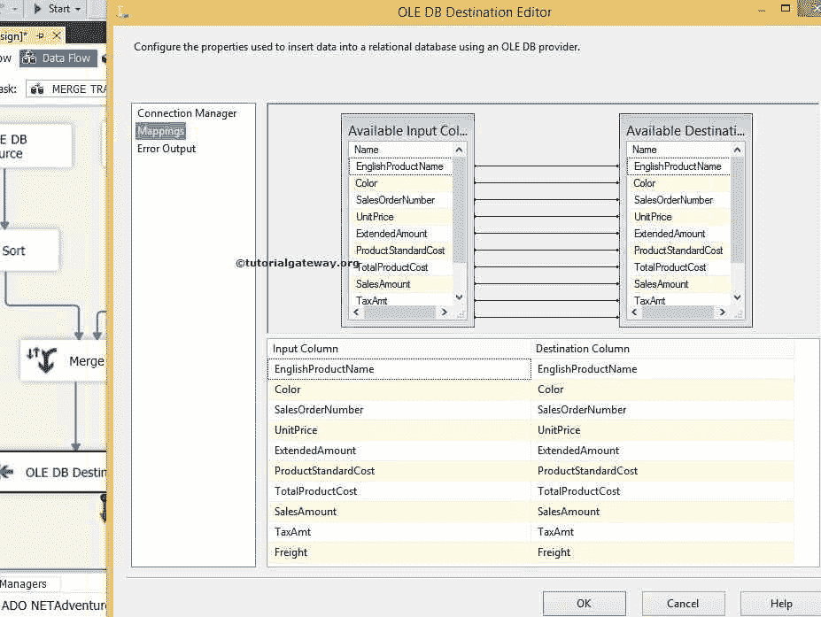

检查输入列是否与目的列匹配

我们完成了 SSIS 合并转换包的设计。让我们执行包

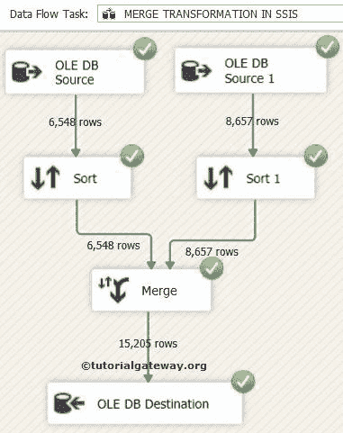

现在我们将在 [SQL](https://www.tutorialgateway.org/sql/) 管理工作室

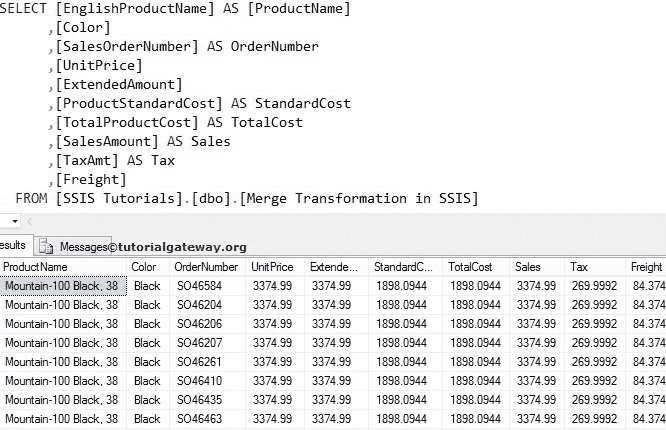T4 中检查 SSIS 合并输出