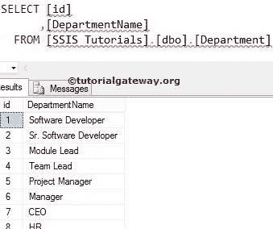
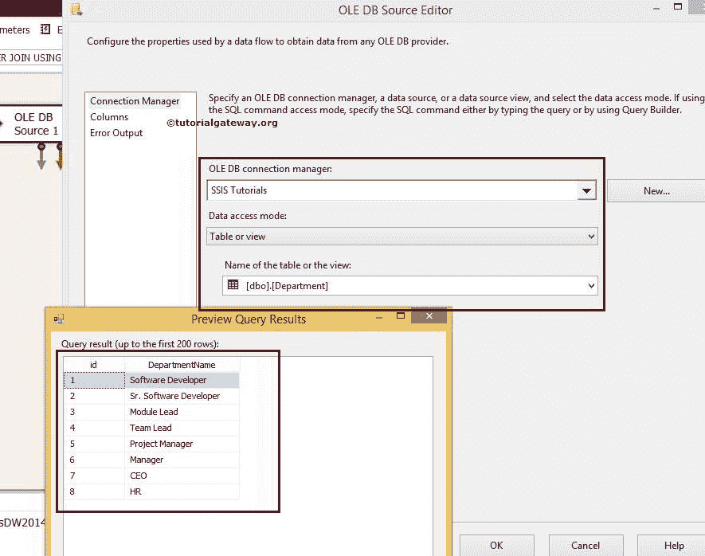
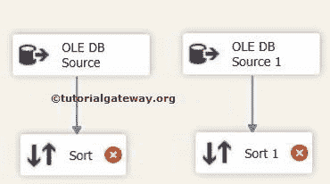
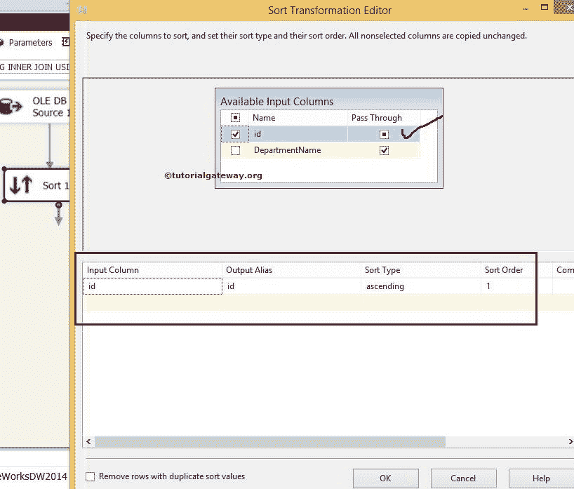
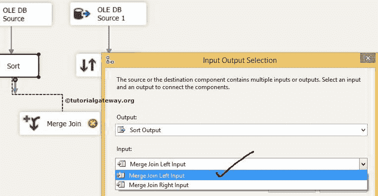
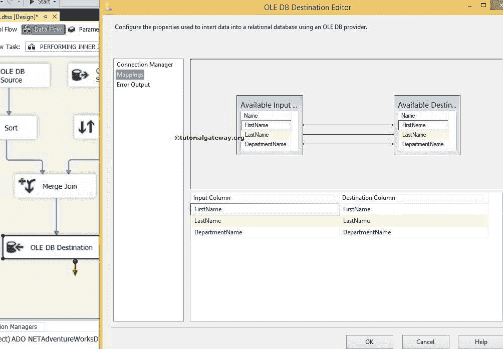

# SSIS 的合并连接转换

> 原文：<https://www.tutorialgateway.org/merge-join-transformation-in-ssis/>

SSIS 的合并连接转换用于执行 [SQL 连接](https://www.tutorialgateway.org/sql-joins/)，如 [SQL Server 集成服务](https://www.tutorialgateway.org/ssis/)中的内部连接、[左外部连接](https://www.tutorialgateway.org/left-outer-join-in-ssis/)、[全外部连接](https://www.tutorialgateway.org/full-outer-join-in-ssis/)和[右外部连接](https://www.tutorialgateway.org/right-outer-join-in-ssis-2014/)(通过交换表间接实现)。SSIS 合并连接转换对于将数据加载到数据仓库中的维度表非常有用。

注意:SSIS 的合并连接转换仅适用于排序数据。因此，在应用任何联接转换之前，排序转换是必需的。请参考 SSIS 文章中的[排序，了解如何对源数据进行排序操作。](https://www.tutorialgateway.org/sort-transformation-in-ssis/)

## SSIS 合并连接转换示例

在本文中，我们将在 SSIS 使用合并连接转换对两个 [SQL](https://www.tutorialgateway.org/sql/) 表执行内部连接。在我们开始创建 [SSIS](https://www.tutorialgateway.org/ssis/) 包之前，让我们看一下我们将要使用 SSIS 合并连接转换执行内部连接的两个源表。

【SSIS 教程】数据库里面的员工表是:

【SSIS 教程】数据库里面的部门表是:

步骤 1:将数据流任务从工具箱拖放到控制流区域，并将其重命名为在 SSIS

使用合并连接转换执行内部连接

双击 SSIS 合并连接转换数据流任务会将我们带到数据流区域。

步骤 2:将两个 OLE 数据库源从工具箱拖放到数据流区域。然后双击数据流区域中的第一个 OLE 数据库源将打开连接管理器设置，并提供一个选项来选择保存源数据的表。

从上面的截图中，您可以看到我们从[SSIS 教程]数据库中选择了[员工]表

第 3 步:单击列选项卡验证列。在此选项卡中，我们可以取消选中不需要的列。

第 4 步:双击第二个 OLE DB 源，配置第二个表使用合并连接转换执行 SSIS 内部连接。这里我们从【SSIS 教程】数据库

中选择【部门】表

第五步:重复第三步

### SSIS 合并连接前的排序转换

步骤 6:将两个排序转换从 SSIS 工具箱拖放到数据流区域，并将 OLE DB 源输出箭头连接到排序转换。

步骤 7:双击排序转换进行配置。检查我们要排序的列，不要忘记通过剩余的列。如果您忘记选择“通过”，它们将不会出现在输出列中。

从源数据来看，部门是员工和部门表之间的连接键。所以我们按照部门升序对雇员表进行排序。

双击排序转换 1，并使用 id 列以升序对部门表进行排序。

### SSIS 合并连接转换配置

步骤 8:现在将 SSIS 合并连接转换拖放到数据流区域，对排序的表执行内部连接。

当您将排序转换的输出箭头拖动到合并连接转换中时，将出现一个输入输出选择窗口，选择是合并连接左输入还是合并连接右输入，如下图所示。

在这里，我们选择了“员工的合并联接左输入”表。单击确定并拖放排序转换 1 的输出箭头。这里合并连接由智能自动选择的右输入。

步骤 9:双击合并连接转换将打开合并连接转换编辑器进行配置。

联接类型提供了一个下拉列表，用于选择要对源数据执行的联接类型(如 SSIS 内联接、[左外联接](https://www.tutorialgateway.org/left-outer-join-in-ssis/)、[全外联接](https://www.tutorialgateway.org/full-outer-join-in-ssis/))。在这个例子中，我们正在执行 SSIS 内部连接。这就是为什么我们从连接类型选项中选择了内部乔恩选项。

从源数据中可以看出，雇员表和部门表都是使用部门标识和标识列连接的。因此，通过拖动箭头选择它们作为连接键。

现在，通过选中标记列名来选择要发送到目标表的列(通过列)。

从上面的截图可以观察到，我们选择了【名字】、【姓氏】、【部门名称】列作为输出列。这意味着 SSIS 内部连接将生成输出列，如[名字]、[姓氏]和[部门名称]，其中部门号与任何 ID 列数据完全相同。

提示:您在此选择的任何列都将只传输到目标表。如果您不想要任何列，请取消选中该列。

步骤 10:将 OLE DB 目标拖放到数据流区域。接下来，双击它来配置目标服务器和目标表，以存储合并连接转换输出

这里我们选择了[SSIS 教程]作为数据库和[使用合并连接转换的内部连接]作为目标表

步骤 11:单击列选项卡，检查输入列是否与目标列匹配。如果没有，请将相应的列分配给目的地列

我们在 SSIS 包中使用合并连接转换完成了执行内部连接的设计。让我们执行包

现在让我们打开 [SQL Server 管理工作室](https://www.tutorialgateway.org/sql/)，在 SSIS 表中使用合并连接转换从内部连接中选择列。

