# SSIS 左外连接

> 原文：<https://www.tutorialgateway.org/left-outer-join-in-ssis/>

在本文中，我们将在 SSIS 使用合并连接转换对两个 SQL 表执行 SSIS 左外连接。在我们开始创建 SSIS 包之前，让我们看看我们在 SSIS 使用合并连接转换用于左外连接的两个源表。

【SSIS 教程】数据库里面的员工表是:

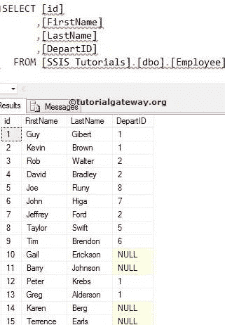

【SSIS 教程】数据库里面的部门表是:

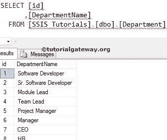

## 使用合并连接转换的 SSIS 左外连接示例

步骤 1:将数据流任务从工具箱拖放到控制流区域。并使用[合并连接变换](https://www.tutorialgateway.org/merge-join-transformation-in-ssis/)将其重命名为在 [SSIS](https://www.tutorialgateway.org/ssis/) 中执行左外连接。

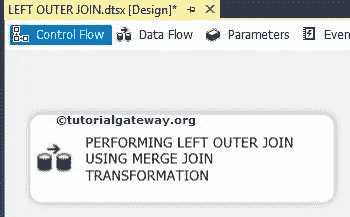

双击数据流任务会将我们带到数据流区域。

步骤 2:将两个 OLE 数据库源拖到数据流区域。然后，双击第一个 OLE 数据库源以打开连接管理器设置。它还提供了选择包含源数据的表的选项。

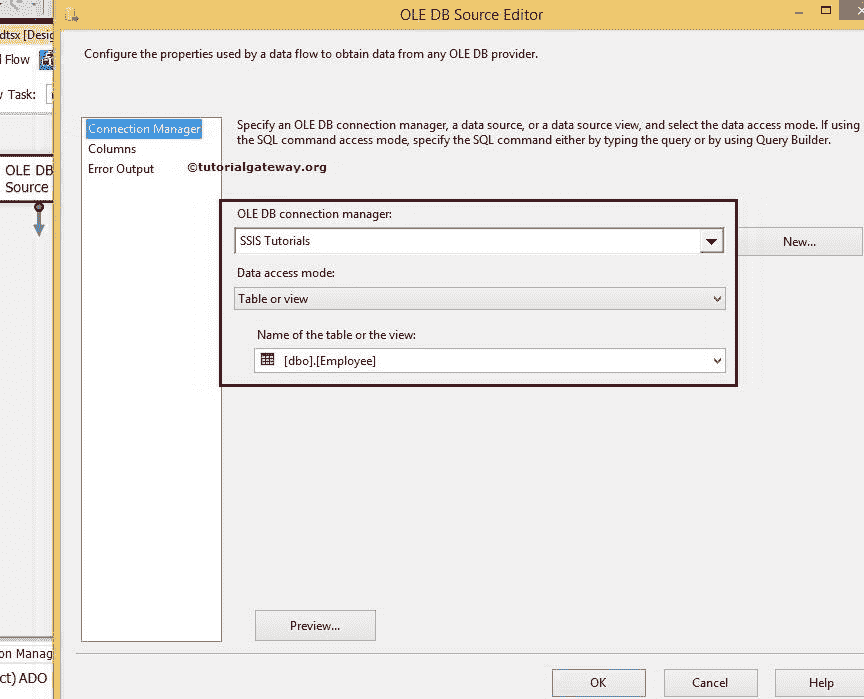

从上面的截图中，您可以看到我们从[SSIS 教程]数据库中选择了[员工]表

步骤 3:单击列选项卡检查列。在此选项卡中，我们可以取消选中不需要的列。

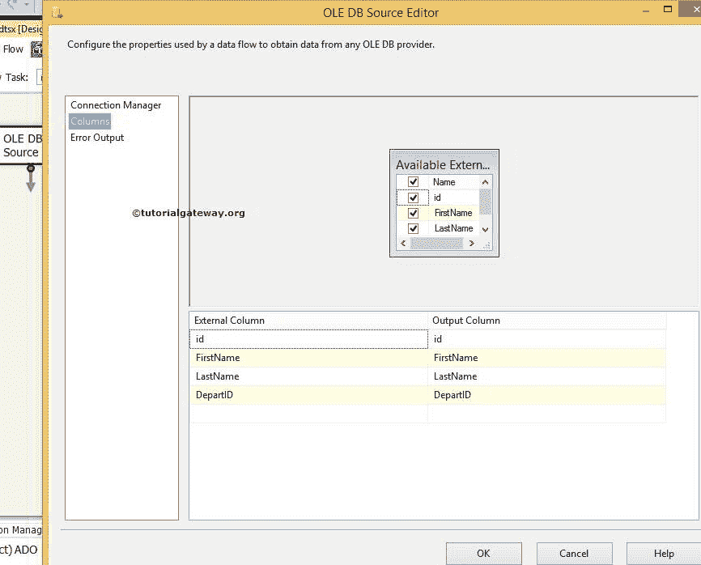

第 4 步:双击第二个 OLE DB 源，配置第二个表在 SSIS 执行左外连接。这里，我们从【SSIS 教程】数据库

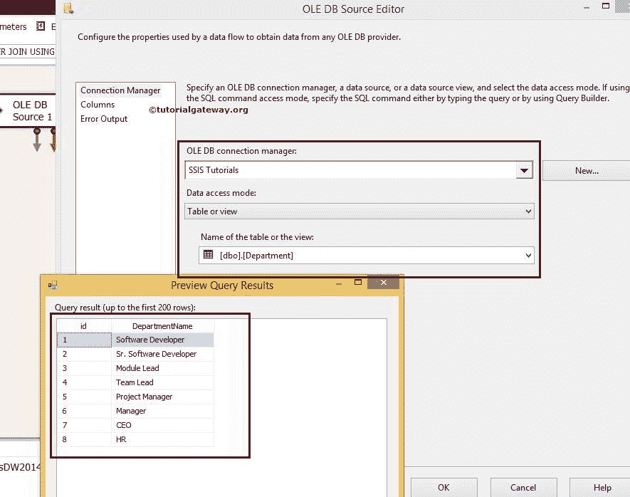

中选择【部门】

第五步:重复第三步

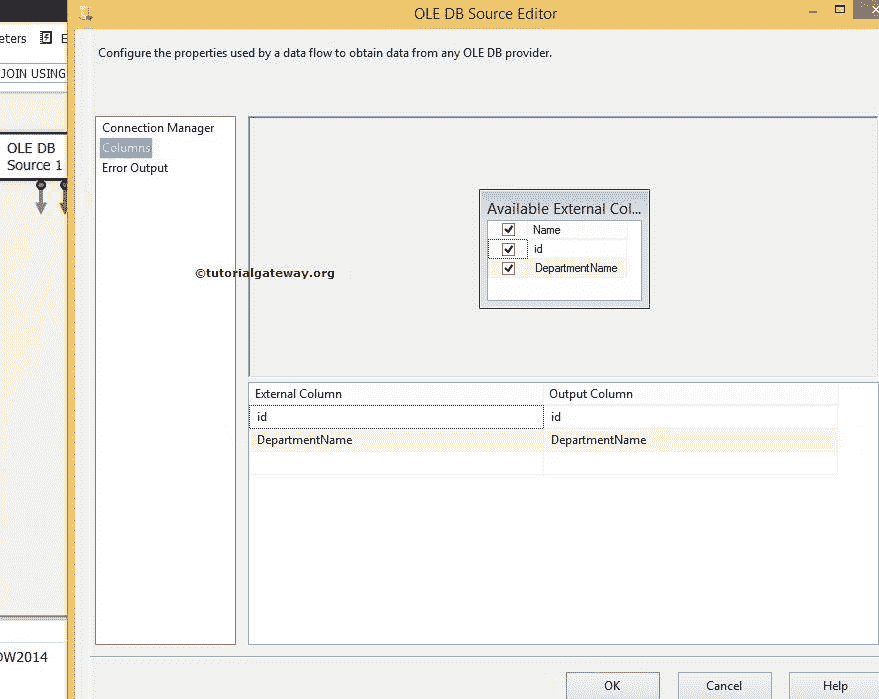

步骤 6:将两个排序转换从工具箱拖到数据流区域。并将 OLE 数据库源输出箭头连接到此转换。

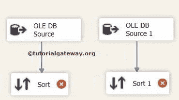

步骤 7:请配置排序转换。选中我们要排序的列，并通过剩余的列。如果您忘记选择“通过”，这些列将不会出现在输出列中。

从源数据来看，部门是员工和部门表之间的连接键。所以我们按照部门升序对雇员表进行排序。

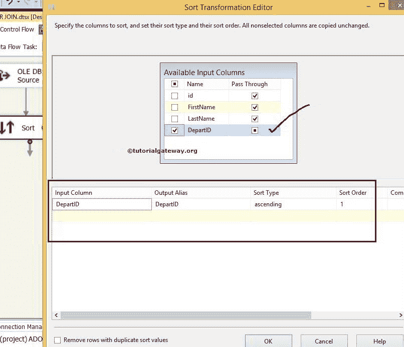

提示:如果不对输入行进行排序，合并连接转换将不起作用。因此[排序转换](https://www.tutorialgateway.org/sort-transformation-in-ssis/)在 SSIS 应用左外连接之前是强制的。

单击排序转换 1，并使用 id 列按升序对部门表进行排序。

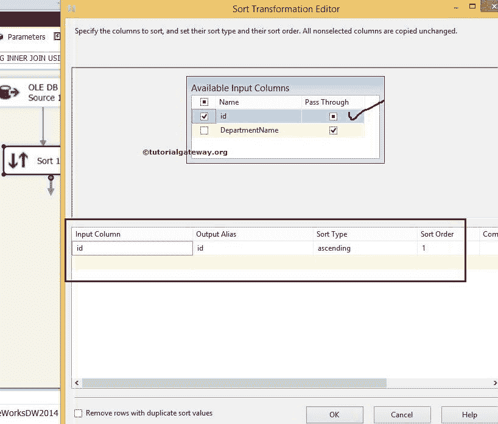

步骤 8:现在将合并连接转换拖放到数据流区域，对排序的表执行左外连接。

### 在 SSIS 合并联接中配置左外部联接

当您将排序转换的输出箭头拉入合并连接转换时，会出现一个输入输出选择窗口，以选择是合并连接左输入还是合并连接右输入。

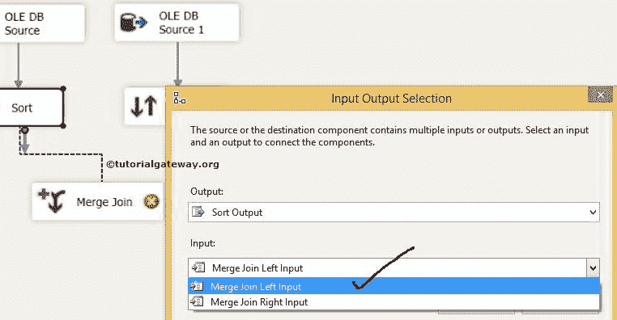

在这里，我们选择了“员工的合并联接左输入”表。单击确定并拖放排序转换 1 的输出箭头。此处合并连接右侧输入由智能自动选择。

步骤 9:双击合并连接转换将打开合并连接转换编辑器进行配置。

联接类型提供了一个下拉列表，用于选择要对源数据执行的联接类型(如 SSIS 的[内部联接](https://www.tutorialgateway.org/merge-join-transformation-in-ssis/)、左侧外部联接和[完全外部联接](https://www.tutorialgateway.org/full-outer-join-in-ssis/))。在这个例子中，我们正在执行左外连接。这就是为什么我们从连接类型选项中选择了 SSIS 左外乔恩选项。

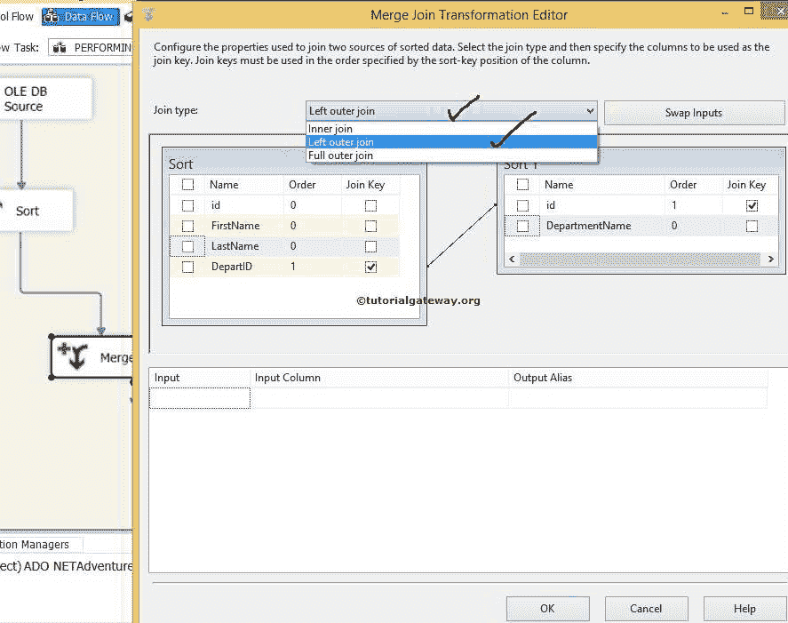

从源数据中可以看出，雇员表和部门表都是使用部门标识和标识列连接的。因此，通过拖动箭头选择它们作为连接键。

现在，通过选中标记列名来决定要转移到目标表的列(通过列)。

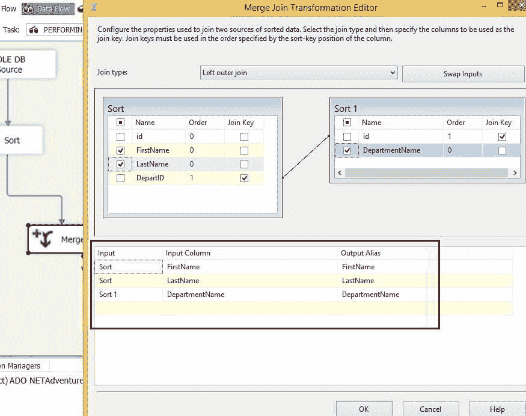

从上面的截图可以观察到，我们选择了【名字】、【姓氏】、【部门】列作为输出列。

这意味着 SSIS 的左外部联接将生成雇员表中的所有[名字]，[姓氏]列行，以及[部门名称]列的匹配行，其中部门号与任何 ID 列数据完全相同。[部门名称]列中所有不匹配的行都被视为空。

步骤 10:将 OLE DB 目标拖放到数据流区域。接下来，双击它来配置目标服务器和目标表，以存储合并连接转换输出

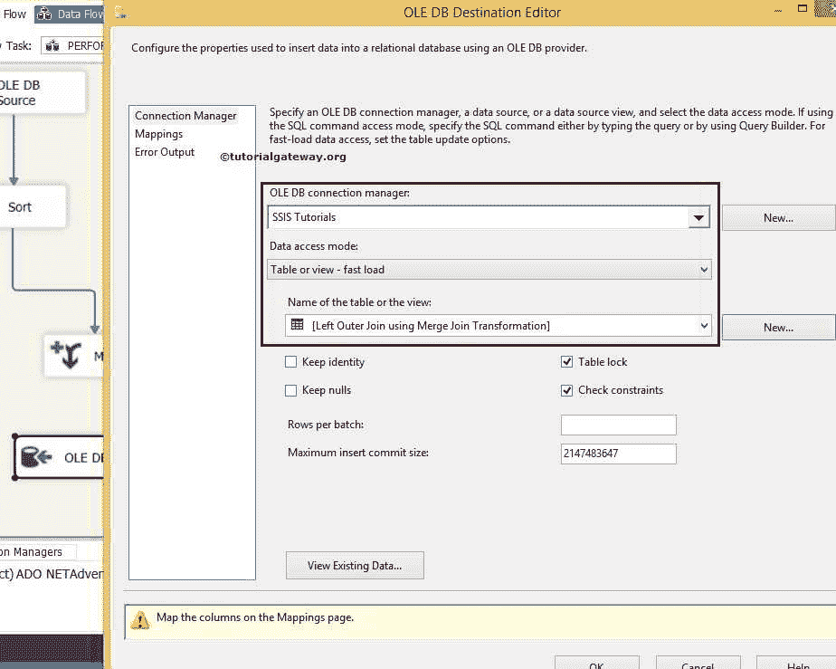

这里我们选择了[SSIS 教程]作为数据库和[使用合并连接转换的左外连接]作为目标表

步骤 11:单击列选项卡，检查输入列是否与目标列匹配。如果没有，请将相应的列分配给目的地列

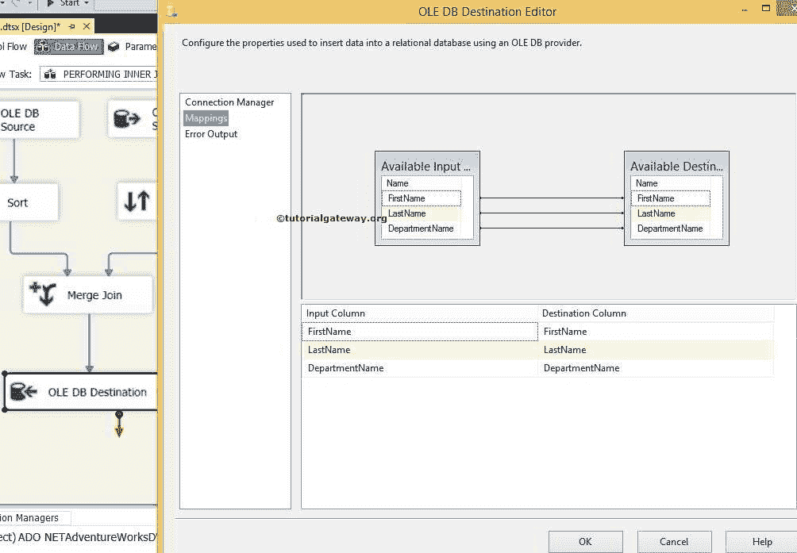

我们在 SSIS 合并连接包中完成了左外部连接的设计。让我们执行包

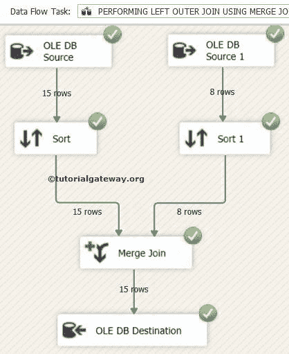

现在我们打开 [SQL Server 管理工作室](https://www.tutorialgateway.org/sql/)，从【使用合并连接转换的左外连接】表中选择列。

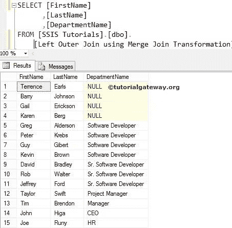