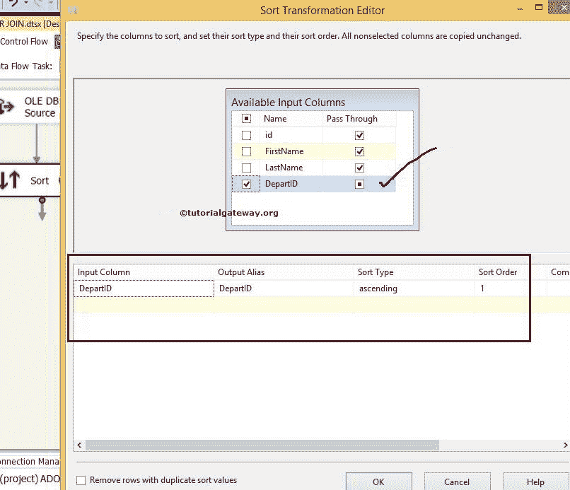
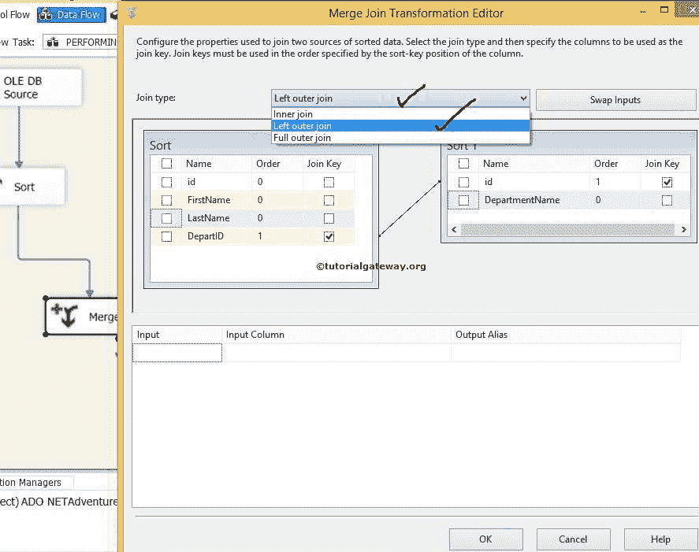

# SSIS 右外连接

> 原文：<https://www.tutorialgateway.org/right-outer-join-in-ssis-2014/>

在本文中，我们将使用合并连接转换在两个 SQL 表上执行 SSIS 右外连接。

在设计 SSIS 包之前，让我们看看两个源表，我们将在 SSIS 使用合并连接转换对它们执行右外连接。

请参考[SSIS 左外网](https://www.tutorialgateway.org/left-outer-join-in-ssis/)文章了解。另外，参见 SSIS 文章中的[全外连接，了解使用合并连接转换的完全连接。](https://www.tutorialgateway.org/full-outer-join-in-ssis/)

【SSIS 教程】数据库里面的员工表是:

部门表里面的【 [SSIS](https://www.tutorialgateway.org/ssis/) 教程】数据库是:

T4】

## 在 SSIS 合并连接转换中配置右外连接

步骤 1:将数据流任务从工具箱拖放到控制流区域，并使用合并连接转换

将其重命名为在 SSIS 执行右外连接

双击数据流任务会将我们带到数据流区域。

步骤 2:将两个 OLE 数据库源从工具箱拖放到数据流区域。接下来，双击数据流区域中的第一个 OLE 数据库源，打开连接管理器设置，并提供选择表的选项。

从上面的截图可以看到，我们从【SSIS 教程】数据库中选择了【员工】表

第 3 步:单击列选项卡验证列。在此选项卡中，我们可以取消选中不需要的列。

步骤 4:双击第二个 OLE 数据库源，配置第二个表来执行合并连接。这里，我们选择了【部门】表

第五步:重复第三步

提示:[合并连接转换](https://www.tutorialgateway.org/merge-join-transformation-in-ssis/)如果不对输入行进行排序，将不起作用。因此[排序转换](https://www.tutorialgateway.org/sort-transformation-in-ssis/)在应用 SSIS 右外连接之前是强制性的。

步骤 6:将两个排序转换从 SSIS 工具箱拖放到数据流区域。接下来，将 OLE DB 源输出箭头连接到排序转换。

步骤 7:双击排序转换进行配置。检查我们要排序的列，不要忘记通过剩余的列。如果您忘记选择“通过”，它们将不会出现在输出列中。

从源数据来看，部门是员工和部门表之间的连接键。因此，我们按部门以升序对雇员表进行排序。

双击排序转换 1，并使用 id 列以升序对部门表进行排序。

步骤 8:现在将合并连接转换拖放到数据流区域，对排序的表执行 SSIS 右外连接。

当您将排序转换的输出箭头拖到合并连接转换中时，将出现一个输入输出选择窗口，选择是合并连接左输入还是右输入。

在这里，我们选择了“员工的合并联接左输入”表。点击确定，拖放[排序转换](https://www.tutorialgateway.org/sort-transformation-in-ssis/) 1 的输出箭头。此处合并连接右侧输入由智能自动选择。

步骤 9:双击合并连接转换将打开合并连接转换编辑器进行配置。

联接类型提供了一个下拉列表来选择要对源数据执行的联接类型(如[内部联接](https://www.tutorialgateway.org/merge-join-transformation-in-ssis/)、[左侧外部联接](https://www.tutorialgateway.org/left-outer-join-in-ssis/)、[完全外部联接](https://www.tutorialgateway.org/full-outer-join-in-ssis/))。在这个例子中，虽然我们执行的是右外连接，但是 SSIS 合并连接转换编辑器没有这个选项。所以现在，我们从连接类型选项中选择了左外乔恩选项。

从源数据中可以看出，雇员表和部门表都是使用部门标识和标识列连接的。因此，通过拖动箭头选择它们作为连接键。

现在，通过选中标记列名来选择要发送到目标表的列(通过列)。

从上面的截图可以看到我们选择了【名字】、【姓氏】、【部门名称】列作为输出列。要执行 SSIS 右外连接，我们必须交换表，所以点击交换输入按钮。由此左表变成右表，右表变成左表。

这意味着 SSIS 右外连接显示所有[部门名称]列行和[名字]，[姓氏]列的匹配行，其中部门标识与任何标识列数据完全相同。[名字]，[姓氏]列中所有不匹配的行都被视为空。

第十步:将 OLE DB 目标拖放到数据流区域，双击配置目标服务器和目标表，存储【合并连接转换】输出

这里我们选择了[SSIS 教程]作为数据库，选择了[使用合并连接转换的右外连接]作为目标表

步骤 11:单击列选项卡，检查输入列是否与目标列匹配。如果没有，请将相应的列分配给目标列

我们使用合并连接转换包完成了执行 SSIS 右外连接的设计。让我们执行 [SSIS](https://www.tutorialgateway.org/ssis/) 右外连接包

T4】

现在我们打开 [SQL Server 管理工作室](https://www.tutorialgateway.org/sql/)，从【使用合并连接转换的右外连接】表中选择列。

