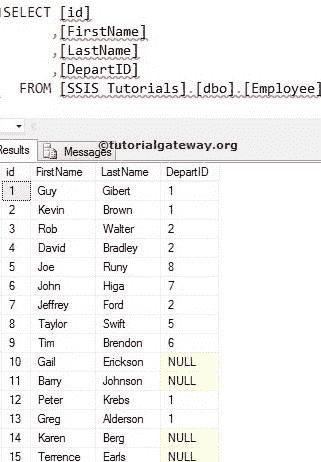
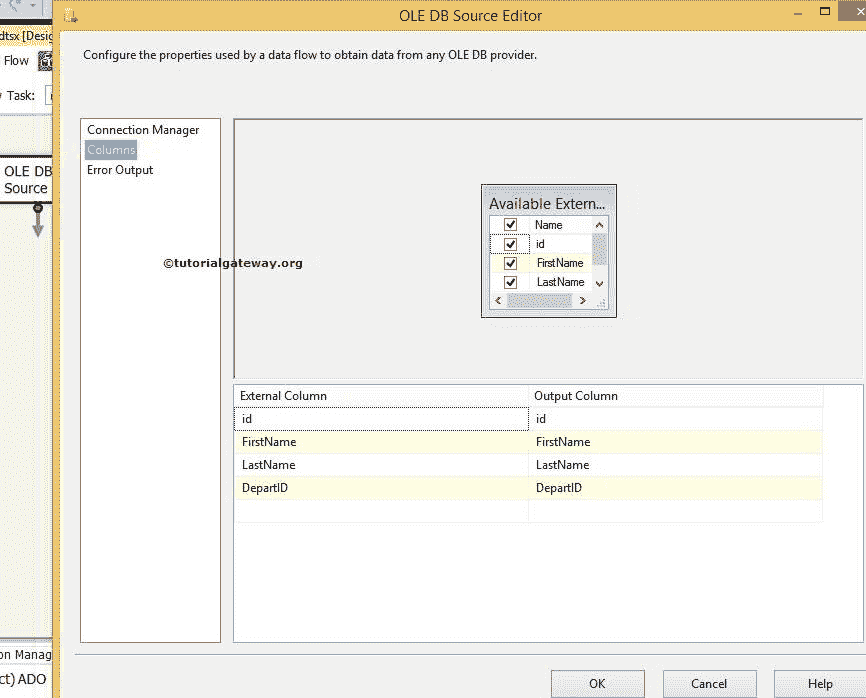
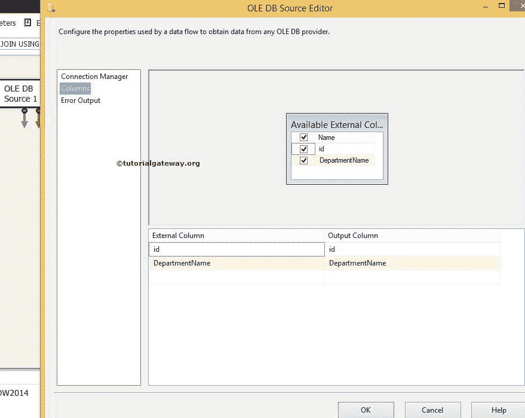

# SSIS 的全外连接

> 原文：<https://www.tutorialgateway.org/full-outer-join-in-ssis/>

SSIS 的完全外部联接类似于 SQL 完全联接，它返回左表和右表中的所有记录。所有不匹配的行都将填充空值。

在本文中，我们将在 SSIS 执行全外连接[合并连接转换](https://www.tutorialgateway.org/merge-join-transformation-in-ssis/)。请参考 SSIS 文章中的[左外连接，了解使用合并连接转换的左外连接。参考 SSIS](https://www.tutorialgateway.org/left-outer-join-in-ssis/) 文章中的[右外连接，了解右外连接](https://www.tutorialgateway.org/right-outer-join-in-ssis-2014/)

在我们开始创建 [SSIS](https://www.tutorialgateway.org/ssis/) 包之前，让我们看一下我们的两个源表，我们将使用合并连接转换在这两个源表上执行 SSIS 全外连接。

【SSIS 教程】数据库里面的员工表是:

【SSIS 教程】数据库里面的部门表是:

## SSIS 合并连接示例中的全外连接

要在 SSIS 执行全外连接，请将数据流任务从工具箱拖放到控制流区域。接下来，将其重命名为在 SSIS

使用合并连接转换执行全外连接

双击数据流任务会将我们带到数据流区域。

将两个 [OLE 数据库源](https://www.tutorialgateway.org/ole-db-source-in-ssis/)从工具箱拖放到数据流区域。然后双击数据流区域中的第一个 OLE DB 源将打开连接管理器设置。它还提供了一个选择保存源数据的表的选项。

从上面的截图中，您可以看到我们从[SSIS 教程]数据库中选择了[员工]表

单击列选项卡验证列，并取消选中不需要的列。

双击第二个 OLE 数据库源，将第二个表配置为执行合并连接。这里我们从【SSIS 教程】数据库

中选择【部门】表

单击列选项卡验证列。

在我们应用 SSIS 全外连接之前，我们必须使用排序转换。因此，将两个[排序转换](https://www.tutorialgateway.org/sort-transformation-in-ssis/)从工具箱拖放到数据流区域。接下来，将 OLE DB 源输出箭头连接到排序转换。

双击排序转换进行配置。检查我们要排序的列，不要忘记通过剩余的列。如果忽略它们以通过，它们不会出现在输出列中。

从源数据来看，部门是员工和部门表之间的连接键。所以我们按照部门升序对雇员表进行排序。

提示:如果不对输入行进行排序，合并连接转换将不起作用。因此[排序转换](https://www.tutorialgateway.org/sort-transformation-in-ssis/)在应用合并连接转换之前是强制的。

双击排序转换 1，并使用 id 列以升序对部门表进行排序。

### SSIS 全外连接

现在，将合并连接转换拖放到数据流区域，在 SSIS 对排序的表执行全外连接。

当您将排序转换的输出箭头拖到合并连接转换中时，会出现一个输入输出选择窗口，用于选择是合并连接左输入还是合并连接右输入。

在这里，我们选择了“员工的合并联接左输入”表。单击确定并拖放排序转换 1 的输出箭头。这里合并连接由智能自动选择的右输入。

双击合并连接转换将打开合并连接转换编辑器进行配置。

联接类型提供了一个下拉列表，用于选择要对源数据执行的联接类型(如[内部联接](https://www.tutorialgateway.org/merge-join-transformation-in-ssis/)、[左侧外部联接](https://www.tutorialgateway.org/left-outer-join-in-ssis/)和 SSIS 完全外部联接)。在本例中，我们正在执行 SSIS 全外连接。这就是为什么我们从连接类型选项中选择了[全外连接](https://www.tutorialgateway.org/sql-full-join/)选项。

从源数据中可以知道，雇员表和部门表都是使用部门标识和标识列连接的。因此，通过拖动箭头，选择它们作为 SSIS 全外连接的连接键。

现在，通过选中标记列名来选择要发送到目标表的列(通过列)。

从上面的截图可以观察到，我们选择了【名字】、【姓氏】、【部门名称】列作为输出列。

这意味着 SSIS 全外连接将生成[名字]、[姓氏]和[部门名称]列中的所有行。所有不匹配的行都被视为空。

提示:您在此选择的任何列都将只存储在目标表中。如果您不想要任何列，则取消选中该列。

第十步:将 [OLE DB 目的地](https://www.tutorialgateway.org/ssis-ole-db-destination/)拖放到数据流区域，双击即可配置目的地服务器和目的地表，以存储

的合并连接转换输出

这里我们选择了[SSIS 教程]作为数据库和[使用合并连接转换的全外连接]作为目标表

步骤 11:单击列选项卡，检查输入列是否与目标列匹配。如果没有，请将相应的列分配给目的地列

我们在 SSIS 合并连接转换包中完成了执行全外连接的设计。让我们执行包

现在我们打开 [SQL Server 管理工作室](https://www.tutorialgateway.org/sql/)，从【使用合并连接转换的全外连接】表中选择列。

