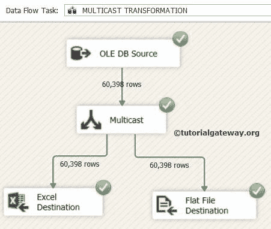

# SSIS 的组播转换

> 原文：<https://www.tutorialgateway.org/multicast-transformation-in-ssis/>

SSIS 的多播转换将输入数据发送到多个目的路径，而不应用任何条件或转换。或者，接受一个输入，进行数据的逻辑复制，并将相同的数据传递给多个输出。

当我们想要对同一数据集并行应用不同的转换时，SSIS 多播转换非常有用。例如，如果我们要对同一数据集执行两种类型的转换。然后使用 SSIS 多播转换制作相同数据的两个副本。接下来，在每个副本上，我们可以执行不同的转换。

## SSIS 组播转换实例

在本例中，我们使用 SSIS 多播转换将 [OLE DB 源](https://www.tutorialgateway.org/ole-db-source-in-ssis/)数据(来自 Dimcustomers 和 Fact 互联网销售表)发送到多个目标，例如使用 Excel 目标和平面文件目标的 Excel 文件和文本文件。

步骤 1:从工具箱中拖放数据流任务来控制流，并将其重命名为 SSIS 的多播转换。


双击 [SSIS](https://www.tutorialgateway.org/ssis/) 数据流任务将打开数据流选项卡。

第二步:拖放 OLE DB 源，SSIS 工具箱中的组播转换到数据流区域


步骤 3:双击数据流区域中的 OLEDB 源将打开连接管理器设置，并提供空间来编写我们的 SQL 语句。


sqlcommand 文本

我们在上面截图中使用的 [SQL](https://www.tutorialgateway.org/sql/) 命令是:

```
SELECT Color, 
       EnglishProductName, 
       ListPrice, 
       DealerPrice,
       EnglishDescription, 
       Fact.SalesAmount
FROM DimProduct
   INNER JOIN
     FactInternetSales AS Fact 
   ON DimProduct.ProductKey = Fact.ProductKey
```

对于这个 SSIS 多播转换示例，我们从 DimProduct 表中选择一种颜色、英文产品名称、标价、经销商价格、英文描述，并从[Adventure Works DW 2014]中提供的事实互联网销售表中选择销售金额列

步骤 4:单击“OLE DB 源列”选项卡来验证这些列。在此选项卡中，我们还可以取消选中不需要的列。


第五步:点击确定按钮。接下来，向下拖动箭头并将其附加到多播。与 SSIS 多播转换无关，因为它只是将数据传输到多个输出。请将 Excel 目标拖放到数据流区域。


第六步:现在，我们必须提供 [Excel 连接管理器](https://www.tutorialgateway.org/excel-connection-manager-in-ssis/)和目标的表详细信息。因此双击 Excel Destination 并提供所需信息


这里我们选择了 DimProducts.xls 作为我们的 excel 目标表

提示:在 Excel 连接管理器中使用之前，您必须先创建 Excel 工作表。如果选中“第一行有列名”选项，列名将保存在所选 Excel 工作表的第一行。


在这里，我们选择了产品目标表，因此，要检查结果，您必须打开 DimProducts.xls 中的产品目标表

步骤 7:配置完表后，单击“映射”选项卡，检查源列是否完全映射到目标列。


单击“确定”完成 excel 目标的配置。

步骤 8:拖放平面文件目标，并连接到 SSIS 多播转换。现在我们必须提供平面文件连接管理器和目标的文件名。因此双击平面文件目标并提供所需信息


步骤 9:单击映射选项卡，检查它们是否精确地映射到目标列。


点击【确定】完成 SSIS 组播包设置并运行包



在 Excel 表


中查看 SSIS 组播转换结果

检查文本文件


中的 SSIS 组播转换结果