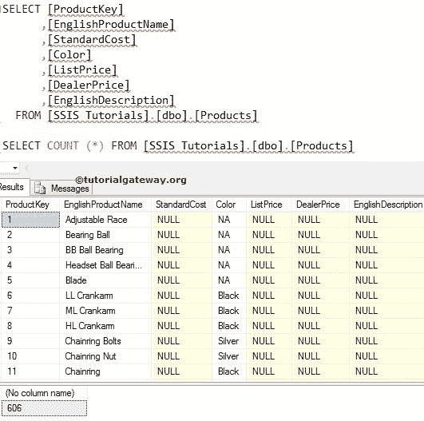

# SSIS 的 OLE 数据库命令转换

> 原文：<https://www.tutorialgateway.org/ole-db-command-transformation-in-ssis/>

SSIS 的 OLE DB 命令转换用来运行数据流中的 [INSERT](https://www.tutorialgateway.org/sql-insert-statement/) 、 [UPDATE](https://www.tutorialgateway.org/sql-update-statement/) 、 [DELETE](https://www.tutorialgateway.org/sql-insert-statement/) 等 SQL 语句。请参考[使用 OLE DB 命令转换删除数据](https://www.tutorialgateway.org/delete-data-using-oledb-command-transformation-in-ssis/)文章了解如何使用 SSIS OLE DB 命令转换删除数据，以及[使用 OLEDB 命令转换更新数据](https://www.tutorialgateway.org/update-data-using-oledb-command-transformation-in-ssis/)文章了解更新操作。

注意: [SSIS](https://www.tutorialgateway.org/ssis/) OLE DB 命令转换一次读取一行，并对该行应用 SQL 语句。因此，如果行数增加，性能将会很差。例如，要更新 5 条记录，OLE DB 命令转换将运行 5 次。

## 在 SSIS 示例中使用 OLE DB 命令转换插入数据

在本例中，我们将向您展示如何使用 OLE DB 命令转换将数据插入到目标表中。在我们开始设计 SSIS 包之前，让我们看看【SSIS 教程】数据库


中的目标表

将数据流任务从工具箱拖放到控制流区域。并在 SSIS 将其重命名为使用 OLE DB 命令转换插入数据。


双击它，它将打开数据流选项卡。

将 OLE DB 源和 OLE DB 命令转换从工具箱拖放到数据流区域。


在数据流区域内，双击 OLE DB 源将打开连接管理器设置，并允许我们选择所需的表。


我们在上面截图中使用的 [SQL](https://www.tutorialgateway.org/sql/) 命令是

```
SELECT [ProductKey]
      ,[EnglishProductName]
      ,[StandardCost]
      ,[Color]
      ,[ListPrice]
      ,[DealerPrice]
      ,[EnglishDescription]

FROM [AdventureWorksDW2014].[dbo].[DimProducts]
```

单击列选项卡验证列。在此选项卡中，我们可以取消选中不需要的列。


将“OLE DB 源输出”箭头拖到“OLE DB 命令转换”上，以对源数据执行转换。

第五步:双击 OLE DB 命令转换将打开 OLE DB 命令的高级编辑器进行配置。

在连接管理器选项卡中，我们从列表中选择已经创建的 OLE DB 连接。请参考 SSIS 文章中的 [OLE DB 连接管理器了解配置设置。](https://www.tutorialgateway.org/ole-db-connection-manager-in-ssis/)

[](https://www.tutorialgateway.org/ole-db-connection-manager-in-ssis/)

在组件属性中，我们必须编写要执行的 SQL 语句。请选择 SqlCommand 属性并点击浏览按钮(…按钮)


单击浏览按钮后，将打开一个字符串值编辑器窗口来编写 SQL 语句。在本例中，我们将值插入到 products 表中。


我们在 SSIS 的这个 Ole DB 命令转换中使用的 SQL 语句是

```
INSERT INTO [SSIS Tutorials].[dbo].[Products]
           ([EnglishProductName]
           ,[StandardCost]
           ,[Color]
           ,[ListPrice]
           ,[DealerPrice]
           ,[EnglishDescription])
     VALUES
           (?, ?, ?, ?, ?, ?)
```

在列映射中，我们必须为参数分配适当的列名。


从上面的截图可以观察到，Param_0 代表第一个问号，param_5 代表第五个问号。

让我们为参数指定适当的列名。


单击“确定”完成在 SSIS 包中配置“使用 OLE DB 命令转换插入数据”。让我们运行包


让我们打开 [SQL Server 管理工作室](https://www.tutorialgateway.org/sql/)查看结果

