# 在 SSIS 使用 OLEDB 命令转换删除数据

> 原文：<https://www.tutorialgateway.org/delete-data-using-oledb-command-transformation-in-ssis/>

在本文中，我们将向您展示如何在 SSIS 使用 OLE DB 命令转换删除数据。使用 OLE DB 命令转换插入数据请参考[SSIS OLE DB 命令转换](https://www.tutorialgateway.org/ole-db-command-transformation-in-ssis/)文章，使用 OLE DB 命令转换更新数据请参考[文章了解更新操作。](https://www.tutorialgateway.org/update-data-using-oledb-command-transformation-in-ssis/)

在我们开始设计 [SSIS](https://www.tutorialgateway.org/ssis/) 使用 OLEDB 命令转换包删除数据之前，让我向您展示一下【SSIS 教程】数据库

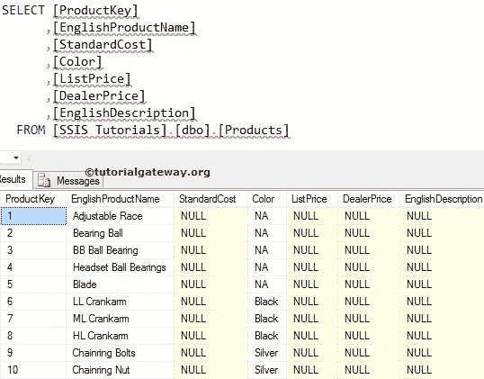

中的目标表

如果您观察上述数据，我们的英文描述列数据为空值。在本例中，我们将使用 SSIS OLE DB 目标转换删除所有没有描述数据的行

## 在 SSIS 使用 OLEDB 命令转换删除数据

将数据流任务从工具箱拖放到控制流区域。并使用 SSIS 的 OLEDB 命令转换将其重命名为删除数据。

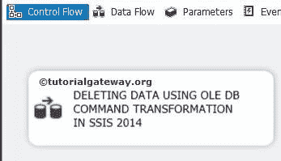

双击它将打开数据流选项卡。接下来，将 OLE DB 源和 OLE DB 命令转换从工具箱拖放到数据流区域。

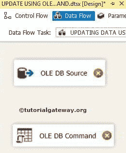

双击数据流区域中的 OLE 数据库源将打开连接管理器设置，并允许我们选择所需的表。

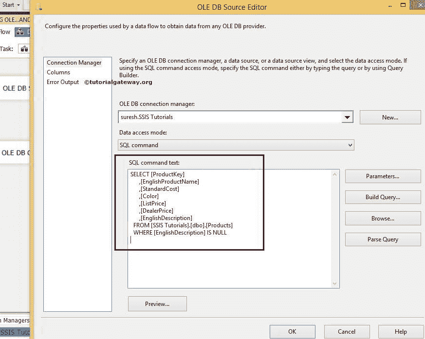

我们用于 SSIS 使用 OLEDB 命令转换删除数据的 [SQL](https://www.tutorialgateway.org/sql/) 命令是

```
SELECT [ProductKey]
      ,[EnglishProductName]
      ,[StandardCost]
      ,[Color]
      ,[ListPrice]
      ,[DealerPrice]
      ,[EnglishDescription]
FROM [SSIS Tutorials].[dbo].[Products]

WHERE [EnglishDescription] IS NULL
```

单击列选项卡验证列，并取消选中不需要的列。

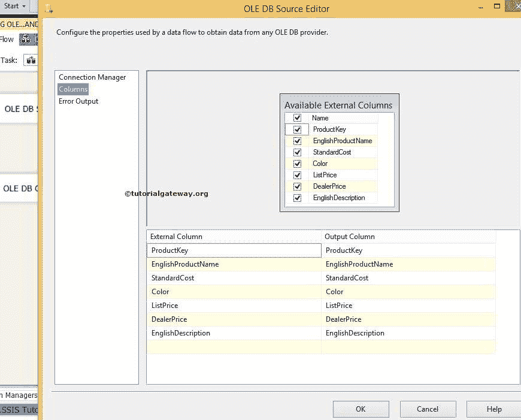

将“OLE DB 源输出”箭头拖到“OLE DB 命令转换”上，以对源数据执行转换。

第五步:双击 OLE DB 命令转换打开高级编辑器进行配置。

在连接管理器选项卡中，我们从列表中选择已经创建的 OLE DB 连接。请参考 SSIS 文章中的 [OLE DB 连接管理器来配置连接管理器。](https://www.tutorialgateway.org/ole-db-command-transformation-in-ssis/)

[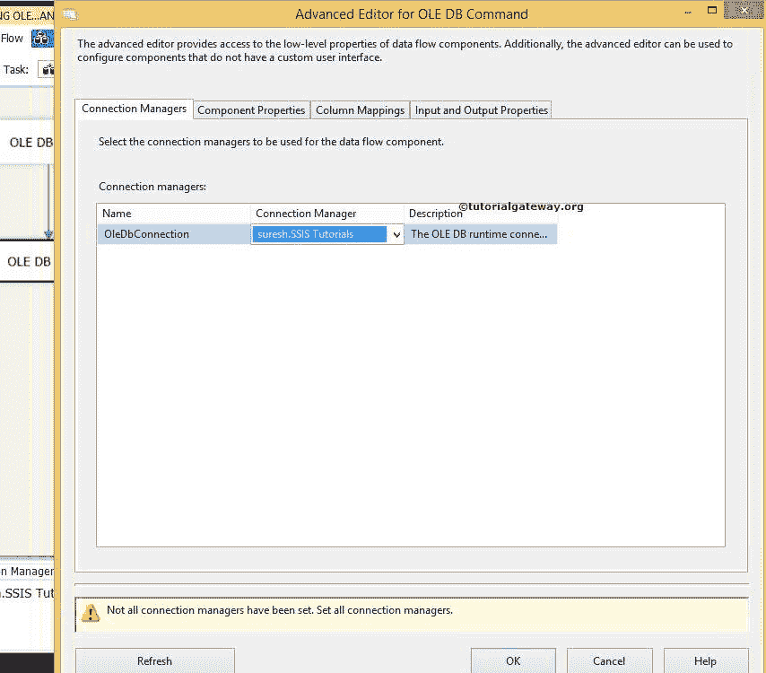](https://www.tutorialgateway.org/ole-db-command-transformation-in-ssis/)

在组件属性中，编写我们必须执行的 SQL 语句。请选择 SqlCommand 属性并点击浏览按钮(…按钮)

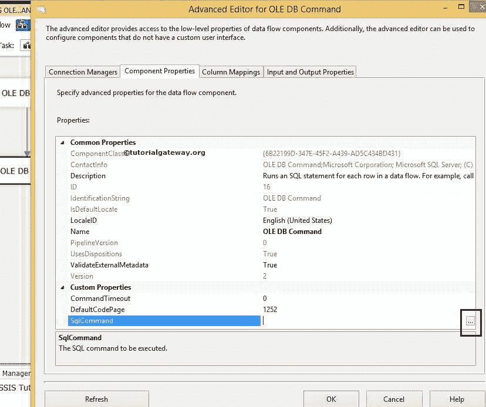

单击浏览按钮后，将打开一个字符串值编辑器窗口来编写 SQL 语句。在本例中，我们删除了 products 表中的值。

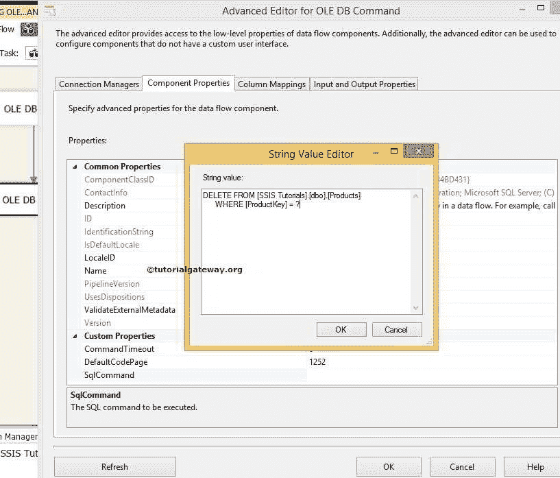

[SQL](https://www.tutorialgateway.org/sql/) 我们用于 SSIS 使用 OLEDB 命令转换删除数据的语句是

```
DELETE FROM [SSIS Tutorials].[dbo].[Products]

WHERE [ProductKey] = ?
```

在列映射中，为参数指定适当的列名。

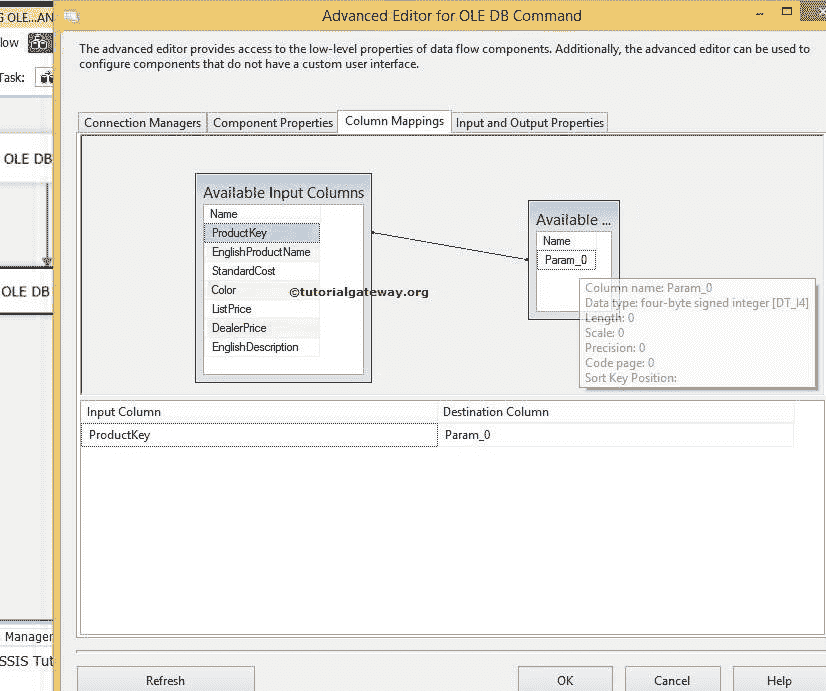

从上面的截图中，可以看到 Param_0 代表第一个问号，也就是来源中的[ProductKey]列。

单击“确定”完成在 SSIS 包中使用 OLEDB 命令转换配置删除数据。让我们运行包

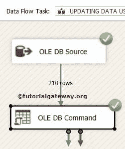

让我们打开 [SQL Server 管理工作室](https://www.tutorialgateway.org/sql/)，检查是否成功删除了没有描述的行。

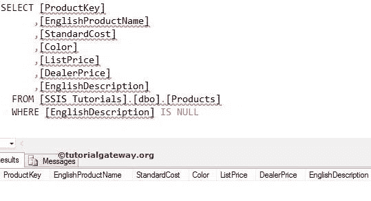

现在让我们看看最终数据。如果观察 ProductKey 列，它以 210 而不是 1 开始，因为 OLE DB 命令转换会删除之前的所有行。

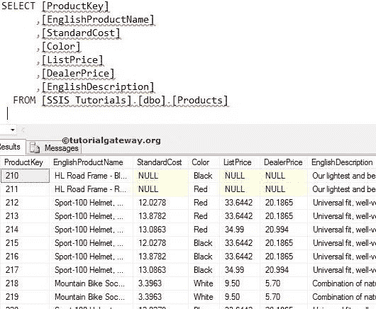