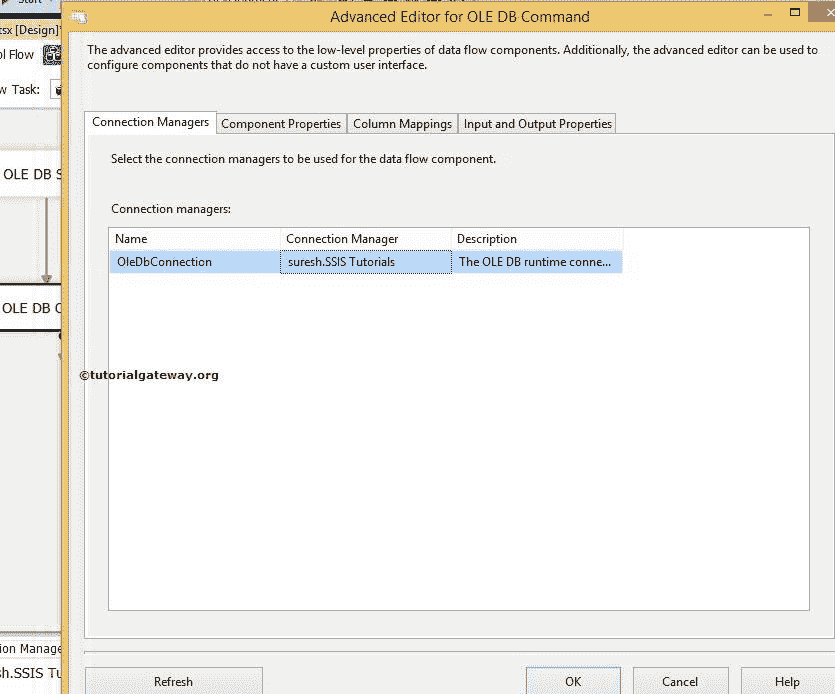

# 在 SSIS 使用 OLEDB 命令转换更新数据

> 原文：<https://www.tutorialgateway.org/update-data-using-oledb-command-transformation-in-ssis/>

在本文中，我们将通过示例向您展示如何在 SSIS 使用 OLEDB 命令转换来更新数据。使用 OLE DB 命令转换插入数据请参考[SSIS](https://www.tutorialgateway.org/ole-db-command-transformation-in-ssis/)文章，使用 OLE DB 命令转换删除数据请参考[SSIS](https://www.tutorialgateway.org/delete-data-using-oledb-command-transformation-in-ssis/)文章了解删除操作。

例如，所有白色产品的标准成本、标价和经销商价格都发生了变化。我们的任务是用修改后的价格更新产品表。在我们开始设计 [SSIS](https://www.tutorialgateway.org/ssis/) 使用 OLEDB 命令转换包更新数据之前，让我向您展示一下【SSIS 教程】数据库


中的表格

下面截图给大家看下修改后的价格表


## 在 SSIS 使用 OLEDB 命令转换更新数据

在本例中，我们的任务是使用 SSIS OLE DB 命令转换，用成本计算表中的新数据或值更新[SSIS 教程]数据库中产品表的旧值。将数据流任务从工具箱拖放到控制流区域，并使用 SSIS 的 OLEDB 命令转换将其重命名为更新数据。


双击它，它将打开数据流选项卡。接下来，将 OLE DB 源和 OLE DB 命令转换从工具箱拖放到数据流区域。


双击数据流区域中的 OLE 数据库源将打开连接管理器设置，并允许我们选择所需的表。


单击“列”选项卡以验证列或取消选中不需要的列。


将“OLE DB 源输出”箭头拖到“OLE DB 命令转换”上，以对源数据执行转换。

第五步:双击 OLE DB 命令转换将打开 OLE DB 命令的高级编辑器进行配置。

在连接管理器选项卡中，我们从列表中选择已经创建的 OLE DB 连接。请参考 SSIS[OLE DB 连接管理器](https://www.tutorialgateway.org/ole-db-connection-manager-in-ssis/)文章。



在组件属性中，我们必须编写 SQL 语句。请选择 SqlCommand 属性并点击浏览按钮(…按钮)


单击浏览按钮后，将打开一个字符串值编辑器窗口来编写 SQL 语句。在本例中，我们正在更新产品表中的值。


[SQL](https://www.tutorialgateway.org/sql/) 我们在 SSIS 使用 OLEDB 命令转换更新数据时使用的语句是

```
UPDATE [SSIS Tutorials].[dbo].[Products]
   SET [StandardCost] = ?
      ,[ListPrice] = ?
      ,[DealerPrice] = ?

 WHERE [Color] = 'white' AND [EnglishProductName] = ?
```

在列映射中，我们必须为参数分配适当的列名。


从上面的截图可以看到，Param_0 代表第一个问号，param_3 代表第四个问号。

让我们为参数指定适当的列名。

单击“确定”完成在 SSIS 包中使用 OLE DB 命令转换配置更新数据。让我们运行包


让我们打开 [SQL Server 管理工作室](https://www.tutorialgateway.org/sql/)查看结果

