# SSIS 的百分比采样转换

> 原文：<https://www.tutorialgateway.org/percentage-sampling-transformation-in-ssis/>

一般来说，SSIS 的百分比采样转换是为了数据建模。这个 SSIS 百分比采样转换从数据源中选择给定百分比的行。接下来，它将它们转移到选定的输出行选项，剩余的行将移动到未选定的输出行。

例如，如果输入有 1000 行，并且如果我们指定 10 作为百分比采样，那么 SSIS 百分比采样转换将从输入数据中返回大约 10%的随机记录。

SSIS 百分比采样转换的功能与[行采样转换](https://www.tutorialgateway.org/row-sampling-transformation-in-ssis/)相同。唯一不同的是， [SSIS](https://www.tutorialgateway.org/ssis/) 百分比采样选择的是行的百分比而不是行数(行采样)。

## SSIS 示例中的百分比采样转换

第一步:从工具箱中拖放数据流任务，并将其重命名为百分比采样转换

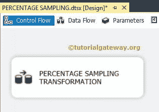

双击它将打开数据流选项卡。

第二步:将 OLE DB 源、百分比采样转换从工具箱拖放到数据流区域

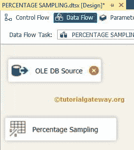

步骤 3:双击数据流区域中的 OLE DB 源将打开连接管理器设置，并提供空间来编写我们的 SQL 语句。

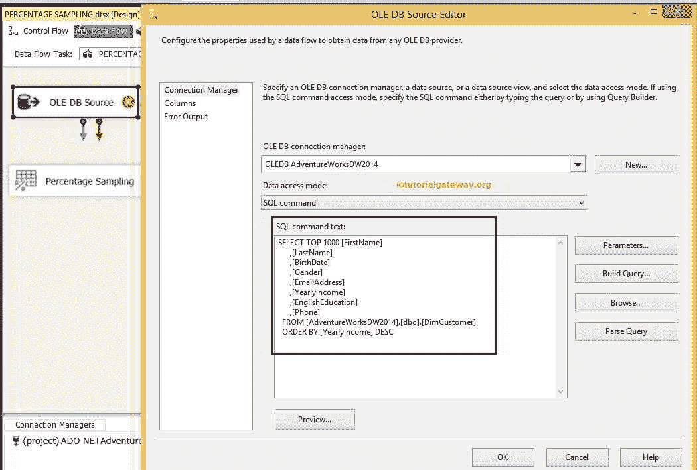

sqlcommand 文本

我们使用的 [SQL](https://www.tutorialgateway.org/sql/) 命令是:

```
SELECT TOP 1000 [FirstName]
      ,[LastName]
      ,[BirthDate]
      ,[Gender]
      ,[EmailAddress]
      ,[YearlyIncome]
      ,[EnglishEducation]
      ,[Phone]
  FROM [AdventureWorksDW2014].[dbo].[DimCustomer]
  ORDER BY [YearlyIncome] DESC
```

目前，我们从 Adventure Works DW 2014 数据库中的 DimCustomers 中选择了前 1000 行，我们希望将这 40%的行发送到目标表

点击列选项卡进行验证，取消选中不需要的列

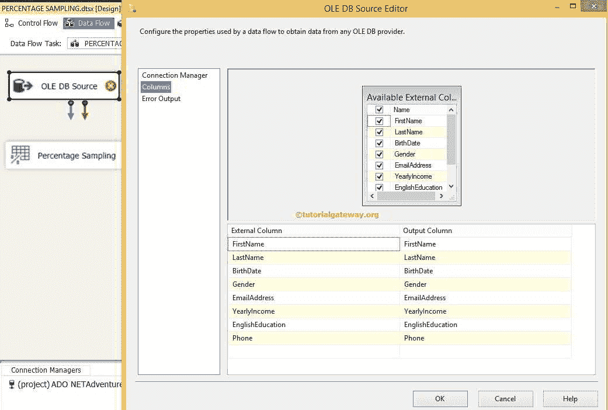

第五步:点击【确定】，编辑【SSIS 百分比采样转换】

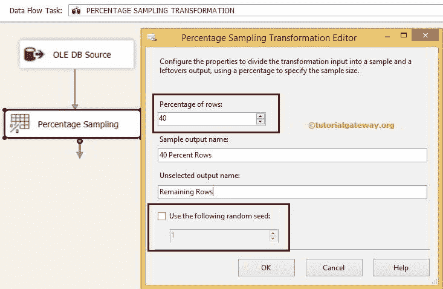

对于本例，我们从输入中选择 40%的行作为所选行，剩余的行将被视为剩余行。

提示:如果选中“使用以下随机种子”选项，每次运行包时，它都会选择相同的行集。如果没有，SSIS 的百分比采样转换会随机选择行。

步骤 6:当我们尝试将百分比采样连接到 OLE DB 目标时，将打开一个输入输出选择弹出窗口，提供选择输出的选项。首先，选择 40%的行输出作为 OLE 数据库目标的输入。当您将另一个箭头拖到其他 OLE 数据库目标时，它会自动选择输出的剩余行。

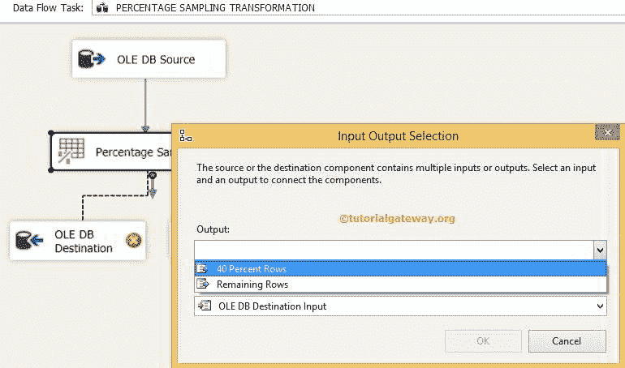

步骤 7:现在，我们必须提供目标的服务器、数据库和表细节。因此双击 OLE DB 目标并提供所需信息

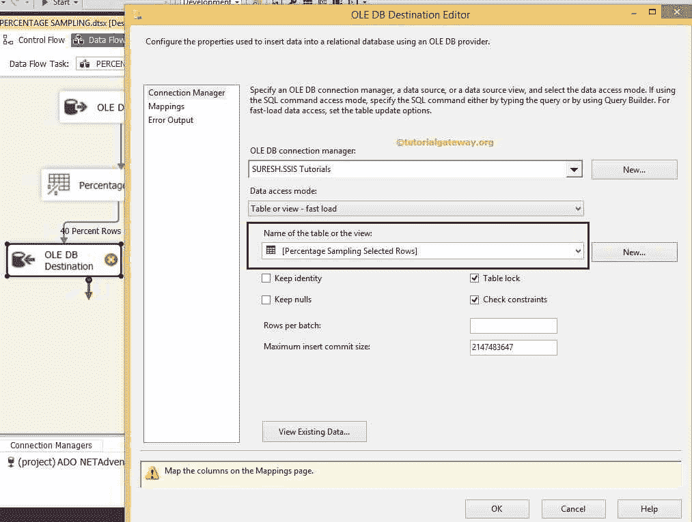

这里，我们选择了 SSIS 教程数据库中的[百分比采样选定行]表

步骤 8:单击映射选项卡，检查映射到目标列的源列。

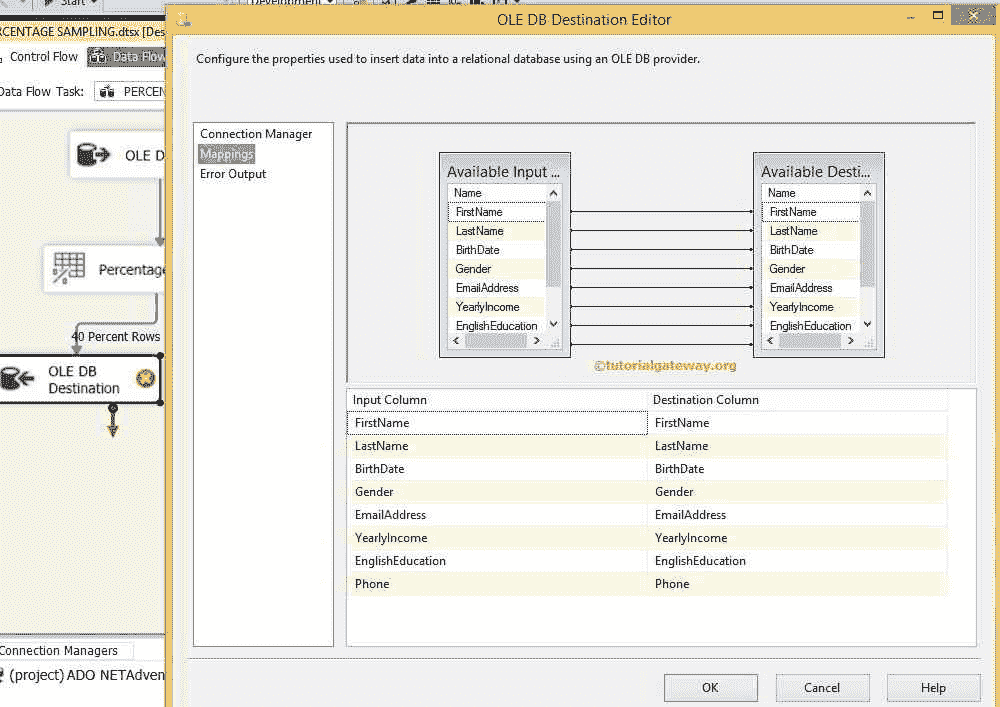

单击“确定”完成 40%行的 OLE 数据库目标的配置。

步骤 9:现在，我们必须为剩余的行配置 OLE DB 目标。因此双击 OLE DB 目标并提供所需信息

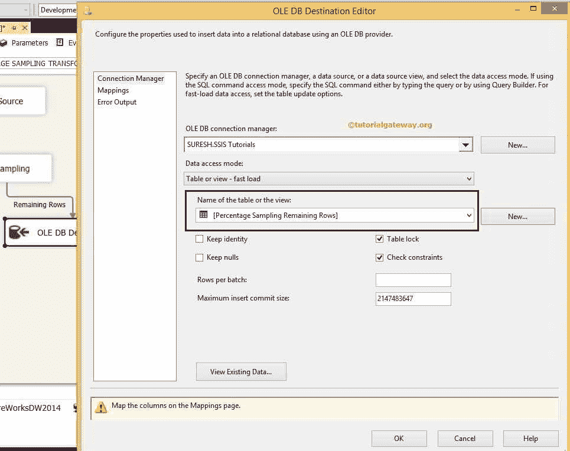

这里，我们选择了 SSIS 教程数据库中的[剩余采样行数百分比]表

第十步:重复第八步

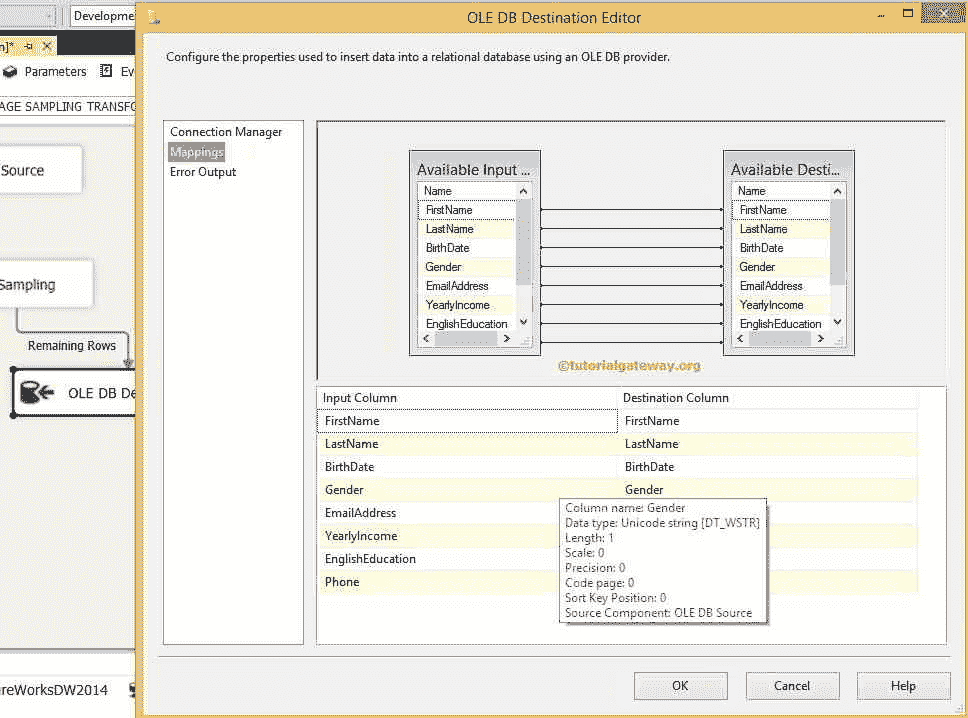

单击“确定”完成我们在 SSIS 包装设计中的百分比采样转换。让我们运行包

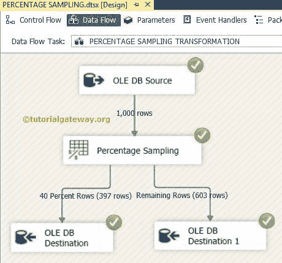

我们在 SSIS 配置了百分比采样转换，从数据源中选择 40%的行意味着 400 行。从上面的截图中，选择了 397 行，并将其转移到[百分比采样选定行]表中，这意味着大约 40%的行。剩余的 603 条记录被转移到[剩余行采样百分比]表

注意:百分比采样转换将选择大约的行百分比，而不是选择精确的行百分比。每次执行时，此估计值都会有所不同。例如，如果您多次运行上面的示例，您可能会得到 397、401、405、395 行等结果。

让我们打开 [SQL Server 管理工作室](https://www.tutorialgateway.org/sql/)并检查两个表的结果

选定行表

```
SELECT [FirstName],[LastName],[BirthDate]
      ,[Gender],[EmailAddress], [YearlyIncome]
      ,[EnglishEducation],[Phone]
 FROM [AdventureWorksDW2014].[dbo].[Row Sampling Remaining Rows]

SELECT COUNT (*) FROM [SSIS Tutorials].[dbo].[Percentage Sampling Selected Rows]
```

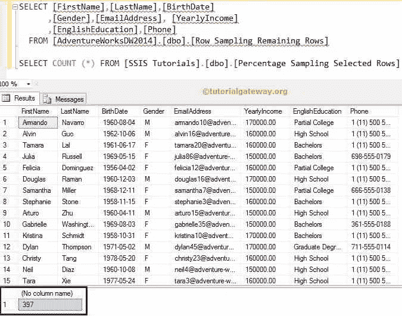

剩余行表

```
SELECT [FirstName],[LastName],[BirthDate]
      ,[Gender],[EmailAddress], [YearlyIncome]
      ,[EnglishEducation],[Phone]
  FROM [AdventureWorksDW2014].[dbo].[Percentage Sampling Remaining Rows]

SELECT COUNT (*) FROM [SSIS Tutorials].[dbo].[Percentage Sampling Remaining Rows]
```

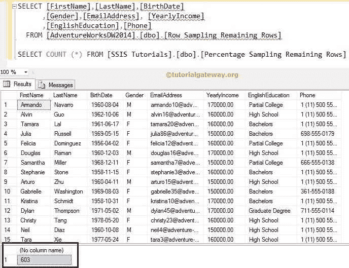