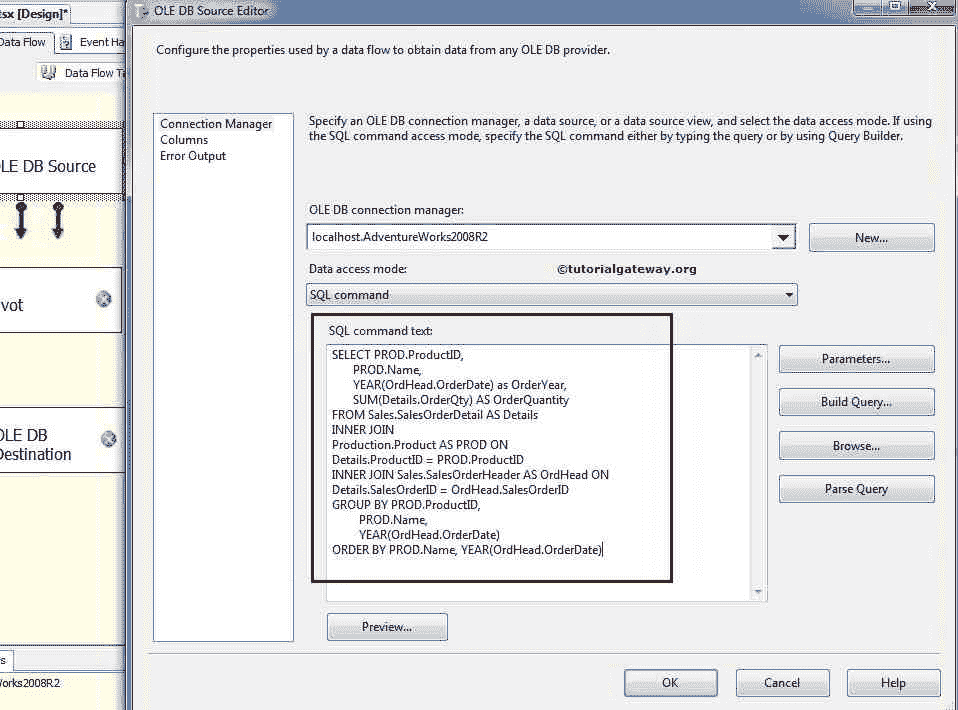
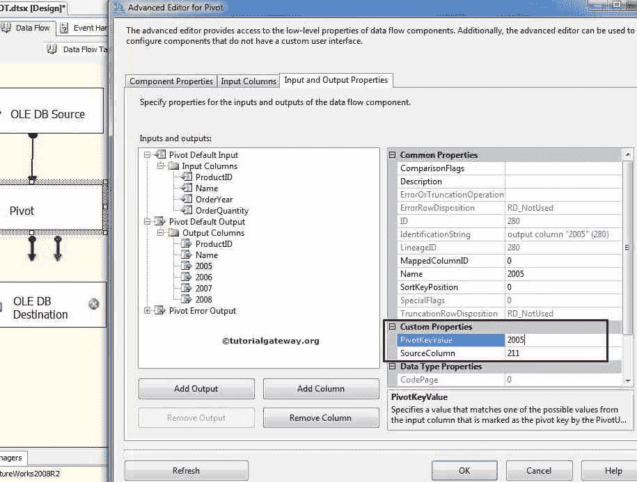

# SSIS 2008 R2 透视转换

> 原文：<https://www.tutorialgateway.org/pivot-transformation-in-ssis-2008r2/>

SSIS 的透视转换允许您对输入数据执行透视操作。在这里，我们将使用一个简单的示例来解释 SSIS 2008R2 中的透视转换，以便您可以更好地理解它。

请参考 [Pivot in SSIS 2014](https://www.tutorialgateway.org/pivot-transformation-in-ssis/) 文章了解他们所做的改变。

## 2008 R2 SSIS 透视转换

场景:我们希望使用 SSIS 2008 R2 中的透视转换来透视下表，以获得所需的输出。


打开 BIDS，从工具箱中拖放数据流任务来控制流，并将其重命名为 ssis 2008 r2 中的透视转换。


双击 [SSIS](https://www.tutorialgateway.org/ssis/) 将打开数据流选项卡。

将 OLE DB 源、透视转换和 OLE DB 目标从工具箱拖放到数据流区域


双击数据流区域中的 OLE DB 源将打开连接管理器设置，并为编写我们的 SQL 语句提供空间。

[我们将用作 SSIS 透视转换源的 SQL](https://www.tutorialgateway.org/sql/) 命令是:

```
SELECT PROD.ProductID,
       PROD.Name,
       YEAR(OrdHead.OrderDate) as OrderYear,
       SUM(Details.OrderQty) AS OrderQuantity

FROM Sales.SalesOrderDetail AS Details
     INNER JOIN
       Production.Product AS PROD ON
          Details.ProductID = PROD.ProductID
     INNER JOIN 
       Sales.SalesOrderHeader AS OrdHead ON
         Details.SalesOrderID = OrdHead.SalesOrderID
GROUP BY PROD.ProductID,
         PROD.Name,
         YEAR(OrdHead.OrderDate)
ORDER BY PROD.Name, 
         YEAR(OrdHead.OrderDate)
```



单击列选项卡验证列。在此选项卡中，我们还可以取消选中不需要的列。


单击“确定”并编辑 SSIS 2008 R2 中的透视转换。在组件属性选项卡中，我们可以更改名称，但我们将保持现在的状态


转到输入列选项卡，选择我们从 OLE DB 源


收到的所有输入列

转到 SSIS 透视转换输入和输出属性选项卡，选择透视默认输入。在“输入列”下，您将找到您在上一个选项卡中选择的所有列。您必须为每个输入列设置的唯一属性是数据透视图。


它描述了可以在数据透视图属性中使用的值:

| 选择 | 描述 |
| Zero | 列值将通过转换传递 |
| one | 设置键。具有相同 set 键的所有列 |
| Two | 这是一个透视列(这些列值成为列名) |
| three | 此列中的值被放置在透视转换创建的新列中 |

因此，在本例中，每个输入列的 PivotUsage 属性将如下所示:

ProductID = 0

名称= 1

订单年份= 2

订单数量= 3

请注意，至少在透视转换中，您必须有一个带有数据透视图 2 的输入列、一个带有数据透视图 3 的输入列、一个带有数据透视图 0 或 1 的输入列。


设置输入列后，转到 Pivot Default 输出，在输出列下，使用【添加列】按钮


添加这些列:ProductID、Name、2005、2006、2007、2008

“产品标识”和“名称”列将显示“产品标识”和“名称”输入列中的确切值。因此，将 ProductID 输出列的 SourceColumn 属性设置为 ProductID 输入列的 LineageID。

在输入列下选择 ProductID，并在那里看到 lineageID 值。


从上面的截图中，可以观察到 202 是输入列的 LineageID。因此，将 ProductID 输出列的 SourceColumn 属性设置为从 ProductID 复制的 LineageID(即 202)


名称列也是如此。

现在，它的透视列转向，在输出列下选择 2005，这些列显示 2005 年的结果，因此在 PivotKeyValue 属性中输入 2005。

输出列 2005、2006、2007 和 2008 的数据来自订单数量输入列。因此，使用 OrderQuantity 输入列的 lineageID 为 2005、2006、2007 和 2008 输出列设置 SourceColumn 值。

在本例中，订单数量的直线指数为 211


因此，我们将 2005 年输出列



的 SourceColumn 设置为 211，PivotKeyValue 设置为 2005

对于 2006 年的输出列，我们将 SourceColumn 设置为 211，将 PivotKeyValue 设置为 2006 年


2007 年也是如此。

对于 2008 输出列，我们将 SourceColumn 设置为 211，将 PivotKeyValue 设置为 2008


接下来，我们必须将输出列保存在 SQL 数据库中。因此，让我们配置 OLE 数据库目标。为此，双击 OLE DB 目标，并提供所需的信息，如目标的 SQL Server 名称、数据库和表详细信息。


在这里，我们选择了雇员数据库作为我们的目标数据库，选择了[数据透视表]作为我们的目标表。

单击“映射”选项卡，检查源列是否完全映射到目标列。


单击“确定”完成 SSIS 2008 R2 包中透视转换的设计。让我们运行包


让我们打开 [SSMS](https://www.tutorialgateway.org/sql/) 查看 2008 年 SSIS 透视转换结果

T4】