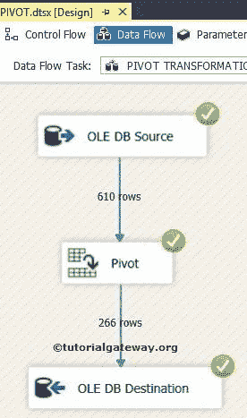

# SSIS 的枢纽转型

> 原文：<https://www.tutorialgateway.org/pivot-transformation-in-ssis/>

SSIS 的透视转换用于对输入数据(源数据)执行透视操作。SSIS 的透视操作意味着将单个行数据转换为单独的列。

在这里，我们将使用一个简单的例子来解释 SSIS 的透视转换，以便您可以更好地理解它。

透视转换与[逆透视转换](https://www.tutorialgateway.org/unpivot-transformation-in-ssis/)正好相反。在前一篇文章中，我们已经讨论了 SSIS 2008R2 中的枢轴转换。虽然功能在 [SSIS](https://www.tutorialgateway.org/ssis/) 2008R2 和 SSIS 2014 中是相同的，但是 SQL Server 商业智能改变了 SQL server 2012 中透视转换的用户界面。与早期版本相比，这个修改版本使开发人员的生活更加轻松。请参考 2008R2 文章中的[透视转换，了解 2014 年的透视转换和 2008R2 的区别。](https://www.tutorialgateway.org/pivot-transformation-in-ssis-2008r2/)

注意:这不是强制性的，但是对于未排序的数据，最好在透视转换之前使用[排序转换](https://www.tutorialgateway.org/sort-transformation-in-ssis/)。因为有时 SSIS 透视转换会对未排序的数据给出奇怪的结果。

## SSIS 案例中的枢纽转换

在本例中，我们将对 SQL Server 表执行透视转换，以将行数据(如日历年 2011、2012、2013 和 2014)转换为单独的列。

考虑下面这个例子的数据


第一步:打开 BIDS，从工具箱中拖拽数据流任务进行流量控制，在 SSIS 2014


将其重命名为 PIVOT Transformation

双击它，它将打开数据流选项卡。

第二步:将 OLE DB 源、透视转换从 SSIS 工具箱拖放到数据流区域


步骤 3:双击数据流区域中的 OLE DB 源将打开连接管理器设置，并提供空间来编写我们的 SQL 语句。


[SQL](https://www.tutorialgateway.org/sql/) 我们用于 SSIS 透视转换的命令是:

```
SELECT PROD.ProductID,
       PROD.Name,
       YEAR(OrdHead.OrderDate) as OrderYear,
       SUM(Details.OrderQty) AS OrderQuantity
FROM Sales.SalesOrderDetail AS Details
     INNER JOIN
       Production.Product AS PROD ON
          Details.ProductID = PROD.ProductID
     INNER JOIN 
       Sales.SalesOrderHeader AS OrdHead ON
         Details.SalesOrderID = OrdHead.SalesOrderID
GROUP BY PROD.ProductID,
         PROD.Name,
         YEAR(OrdHead.OrderDate)
ORDER BY PROD.Name, 
         YEAR(OrdHead.OrderDate)
```

第 4 步:单击列选项卡验证列。在这里，我们也可以取消选中不需要的列。


单击“确定”，将 OLE 数据库源的输出箭头拖到透视转换，对源数据执行透视转换。

### 配置 SSIS 透视转换

步骤 5:双击或编辑透视转换。它将打开透视窗口，这与 SSIS 2008R2 中的透视转换有点不同。


下表说明了可以在 SSIS 透视转换编辑器中使用的值:

| 选择 | 描述 |
| Zero | 列值将通过转换传递 |
| one | 设置键。具有相同 set 键的所有列 |
| Two | 这是一个透视键(这些列值成为列名) |
| three | 这是一个透视值，该列中的值将被放置在透视转换创建的新列中 |

所以，在这个例子中:

ProductID = 0

名称= 1(设置键)

订单年份= 2(透视键)

订单数量= 3(枢轴值)


单击确定并运行 SSIS 透视转换包。

转到进度选项卡，检查列名，如下所示。

注意:对于像本例这样的 3 列或 4 列，我们可以用列名直接替换[值 1]，[值 2]等，但是在实时情况下，我们可能会处理 50 年，因此不可能在从值区域生成透视输出列中写入这 50 年。因此，最好运行一次包，然后从进度选项卡


中复制列名

停止调试模式并复制选定的值。

再次双击数据流区域中的 SSIS 透视转换，并将列名粘贴到从值区域生成透视输出列中，如下图所示。


单击“立即生成列”按钮以生成透视列。此生成的列会自动添加到现有透视输出列区域


在“生成输出列结果”窗口中单击“确定”以生成名称如上面截图所示的输出列。


从上面的截图中，如果您可以观察现有的透视输出列区域，将为源数据生成输出列(C_2011_OrderQuantity、C_2012_OrderQuantity、C_2013_OrderQuantity 和 C_2014_OrderQuantity)。

单击确定。

现在我们必须保留 SQL 数据库中的输出列。因此，将 OLE 数据库目标从工具箱拖放到数据流区域。接下来，将 SSIS 透视转换输出箭头拖到 OLE DB 目标中。

双击 OLE DB 目标，并提供所需的信息，如目标的 SQL Server 名称、数据库和表详细信息。


这里，我们选择了[SSIS 教程]数据库作为我们的目标数据库，选择了[SSIS 的透视转换]表作为我们的目标表。

单击映射选项卡，检查映射到目标列的透视转换源列。


注意:如果您的输入和目标列名相同，智能会自动映射。如果列名(任何别名或计算列)有任何变化，我们必须手动映射它们。

从上面的截图可以观察到，智能本身是无法映射的。所以，请正确映射。


单击“确定”完成 SSIS 2014 软件包中枢轴转换的设计。让我们运行包



### 透视转换结果

让我们打开 [SSMS](https://www.tutorialgateway.org/sql/) ，并编写下面的查询来检查 SSIS 透视转换结果

```
SELECT [Product Name]
     ,[2011]
     ,[2012]
     ,[2013]
     ,[2014]
FROM [PIVOT Transformation in SSIS]
```

