# SSIS 的行数转换

> 原文：<https://www.tutorialgateway.org/row-count-transformation-in-ssis/>

SSIS 的行计数转换用于在行通过数据流时对行进行计数，并将最终计数存储在变量中。例如，如果我们想通知管理器通知插入的行数，那么我们可以使用 SSIS 行数转换来计算行数。然后使用脚本任务向经理发送电子邮件。

在 SQL Server 集成服务中，行计数转换将不会更新变量值，直到源数据的最后一行通过此 SSIS 转换。所以，我们不能在中间使用更新的值。让我们设计一个包，以便更好地理解 SSIS 行数转换。

## SSIS 示例中的行数转换

第一步:将数据流任务从工具箱拖放到控制流中，在 SSIS

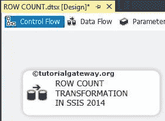

将其重命名为行数转换

步骤 2:这个转换只在一个变量中存储计数的行信息，所以在使用这个转换之前，我们需要在变量选项卡上创建一个变量，并将一个整数变量添加到包中。

右键单击 [SSIS](https://www.tutorialgateway.org/ssis/) 控制流区域将打开带有多个选项的上下文菜单。从上下文菜单中选择变量选项以创建变量。

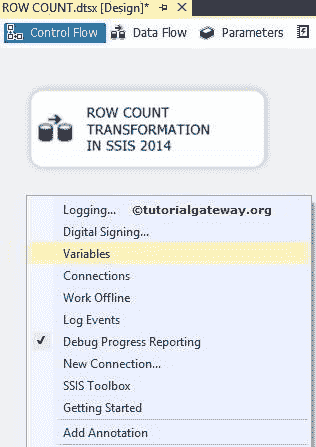

在本例中，我们选择添加一个名为 NumberOfRows 的整型变量，并将值赋给 0。

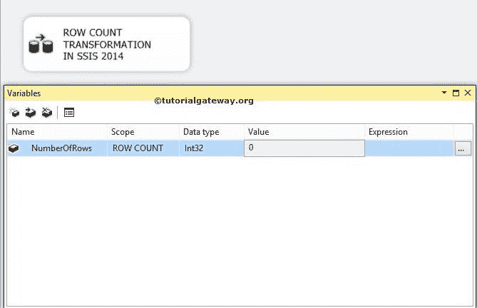

双击数据流任务将打开数据流选项卡。

第三步:将 OLE DB 源、行数转换从 SSIS 工具箱拖放到数据流区域

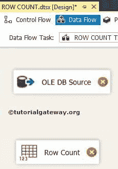

步骤 4:双击数据流区域中的 OLE DB 源将打开连接管理器设置，并提供空间来编写我们的 SQL 语句。

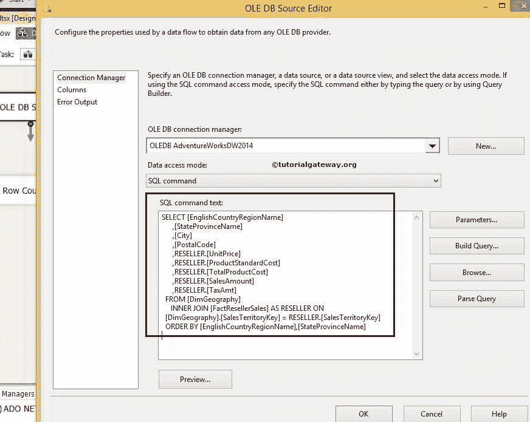

[我们在上图中使用的 SQL](https://www.tutorialgateway.org/sql/) 命令

```
USE AdventureWorksDW2014
GO

SELECT [EnglishCountryRegionName]
      ,[StateProvinceName]
      ,[City]
      ,[PostalCode]
      ,RESELLER.[UnitPrice]
      ,RESELLER.[ProductStandardCost]
      ,RESELLER.[TotalProductCost]
      ,RESELLER.[SalesAmount]
      ,RESELLER.[TaxAmt]

FROM [DimGeography]
  INNER JOIN [FactResellerSales] AS RESELLER ON
[DimGeography].[SalesTerritoryKey] = RESELLER.[SalesTerritoryKey] 
ORDER BY [EnglishCountryRegionName],[StateProvinceName]
```

第 5 步:单击列选项卡验证列。在此选项卡中，我们还可以取消选中不需要的列。

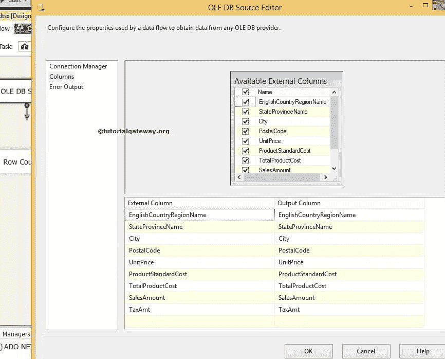

单击确定

步骤 6:最后一步是配置行计数转换。双击 SSIS 行数转换将打开一个小的行数窗口，从下拉列表中选择用户定义的变量。这里我们选择已经创建的变量(NumberOfRows)。

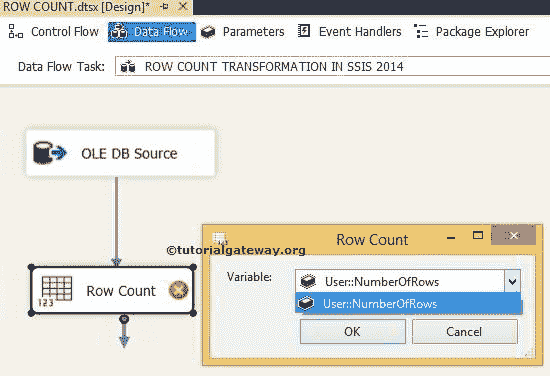

或者，您可以用更传统的方法配置 SSIS 行数转换。右键单击行计数转换将打开带有多个选项的上下文菜单。在这里选择显示高级编辑器选项。

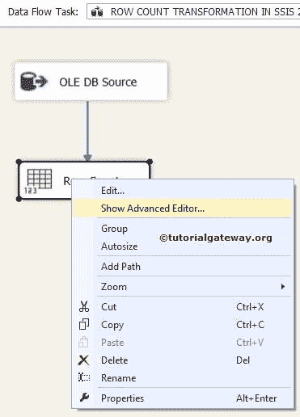

它打开 SSIS 行数转换的高级编辑器。在组件属性选项卡中，选择行计数编辑器的变量名称属性，如下图所示，并关联我们之前创建的变量(NumberOfRows)

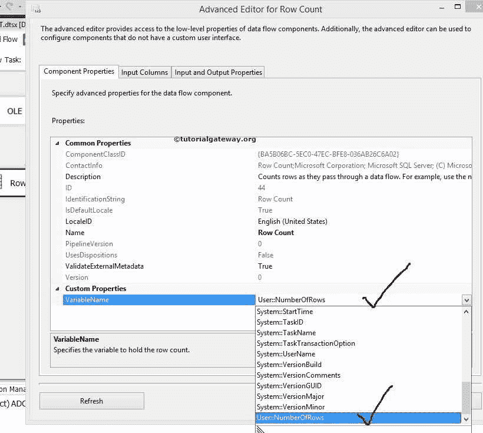

第七步:进入控制流区域，将[脚本任务](https://www.tutorialgateway.org/script-task-in-ssis/)从工具箱拖放到控制流区域。接下来，双击它来配置

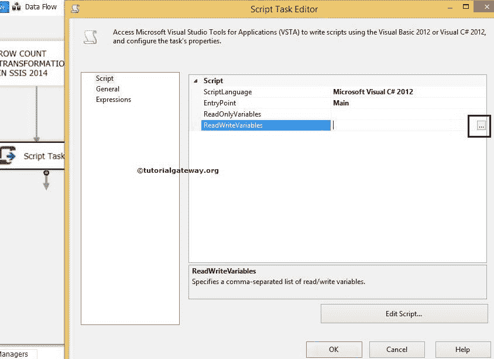

第八步:选择用户定义的变量作为读写变量

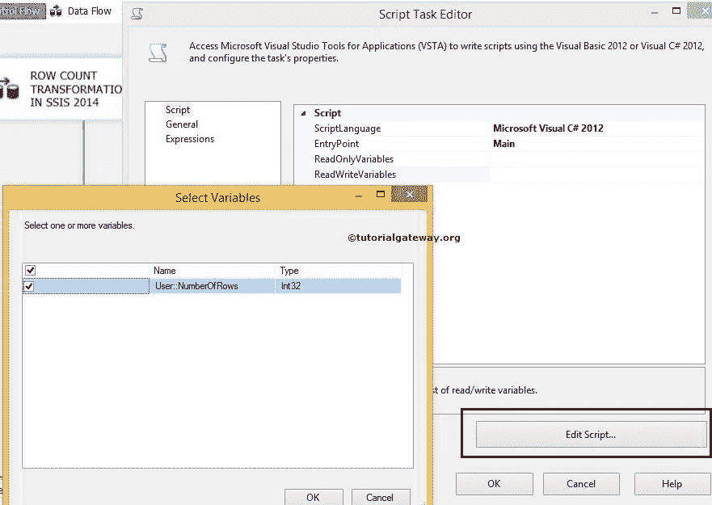

第九步:点击确定，然后点击编辑脚本按钮，打开类文件

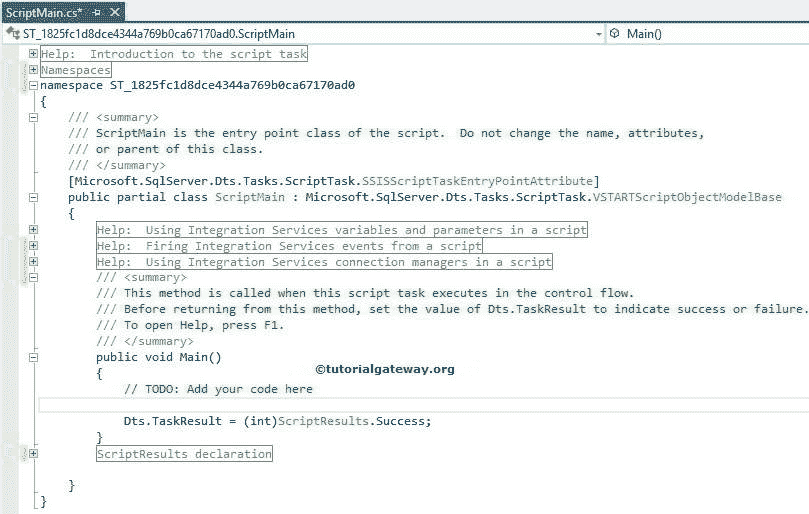

在 Main 方法中键入以下代码行

```
String Message = Dts.Variables["User::NumberOFRows"].Value.ToString();

MessageBox.Show(Message);
```

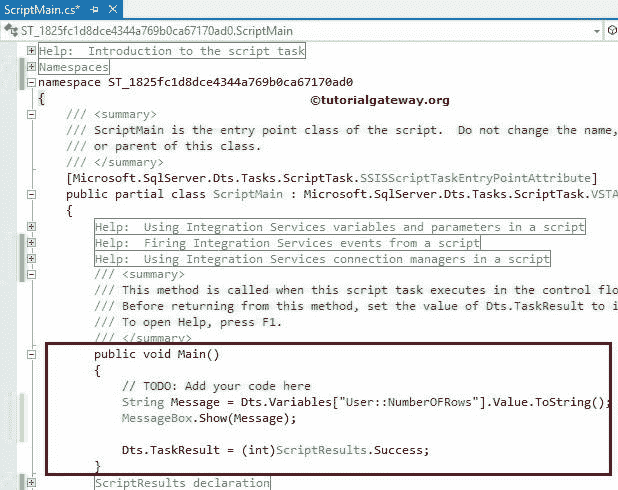

注:这里我用的是 C#编程语言代码，对不起 VB.Net 人。希望你能理解这段代码。

关闭类文件，让我们运行 SSIS 行数转换包。从下面的截图中，您可以看到它正在显示带有行数信息的消息框。

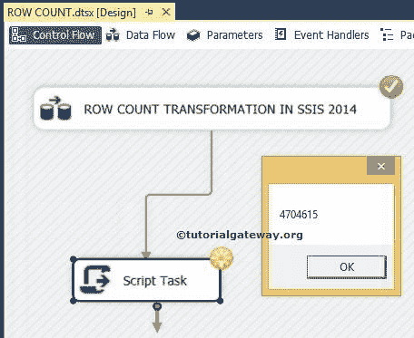

让我们看看数据流区域，SSIS 行数转换是否给出了正确的结果

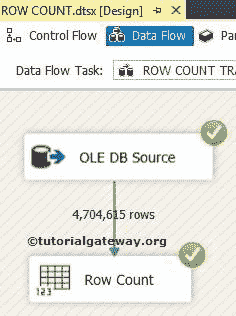

请记住，在您单击确定按钮之前，脚本任务将处于运行模式。关闭消息框后，绿色勾号将显示

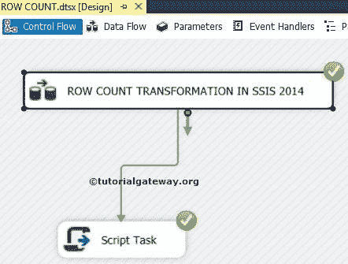

您可以观察到显示通过该转换传递的行数的消息框。

注意:这个 SSIS 行数转换有一个输入和一个输出。它不支持错误输出。