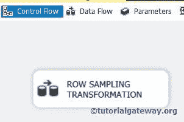

# SSIS 的行抽样转换

> 原文：<https://www.tutorialgateway.org/row-sampling-transformation-in-ssis/>

SSIS 的行采样转换提供了一个选项，可以指定要从数据源中检索的行数。SSIS 行采样转换数据是随机选择的，除非您使用此使用以下随机种子选项。

SSIS 的行采样转换将从一个源获取整个数据，并随机提取选定的行数。SSIS 行采样给你两个输出。第一个是选中的数据，第二个是未选中的数据。这种 SSIS 行采样转换在训练数据挖掘模型时非常有用。

理解数据建模还为时过早，所以让我们举一个简单的例子——例如，100 名员工在一家软件公司工作。公司必须挑选十名员工出国旅游。然后公司可以用 SSIS 行抽样转换随机抽取十名员工。如果公司可能每年选择同样的十名员工，他们可以勾选使用以下随机种子选项。

## SSIS 实例中的行抽样转换

步骤 1:从工具箱中拖放数据流任务来控制流，并将其命名为行采样转换。



双击它将打开 [SSIS](https://www.tutorialgateway.org/ssis/) 数据流选项卡。

第二步:将 OLE DB 源、行采样转换从 SSIS 工具箱拖放到数据流区域


步骤 3:双击数据流区域中的 OLE DB 源将打开连接管理器设置，并提供空间来编写我们的 SQL 语句。


sqlcommand 文本

```
SELECT TOP 1000 [FirstName]
      ,[LastName]
      ,[BirthDate]
      ,[Gender]
      ,[EmailAddress]
      ,[YearlyIncome]
      ,[EnglishEducation]
      ,[Phone]
  FROM [AdventureWorksDW2014].[dbo].[DimCustomer]
  ORDER BY [YearlyIncome] DESC
```

目前，我们在 Adventure Works DW 2014 数据库中从 DimCustomers 中选择了前 1000 行，我们希望在目标表中选择 300 行。

第 4 步:单击列选项卡验证列。在此选项卡中，我们还可以取消选中不需要的列。


提示:如果我们不想要任何列，那么不要将它们添加到您的 SQL 命令中。

步骤 5:单击确定，并使用箭头连接 OLE 数据库源和行采样转换。双击 SSIS 行采样转换进行配置。

这里，我们选择 300 行作为选定行，其余 700 行作为未选定行。


提示:如果您选中“使用以下随机种子”选项，那么它将在您每次运行包时选择相同的行集。如果没有，行采样转换将随机选择行。

步骤 6:当我们尝试将 SSIS 行采样转换连接到 OLE DB 目标时。一个名为“输入输出选择”的弹出窗口，提供选择输出的选项。


这里，我们选择了 SELECTED ROWS 输出。单击确定，并将另一个箭头从 SSIS 行采样拖放到第二个目标。在这里，它将自动选择剩余行选项。

步骤 7:现在，我们必须提供目标的服务器、数据库和表细节。因此双击所选行的 OLE DB 目标，并给出所需信息


在这里，我们选择了[冒险工作 DW 2014]数据库中的[行采样选定行]表

步骤 8:单击映射选项卡，查看精确映射的列。


单击“确定”完成选定行的 OLE 数据库目标的配置。

注意:如果输入列名和目标列名相同，智能将自动映射。如果列名有变化，那么我们必须手动分配它们。

步骤 9:现在，我们必须为剩余的行配置 OLE DB 目标。因此双击 OLE DB 目标并提供所需信息


这里，我们选择了[冒险工作 DW 2014]数据库中的[行采样剩余行]表

单击“映射”选项卡检查源列是否正确映射到目标列，然后单击“确定”完成 SSIS 包设计中的行采样转换。

让我们运行 SSIS 行采样转换包


让我们打开 [SQL Server 管理工作室](https://www.tutorialgateway.org/sql/)，检查两个表的 SSIS 行抽样转换结果

选定行表

```
SELECT [FirstName],[LastName],[BirthDate]
      ,[Gender],[EmailAddress], [YearlyIncome]
      ,[EnglishEducation],[Phone]
FROM [AdventureWorksDW2014].[dbo].[Row Sampling Selected Rows]

SELECT COUNT (*) FROM [AdventureWorksDW2014].[dbo].[Row Sampling Selected Rows]
```


您可以观察到该表中的行数= 300

剩余行表

```
SELECT [FirstName],[LastName],[BirthDate]
      ,[Gender],[EmailAddress], [YearlyIncome]
      ,[EnglishEducation],[Phone]
FROM [AdventureWorksDW2014].[dbo].[Row Sampling Remaining Rows]

SELECT COUNT (*) FROM [AdventureWorksDW2014].[dbo].[Row Sampling Remaining Rows]
```

