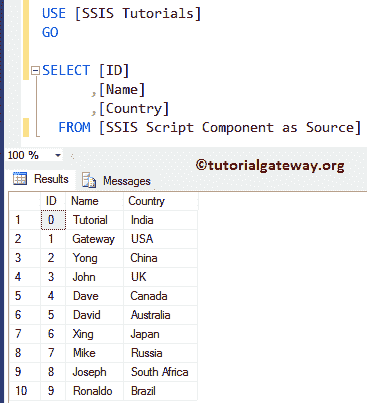

# 作为源的 SSIS 脚本组件

> 原文：<https://www.tutorialgateway.org/ssis-script-component-as-source/>

在本文中，我们将通过一个实例展示如何使用 SSIS 脚本组件作为源代码。您还可以查看以下链接:

*   [SSIS 脚本组件作为转换](https://www.tutorialgateway.org/ssis-script-component-as-transformation/)
*   [作为目的地的 SSIS 脚本组件](https://www.tutorialgateway.org/ssis-script-component-as-destination/)

## 将 SSIS 脚本组件配置为源

步骤 1:从工具箱中拖放数据流任务到控制流区域，并将其重命名为源中的 SSIS 脚本组件。


双击它将打开数据流选项卡。

第二步:将脚本组件从 [SSIS](https://www.tutorialgateway.org/ssis/) 工具箱拖放到数据流区域。将脚本组件放到数据流区域后，将会打开一个名为“选择脚本内容类型”的新弹出窗口。在这个例子中，我们想要演示 SSIS 脚本组件作为源代码，因此，我们选择了源代码选项


步骤 3:双击脚本组件将打开下面的编辑器来配置属性。请参见[脚本组件转换](https://www.tutorialgateway.org/ssis-script-component-as-transformation/)了解这些属性


第四步:在输入和输出选项卡中，转到输出列，在输出列下，我们将使用添加列按钮


添加这些列:身份证、姓名、国家

首先，我们添加国家列，然后将数据类型从整数(默认)更改为字符串[DT_STR]


同样，我们添加了剩余的列。请记住，您可以使用“名称”属性根据需要更改列名。


接下来，我们将使用 name 属性将输出名称更改为 Myoutput。改变不是强制性的，要看你


步骤 5:在脚本选项卡中，请单击编辑脚本..按钮来编写实际的 C#脚本

提示:您可以使用脚本语言属性将语言更改为 VB.Net。


一旦你点击编辑脚本，它将打开 main.cs 类文件来编写 C#代码。要发送一些代码，我们必须在 CreateNewOutputRows()函数


中编写我们的自定义代码

第六步:在这里添加你的定制 C#代码。在本例中，我们声明了两个字符串数组，然后使用 For 循环将每个数组元素分配给单独的行。


我们在上面的截图中使用的代码是:

C# CODE

```
public override void CreateNewOutputRows()
 {
   /*
      Add rows by calling the AddRow method on the member variable named "<Output Name>Buffer".
      For example, call MyOutputBuffer.AddRow() if your output was named "MyOutput".
   */
   //int[] Identity = new int[] { 1, 2, 3, 4, 5, 6, 7, 8, 9, 10 };

   // Creating String array holding the Country Names 
   string[] CountryNames = new string[] { "India", "USA", "China", "UK", "Canada", 
                                         "Australia", "Japan", "Russia", "South Africa", "Brazil"};
   // Creating String array holding the Names
   string[] CustomerNames = new string[] { "Tutorial", "Gateway", "Yong", "John", 
                                           "Dave", "David", "Xing", "Mike", "Joseph", "Ronaldo"};

   for (int i = 0; i < CountryNames.Length; i++)
   {
      /* Myoutput is the Name that we given in Script component.
         Please provide the name that you see, or assigned in Script Component
      */
      MyoutputBuffer.AddRow();
      MyoutputBuffer.ID = i; // Identity[i];
      MyoutputBuffer.Country = CountryNames[i];
      MyoutputBuffer.Name = CustomerNames[i];
   }
 }
```

步骤 7:编辑完脚本后，请关闭 main.cs 文件。接下来，将 [OLE DB 目的地](https://www.tutorialgateway.org/ssis-ole-db-destination/)拖放到数据流区域，然后将脚本组件输出箭头拖动到这个新的 OLE DB 目的地


第八步:双击 [OLE DB 目标](https://www.tutorialgateway.org/ssis-ole-db-destination/)将打开 OLE DB 目标编辑器。


步骤 9:选择您已经创建的 [OLE DB 连接管理器](https://www.tutorialgateway.org/ole-db-connection-manager-in-ssis/)(如果没有，使用新建按钮创建一个新的)。这里我们选择[SSIS 教程]数据库中的[SSIS 脚本组件作为源]表。


步骤 10:单击映射选项卡，检查源列是否映射到目标列。


单击“确定”完成创建我们的 SSIS 脚本组件作为源包。

步骤 11:在解决方案资源管理器中右键单击作为源包的 SSIS 脚本组件，并选择执行包。


从上面的截图中，您可以观察到我们的包已经成功执行。让我们打开 [SQL Server 管理工作室](https://www.tutorialgateway.org/sql-server-management-studio/)并编写以下查询来查看数据

```
USE [SSIS Tutorials]
GO

SELECT [ID]
      ,[Name]
      ,[Country]
  FROM [SSIS Script Component as Source]
```

输出

