# 作为转换的 SSIS 脚本组件

> 原文：<https://www.tutorialgateway.org/ssis-script-component-as-transformation/>

脚本组件是 SQL Server 集成服务中最重要和最强大的项目之一。我们可以将这个 SSIS 脚本组件用作源、目标和转换。

在本文中，我们将通过一个实际的例子向您展示如何使用 SSIS 脚本组件作为转换。虽然我们使用了一个简单的 SSIS 脚本组件的例子作为转换演示，但是它是为做健壮的工作而设计的。内置转换不可能完成的工作，或者我们可以使用这个 SSIS 脚本组件作为一个转换，在一个地方组合多个转换的工作。

您还可以查看以下链接:

*   [SSIS 脚本组件为源](https://www.tutorialgateway.org/ssis-script-component-as-source/)
*   [作为目标的 SSIS 脚本组件](https://www.tutorialgateway.org/ssis-script-component-as-destination/)

在我们开始创建作为转换包的 SSIS 脚本组件之前，让我们看看将要使用的 SQL 表和数据。

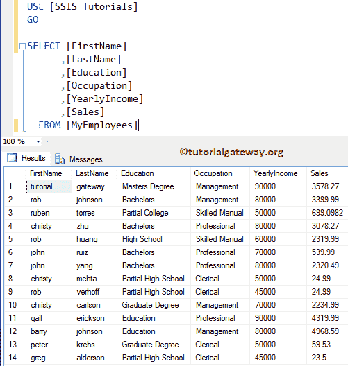

## 将 SSIS 脚本组件配置为转换

第一步:从工具箱中拖放数据流任务到控制流区域，并将其重命名为 SSIS 脚本组件转换。

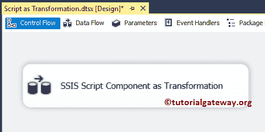

双击 [SSIS](https://www.tutorialgateway.org/ssis/) 数据流任务将打开数据流选项卡。

第二步:拖拽 [OLE DB 源](https://www.tutorialgateway.org/ole-db-source-in-ssis/)双击打开 [OLE DB 连接管理器](https://www.tutorialgateway.org/ole-db-connection-manager-in-ssis/)设置

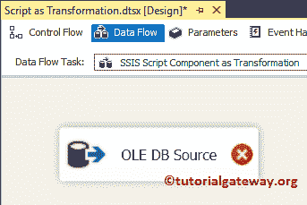

从下面的截图可以观察到，我们选择了【SSIS 教程】数据库作为源数据库，【我的员工】表作为源表

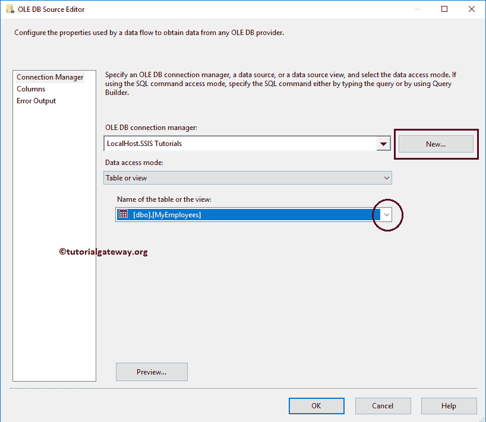

第 3 步:单击列选项卡验证列。在此选项卡中，我们还可以取消选中不需要的列。

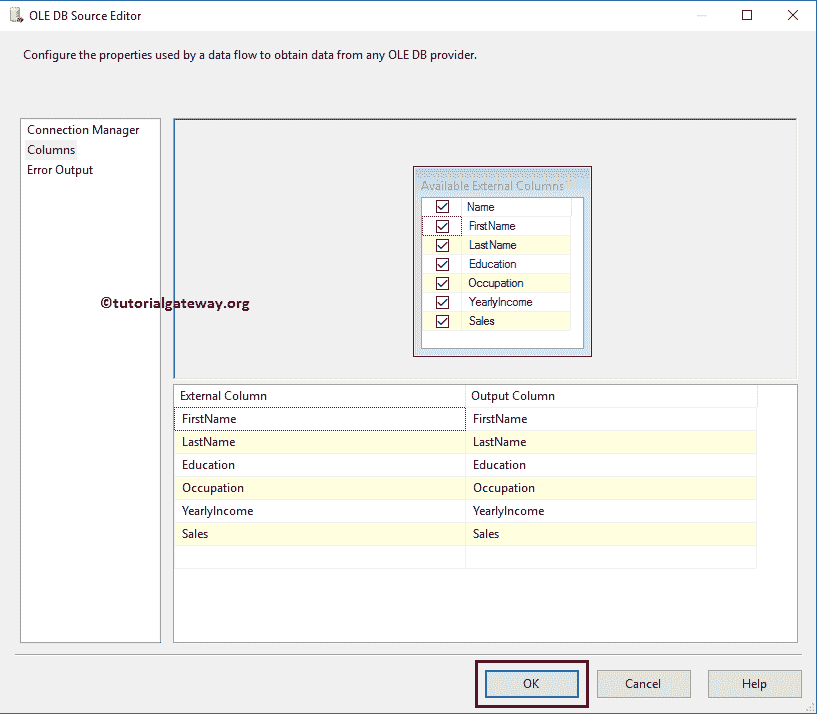

第四步:将 [SSIS](https://www.tutorialgateway.org/ssis/) 工具箱中的脚本组件拖放到数据流区域。删除脚本组件后，将打开一个名为“选择脚本内容类型”的新弹出窗口。

在这里，我们想要演示作为转换的 SSIS 脚本组件。因此，我们选择了转换选项

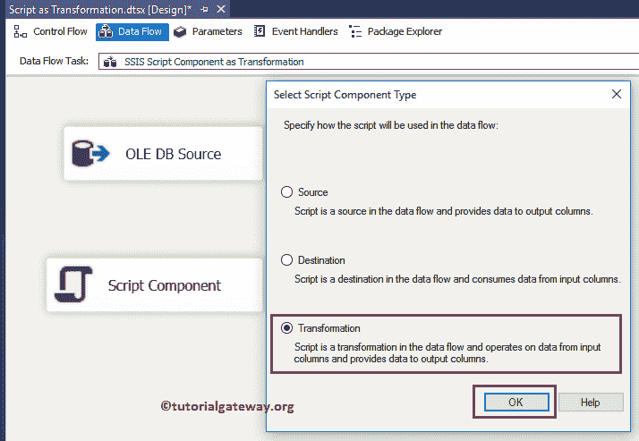

步骤 5:双击脚本组件将打开下面的编辑器来配置属性。虽然有许多属性，但我们将探索日常编码中使用的一些重要特性

*   名称:请提供唯一的名称
*   描述:简要描述脚本功能。提供有效的描述始终是一种良好的做法。
*   ReadOnlyVariables:请选择要在脚本中使用的变量，它们可以是用户定义的变量或系统默认变量。请记住，选择为只读的变量用于只读目的(我们不能更改它们)
*   读写变量:请选择要在脚本中使用的变量。请记住，作为读写变量选择的变量可以根据我们的要求进行更改

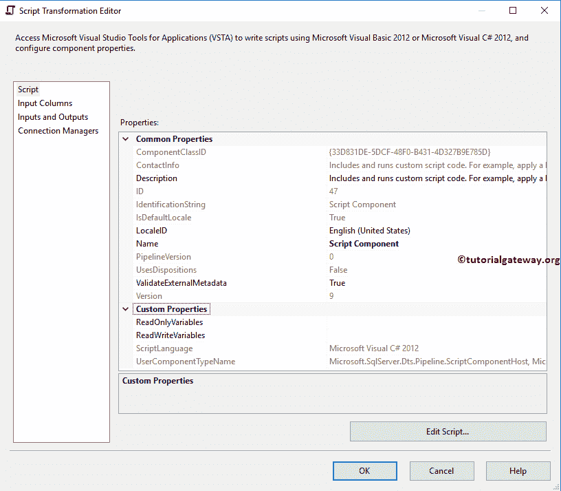

步骤 6:在 SSIS 脚本组件作为转换输入列标签中，您可以交叉检查输入列。

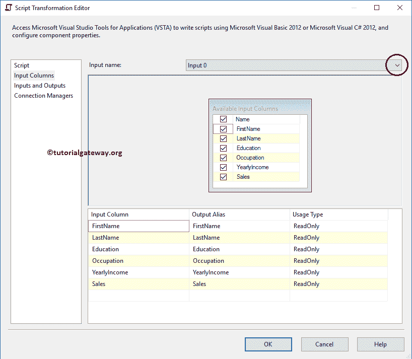

第七步:在输入和输出选项卡中，转到输出列，在输出列下，我们将使用添加列按钮

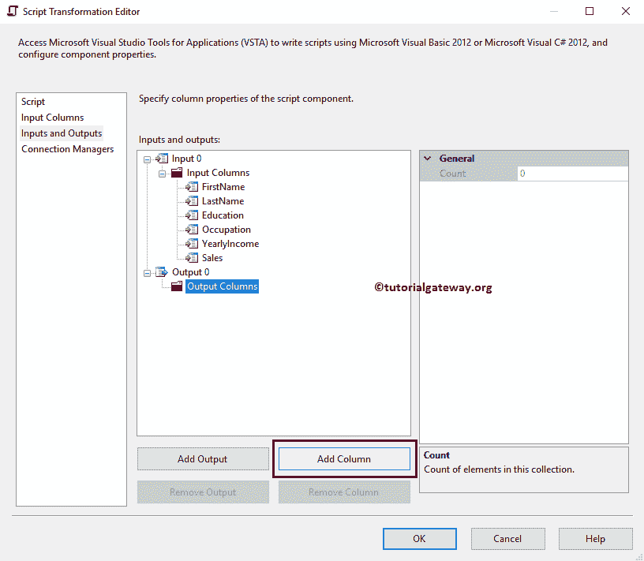

添加一个名为全名的列

这里我们添加了全名列，然后将数据类型从整数(默认)更改为字符串[DT_STR]

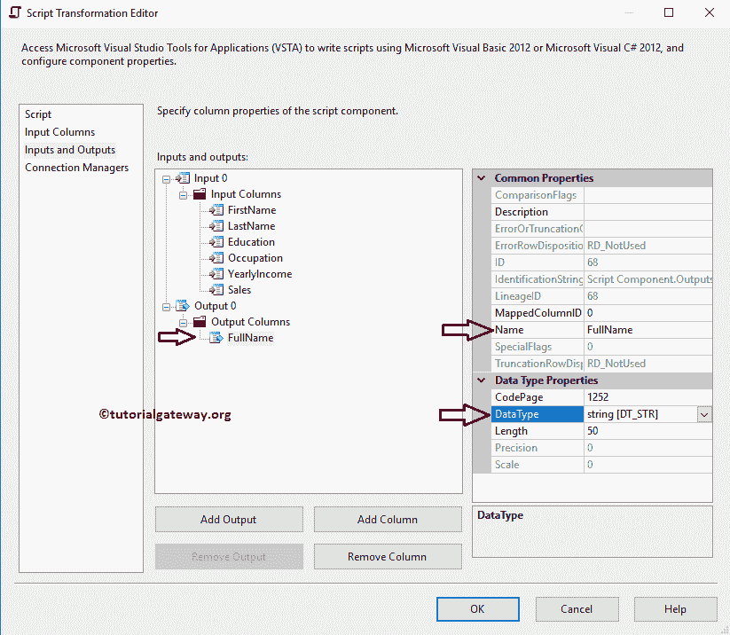

步骤 8:在脚本选项卡中，请单击编辑脚本..按钮编写实际的 C#脚本

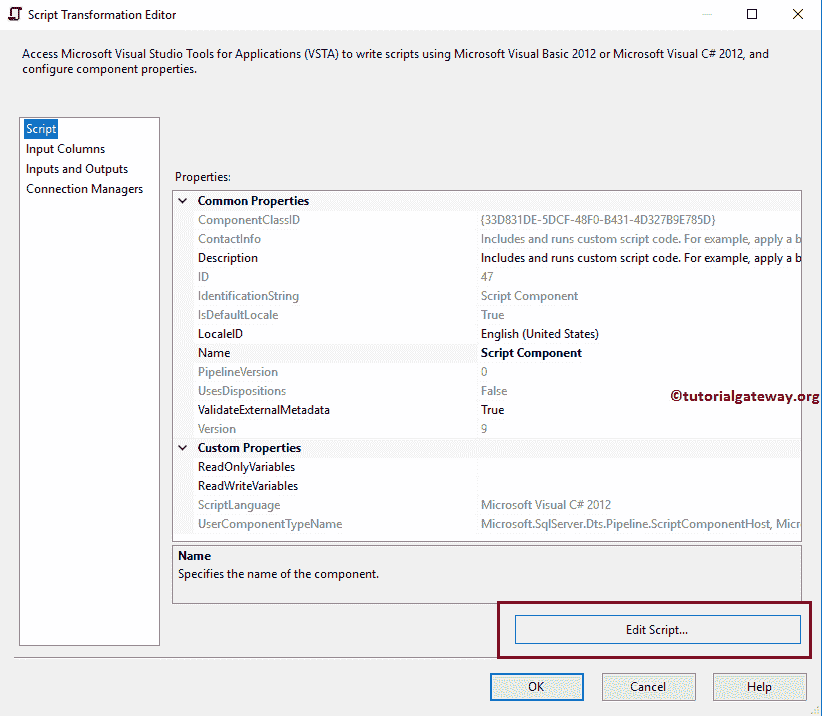

一旦你点击编辑脚本，它将打开 main.cs 类文件来编写 C#代码。请在【输入 0 缓冲行】函数【输入 0】 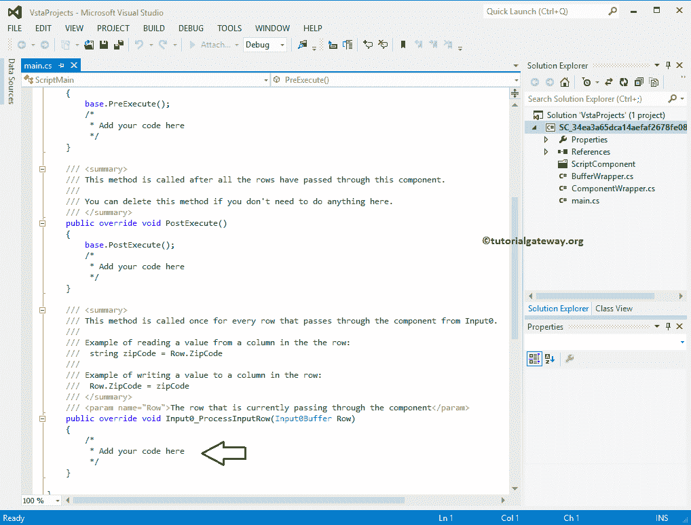 中写入您的自定义代码

步骤 9:在这里添加你的定制 C#代码。在这个例子中，我们将名字和姓氏连接起来，然后将第一个字母转换成大写字母。

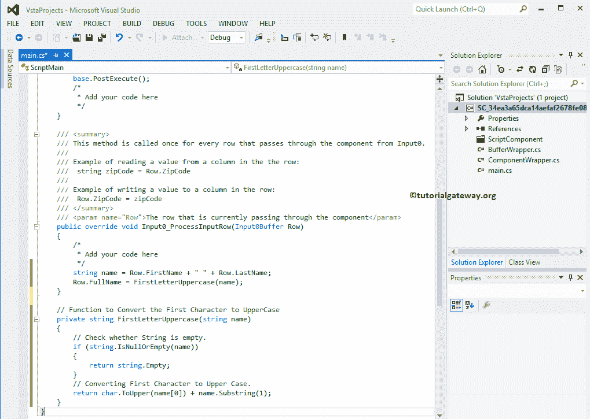

我们在上面的 SSIS 脚本组件转换截图中使用的代码是:

C# CODE

```
    public override void Input0_ProcessInputRow(Input0Buffer Row)
    {
        /*
         * Add your code here
         */
        string name = Row.FirstName + " " + Row.LastName;
        Row.FullName = FirstLetterUppercase(name);
    }

    // Function to Convert the First Character to UpperCase 
    private string FirstLetterUppercase(string name)
    {
        // Check whether String is empty.
        if (string.IsNullOrEmpty(name))
        {
            return string.Empty;
        }
        // Converting First Character to Upper Case.
        return char.ToUpper(name[0]) + name.Substring(1);
    }
```

步骤 10:编辑完脚本后，请关闭主. cs 文件。接下来，拖动 [OLE DB 目标](https://www.tutorialgateway.org/ssis-ole-db-destination/)，将脚本组件输出箭头连接到这个新的 OLE DB 目标

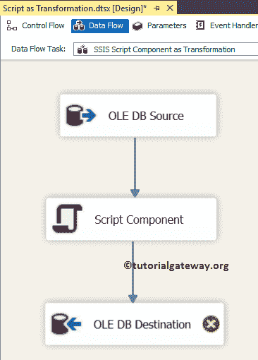

第十一步:双击 [OLE DB 目标](https://www.tutorialgateway.org/ssis-ole-db-destination/)，选择已经创建的 [OLE DB 连接管理器](https://www.tutorialgateway.org/ole-db-connection-manager-in-ssis/)。这里我们选择[SSIS 教程]数据库中的[SSIS 脚本组件作为转换]表。

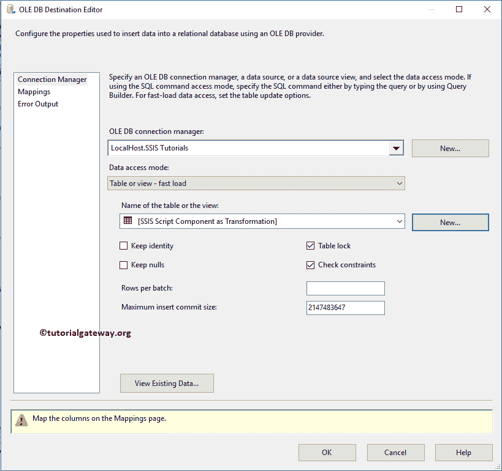

步骤 12:单击映射选项卡，检查源列是否映射到目标列。

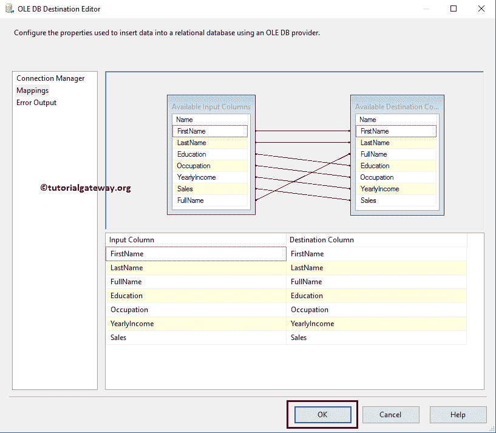

单击“确定”完成创建我们的包。

步骤 13:在解决方案资源管理器中右键单击作为转换包的 SSIS 脚本组件，并选择执行包。

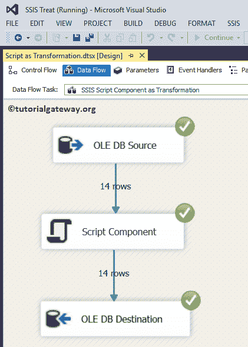

从上面的截图中，您可以观察到我们的 SSIS 脚本组件转换包已经成功执行。让我们打开 [SQL Server 管理工作室](https://www.tutorialgateway.org/sql/)并编写以下查询来查看数据

```
USE [SSIS Tutorials]
GO
SELECT [FirstName]
      ,[LastName]
      ,[FullName]
      ,[Education]
      ,[Occupation]
      ,[YearlyIncome]
      ,[Sales]
  FROM [SSIS Script Component as Transformation]
```

输出

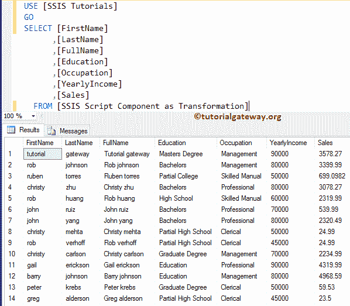