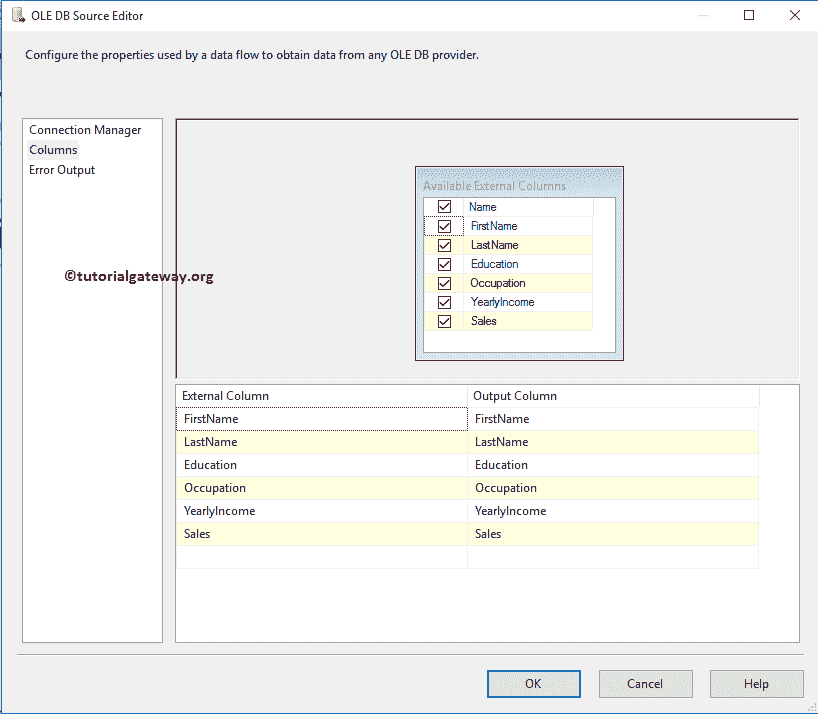
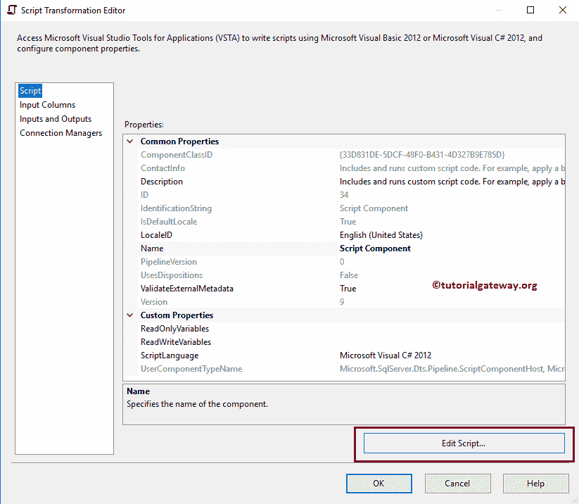

# 作为目标的 SSIS 脚本组件

> 原文：<https://www.tutorialgateway.org/ssis-script-component-as-destination/>

本文将通过一个实例向您展示如何使用 SSIS 脚本组件作为目标。您还可以查看以下链接:

*   [SSIS 脚本组件为源](https://www.tutorialgateway.org/ssis-script-component-as-source/)
*   [SSIS 脚本组件作为转换](https://www.tutorialgateway.org/ssis-script-component-as-transformation/)

在我们开始创建作为目标包的 SSIS 脚本组件之前，让我们看看将要使用的 SQL 表和数据。


## 将 SSIS 脚本组件配置为目标

步骤 1:从工具箱中拖放数据流任务以控制流区域。接下来，将其重命名为目标 SSIS 脚本组件。


双击 [SSIS](https://www.tutorialgateway.org/ssis/) 数据流任务将打开数据流选项卡。

第二步:将 [OLE DB 源](https://www.tutorialgateway.org/ole-db-source-in-ssis/)从工具箱拖放到数据流区域。双击数据流区域中的 OLE DB 源将打开 [OLE DB 连接管理器](https://www.tutorialgateway.org/ole-db-connection-manager-in-ssis/)设置


从下面的截图中，您可以看到我们选择了[SSIS 教程]数据库中的[我的员工]表作为源表


第 3 步:单击列选项卡验证列。在此选项卡中，我们还可以取消选中不需要的列。



第四步:将脚本组件从 [SSIS](https://www.tutorialgateway.org/ssis/) 工具箱拖放到数据流区域。删除脚本组件后，将会打开一个名为“选择脚本内容类型”的新弹出窗口，如下所示。这里我们想演示一下作为目标的 SSIS 脚本组件，因此，我们选择了目标选项


接下来，将 OLE DB 源输出箭头拖放到这个脚本组件


**步骤 3:双击 Script 组件将打开以下编辑器来配置属性。请参见[脚本组件转换](https://www.tutorialgateway.org/ssis-script-component-as-transformation/)了解这些属性**


步骤 6:在“输入列”选项卡中，您可以交叉检查输入列。


步骤 7:在连接管理器选项卡中，您可以添加 OLE DB、ADO 或平面文件连接管理器。以便您可以从脚本文件调用连接。对于这个例子，我们将直接提供 C#脚本里面的文件路径


步骤 8:在脚本选项卡中，请单击编辑脚本..按钮编写实际的 C#脚本



一旦你点击编辑脚本，它将打开 main.cs 类文件来编写 C#代码。请在【输入 0 缓冲行】函数【输入 0】  中写入您的自定义代码

步骤 9:在这里添加你的定制 C#代码。对于本例，我们将源数据中的每一行和每一列读取到文本文件中。


我们在上面的 SSIS 脚本组件目标屏幕截图中使用的代码是:

C# CODE

```
// Creating two private Variables
private StreamWriter textWriter;
private string columnDelimiter = ",";

  /// This method is called once, before rows begin to be processed in the data flow.
  ///
  /// You can remove this method if you don't need to do anything here.
public override void PreExecute()
{
   base.PreExecute();

     /* Establish the Connection before the data flow begins.
        If you place this code inside the Input0_ProcessInputRow() then it will
        an error 
     */
   textWriter = new StreamWriter(@"D:\FILE EXAMPLES\Write.txt", false); 
}

  /// This method is called after all the rows have passed through this component.
  ///
  /// You can delete this method if you don't need to do anything here.
public override void PostExecute()
{
   base.PostExecute();

   // Closing the Connection. 
   textWriter.Close(); // It is always advisable to close the Connection 
}

  /// This method is called once for every row that passes through the component from Input0.
  ///
  /// Example of reading a value from a column in the the row:
  ///  string zipCode = Row.ZipCode
  ///
  /// Example of writing a value to a column in the row:
  ///  Row.ZipCode = zipCode
public override void Input0_ProcessInputRow(Input0Buffer Row)
{
    textWriter.Write(Row.FirstName);
    textWriter.Write(columnDelimiter);

    textWriter.Write(Row.LastName);
    textWriter.Write(columnDelimiter);

    textWriter.Write(Row.Education);
    textWriter.Write(columnDelimiter);

    textWriter.Write(Row.Occupation);
    textWriter.Write(columnDelimiter);

    textWriter.Write(Row.YearlyIncome);
    textWriter.Write(columnDelimiter);

    textWriter.Write(Row.Sales);

    textWriter.WriteLine();
}
```

我建议你也看看评论。编辑完脚本后，请关闭主. cs 文件，然后单击“确定”完成包的创建

步骤 10:在解决方案资源管理器中右键单击作为目标包的 SSIS 脚本组件，并选择执行包。


从上面的截图中，您可以观察到我们作为目标包的 SSIS 脚本组件已经成功执行。让我们打开文本文件，看看数据是否被写入。

