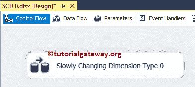
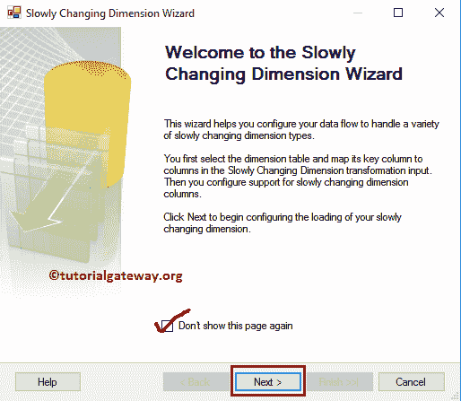
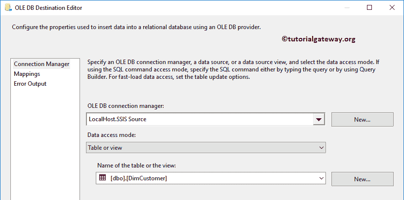

# SSIS 渐变维度类型 0

> 原文：<https://www.tutorialgateway.org/ssis-slowly-changing-dimension-type-0/>

在本文中，我们将解释关于 SSIS 渐变维度类型 0(称为固定属性)。

SSIS 渐变维度类型 0:如果要限制列不变，则将其标记为固定属性。如果维表成员(列)标记为固定属性，则不允许对这些列进行任何更改(更新数据)，但可以插入新记录。这种改变是有用的。例如，我们可以将员工姓氏、出生日期、公司登录详细信息标记为固定属性，因为一旦我们存储了这些值，它们就不会对任何员工发生变化。在我们进入示例之前，让我们看看维度表中的数据。

下面的截图将向您展示我们的[DimCustomer]表中的数据。通过从[AdventureWorksDW2014]数据库的[DimCustomer]表中选择前 10 条记录，可以获得相同的数据。

下图显示了[客户资源]表中的数据，我们将在[客户资源]表中插入或更新这两条记录。

如果您观察上面的截图，客户备选密钥(AW00011011)的姓氏已经从“阳”变成了“略”，我们有了一个客户备选密钥(AW00011011)的新记录。我们的任务是插入新记录，并尝试更新第一条记录的姓氏。

## SSIS 渐变维度类型 0 示例

步骤 1:打开 BIDS，从工具箱中拖放数据流任务来控制流，并将其命名为 SSIS 渐变维度类型 0。

双击它将打开数据流选项卡。

第二步:拖放 OLE DB 源，从 [SSIS](https://www.tutorialgateway.org/ssis/) 工具箱慢慢改变维度到数据流区域

T4】

步骤 3:双击数据流区域中的 OLE DB 源将打开连接管理器设置，并提供空间来编写我们的 SQL 语句。这里我们使用已经创建的 [OLE DB 连接管理器](https://www.tutorialgateway.org/ole-db-connection-manager-in-ssis/)和【SSIS 源】中的 CustomerSource 表作为源表。请参考 SSIS 文章中的 [OLE DB 源码。](https://www.tutorialgateway.org/ole-db-source-in-ssis/)

第 4 步:单击列选项卡验证列。在此选项卡中，我们还可以取消选中不需要的列。

将蓝色箭头从“OLE DB 源”拖放到“渐变维度转换”以连接数据。

第五步:双击渐变维度转换打开编辑器。一旦你点击它，它将打开慢慢改变维度向导。第一页是欢迎页面，如果您不想再次看到此页面，请勾选“不再显示此页面”复选框。现在，点击下一步

步骤 6:选择维度表和键:此页面用于配置维度表信息。

连接管理器:此选项用于提供与维度表的连接。这里我们使用已经创建的 [OLE DB 连接管理器](https://www.tutorialgateway.org/ole-db-connection-manager-in-ssis/)和【SSIS 来源】中的 DimCustomer 表作为维度表。您总是可以通过单击“新建”按钮来更改连接。

表或视图:此选项对于选择要对其执行缓慢更改操作的数据仓库维度表或视图非常有用。这里我们选择的是 DimCustomer 表。

*   输入列:来自要插入或更新的 OLE 数据库源或列的列。
*   维度列:维度表中可用的列。
*   键类型:要执行缓慢变化维度，我们至少需要一个业务键，我们都知道客户替代键是键列。请将键类型从非键列更改为业务键

步骤 7–慢慢改变维度列:这是整个向导的主页面。这里有

*   维度列:维度表中可用的所有列都将在此部分中可用。在这里，您必须选择要标记为固定属性的列。从下面的截图中，您可以看到我们选择了姓氏、出生日期和电子邮件地址列
*   变更类型:选择变更类型。在本例中，我们讨论的是 SCD 类型 0。因此，我们保留默认的固定属性作为变更类型。

默认情况下，向导会将“固定”属性指定为“更改类型”。但是你可以改变它们。

步骤 8–固定和更改属性选项:此页面有两个选项，第二个选项对于 SCD 类型 0 呈灰色。如果数据有任何变化(来自输入列的数据不同于维度表数据)，则:

*   如果要使包失败，请选中“如果在固定属性选项中检测到更改，则使转换失败”复选框。
*   如果您不想包失败，请取消选中此选项。注意，取消选中此选项不允许您更新现有记录，但它不会使包失败

步骤 9–推断维度成员:我们将在“缓慢变化的维度推断维度”一文中讨论此选项。现在，我们取消选择该选项，点击【下一步】按钮

步骤 10–完成渐变尺寸向导:点击完成按钮，完成 SSIS 渐变尺寸类型 0

的配置

一旦你点击完成按钮，我们的数据流将自动改变。如果观察下面的截图，它添加了 [OLE DB Destination](https://www.tutorialgateway.org/ssis-ole-db-destination/) 将新记录插入维度表

(可选步骤):让我们双击 OLE DB 目标来检查自动创建的目标(表名和连接管理器设置和映射)。

单击“确定”完成我们的 SSIS 渐变尺寸类型 0 包设计。让我们运行包

从上面的截图中，您可以观察到，尽管有两行来自 OLE 数据库源。此处仅插入了一行(未执行更新)。

让我们打开 [SQL Server 管理工作室](https://www.tutorialgateway.org/sql/)查看结果。如果您观察到以下记录，我们的包添加了客户替代密钥 AW00011011 的新记录。但是没有更新 AW00011001 的姓氏。

让我们看看如果在固定属性选项中检测到更改，取消选中失败转换时会发生什么。

单击“确定”完成 SSIS 渐变维度类型 0 包设计，并让我们运行该包。从下面的截图中，您可以观察到该包在慢慢改变维度转换时失败了。

