# SSIS 缓变维度类型 1

> 原文：<https://www.tutorialgateway.org/ssis-slowly-changing-dimension-type-1/>

在本文中，我们将解释关于 SSIS 缓变维度类型 1(称为变化属性)。

SSIS 缓变维度类型 1:如果要更新列数据，请将其标记为“变化属性”。如果维度表成员(列)标记为“更改属性”，它会用新记录替换现有记录。这种改变是有用的。例如，如果我们想要更新错误键入的数据，请将此列标记为“正在更改”属性。在我们进入示例之前，让我们看看维度表中的数据。

注:SSIS 缓变维度类型 1 会用新值更新旧记录，但不维护 [SSIS](https://www.tutorialgateway.org/ssis/) 的历史数据。

下面的截图将显示我们的[员工]表中的数据。您可以通过从[AdventureWorksDW2014]数据库的[DimEmployee]表中选择前 10 条记录来获得相同的数据。

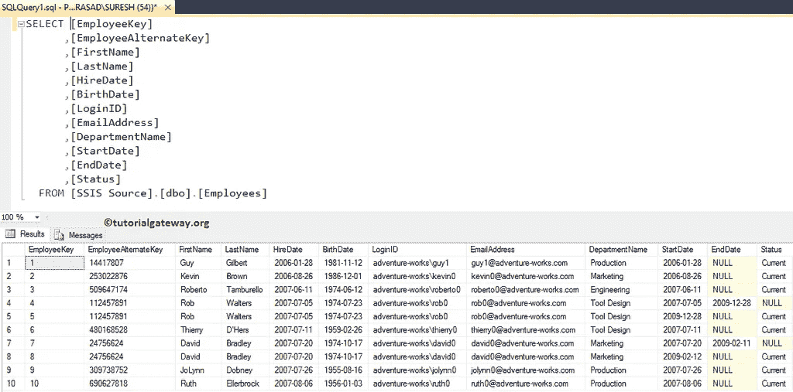

下图显示了[雇员资源]表中的数据，我们将更新这两条记录或将它们插入[雇员]表中。

如果您观察上面的图像，员工标识(253022876)的部门名称与原始值不同(它已从“营销”更改为“销售”，我们有一个员工标识为 253022870 的新记录。我们的任务是插入新记录并更新第二个记录的部门名称。

## SSIS 缓变维度类型 1 示例

步骤 1:打开 BIDS，将数据流任务从工具箱拖放到控制流中。接下来，将其命名为 SSIS 缓变维度类型 1。

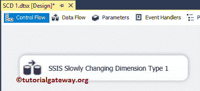

双击它将打开数据流选项卡。

第二步:拖拽 OLE DB 源，从 SSIS 工具箱慢慢变维到数据流区域

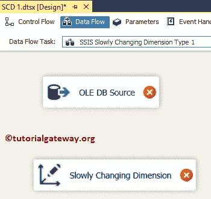

第三步:双击 [OLE DB 源](https://www.tutorialgateway.org/ole-db-source-in-ssis/)。这里我们使用已经创建的 [OLE 数据库连接管理器](https://www.tutorialgateway.org/ole-db-connection-manager-in-ssis/)和【SSIS 来源】中的员工来源表作为来源表。

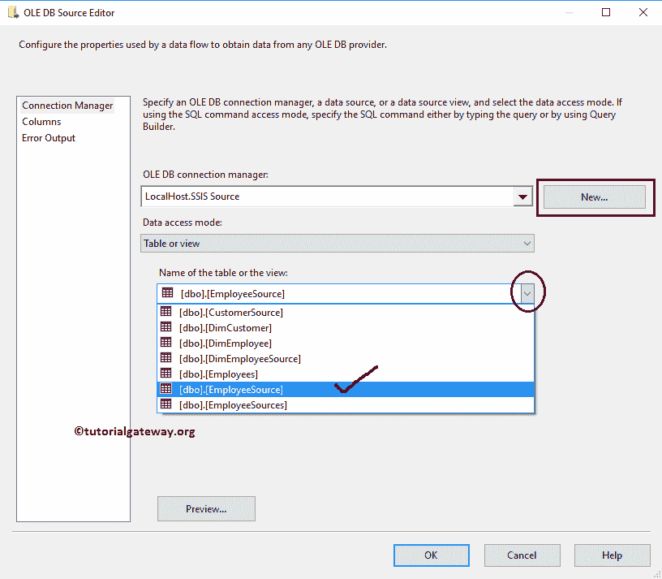

第 4 步:单击列选项卡验证列。在此选项卡中，我们还可以取消选中不需要的列。

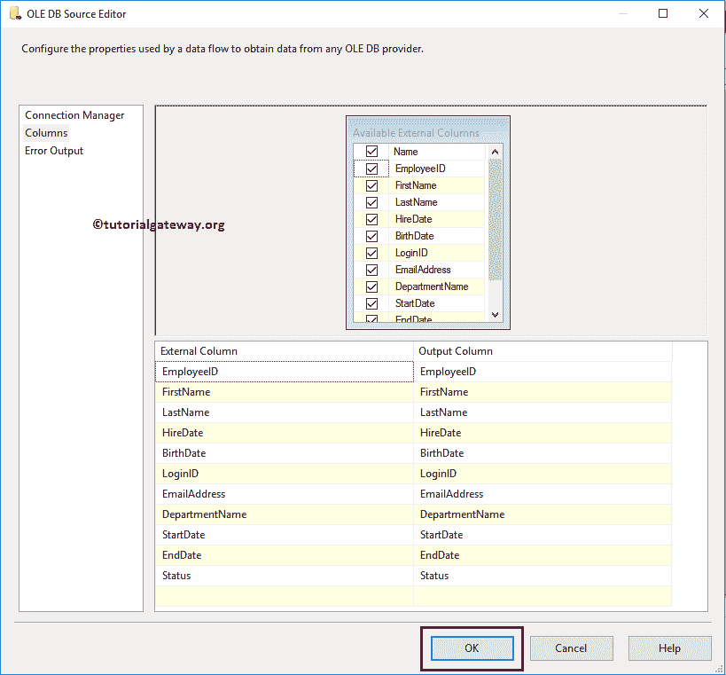

要使用 OLE DB 源中的数据，请将蓝色箭头从 OLE DB 源拖放到 SCD 转换。

第五步:双击渐变维度转换，打开渐变维度向导。

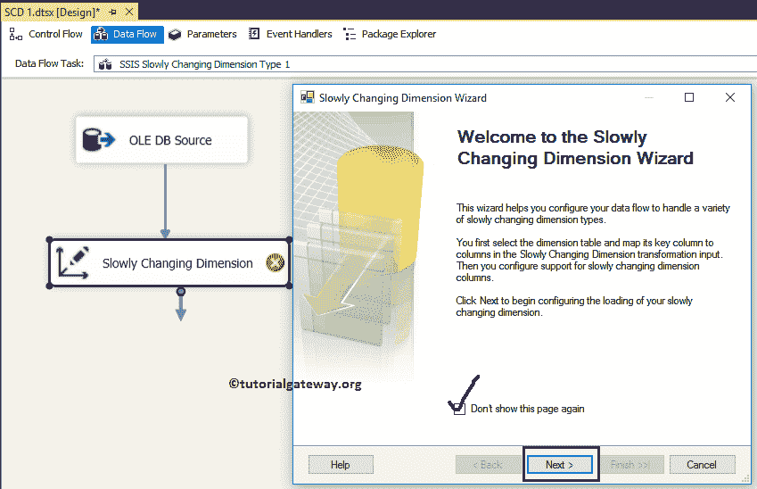

步骤 6:选择维度表和键:此页面用于配置维度表信息。

连接管理器:此选项提供到维度表的连接。在这里，我们使用已经创建的 [OLE DB 连接管理器](https://www.tutorialgateway.org/ole-db-connection-manager-in-ssis/)，它与我们的 SQL Server 中存在的【SSIS 源】数据库连接。

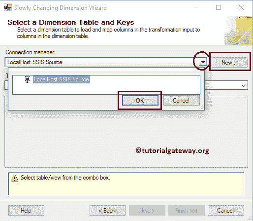

表或视图:用于选择要对其执行缓慢更改操作的数据仓库维度表或视图。这里我们选择了“员工”表。

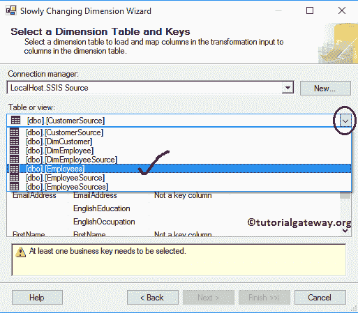

*   输入列:来自 OLE 数据库源的列。
*   维度列:员工维度表中可用的列。
*   密钥类型:要执行缓变维度 1 或 SSIS SCD 1，我们至少需要一个业务密钥。我们知道员工备选键是关键列。请将键类型从非键列更改为业务键

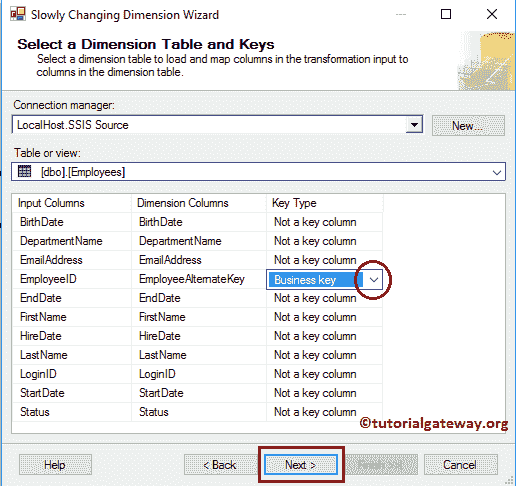

步骤 7–慢慢改变维度列:这是整个向导的主页面。

*   维度列:维度表中可用的列将在此部分提供。选择要为“更改类型”选择的列。在这里，我们选择出生日期和电子邮件地址列作为固定属性，部门名称作为更改属性
*   变更类型:选择变更类型。这里，我们保留默认的固定属性作为出生日期的更改类型，电子邮件地址列和部门名称作为更改属性。

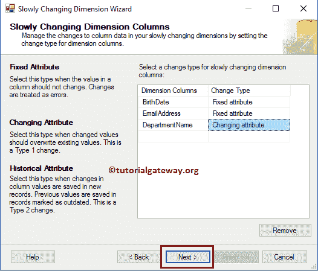

STEP 8–固定和更改属性选项:本页有两个选项，我们已经在 [SSIS 缓变维度类型 0](https://www.tutorialgateway.org/ssis-slowly-changing-dimension-type-0/) 一文中解释了第一个选项。我们将在下一篇文章中解释第二个选项。

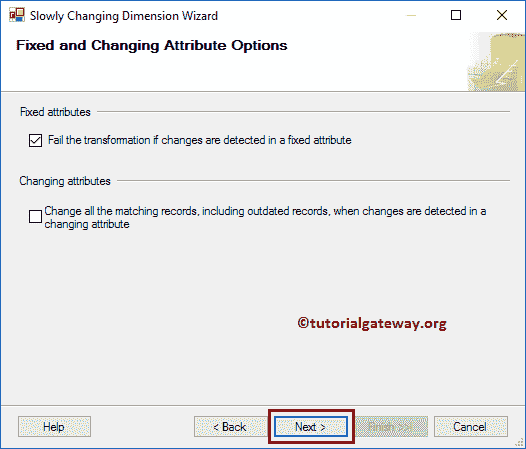

步骤 9–推断维度成员:我们将在“缓慢变化的维度推断维度”一文中讨论此选项。现在，我们取消选择该选项，点击【下一步】按钮

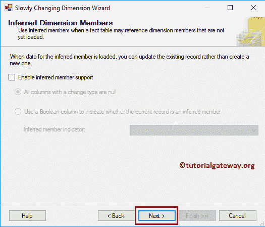

步骤 10–完成缓变尺寸向导:点击完成按钮，完成 SSIS 缓变尺寸类型 1

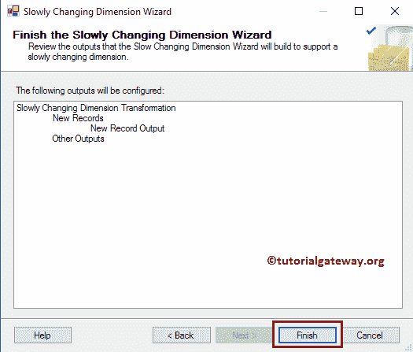

的配置

一旦你点击完成按钮，我们的数据流会自动改变。如果观察下面的截图，它添加了 [OLE DB 目的地](https://www.tutorialgateway.org/ssis-ole-db-destination/)将新记录插入维度表， [OLE DB 命令转换](https://www.tutorialgateway.org/ole-db-command-transformation-in-ssis/)用新数据更新现有旧记录

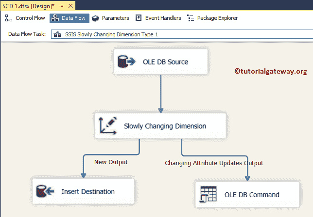

(可选步骤):让我们双击 OLE DB 目标来检查自动创建的目标(表名和连接管理器设置和映射)。

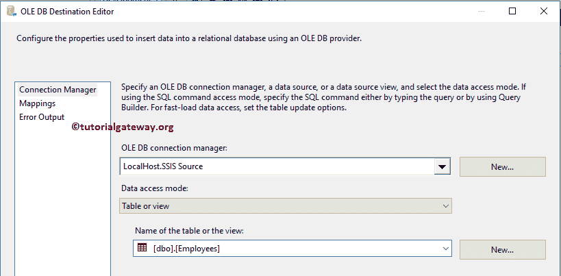

(可选步骤):让我们双击 [OLE DB 命令转换](https://www.tutorialgateway.org/ole-db-command-transformation-in-ssis/)来检查自动创建的 Update 语句。

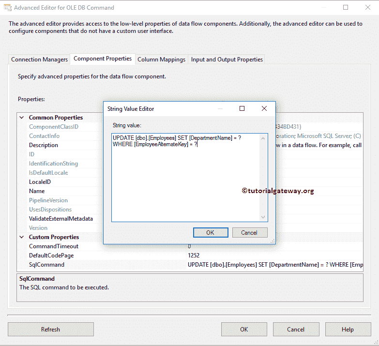

单击“确定”完成我们的 SSIS 渐变维度类型 1 包设计。让我们运行包

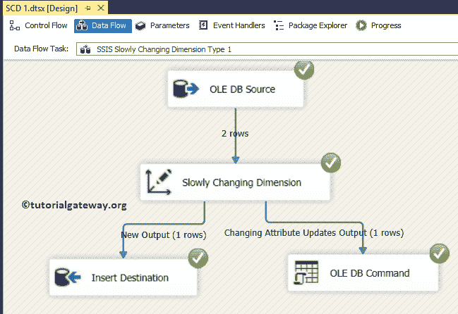

从上面的截图中，您可以看到两行来自 OLE DB 源。插入一行，更新另一行。

让我们打开 [SQL Server 管理工作室](https://www.tutorialgateway.org/sql/)查看结果。如果您观察到以下记录，我们的包添加了员工替代键 253022870 的新记录。我们还更新了员工替代键 253022876 的部门名称。

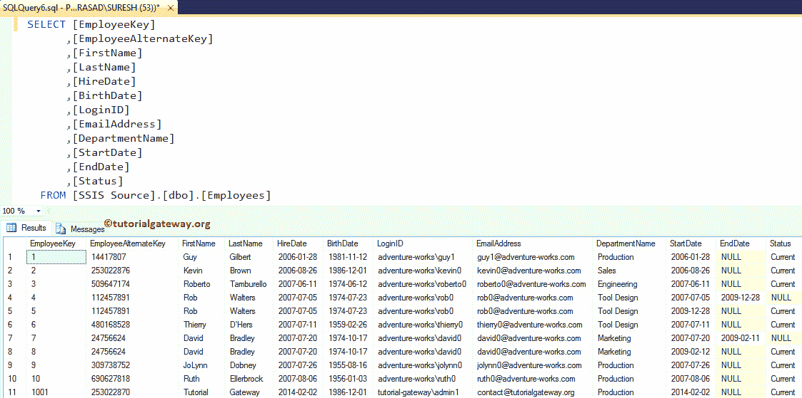