# SSIS 缓变维度类型 2

> 原文：<https://www.tutorialgateway.org/ssis-slowly-changing-dimension-type-2/>

SSIS 缓变维度转换协调数据仓库维度表中记录的插入和更新。这种转换支持四种类型的变化，在本文中，我们将解释 SSIS 缓变维度类型 2(也称为 SCD 历史属性或 SCD 2)。

SSIS 缓变维度类型 2 (SCD 2):如果要维护一个列的历史数据，那么将它们标记为历史属性。如果您的维度表成员(或列)被标记为历史属性，则它将维护当前记录，并且在此基础上，它将创建一个详细信息不断变化的新记录。实时地，由 SCD 2 或 SSIS 缓变维度类型 2 提供的变化类型是有益的。例如，如果我们想要维护员工以前和现在所在的城市，或者员工以前的部门和现在的部门，那么我们可以将这些列标记为历史属性。在我们进入这个例子之前，让我们看看雇员维度表中的数据。

注:由于 SSIS 缓变维度类型 2 正在维护历史数据，随着数据的增长，维护数据将面临挑战。

下面的截图将向您展示我们的[员工]表中的数据。对于这个 SSIS SCD 2 或缓慢变化维度类型 2 演示，我们将使用这些数据。您可以通过从[AdventureWorksDW2014]数据库的[DimEmployee]表中选择前 10 条记录来获得相同的数据。

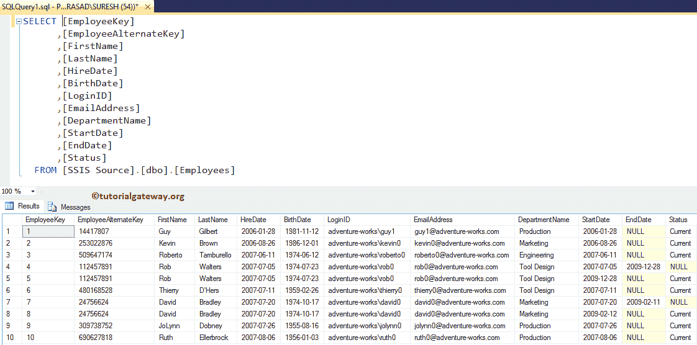

下图显示了[雇员资源]表中的数据，我们将更新这两条记录或将它们插入[雇员]表中。

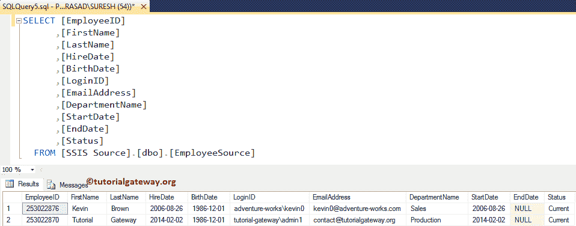

如果您观察上面的截图，员工标识(253022876)的部门名称与原始值不同。它已从“营销”更改为“销售”，我们的员工 Id 为 253022870，这是一项新记录。我们的任务是插入新记录并更新第二个记录的部门名称。

## SSIS 缓变维度类型 2 示例

步骤 1:打开 BIDS，从工具箱中拖放数据流任务来控制流，并将其命名为 SSIS 缓变维度类型 2。

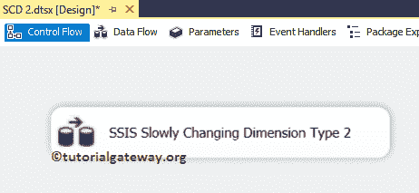

双击它将打开数据流选项卡。

第二步:拖放 OLE DB 源，从 [SSIS](https://www.tutorialgateway.org/ssis/) 工具箱慢慢改变维度到数据流区域

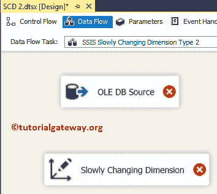T4】

第三步:双击数据流区域中的 OLE DB 源。它将打开连接管理器设置，并提供空间来编写我们的 SQL 语句。这里我们使用已经创建的 [OLE DB 连接管理器](https://www.tutorialgateway.org/ole-db-connection-manager-in-ssis/)和【SSIS 源】中的【雇员源】表作为源表。如果您觉得配置 OLE DB 源有什么困难，请参考 SSIS[OLE DB 源](https://www.tutorialgateway.org/ole-db-source-in-ssis/)。

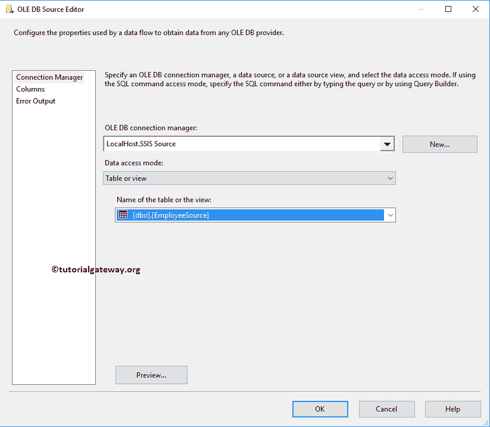

第 4 步:单击列选项卡验证列。在此选项卡中，我们还可以取消选中不需要的列。

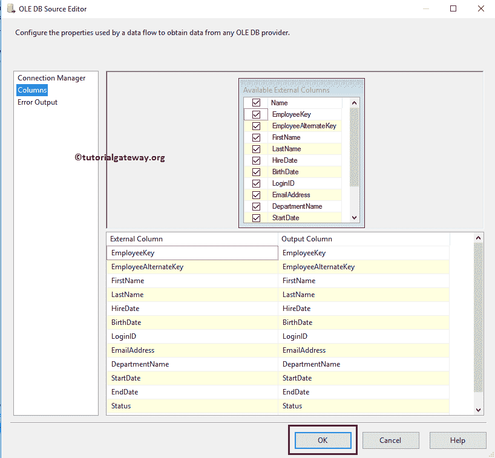

要使用 OLE 数据库源数据，请将蓝色箭头从 OLE 数据库源拖放到缓慢变化的维度转换以连接数据。

SCD 2 步骤 5:双击 SSIS 渐变维度转换。一旦你点击它，它将打开慢慢改变维度向导。第一页是欢迎页面。如果您不想再次看到此页面，请勾选“不再显示此页面”复选框。现在，点击下一步

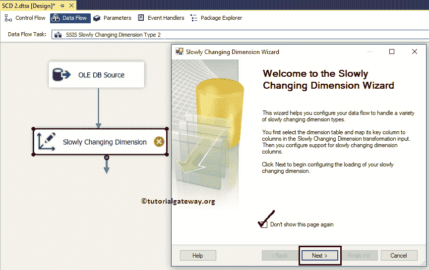

步骤 6:选择 SSIS 缓变维度表和键:此页面用于配置维度表信息。

连接管理器:此选项用于提供与维度表的连接。这里我们使用已经创建的 [OLE DB 连接管理器](https://www.tutorialgateway.org/ole-db-connection-manager-in-ssis/)，它连接到存在于我们的 SQL Server 中的【SSIS 源】数据库。您可以通过单击“新建”按钮来更改连接管理器设置。

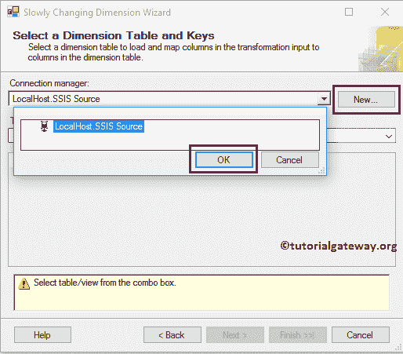

表或视图:此选项对于选择要对其执行缓慢更改操作的数据仓库维度表或视图非常有用。这里我们选择了“员工”表。

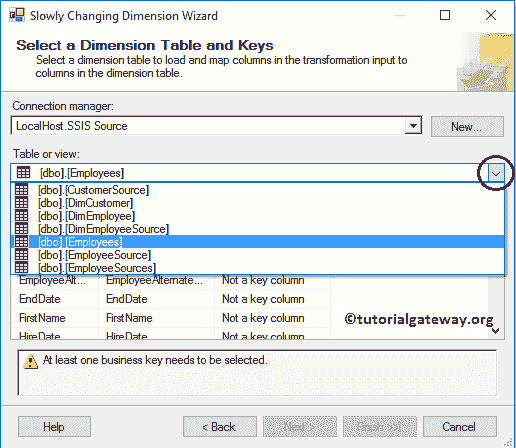

*   输入列:来自 OLE 数据库源的列。
*   维列:员工维表中可用的列。
*   密钥类型:要执行 SSIS 缓变维度 2 或 SSIS SCD 2，我们至少需要一个业务密钥。在这里，我们都知道员工备选键是键列。请将键类型从非键列更改为业务键

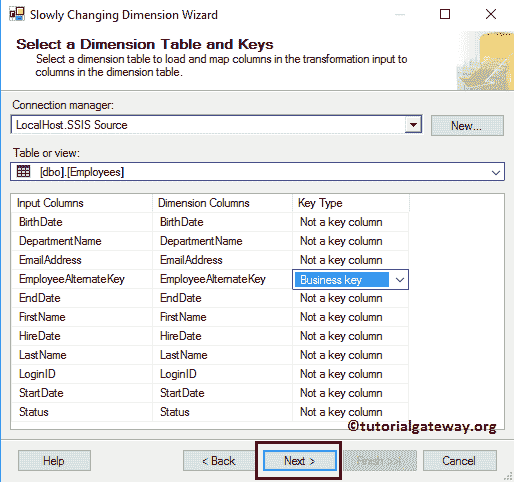

第 7 步–缓慢变化的维度列:这是创建 SSIS SCD 2 或 SSIS 缓慢变化的维度类型 2 的整个向导的主页面。我们到了

*   维度列:维度表中可用的所有列都将在此部分中可用。在这里，您必须选择要为“变更类型”选择的列。从下面的截图中，您可以看到我们选择了出生日期、登录 Id 和部门名称列
*   变更类型:选择变更类型。在本例中，我们将默认的固定属性保留为出生日期、登录标识列的更改类型。我们希望维护部门名称的历史数据。所以我们选择这个作为历史属性。

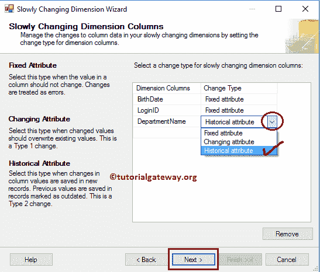

提示:默认情况下，向导会将“固定”属性指定为“更改类型”。但是你可以改变它们。

STEP 8–固定和更改属性选项:本页有两个选项，我们已经在 [SSIS 缓变维度类型 0](https://www.tutorialgateway.org/ssis-slowly-changing-dimension-type-0/) 一文中解释了第一个选项。我们将在下一节披露第二种选择。

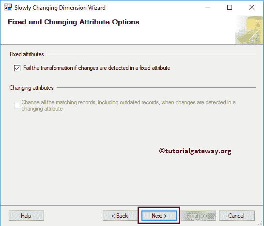

步骤 9–SSIS 缓变维度历史属性选项:为了维护历史数据，我们必须配置以下选项。首先，我们将向您展示第二个选项的配置设置，稍后我们将展示另一个选项。

SSIS 使用开始日期和结束日期缓慢更改维类型 2:请使用“使用开始日期和结束日期来标识当前记录和过期记录”选项来使用开始日期和结束日期。

*   开始日期列:在这里，您必须选择记录的开始日期。例如，员工加入日期或生产开始日期等。
*   结束日期列:在这里，您必须选择记录的结束日期(通常值为空)。例如，员工结束日期。
*   设置日期值的变量:请指定新插入记录的开始日期和当前记录的结束日期。

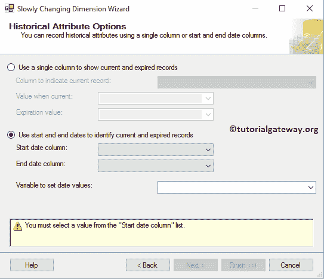

从下面的截图中，您可以看到我们选择了开始日期作为开始日期列，结束日期作为结束日期列。并将容器开始时间作为新插入记录的开始日期。

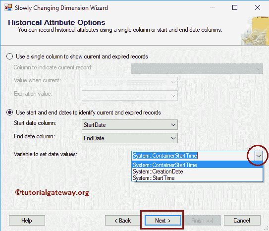

步骤 10–推断维度成员:我们将在“缓慢变化的维度推断维度”一文中讨论此选项。对于这个 SSIS 渐变维度类型 2 的例子，我们取消选择这个选项，点击

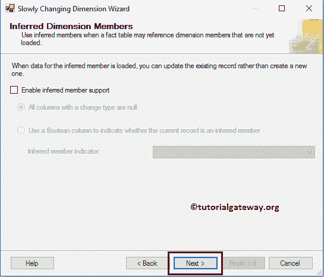

下一步按钮

步骤 10–完成缓变尺寸向导:点击完成按钮，完成 SSIS 缓变尺寸类型 2

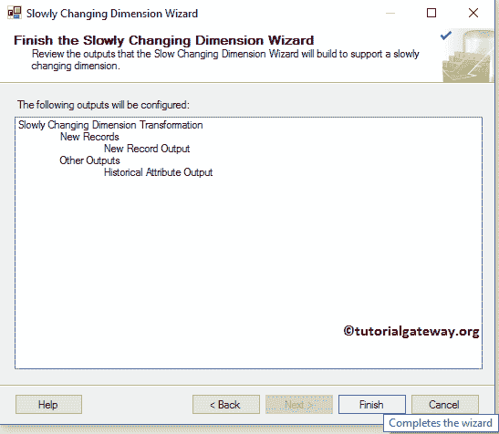

的配置

一旦你点击完成按钮，我们的数据流将自动改变。如果观察下面的截图，它添加了[派生列变换](https://www.tutorialgateway.org/derived-column-transformation-in-ssis/)将结束日期设置为容器开始时间。 [OLE 数据库命令转换](https://www.tutorialgateway.org/ole-db-command-transformation-in-ssis/)将结束日期(空值)更新为容器开始时间。[联合所有转换](https://www.tutorialgateway.org/union-all-transformation-in-ssis/)将历史数据和新输入结合起来。派生列转换将新记录开始日期设置为容器开始时间。和 [OLE 数据库目标](https://www.tutorialgateway.org/ssis-ole-db-destination/)将新记录插入维度表。

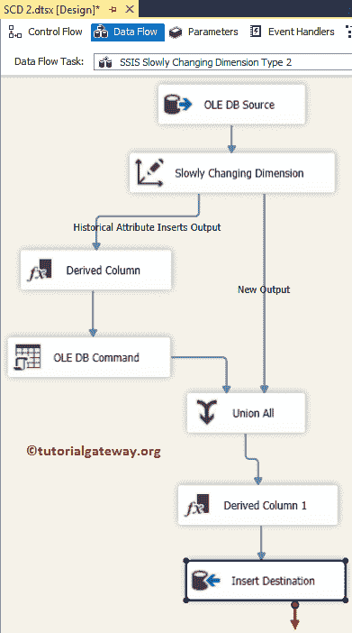

(可选步骤):让我们双击[派生列转换](https://www.tutorialgateway.org/derived-column-transformation-in-ssis/)来检查自动生成的表达式以设置结束日期。

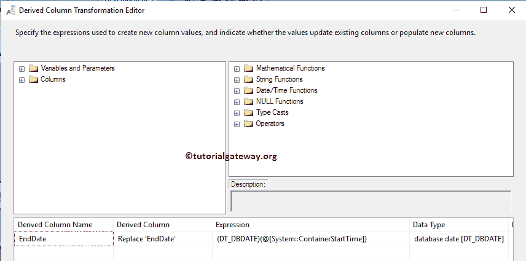

(可选步骤):让我们双击 [OLE DB 命令转换](https://www.tutorialgateway.org/ole-db-command-transformation-in-ssis/)来检查自动创建的 Update 语句。

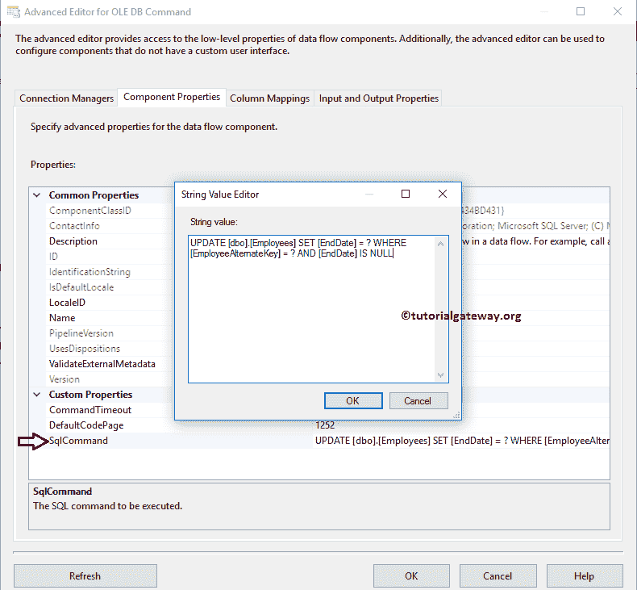

(这是可选步骤):让我们双击[派生列变换](https://www.tutorialgateway.org/derived-column-transformation-in-ssis/)检查自动生成的表达式，以设置新记录的开始日期。

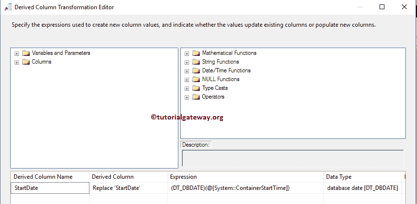

(可选步骤):让我们双击 OLE DB 目标。并检查自动创建的目标(表名和连接管理器设置和映射)。

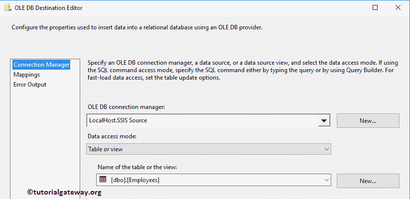

单击“确定”完成我们的 SSIS 缓变尺寸类型 2 包装设计。让我们运行 SSIS SCD 2 包

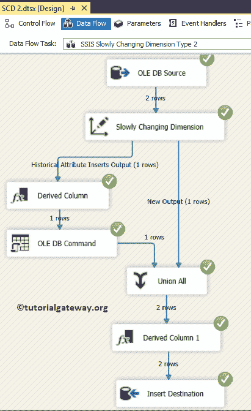

从上面的截图中，您可以观察到，尽管有两行来自 OLE 数据库源。一行直接插入，另一行维护历史信息后再插入。

让我们打开 [SQL Server 管理工作室](https://www.tutorialgateway.org/sql/)查看结果。如果您观察以下记录，我们的包

*   添加了员工备选键 253022870 的新记录。
*   设置员工备选键 253022876 的结束日期，并
*   为员工备选键 253022876 添加了新记录，并更新了部门名称。

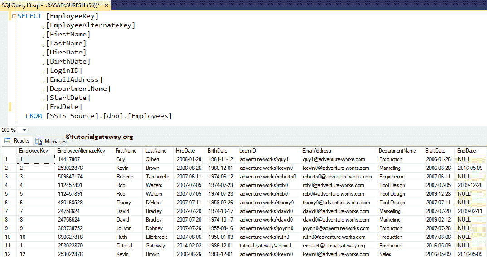

让我们看看当我们选中“使用单个列显示 SSIS 缓变维度类型 2 的当前和过期记录”选项时会发生什么:

*   指示当前记录的列:请指定指定当前和过期记录的列名。这里我们选择状态列
*   当前值:在这里，您必须指定将为当前记录显示的值。
*   结束日期列:在这里，您必须指定将为过期记录显示的值。

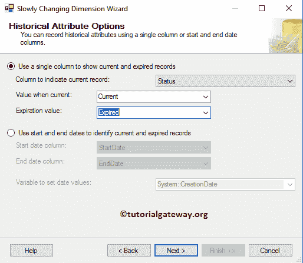

单击“确定”完成 SCD 2 或 SSIS 缓变维度类型 2 包设计，并让我们运行该包。

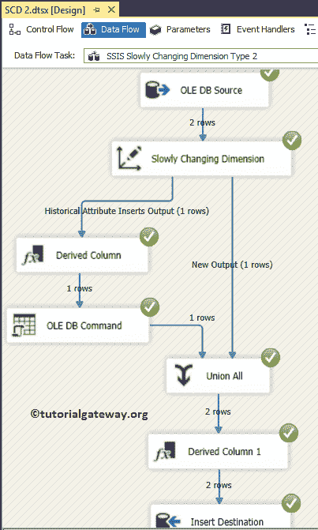

让我们打开 SQL Server 管理工作室并检查结果。如果您观察以下记录，我们的 SSIS 缓变维度类型 2 包

*   添加了员工备选键 253022870 的新记录。
*   将员工备选键 253022876 的状态设置为“到期”，并
*   为员工备选键 253022876 添加了新记录，更新了部门名称，并将状态设置为“当前”。

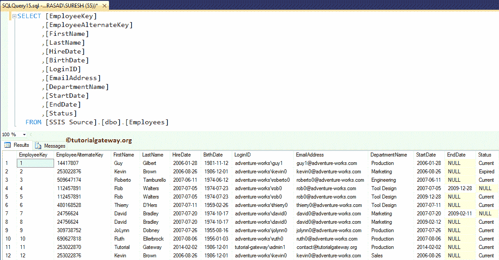