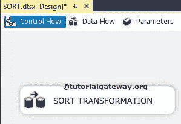
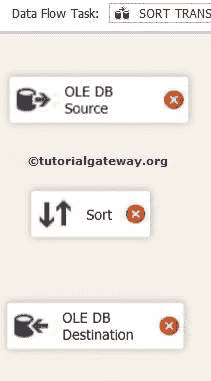
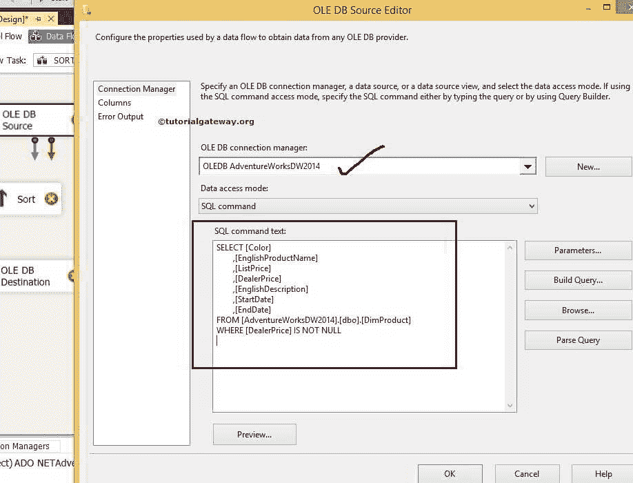
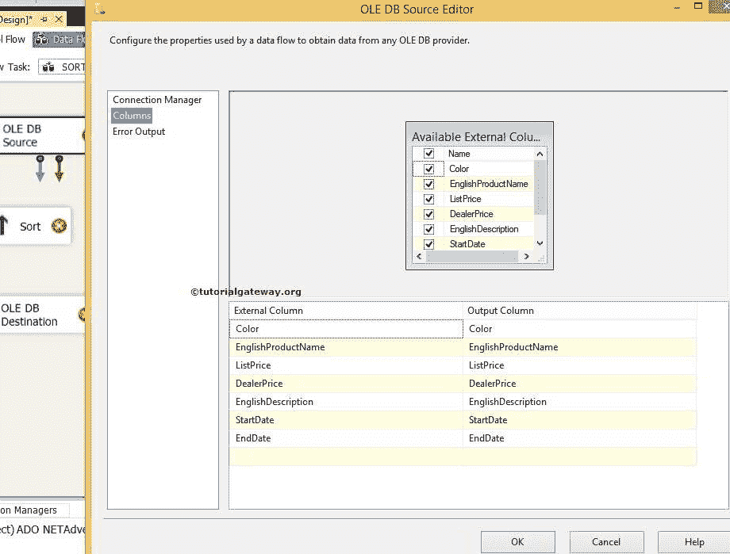
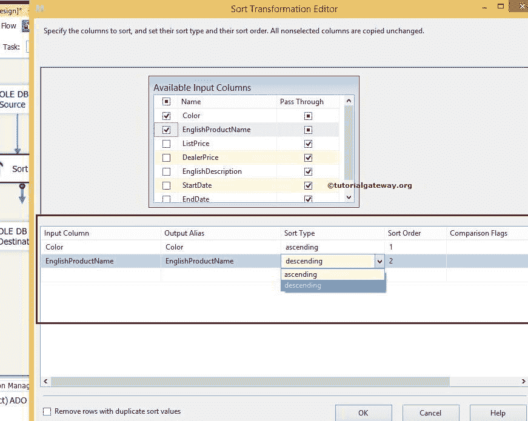
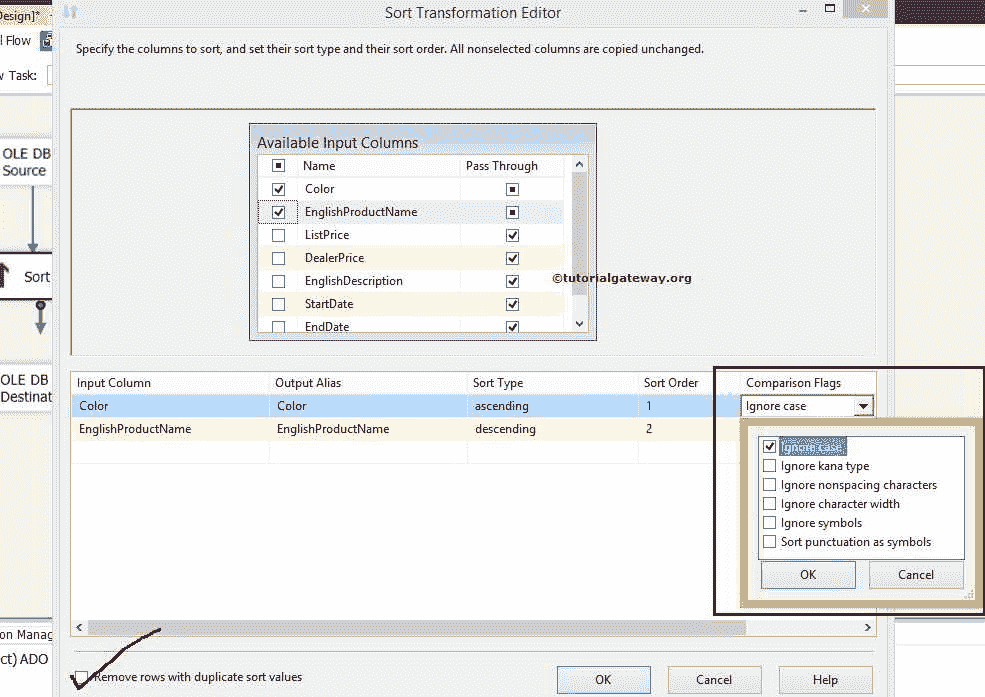
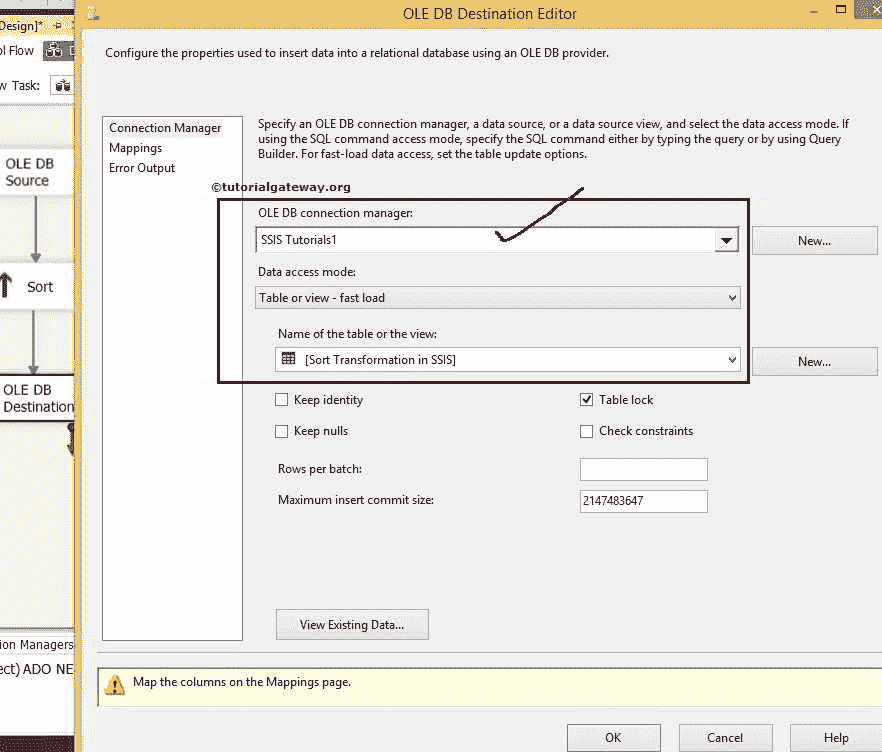
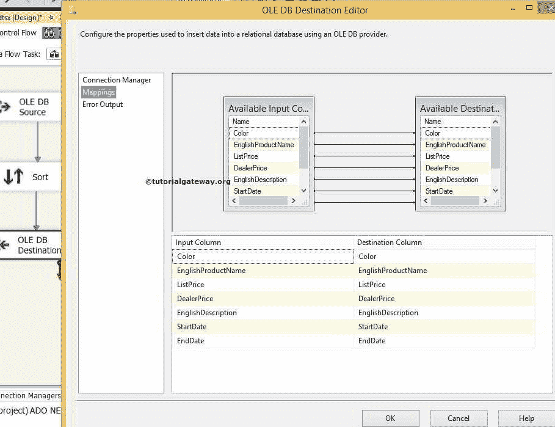
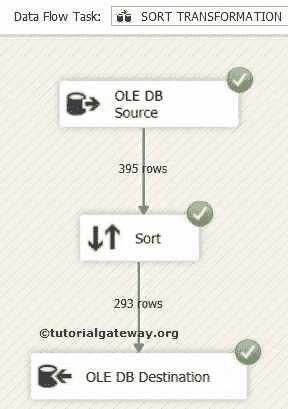
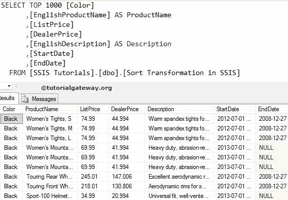

# SSIS 的排序转换

> 原文：<https://www.tutorialgateway.org/sort-transformation-in-ssis/>

SSIS 的排序转换用于以升序或降序对源数据进行排序，这类似于 T-SQL 命令 ORDER BY 语句。

SSIS 的排序转换使用排序顺序属性来指定优先级。

*   如果排序顺序值是正数，则排序转换会以升序对数据进行排序
*   如果排序顺序值为负数，SSIS 排序转换将按降序对数据进行排序

像[合并转换](https://www.tutorialgateway.org/merge-transformation-in-ssis/)和[合并连接转换](https://www.tutorialgateway.org/merge-join-transformation-in-ssis/)这样的转换在使用之前需要数据排序。在这些情况下，我们使用 SSIS 排序转换来对数据进行排序。

例如，如果“员工姓名”列的排序顺序为 1，“薪资”列的排序顺序为 2。排序转换将按员工姓名排序数据，然后按城市排序。

## SSIS 示例中的排序转换

第一步:在 [SSIS](https://www.tutorialgateway.org/ssis/) 中，将数据流任务从工具箱拖放到控制流中，并将其重命名为排序转换。



双击它，它将打开数据流选项卡。

第二步:将 OLE DB 源、排序转换和 OLE DB 目标从工具箱拖放到数据流区域



步骤 3:双击数据流区域中的 OLE DB 源将打开连接管理器设置，并提供空间来编写我们的 SQL 语句。



[SQL](https://www.tutorialgateway.org/sql/) 我们在上面截图中使用的命令是:

```
SELECT [Color]
      ,[EnglishProductName]
      ,[ListPrice]
      ,[DealerPrice]
      ,[EnglishDescription]
      ,[StartDate]
      ,[EndDate]
FROM [AdventureWorksDW2014].[dbo].[DimProduct]
WHERE [DealerPrice] IS NOT NULL
```

第 4 步:单击列选项卡验证列。在此选项卡中，我们还可以取消选中不需要的列。



单击确定并将蓝色箭头从 OLE 数据库源拖到排序转换，以对源数据执行转换(排序)。

第五步:双击 SSIS 排序转换进行配置。

检查我们要排序的列，不要忘记通过剩余的列。如果您忘记选择“通过”，它们将不会出现在输出列中。



为了理解 SSIS 的排序转换，我们用升序对一列进行排序，用降序对另一列进行排序。从上面，我们是按颜色排序，然后按[英文产品名称]排序，因为我们以这种方式指定了排序顺序。

*   首先，数据按升序按颜色排序，然后
*   其次，数据按照英文产品名称降序排序。



从上面的截图中，您可以观察到 SSIS 的排序转换有一个更重要的属性，叫做比较标志。

1.  忽略大小写:指定是否要区分大写和小写字母。如果我们勾选这个选项，那么两个 xyz 都和 XYZ 一样。
2.  忽略假名类型:指定是否要区分日语:平假名和片假名字母。如果我们选中这个选项，那么它将忽略假名类型。
3.  忽略非间隔字符:如果您不想区分正常字符和音调符号，请选中此选项。
4.  忽略字符宽度:指定是否要区分同一字符的单字节和双字节表示。如果我们选中此选项，SSIS 排序转换会忽略差异。
5.  忽略符号:指定是否要考虑普通字母和带符号的字母(如空格、货币符号、运算符等)。)一样还是不一样。如果我们选中这个选项，两个%xyz 都与 xyz 相同。
6.  将标点符号排序为符号:如果我们选中此选项，除连字符和撇号之外的所有标点符号都将排序在实际字母之前。例如，SSIS 排序转换将排序？x 之前的 xyz。

删除具有重复排序值的行:如果选中此选项，排序转换将删除重复的列。如果没有，那么这个转换将复制所有的列，包括重复的行。

步骤 6:将蓝色箭头从排序转换拖到 OLE 数据库目标。

现在，我们必须提供目标的服务器、数据库和表的详细信息。因此双击 OLE DB 目的地并提供所需信息



从上面的截图中，我们选择了[SSIS 教程]数据库中的[SSIS 排序转换]表

步骤 7:单击“映射”选项卡，检查源列是否完全映射到目标列。



单击“确定”完成 SSIS 排序转换包的设计。让我们运行包



让我们打开 [SQL Server 管理工作室](https://www.tutorialgateway.org/sql/)，通过结果



查看[订单](https://www.tutorialgateway.org/sql-order-by-clause/)