# SSIS 的术语查找转换

> 原文：<https://www.tutorialgateway.org/term-lookup-transformation-in-ssis/>

SSIS 术语查找转换用于查找字符串或文本中的术语。它使用引用表(包含术语)从源数据中查找匹配的句子，并计算术语在源数据行中重复的次数。

默认情况下，SSIS 术语查找转换会向转换输出中添加两个额外的列，称为术语和频率。SSIS 术语包含来自查找表的术语，频率包括短语在输入数据集中重复或出现的次数。

提示: [SSIS](https://www.tutorialgateway.org/ssis/) 术语查找转换只允许 DT_WSTR 和 DT_NTEXT 数据类型的列执行术语查找。如果您的输入列与这两个不同，请使用 [SSIS 数据转换](https://www.tutorialgateway.org/ssis-data-conversion/)将其他数据类型转换为 DT_WSTR 和 DT_NTEXT 数据类型。

例如，如果您的公司有 100 种产品，并且允许用户对您的产品撰写评论。假设你每天得到 2000 条评论，那么你将如何发现哪条评论属于哪种产品？为了解决这些类型的问题，SSIS 引入了术语查找转换。使用它，您可以找到哪一行有产品 1 审核，哪一行有产品 90 审核。

提示:请参考[SSIS 术语抽取转换](https://www.tutorialgateway.org/term-extraction-transformation-in-ssis/)文章了解术语抽取技术

### 术语查找转换匹配技术

SSIS 术语查找转换使用以下规则对源数据执行术语查找:

*   如果引用表包含单词的单数形式，SSIS 术语查找转换会将源数据中单词的单数和复数形式都视为单数形式。例如，如果术语查找表包含 Employee，并且我们在源数据中有 Employee 和 Employees 术语，则 SSIS 术语查找转换会将这两个术语都算作查找术语的匹配项
*   如果引用表包含单词的复数形式，术语查找转换会将源数据中单词的单数和复数形式视为单独的术语。例如，如果术语查找表包含雇员，并且我们在源数据中有雇员和雇员术语，术语查找转换将分别计算雇员和雇员。
*   如果我们将 SSIS 术语查找转换配置为执行区分大小写的匹配，则员工将与员工分开处理。如果我们将雇员作为句子中的第一个单词，那么术语查找转换将雇员和雇员算作同一个术语。

## SSIS 示例中的术语查找转换

在本例中，我们将向您展示如何使用示例数据在 SSIS 配置术语查找转换。

这是我们的查找来源表

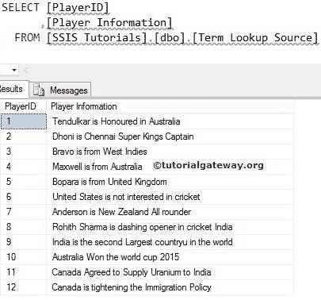

这是我们在[SSIS 教程]数据库中的查找表。

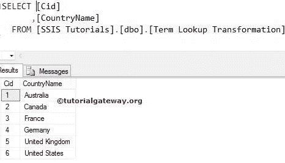

步骤 1:使用集成服务项目模板在 BIDS 中创建新项目。将数据流任务拖到控制流区域，并根据您的要求对其进行重命名。

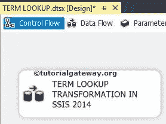

双击它，它将打开数据流选项卡。

第二步:将 OLE DB 源、术语查找转换和 OLE DB 目标拖放到数据流区域

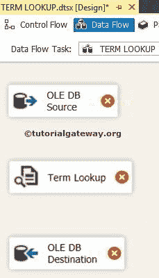

步骤 3:双击数据流区域中的 OLE DB 源将打开连接管理器设置。它为编写我们的 SQL 语句提供了空间。或者我们可以从下拉列表中选择表格。

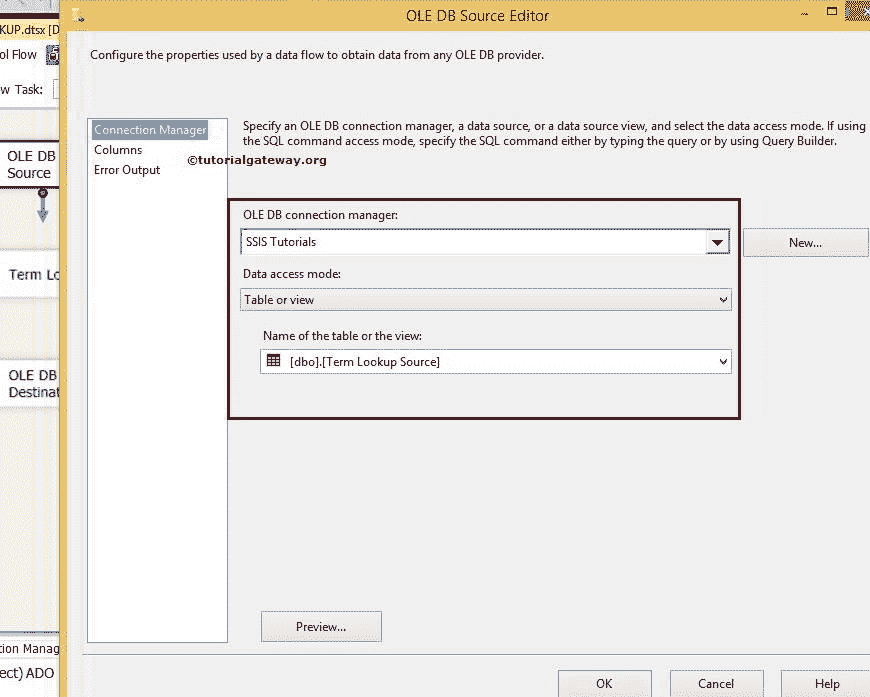

第 4 步:单击列选项卡验证列。在此选项卡中，我们可以取消选中不需要的列。

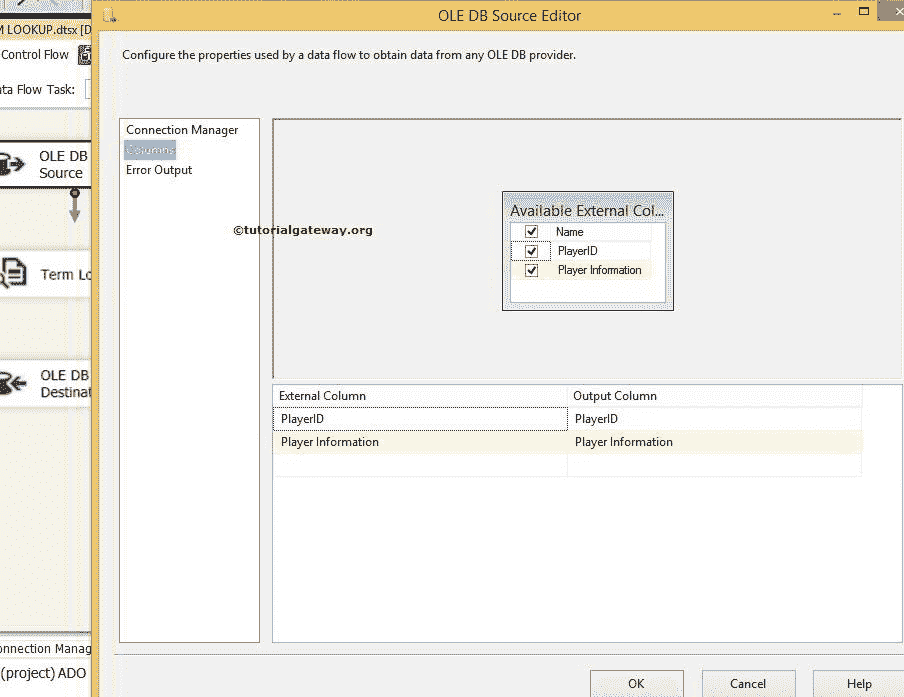

步骤 5:单击确定并编辑 SSIS 术语查找转换

在“引用表”选项卡中，配置 OLE DB 连接管理器以引用数据库(这里是[SSIS 教程])，然后选择要添加为引用表的表(这里是术语查找转换表)。

提示:这个 SSIS 术语查找转换只支持 [OLE DB 连接管理器](https://www.tutorialgateway.org/ole-db-connection-manager-in-ssis/)连接引用表。

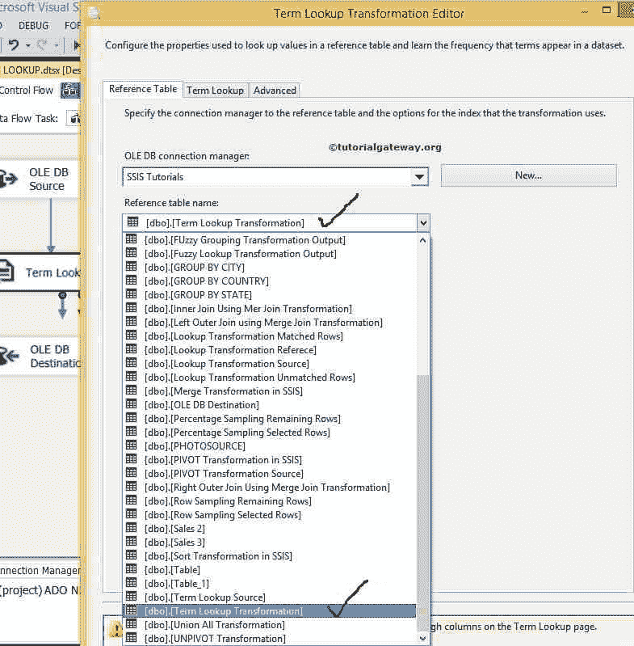

注意:此转换将只接受 Unicode 字符串[DT_WSTR]或 Unicode 文本流[DT_NTEXT]作为其数据类型。

步骤 6:使用术语查找选项卡将输入列映射到引用表中的查找列，并为每个输出列提供别名。

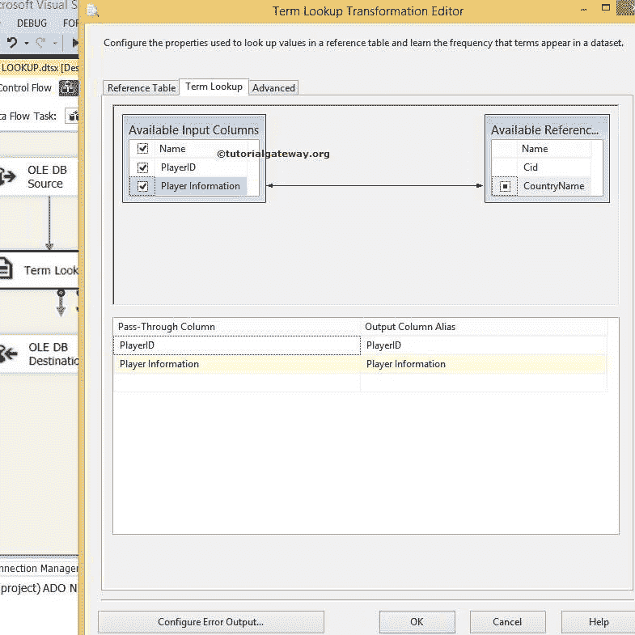

使用“转换编辑器”对话框的“高级”选项卡指定查找是否区分大小写。

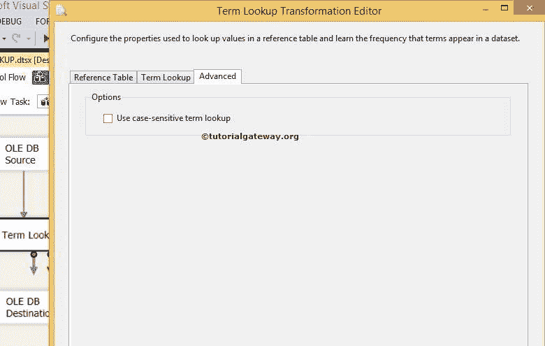

从下面的截图中，您可以看到在转换上有一个警告符号。它告诉我们错误输出没有连接。您可以通过配置错误输出来删除警告符号。因此双击配置错误输出按钮将打开一个新窗口来设置错误输出。

此转换的默认配置是重定向错误行。您可以通过连接错误输出，或将默认行为更改为忽略故障或组件故障来消除此警告。让我改成忽略失败

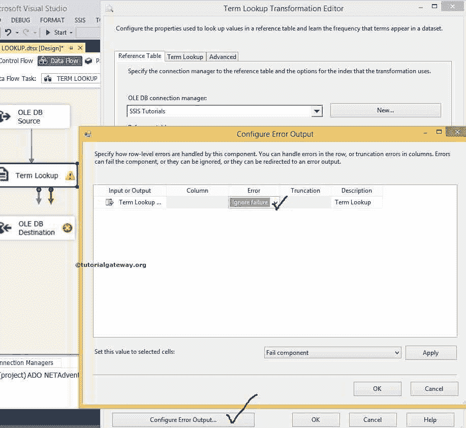

单击确定完成配置转换。

步骤 7:现在，我们必须提供目的地的服务器、数据库和表细节。因此双击 OLE DB 目的地并提供所需信息

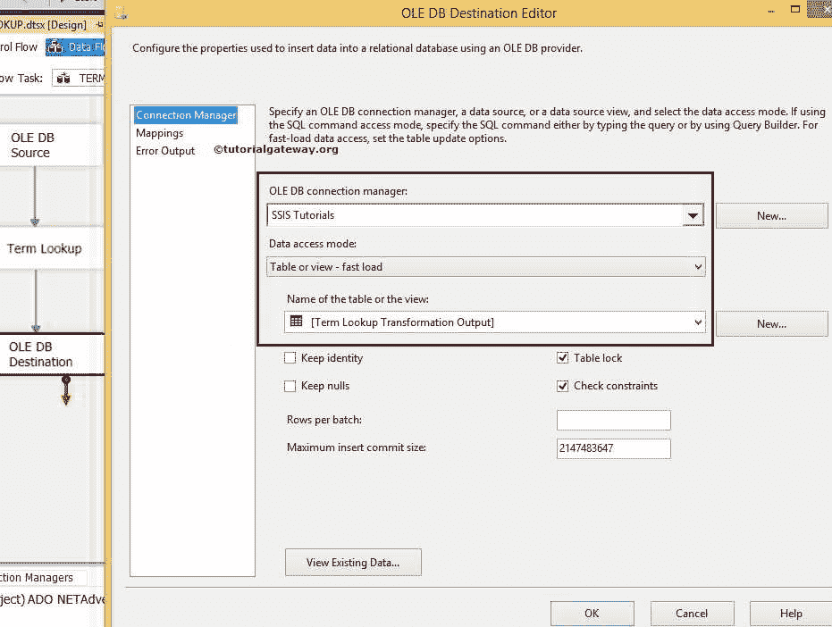

从上面的截图可以看到，我们选择了[SSIS 教程]数据库作为目标数据库，选择了[术语查找转换输出]表作为目标表。

步骤 8:单击“映射”选项卡，检查源列是否完全映射到目标列。

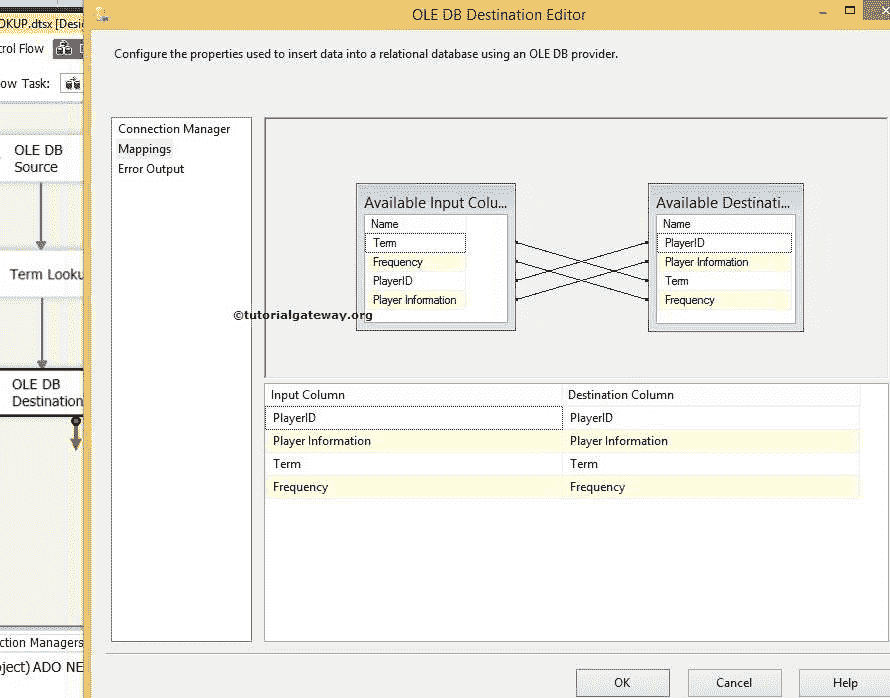

单击“确定”完成 SSIS 术语查找转换包的设计。让我们运行包

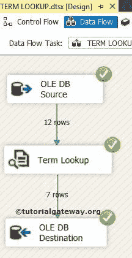

打开 [SQL Server 管理工作室](https://www.tutorialgateway.org/sql/)查看结果

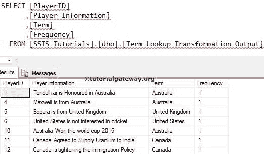

从上面的截图中，您可能会看到，这个转换显示了一个句子中术语的术语和频率(术语重复的次数)。