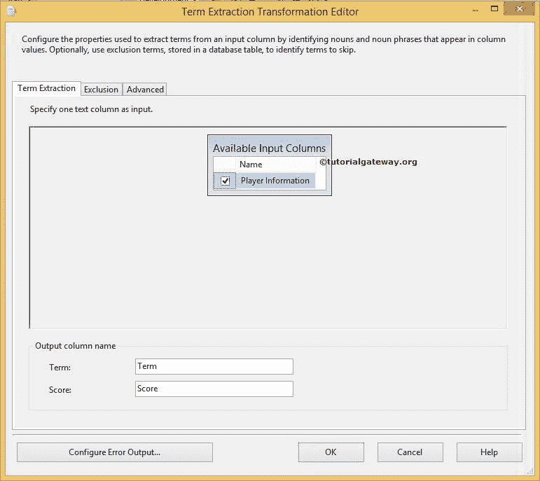
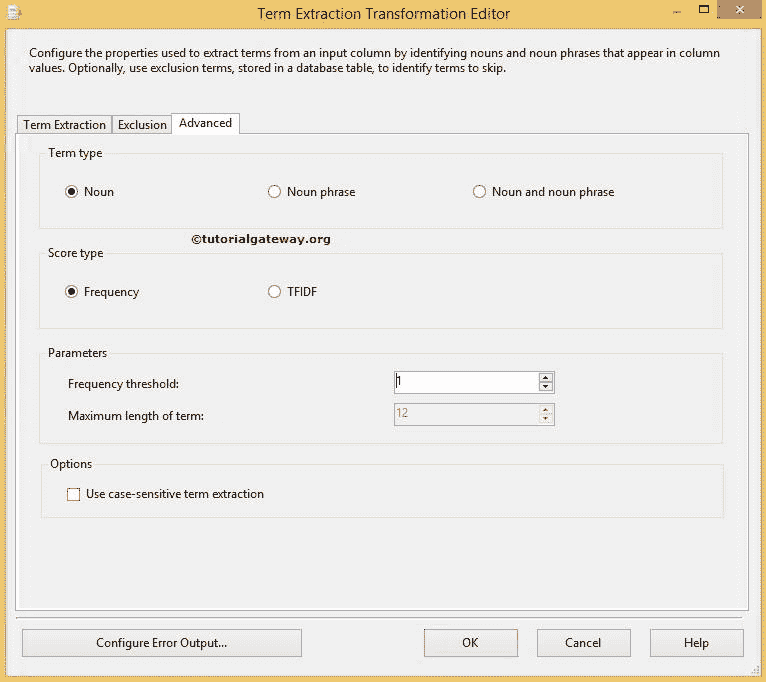

# SSIS 的术语提取

> 原文：<https://www.tutorialgateway.org/term-extraction-in-ssis/>

SSIS 的术语提取转换首先从源数据中的文本中提取术语，然后将提取的术语写入转换输出列。

例如，人们正在写关于你的产品的评论，你想联系他们寻求进一步的帮助。在这些情况下，您可以使用 SSIS 术语提取转换从评论中提取用户的电子邮件地址和姓名。

注意:SSIS 术语提取转换使用自己的英语词典和语言设置从源数据中提取术语。

在 [SSIS](https://www.tutorialgateway.org/ssis/) 中，我们只能对 DT_WSTR 和 DT_NTEXT 数据类型的列执行术语提取转换。如果您的输入列与这两个不同，请使用 [SSIS 数据转换](https://www.tutorialgateway.org/ssis-data-conversion/)将其他数据类型转换为 DT_WSTR 和 DT_NTEXT 数据类型

提示:请参考 SSIS 文章中的[术语查找转换，了解术语查找技术。](https://www.tutorialgateway.org/term-lookup-transformation-in-ssis/)

## 在 SSIS 配置术语提取所涉及的步骤

双击该转换时，将打开 SSIS 术语提取转换编辑器窗口进行配置。它包含三个选项卡，如术语提取、排除和高级选项卡。

### 术语提取选项卡

在术语提取选项卡中，我们必须从可用输入列选项中选择源数据的列名。

术语提取转换只生成两个输出列。列的默认名称是术语和分数，但是您可以根据自己的要求更改它们。

*   术语:此列包含从文本中提取的术语。例如，如果我们提取名词，那么所有的名词都将存储在这个列中。
*   分数:此列包含一个术语在输入列中重复的次数。例如，印度是从文本中提取的第一个术语。术语提取转换将检查所有行，并计算术语印度在该输入列的所有可用行中重复的次数。

### 术语提取转换中的排除选项卡

此选项卡用于从提取中排除不需要的术语。例如，当我们从包含所有公司产品的产品评论的源数据中提取术语时，我们不需要从输入文本中提取产品名称。要将排除条款添加到条款提取转换，请选中使用排除条款选项

提示:请参考术语文章中的[排除选项卡，了解排除选项卡的配置。](https://www.tutorialgateway.org/exclusion-tab-in-ssis-term-extraction-transformation/)

“排除”选项卡中可用于配置排除列表的选项列表如下:

*   OLE DB 连接管理器:SSIS 术语提取转换只支持 [OLE DB 连接管理器](https://www.tutorialgateway.org/ole-db-connection-manager-in-ssis/)与持有排除列表的服务器连接。因此，如果您已经创建了一个现有的，请从下拉列表中选择它。或者，如果您想创建新的连接，请单击“新建”按钮。
*   新建:使用“OLE DB 连接管理器”对话框创建到数据库的新连接。
*   表或视图:从包含排除术语的下拉列表中选择表或视图。
*   列:从包含排除术语的表或视图中选择列名。
*   配置错误输出:单击此按钮配置错误。

### 高级选项卡

使用 SSIS 术语提取转换编辑器中的高级选项卡来配置提取属性。

从上面的截图中，您可以观察到以下是“高级”选项卡中可用的选项列表

*   名词:如果选择此选项，SSIS 术语提取转换将仅从输入文本中提取名词。详见[SSIS 术语提取转化](https://www.tutorialgateway.org/term-extraction-transformation-in-ssis/)。
*   名词短语:如果选择此选项，转换将仅从输入文本中提取名词短语。详见[SSIS](https://www.tutorialgateway.org/extract-noun-phrases-using-term-extraction-transformation-in-ssis/)使用术语提取转换提取名词短语。
*   名词和名词短语:SSIS 术语提取转换将从输入文本中提取名词和名词短语。详见[SSIS](https://www.tutorialgateway.org/extract-nouns-and-noun-phrases-using-term-extraction-transformation-in-ssis/)使用术语提取转换提取名词和名词短语。
*   频率:如果选择此选项，分数列将存储输入列中重复的术语的频率信息。
*   TFIDF:分数栏将存储术语的 TFIDF 值的信息。
*   频率阈值:如果我们指定 3，如果术语在列中至少重复三次，转换将提取术语，并且忽略重复不到三次的术语。
*   最长期限:请提供单词或短语的最长期限。如果我们选择了“仅名词短语”选项，则此选项可用。
*   使用区分大小写的术语提取:如果要执行区分大小写的提取，请选中此选项。