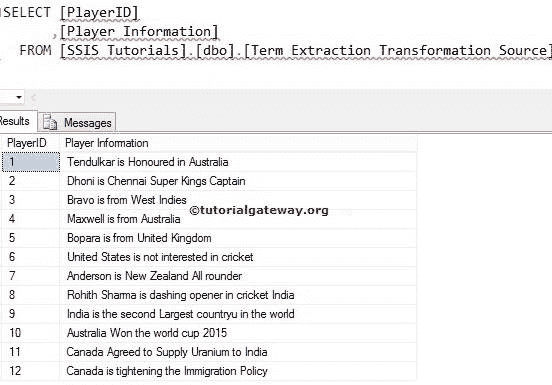
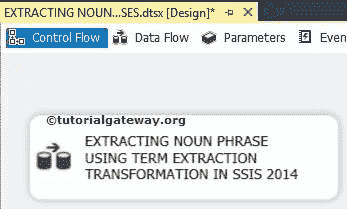
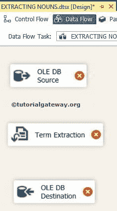
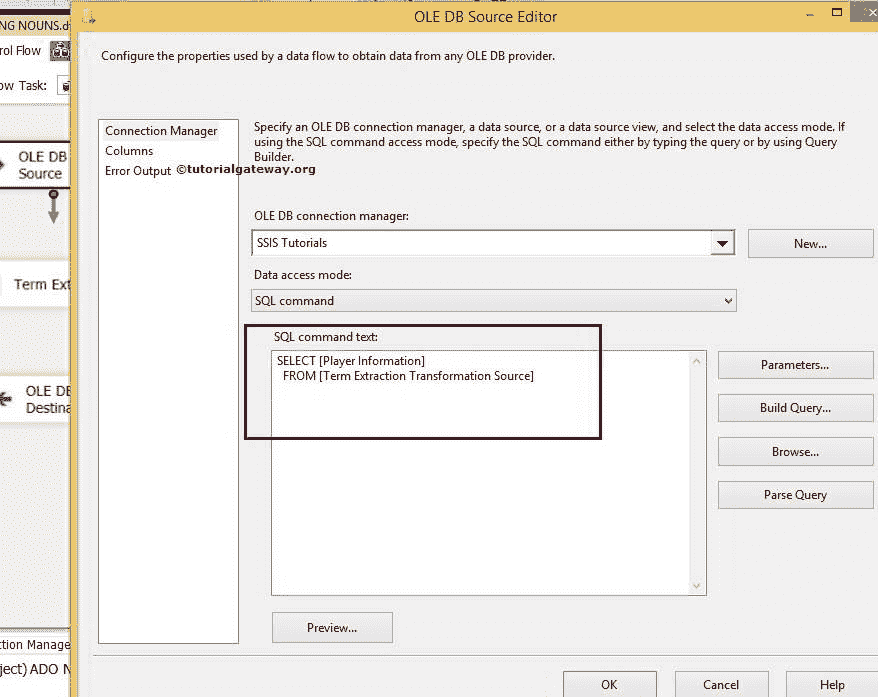
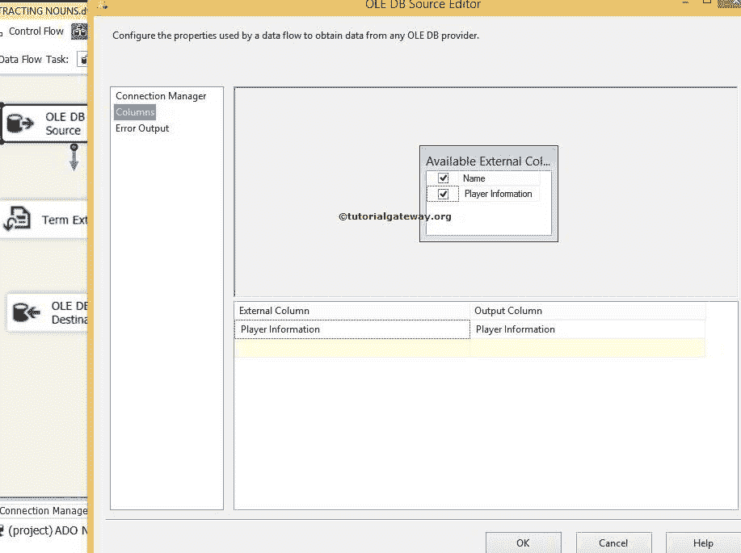
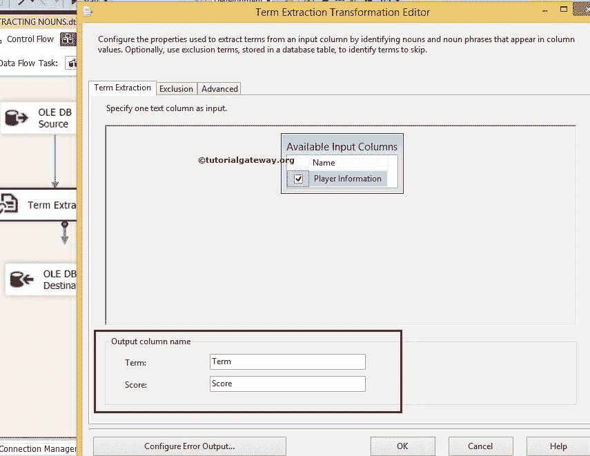
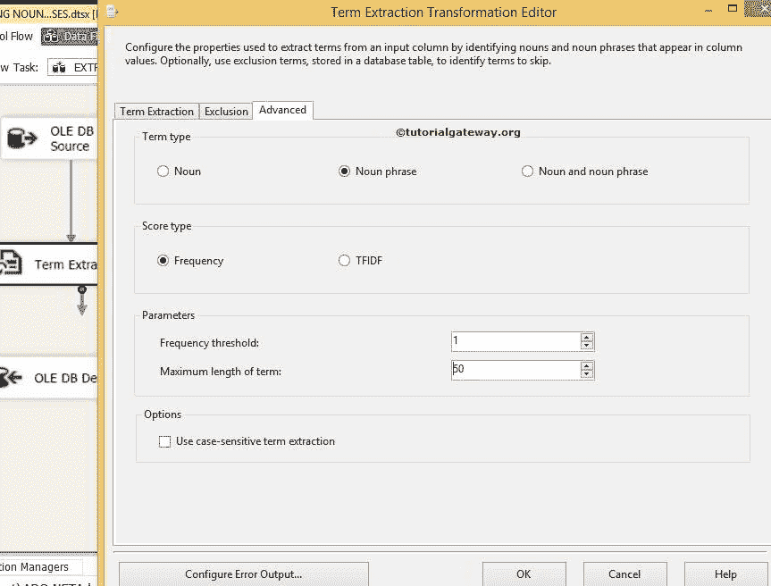
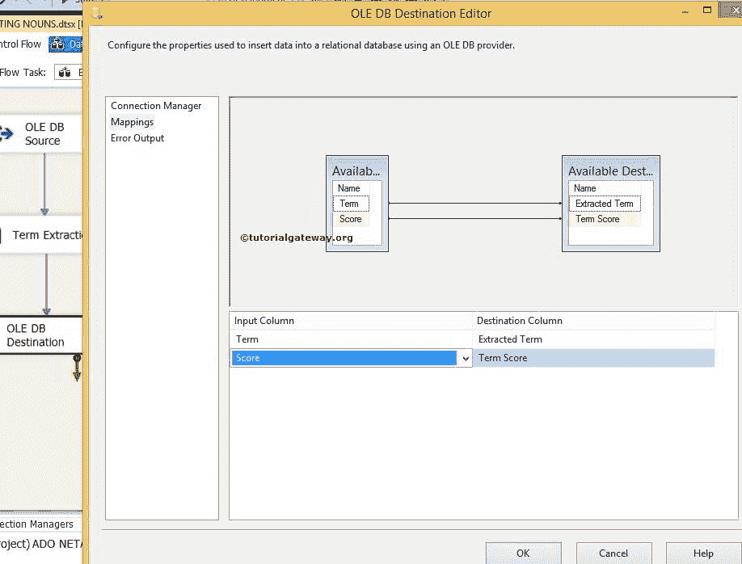
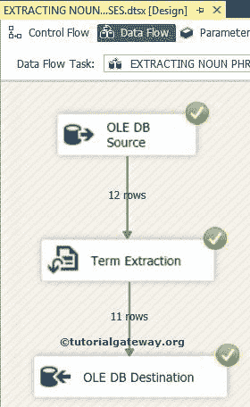
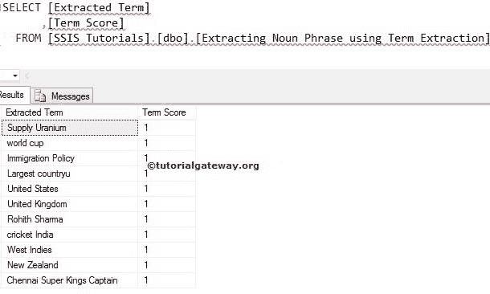

# 在 SSIS 使用术语提取转换提取名词短语

> 原文：<https://www.tutorialgateway.org/extract-noun-phrases-using-term-extraction-transformation-in-ssis/>

在本文中，我们将通过示例向您展示如何在 SSIS 使用术语提取转换来提取名词短语。在阅读本文之前，请参考 SSIS 文章中的[术语提取，了解该转换的定义、属性和功能。](https://www.tutorialgateway.org/term-extraction-in-ssis/)

下图截图显示了我们的源数据



## 在 SSIS 使用术语提取转换提取名词短语

步骤 1:打开 BIDS，从工具箱中拖放数据流任务来控制流。并将其重命名为在 [SSIS](https://www.tutorialgateway.org/ssis/) 中使用术语提取转换提取名词短语。



双击它，它将打开数据流选项卡。

第二步:将 OLE DB 源、术语抽取转换和 OLE DB 目标从工具箱拖放到数据流区域



步骤 3:双击数据流区域中的 OLE DB 源将打开连接管理器设置，并提供空间来编写我们的 SQL 语句。



这里我们选择了【SSIS 教程】数据库作为我们的源数据库，我们在上面截图中使用的 [SQL](https://www.tutorialgateway.org/sql/) 命令是:

```
USE [SSIS Tutorials]
GO

SELECT [Player Information]
FROM [Term Extraction Transformation Source]
```

第 4 步:单击列选项卡验证列或取消选中不需要的列。



将 OLE 数据库源输出箭头拖到术语提取转换上，以转换源数据。

### SSIS 抽取我们的句子

步骤 5:双击术语提取转换打开编辑器进行配置。在术语提取选项卡中，从可用的输入列中选择要用于术语提取的列。我们将输出列名称保留为默认术语和分数。



排除选项卡:如果要在提取术语时省略特定术语，请通过命名包含排除术语的列来配置此选项卡。


在这个例子中，让我们留下这个，因为我们想从 SSIS 源数据中提取所有的名词短语。

步骤 6:术语提取转换的高级选项卡对于选择术语类型、源类型和频率阈值至关重要。在这个例子中，我们只提取名词短语。因此，我们选择名词短语作为术语类型，并选择频率阈值为 1。请参考 SSIS 文章[使用术语抽取转换抽取名词，了解如何从源数据中抽取名词。](https://www.tutorialgateway.org/term-extraction-transformation-in-ssis/)

[](https://www.tutorialgateway.org/term-extraction-transformation-in-ssis/)

从下面的截图中，术语提取转换上有一个警告标志。它表示错误输出未连接。您可以通过配置错误输出来消除警告符号。因此双击配置错误输出按钮将打开一个新窗口来设置错误输出。

术语提取转换的默认配置是重定向错误行。您可以通过连接错误输出或更改默认模式为忽略故障或故障组件来消除此警告。让我们换成忽略失败


单击确定完成术语提取转换的配置。

步骤 7:接下来，提供目标的服务器、数据库和表的详细信息。因此，双击 OLE 数据库目标并提供所需的信息。


这里我们选择了[SSIS 教程]数据库作为目标数据源(本地主机作为服务器实例)和[使用术语提取提取名词短语]表作为我们的目标表

步骤 8:单击映射选项卡，验证源列是否映射到目标列。如果没有，请将它们分配到正确的目的地栏



单击“确定”完成使用术语提取转换包设计我们的 SSIS 提取名词短语。让我们运行包



打开 [SQL Server 管理工作室](https://www.tutorialgateway.org/sql/)查看结果

