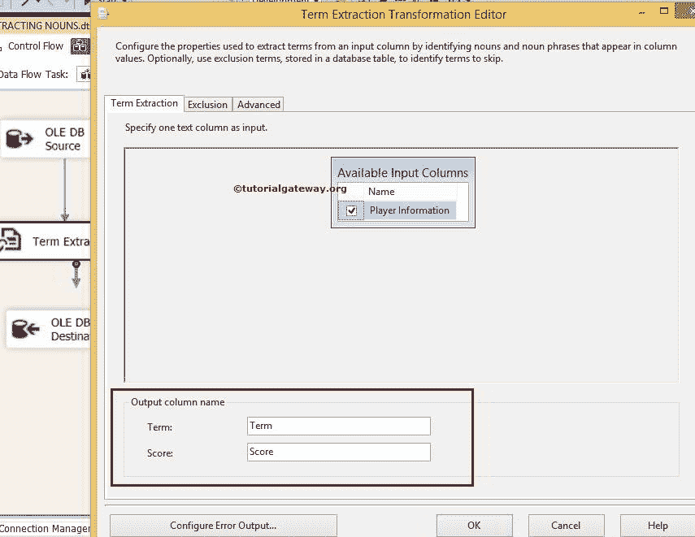

# 在 SSIS 中使用术语提取转换提取名词和短语

> 原文：<https://www.tutorialgateway.org/extract-nouns-and-noun-phrases-using-term-extraction-transformation-in-ssis/>

在本文中，我们将向您展示如何使用 SSIS 术语提取转换来提取名词和名词短语。在阅读本文之前，请参考 SSIS 文章中的[术语提取，了解该转换的定义和功能。](https://www.tutorialgateway.org/term-extraction-in-ssis/)

提示:请参考 SSIS[术语提取转换](https://www.tutorialgateway.org/term-extraction-transformation-in-ssis/)文章了解提取名词所涉及的步骤，[使用术语提取提取名词短语](https://www.tutorialgateway.org/extract-noun-phrases-using-term-extraction-transformation-in-ssis/)文章遵循 [SSIS](https://www.tutorialgateway.org/ssis/) 中从源数据中提取名词短语所涉及的步骤。

下图截图显示了我们的源数据


## 在 SSIS 配置术语提取转换来提取名词和短语

步骤 1:打开 BIDS，从工具箱中拖放数据流任务来控制流，并将其重命名为在 SSIS 使用术语提取转换提取名词和名词短语。


双击它将打开数据流选项卡。

第二步:将 OLE DB 源、术语提取转换和 OLE DB 目标从工具箱拖放到数据流区域


步骤 3:双击数据流区域中的 OLE DB 源将打开连接管理器设置，并提供空间来编写我们的 SQL 语句。


这里我们选择了[SSIS 教程]数据库作为我们的源数据库，并且我们在上面的截图中使用的 SQL 命令是:

```
USE [SSIS Tutorials]
GO

SELECT [Player Information]
FROM [Term Extraction Transformation Source]
```

第 4 步:单击列选项卡验证列。在此选项卡中，我们还可以取消选中不需要的列。


将 OLE 数据库源输出箭头拖到术语提取转换上，对源数据执行转换。

第五步:双击术语提取转换将打开术语提取编辑器进行配置。在术语提取选项卡中，从可用的输入列中选择要用于术语提取的列。我们将输出列名称保留为默认术语和分数。



排除选项卡:如果要在术语提取期间排除特定术语，请通过指定包含排除术语的列来配置此选项卡。


在这个例子中，让我们留下这个，因为我们想从源数据中提取所有的名词短语。

步骤 6:术语提取转换编辑器对话框的高级选项卡对于选择术语类型、源类型和频率阈值很重要。在这个例子中，我们提取名词和名词短语。因此，我们选择名词和名词短语选项作为术语类型，并选择频率阈值为 1。请参考 SSIS 文章中[使用术语提取转换提取名词理解，如何从源数据中提取名词，](https://www.tutorialgateway.org/term-extraction-transformation-in-ssis/)[使用术语提取转换提取名词短语](https://www.tutorialgateway.org/extract-noun-phrases-using-term-extraction-transformation-in-ssis/)文章理解，如何从数据源中提取名词短语。


从下面的截图中，您可以看到，术语提取转换上有一个警告符号。这说明错误输出没有连接。您可以通过配置术语提取转换的错误输出来删除警告符号。因此双击配置错误输出按钮将打开一个新窗口来设置错误输出。

术语提取转换的默认配置是重定向错误行。您可以通过连接错误输出来消除此警告。或者将默认行为更改为忽略故障或故障组件。让我们换成忽略失败


单击确定完成术语提取转换的配置。

步骤 7:现在，我们必须提供目标的服务器、数据库和表细节。因此，双击 OLE 数据库目标并提供所需的信息。


这里我们选择了[SSIS 教程]数据库作为目标数据源(本地主机作为服务器实例)和[提取 SSIS 的名词和名词短语]表作为我们的目标表

步骤 8:单击“映射”选项卡，检查源列是否完全映射到目标列。如果没有，请将其分配到适当的目标栏


单击“确定”完成使用术语提取转换包提取名词和名词短语的设计。让我们运行包


打开 [SQL Server 管理工作室](https://www.tutorialgateway.org/sql/)查看结果

