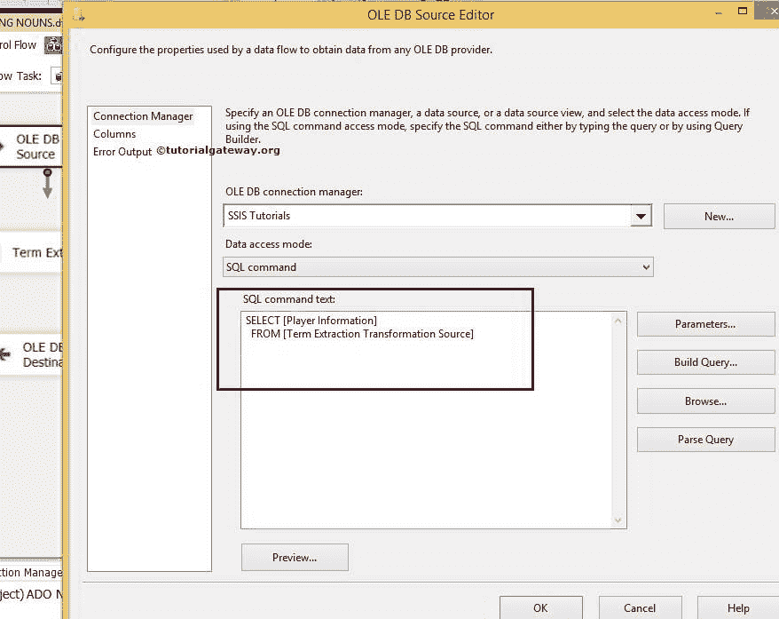
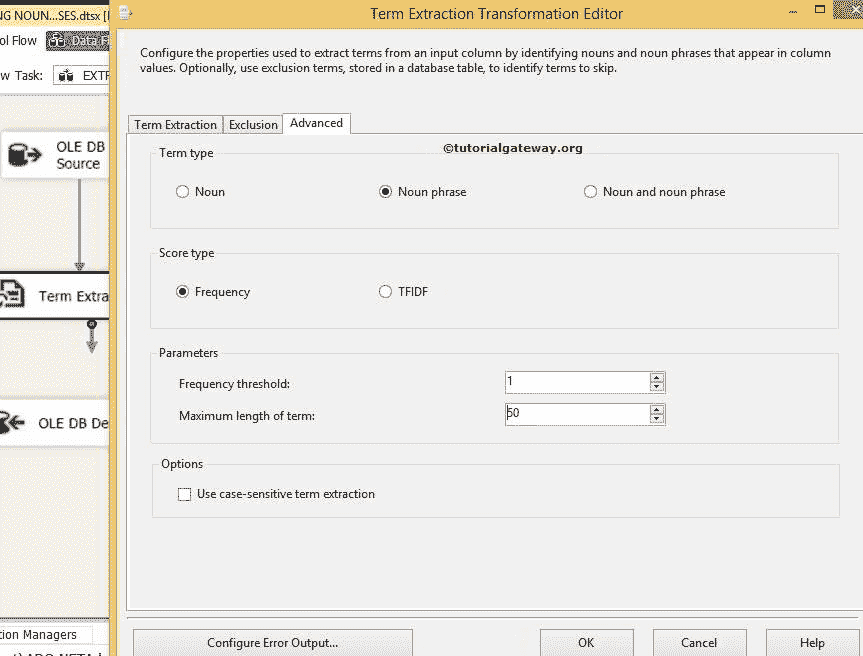

# SSIS 术语提取转换中的排除选项卡

> 原文：<https://www.tutorialgateway.org/exclusion-tab-in-ssis-term-extraction-transformation/>

在本文中，我们将向您展示如何使用排除选项卡，同时使用 SSIS 术语提取转换提取名词短语。

在阅读这篇 SSIS 排除标签文章之前，请参考[术语提取](https://www.tutorialgateway.org/term-extraction-in-ssis/)文章了解该转换的定义和功能，以及[使用术语提取转换](https://www.tutorialgateway.org/extract-noun-phrases-using-term-extraction-transformation-in-ssis/)文章提取名词短语，了解如何在 [SSIS](https://www.tutorialgateway.org/ssis/) 中从源数据中提取名词短语。

下图截图显示了我们的源数据


让我们也看看排除列表


在本例中，我们将显示源数据中除上述名称之外的所有名词短语。

## 在 SSIS 术语提取转换中配置排除选项卡

步骤 1:打开 BIDS，从工具箱中拖放数据流任务来控制流，并将其重命名为 SSIS 术语提取转换中的排除选项卡。


第二步:将 OLE DB 源、术语提取转换和 OLE DB 目标从工具箱拖放到数据流区域


步骤 3:双击数据流区域中的 OLE DB 源将打开连接管理器设置，并提供空间来编写我们的 SQL 语句。



这里我们选择了【SSIS 教程】数据库作为我们的源数据库，我们使用的 [SQL](https://www.tutorialgateway.org/sql/) 命令是:

```
USE [SSIS Tutorials]
GO

SELECT [Player Information]
FROM [Term Extraction Transformation Source]
```

第 4 步:单击列选项卡验证列。


将 OLE 数据库源输出箭头拖到术语提取转换上，对源数据执行转换。

步骤 5:双击术语提取转换进行配置。在术语提取选项卡中，从可用的输入列中选择要用于术语提取的列。我们将输出列名称保留为默认术语和分数。


排除标签:在这里，我们想从名词短语中排除国家名称(我们在前面显示过)。为此，让我们在 SSIS 配置 [OLE DB 连接管理器](https://www.tutorialgateway.org/ole-db-connection-manager-in-ssis/)和排除条款。


从上面的截图中，我们从[SSIS 教程]数据库中选择了[术语提取中的排除列表]表。我们从这个表中选择了 CountryName，因为它保存了排除项，如国家名称。

第六步:在这个例子中，我们只提取名词短语。因此，我们选择名词短语作为术语类型，并选择频率阈值为 1。请参考 SSIS 文章[使用术语提取转换提取名词，了解如何从源数据中提取名词。](https://www.tutorialgateway.org/term-extraction-transformation-in-ssis/)

[](https://www.tutorialgateway.org/term-extraction-transformation-in-ssis/)

从下面的截图中，可以看到，术语提取转换上有一个警告符号。您可以通过配置术语提取转换的错误输出来删除警告符号。因此双击配置错误输出按钮将打开一个新窗口来设置错误输出。

术语提取转换的默认配置是重定向错误行。您可以通过连接错误输出，或将默认行为更改为忽略故障或组件故障来消除此警告。让我们换成忽略失败


单击确定完成术语提取转换的配置。

步骤 7:现在，使用 OLE DB 目标提供目标的服务器、数据库和表详细信息。


这里我们选择了[SSIS 教程]数据库作为目标数据源(本地主机作为服务器实例)和[术语提取转换排除选项卡]表作为我们的目标表

步骤 8:单击“映射”选项卡，验证源列是否完全映射到目标列。


单击“确定”完成 SSIS 术语提取转换包中排除选项卡的设计。让我们运行包


如果不包括排除列表，输出如下:


打开 [SQL Server 管理工作室](https://www.tutorialgateway.org/sql/)，在


SSIS 术语提取转换中添加排除列表后查看结果