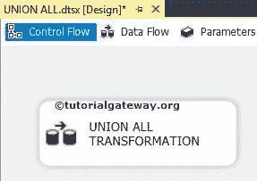
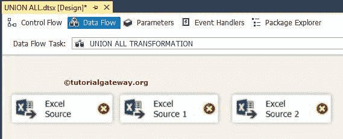
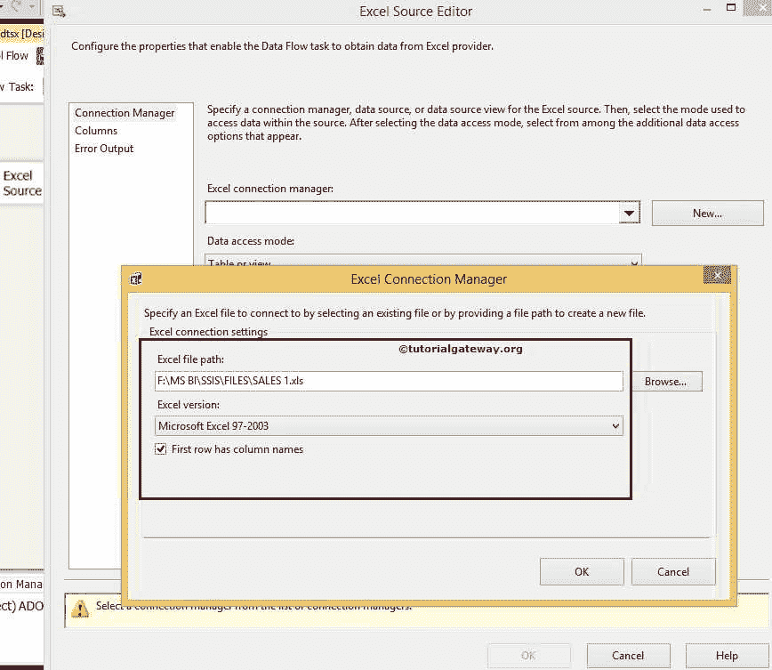
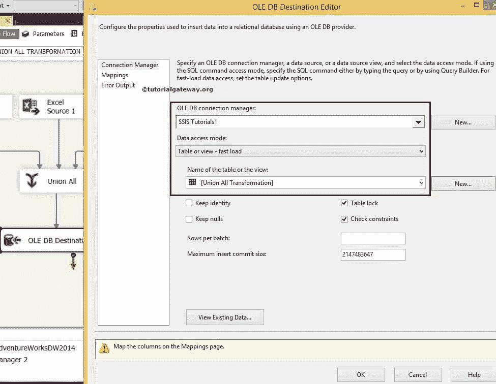
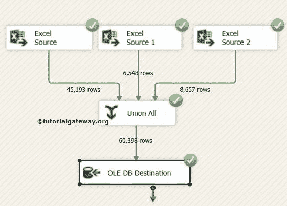

# SSIS 的全联盟变革

> 原文：<https://www.tutorialgateway.org/union-all-transformation-in-ssis/>

SSIS 的 Union All Transformation 用于组合来自多个来源的数据(excel 文件、平面文件等)。).或者多个 SQL 表，并产生一个输出来存储在目标表中。SSIS 的联合所有转换在合并数据并存储在目标表中时不遵循任何特定的顺序

例如，该公司有 100 家商店，每个商店维护其销售数据。一天结束时，它们都属于一家公司，你的工作是找出任何单一产品的一个月或一年的销售额。访问 100 家商店或交叉检查 100 个 excel 或平面文件并计算销售额是不切实际的。在这种情况下，您所要做的就是，使用 SSIS Union All Transformation 将来自 100 家商店的所有 100 个 excel 文件组合并存储在数据仓库中，然后从数据库中计算产品销售额。

注意: [SSIS](https://www.tutorialgateway.org/ssis/) 中的并集全转换只会产生一个输出，不支持错误输出。

## SSIS 联合所有转型的例子

我们将产品销售数据存储在三个不同的 excel 文件中(SALES 1、SALES 2、SALES 3，如下图截图所示)。并且，我们希望将所有的 excel 数据导出到一个 [SQL](https://www.tutorialgateway.org/sql/) 数据库表中。

步骤 1:从工具箱中拖放数据流任务来控制流，并将其重命名为“联合所有转换”。

双击 SSIS 联合所有转换将把我们带到数据流区域。

第二步:将三个 Excel 源从工具箱拖放到数据流区域

双击数据流区域中的第一个 Excel 源将打开连接管理器设置，并提供一个选项来选择保存源数据的表。

从上面的 SSIS 联合所有转换截图中，您可以观察到我们正在选择 SALES 1.xls 文件作为源。单击“确定”选择保存数据的表格或 Excel 工作表。

这里我们选择了 Sales1.xls 中的小于 400 表

第 3 步:单击列选项卡验证列。在此选项卡中，我们还可以取消选中不需要的列。

第四步:双击第二个 excel 源，用 Sales 2 excel 文件进行配置。

对另一个 excel 文件执行同样的操作。接下来，将联合所有转换拖放到 SSIS 数据流区域

第五步:通过拖动输出箭头

，将所有 Excel 源加入到“联合所有转换”中

第六步:双击 SSIS 联合所有转换将打开联合所有转换编辑器窗口进行配置

提示:SSIS 联合所有转换编辑器自动映射列，只要列名相同，如果列名不相同，那么我们必须手动进行。使用 Excel 时，请小心数据转换。

步骤 7:拖放 OLE DB 目标并双击它进行配置。现在我们必须提供目标的服务器、数据库和表的详细信息。

这里我们选择了 SSIS 教程数据库和[联合所有转换]表作为目的地。

步骤 8:单击“映射”选项卡，检查 SSIS 联合所有转换源列是否完全映射到目标列。

通过点击 ok，我们在 ssis 包中完成了联合所有转换的开发。那么，让我们运行包

让我们打开 [SQL Server 管理工作室](https://www.tutorialgateway.org/sql/)，查看

联合所有转换结果