# SSIS 的逆转型

> 原文：<https://www.tutorialgateway.org/unpivot-transformation-in-ssis/>

SSIS 的 UNPIVOT 转换用于将 DE 规范化数据转换为更规范化的版本，类似于 SQL UNPIVOT。SSIS 逆透视变换的作用与枢轴变换正好相反。

请参考 SSIS 文章中的[透视变换，了解如何将归一化数据转换为去归一化数据。](https://www.tutorialgateway.org/pivot-transformation-in-ssis/)

将以下数据视为我们的 SSIS 逆透视变换源数据

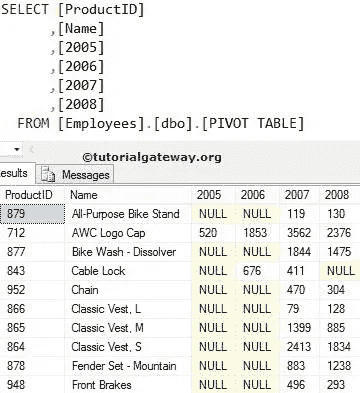

## SSIS 逆投影变换实例

在这个 SSIS 逆透视变换的例子中，我们将把雇员数据库中的数据透视表转换成一个普通的表。

第一步:打开 BIDS，从工具箱中拖放数据流任务来控制流，并将其重命名为 UNPIVOT 变换

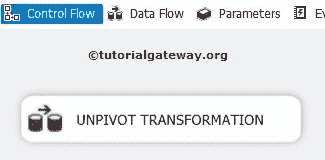

双击它将打开数据流选项卡。

第二步:将 OLE DB Source，UNPIVOT Transformation 从工具箱拖放到数据流区域，如图。

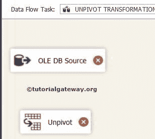

第三步:双击数据流区域的 [SSIS](https://www.tutorialgateway.org/ssis/) OLE DB 源将打开连接管理器设置，并提供空间来编写我们的 [SQL](https://www.tutorialgateway.org/sql/) 语句。在本例中，我们将使用员工数据库中的透视表作为我们的来源

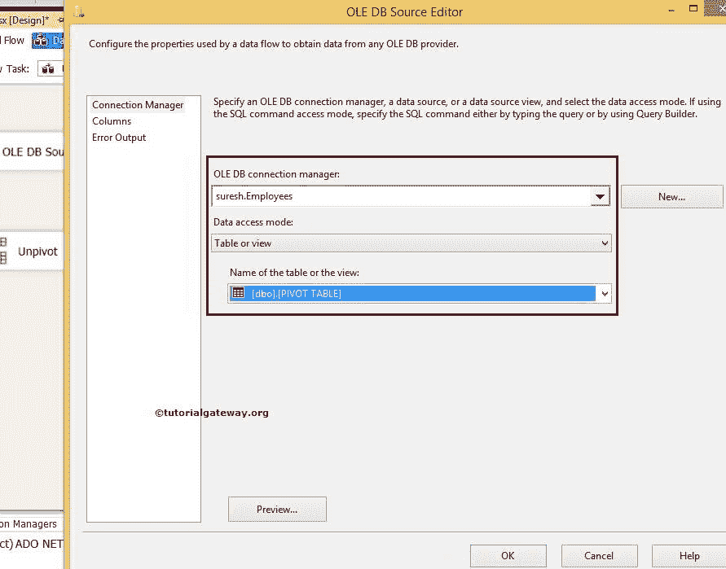

第 4 步:单击列选项卡验证列。在此选项卡中，我们可以取消选中不需要的列。

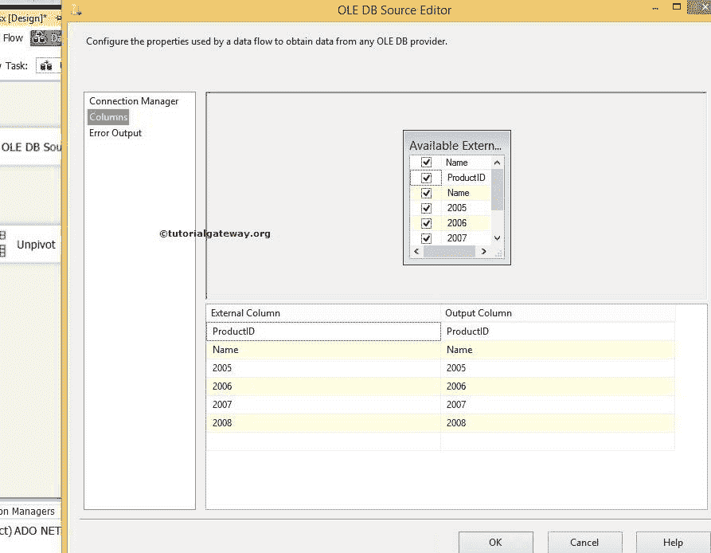

这里我们选择产品编号、名称、2005 年、2006 年、2007 年和 2008 年

单击“确定”并将蓝色箭头从“OLE 数据库源”拖到“取消固定转换”以对源数据执行转换。

第五步:双击 SSIS 逆透视变换进行配置。

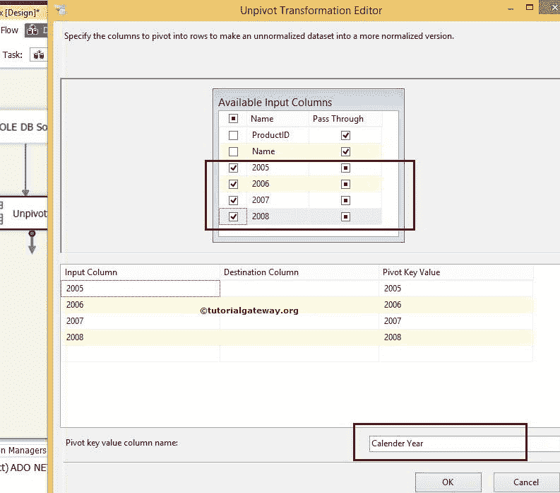

1.  可用输入列:通过选中复选框选择要取消固定的列。不要忘记为其余的列选择“通过”选项。如果您没有选择“通过”选项，那么这些列将不能用于目标。在本例中，“产品标识”和“名称”列是“传递”列，2005、2006、2007、2008 是我们要取消固定的列。
2.  输入列:“可用输入列”选项中的所有选定列都会自动添加到此部分。所以，2005，2006，2007，2008 列是输入列
3.  目标列:指定要存储值的目标列的名称。或者输入列中的数据，如 2005、2006、2007、2008。
4.  透视键值:指定透视值的名称，这些值作为列值存储在“日历年”列中(透视键值列名称)。默认值与输入列相同。不过，你可以随意改变。我们对 2005 年、2006 年、2007 年、2008 年的价值观没有意见，所以我们没有改变这些价值观。
5.  透视键值列名称:指定您希望看到的透视值列的名称。因为我们的列数据是 2005 年、2006 年、2007 年和 2008 年，所以我们将默认的透视键值更改为日历年。

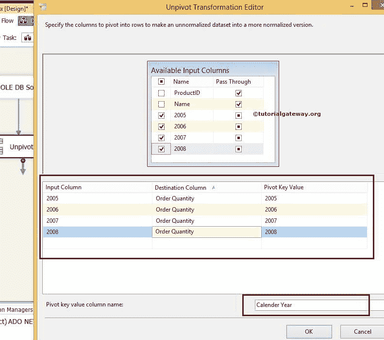

在这个 SSIS 逆透视转换示例中，我们将目标列命名为订单数量，将透视键值列名称命名为日历年

步骤 6:现在，我们必须提供目的地的服务器、数据库和表细节。因此，双击 OLE 数据库目标并提供所需的信息。

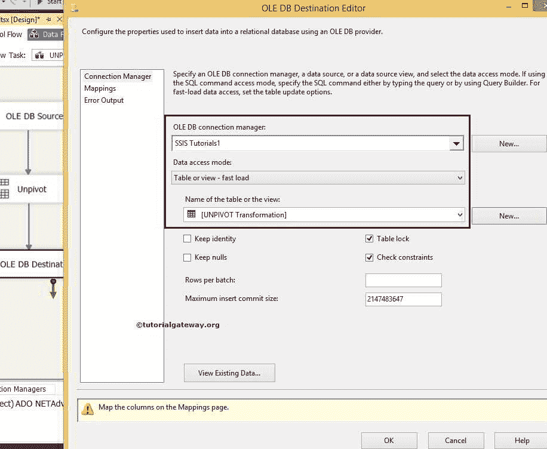

这里我们选择了[SSIS 教程]数据库作为我们的目标数据库和[逆变换]表作为我们的目标表。

步骤 8:单击“映射”选项卡，检查 SSIS 逆透视变换源列是否完全映射到目标列。

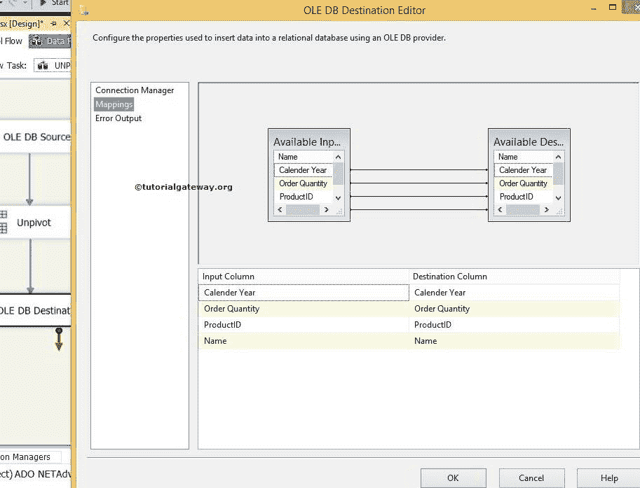

单击“确定”完成我们在 SSIS 的软件包设计。让我们运行包

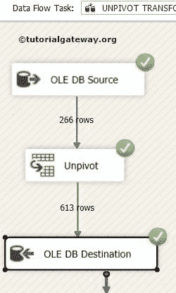

查看 [SQL Server](https://www.tutorialgateway.org/sql/) 管理工作室

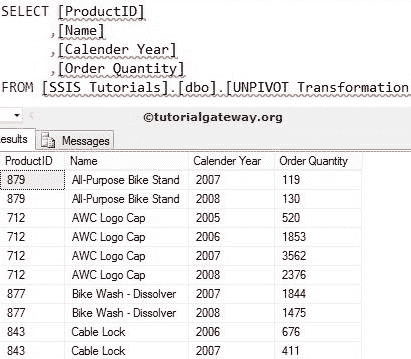

中的 SSIS [UNPIVOT](https://www.tutorialgateway.org/unpivot-in-sql/) 转换结果