# 对于 SSIS 的环形集装箱

> 原文：<https://www.tutorialgateway.org/loop-container-ssis/>

SSIS 的 For 循环容器将重复 SQL 集成服务任务给定次数，直到给定条件为假。它与任何编程语言中的 For 循环相同。在本章中，我们将通过示例向您展示在 SSIS 配置 For 循环容器的分步方法。

在我们开始使用 SSIS For 循环容器之前，让我在 SQL Server 中创建一个空表:

```
-- For Loop Container in SSIS Example
USE [SQL Tutorial]
GO

CREATE TABLE [dbo].[SSISForLoopExample](
 [Key] [int] IDENTITY(1,1) NOT NULL PRIMARY KEY,
 [CounterNumber] [int] NULL,
 [LoopNumber] [varchar](50) NULL,
 [LastUpdated] [datetime] NULL,
)
GO
```

## 对于 SSIS 配置中的循环容器

在这个例子中，我们将创建一个变量。接下来，我们将使用 For 循环将该变量增加 1，然后将该值保存在我们上面创建的表中。为此，首先将 SSIS 循环容器拖放到控制流区域

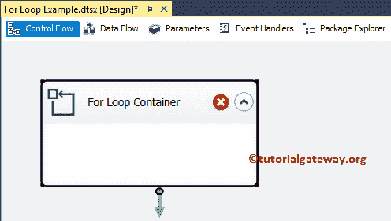

双击它将打开循环编辑器的 [SSIS](https://www.tutorialgateway.org/ssis/) 。您可以使用此编辑器对其进行配置。请参考[C 编程中的 For 循环](https://www.tutorialgateway.org/for-loop-in-c-programming/)逐步了解 For 循环的编程流程。即使不知道 [C 语言](https://www.tutorialgateway.org/c-programming/)，也有助于理解循环概念。

*   InitExpression: For 循环以初始化语句开始，因此应该首先初始化计数器变量(例如，@counter = 1 或@i = 1。).
*   评估表达式:根据条件测试的计数器变量值。如果条件为真，它将执行 For 循环容器。否则，For 循环终止。
*   赋值表达式:该表达式将在每次迭代结束后执行。它有助于根据我们的要求增加或减少计数器变量。

在 SSIS 循环容器常规部分下，请指定有效且更有意义的名称和描述。

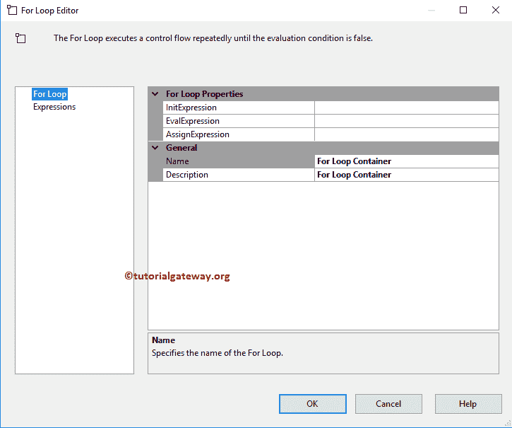

我想我忘了创建一个可以在 For 循环中使用的变量。所以，让我关闭 for Loop 编辑器，右键单击设计将打开上下文菜单。请选择变量选项。

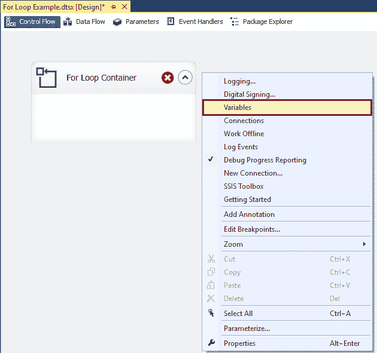

从下面的截图中可以看出，我们创建了一个名为 CounterNumber 的整数类型变量，并分配了默认值 0。

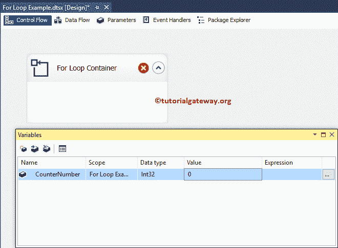

接下来，打开“For 循环编辑器”，并指定适当的值。从下面开始，For 循环将从 0 开始执行，直到达到 10，并且对于每次迭代，CounterNumber 值递增 1。

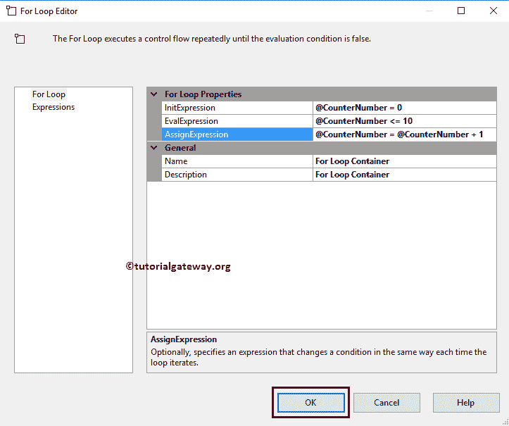

单击“确定”关闭 SSIS 循环容器。让我将[执行 SQL 任务](https://www.tutorialgateway.org/execute-sql-task-in-ssis/)拖放到 For 循环容器中。我们将使用这个执行 SQL 任务将[数据插入到 SQL 表中。](https://www.tutorialgateway.org/sql-insert-statement/)

[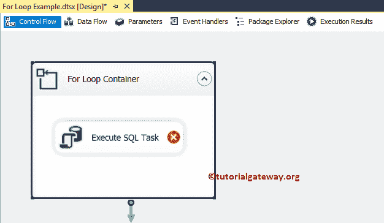](https://www.tutorialgateway.org/sql-insert-statement/)

双击它将打开执行 SQL 任务编辑器进行配置。让我选择连接类型为[ADO.NET 连接](https://www.tutorialgateway.org/ado-net-connection-manager-in-ssis/)，连接到 SQL 教程数据库。接下来，我们使用直接输入作为 [SQL](https://www.tutorialgateway.org/sql/) 语句，因此单击…按钮。

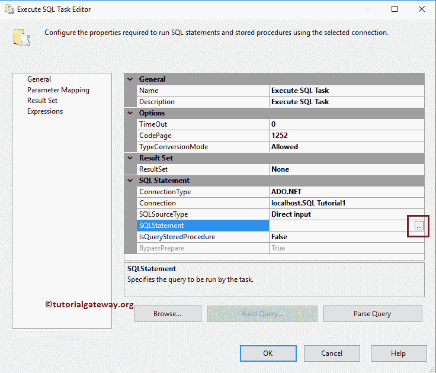

请在这里写你的自定义 SQL 语句。从下面的截图中可以看出，我们正在编写一个 [SQL Insert 语句](https://www.tutorialgateway.org/sql-insert-statement/)，将数据插入到 SSIS For Loop 示例表中。

```
-- For Loop Container in SSIS Example
INSERT INTO [dbo].[SSISForLoopExample]
           ([CounterNumber]
           ,[LoopNumber]
           ,[LastUpdated])
     VALUES
           (@CounterNumber
           ,'Loop Number' + CAST(@CounterNumber AS VARCHAR(50))
           ,getdate())
```

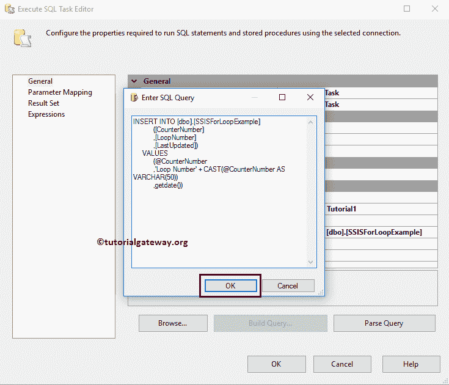

验证剩余的 SSIS 循环容器设置

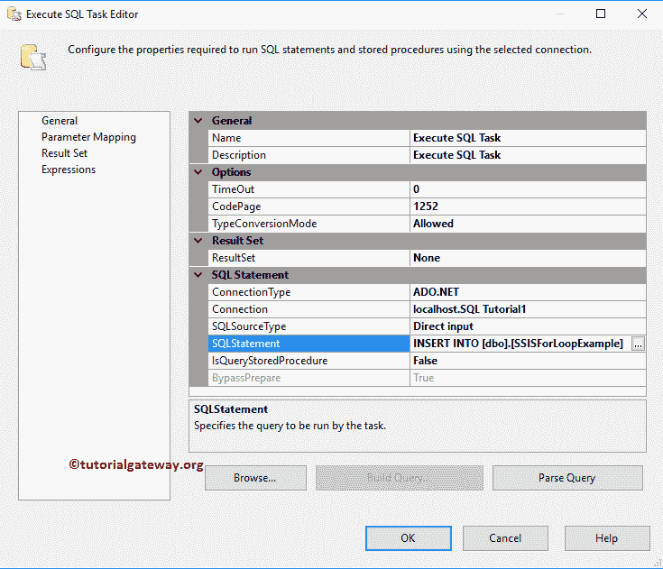

接下来，转到 SSIS For 循环容器参数设置，分配我们在 SQL 命令中使用的参数。如您所见，我们将用户变量(我们从 For 循环中获得的变量)分配给参数名称(这是我们在 SQL 语句中使用的名称)


单击确定完成配置执行 SQL 任务参数映射。让我们运行 SSIS For Loop 容器包

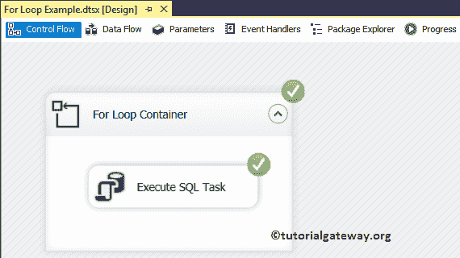

让我打开 [SQL Server](https://www.tutorialgateway.org/sql/) 管理工作室，检查我们是否使用了 SSIS For Loop 容器

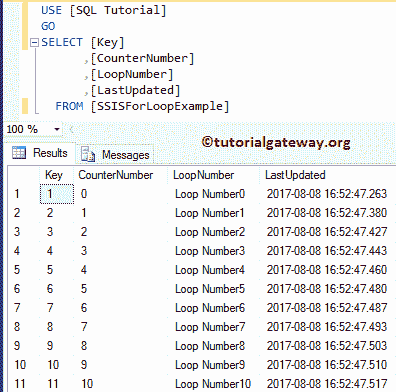

将记录多个计数器值插入到目标表中