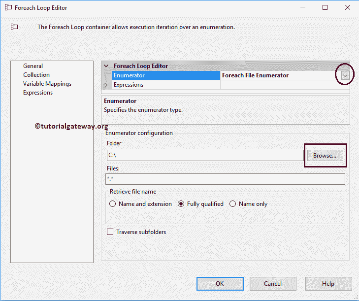

# SSIS 循环文件枚举器

> 原文：<https://www.tutorialgateway.org/ssis-foreach-loop-file-enumerator/>

SSIS ForEach 循环容器将重复控制流任务 N 次，这类似于任何编程语言中的 ForEach 循环。SQL Server 集成服务或 SSIS 提供了八种类型的枚举器。在本文中，我们将向您展示配置 SSIS ForEach 循环文件枚举器所涉及的步骤。

SSIS Foreach 文件枚举器:用于枚举指定文件夹中的文件。SSIS ForEach 循环文件枚举器也将遍历指定文件夹中的子文件夹。例如，如果您想将多个文件从一个文件夹移动到另一个文件夹，或者使用 FTP 任务将多个文件上传到 FTP 服务器，等等。在我们开始创建包之前，让我们看看源数据。

我们在 Documents 驱动器中有文件系统任务文件夹，我们的任务是将数据从文本文件加载到 [SQL Server](https://www.tutorialgateway.org/sql/) 表中。下面的截图显示了该文件夹中的文件。

下面的截图将向您展示 Employee1.txt 文件中的数据。

下面的截图将向您展示 Employee2.txt 文件中的数据。

下面的文本文件显示了 Employee3.txt 文件中的数据。

下面的截图显示了 Employee4.txt 文件中的数据。

## SSIS 循环文件枚举器

在这个 SSIS ForEach 循环文件枚举器的例子中，我们将枚举那些雇员文本文件，并提取这些文件中存在的数据，并将它们加载到 SQL 表中。为此，首先将 Foreach 循环容器拖放到控制流区域

双击它将打开 [SSIS](https://www.tutorialgateway.org/ssis/) 每个循环编辑器进行配置。在常规选项卡中，请指定有效且更有意义的名称和描述。

在我们进入剩下的属性之前，我们必须了解 Enumerator 属性。从下面的截图中，您可以观察到我们选择 Foreach 文件枚举器是因为我们想要遍历文件系统中的文件。接下来，单击浏览按钮从我们的文件系统中选择文件夹名称。

从下面的截图中，您可以观察到我们正在电子驱动器中选择文件系统任务文件夹文件夹。单击确定按钮选择它。

在文件部分，我们必须使用通配符指定文件类型。在这个例子中，我们想要枚举文本文件，所以我们使用通配符*。文本文件（textfile）

提示:如果您要使用所有的扩展，请使用*。*通配符

SSIS 循环文件枚举器中“检索文件名”选项下的属性列表如下:

*   名称和扩展名:如果选择此选项，Foreach 循环将在变量中存储文件名和扩展名。例如，Employee1.txt
*   仅名称:如果选择此选项，Foreach 循环会将文件名存储在变量中。例如，员工 1
*   完全限定:如果选择此选项，Foreach 循环会在变量中存储路径、文件名和扩展名。例如，E:\Folder Name\Employee1.txt .从下面的截图中，您可以观察到我们正在选择此选项。
*   遍历子文件夹:如果要检查子文件夹，请勾选此选项

接下来，我们必须将文件名存储在一个变量中，以便在数据流任务中使用它们。为此，转到变量映射部分，选择用户变量(如果有)或创建新变量

一旦点击<new variable..="">，添加变量窗口将打开，创建一个新的变量。在这个例子中，我们需要变量来存储文件路径、文件名及其扩展名。因此，我们创建了一个字符串变量，并将名称指定为 EmployeeFile_Name。单击“确定”完成创建字符串变量。</new>

现在选择新创建的变量，并将其分配给索引 0。完成后，单击确定完成 Foreach 循环容器的配置。

接下来，将数据流任务从工具箱拖放到 Foreach 循环容器中，并将其重命名为 SSIS Foreach 循环文件枚举器。

双击它将打开数据流选项卡。接下来，拖放[平面文件源](https://www.tutorialgateway.org/flat-file-source-in-ssis/)和 [OLE DB 目标](https://www.tutorialgateway.org/ssis-ole-db-destination/)。

双击平面文件源将打开平面文件源编辑器来配置连接管理器设置。如果您尚未创建平面文件连接管理器，单击新建按钮将打开平面文件连接管理器编辑器。从下面的截图中，您可以看到我们正在从文件系统任务文件夹中选择员工 1 文本文件。

我们的文本文件将列名作为第一行，因此，请选中第一个数据行选项

中的列名

单击列选项卡预览列数据并更改行和列分隔符。

单击确定按钮关闭平面文件源连接管理器编辑器，然后单击平面文件源编辑器列选项卡验证列。在此选项卡中，我们可以取消选中不需要的列。

双击 [OLE DB 目标](https://www.tutorialgateway.org/ssis-ole-db-destination/)，选择 [OLE DB 连接管理器](https://www.tutorialgateway.org/ole-db-connection-manager-in-ssis/)，选择【SSIS 教程】数据库中的【SSIS ForEach 循环文件分子】表，插入新记录。

单击“映射”选项卡，检查源列是否完全映射到目标列。

在开始执行任务之前，我们必须更改平面文件连接管理器的连接字符串设置。因为到目前为止，我们配置平面文件连接管理器来选择单个文件(即 Employee1.txt 文件)。但是我们的任务是选择员工 1、员工 2、员工 3 和员工 4。这意味着我们必须动态分配文件名。为此，我们必须更改连接管理器设置。

请从“连接管理器”窗格中选择平面文件连接管理器，右键单击它将打开上下文菜单。请选择“属性”选项。

单击表达式属性将打开属性表达式编辑器。这里我们必须配置连接字符串设置。因此，从下拉框中选择连接管理器属性，然后单击…按钮。

单击…按钮后，它将打开表达式生成器来构建表达式。这里我们将 EmployeeFile_Name 变量作为表达式进行拖动，因为它保存了文件系统任务文件夹中每个文本文件的完整路径。

单击“确定”完成 SSIS 循环文件枚举器包的配置。让我们运行包

让我们打开 [SQL Server](https://www.tutorialgateway.org/sql/) 管理工作室，检查是否使用 SSIS ForEach 循环文件枚举器将多个文本文件中的记录插入到目标表中

