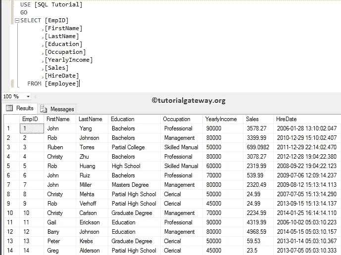

# SSIS `Foreach` 节点列表枚举器

> 原文：<https://www.tutorialgateway.org/ssis-foreach-nodelist-enumerator/>

SSIS `Foreach` 节点列表枚举器对于枚举 XML 节点很有用。例如，您可以使用此枚举器遍历 XML 文件中的任何节点。在本文中，我们将通过一个例子向您展示如何使用这个 SSIS `Foreach` 节点列表枚举器。

在我们开始演示 SSIS 的 Foreach 节点列表枚举器之前，让我向您展示我们将用于此示例的数据。我们将在本例中使用 SQL Server 中的员工表:



下面的查询会将 Employee 表中的数据转换成一个 XML 文件


而 XML 文件里面的数据是:


## SSIS `Foreach` 节点列表枚举器示例

在这个 SSIS `Foreach` 节点列表枚举器示例中，我们将枚举上述 XML 文件中的节点，并将占领列信息复制到另一个数据库表中。为此，首先将 Foreach 循环容器拖放到控制流区域


双击它将打开 Foreach 循环编辑器进行配置。在 [SSIS](https://www.tutorialgateway.org/ssis/) 常规选项卡中，请指定有效的名称和描述。这里，我们将名称指定为


SSIS·福雷赫节点列表枚举器

接下来，转到“集合”选项卡选择枚举器。这里，我们选择 Foreach 节点列表枚举器，因为我们想在 XML 节点上循环。


以下是您必须为此 SSIS `Foreach` 节点列表枚举器配置的属性列表。


文档源类型:这个 SSIS `Foreach` 节点列表枚举器属性有三个选项:

*   文件连接:它意味着，源位于文件系统中的一个 XML 文件中。您可以使用下一个属性来选择文件。
*   变量:源存在于变量中。如果选择此选项，则必须在下一个选项中选择变量名。
*   直接输入:我们希望将 XML 数据直接插入到这个编辑器中。目前，我们选择这个选项。


可以看到，我们插入了上面指定的 XML 数据


枚举器类型:此 Foreach 节点列表枚举器属性有四个选项:

*   导航器:这将使用 XpathNavigator 枚举
*   节点:枚举节点。
*   节点文本:这将枚举文本节点。缩小搜索范围是有用的。
*   ElementCollection: IT 枚举 Xpath 返回的元素节点。


接下来，我们将提供路径。以下路径将导航至“员工详细信息”节点下每个雇主中的“职业”节点。


现在选择现有变量，并将其分配给索引 0。完成后，单击确定完成 Foreach 循环容器的配置。


接下来，将执行 SQL 任务拖放到 Foreach 循环容器中。此任务帮助我们将值插入到空表中。


双击它将打开执行 SQL 任务编辑器窗口。这里我们选择了 [OLE DB 连接](https://www.tutorialgateway.org/ole-db-connection-manager-in-ssis/)类型，选择了现有的连接，指向[ [SQL 教程](https://www.tutorialgateway.org/sql/) ]数据库。


接下来，我们编写以下 SQL 查询，将表名插入到 SMO 枚举器表中。

```
INSERT INTO [NodeListEnumerator] ([Occupation])
                          VALUES (?)
```

这里问号将被参数代替。


请在开始参数映射


之前交叉检查所有属性

接下来，转到参数映射，并选择我们在 Foreach Loop 容器中分配的参数。这意味着 Foreach 循环容器将循环遍历 XML 节点，并将占用信息存储在变量中。接下来，我们将该变量传递到[执行 SQL 任务](https://www.tutorialgateway.org/execute-sql-task-in-ssis/)


单击“确定”完成 SSIS `Foreach` 节点列表枚举器包的配置。让我们运行包


让我们打开 [SQL Server](https://www.tutorialgateway.org/sql/) 管理工作室，检查是否使用了 SSIS `Foreach` 节点列表枚举器


将职业详细信息插入到目标表中