# SSIS ForEach 循环 SMO 枚举器

> 原文：<https://www.tutorialgateway.org/ssis-foreach-loop-smo-enumerator/>

在本文中，我们将向您展示配置 SSIS ForEach 循环 SMO 枚举器所涉及的步骤。

SSIS ForEach 循环 SMO 枚举器:SMO 的意思是 SQL Server 管理对象，这个用来枚举 SQL Server 管理对象。例如，SSIS ForEach 循环 SMO 枚举器可以枚举表、视图等的列表。，存在于数据库中。

## SSIS ForEach 循环 SMO 枚举器

在本例中，我们将枚举存在于 2014 数据库中的表，并将表名复制到另一个数据库表中。为此，首先将 Foreach 循环容器拖放到 [SSIS](https://www.tutorialgateway.org/ssis/) 控制流区域

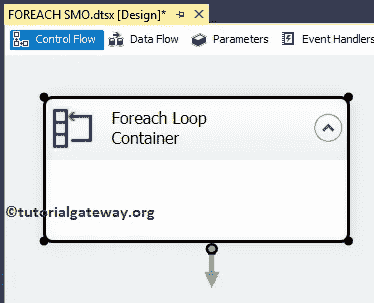T4】

双击它将打开 Foreach 循环编辑器进行配置。在常规选项卡中，请指定有效且更有意义的名称和描述。从下面，您可以看到我们将默认名称更改为 SSIS ForEach Loop SMO 枚举器

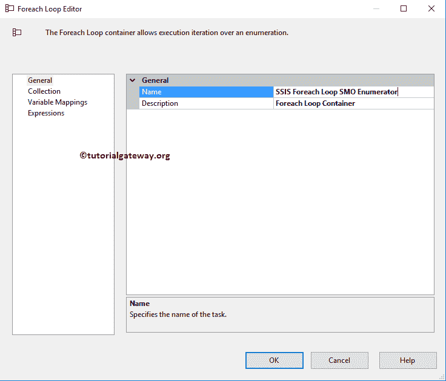

接下来，转到收集选项卡选择枚举器并配置信使。在我们进入剩下的属性之前，我们必须了解 Enumerator 属性。在这里，我们选择 Foreach SMO 枚举器，因为我们希望循环访问我们的 2014 年复现数据库中的表。

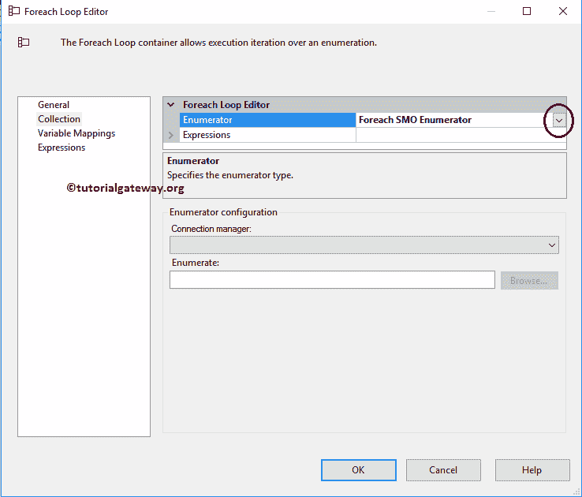

接下来，我们必须配置连接管理器。因此，单击向下箭头按钮并选择新连接..按钮创建新的连接管理器，或者选择现有的连接管理器(如果有)。

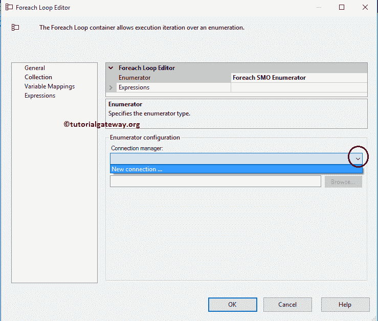

单击“新建连接”后..按钮，SMO 连接管理器编辑器将打开进行配置。对于这个 SSIS ForEach 循环 SMO 枚举器示例，我们选择 suresh 作为服务器实例，并且使用 Windows 身份验证。

提示:请参考[SSIS SMO 连接管理器](https://www.tutorialgateway.org/smo-connection-manager-in-ssis/)文章了解属性。

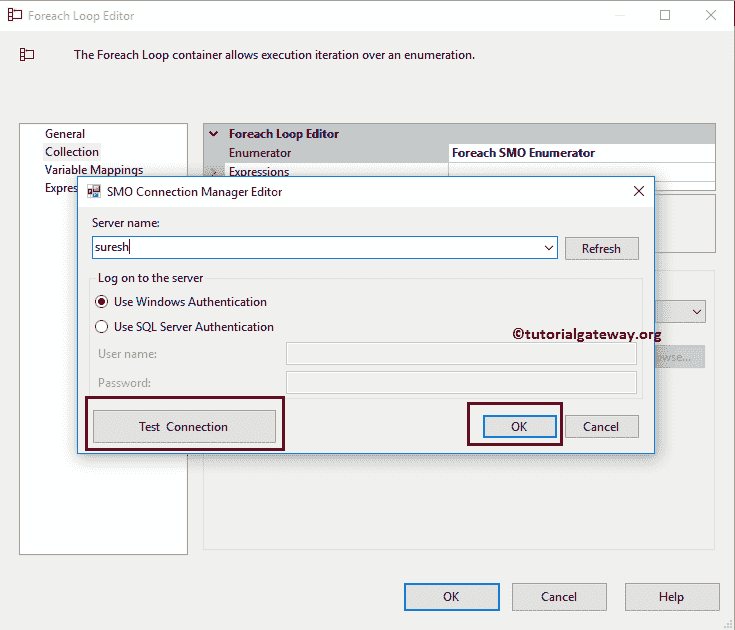

单击浏览按钮选择数据库中的表。从下面的截图中，您可以看到我们正在选择 AdventureWorksDW2014 数据库表名。

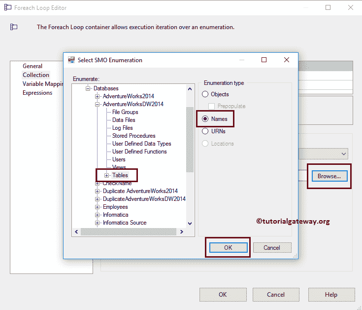

接下来，我们必须将文件名存储到一个变量中，以便在我们的执行 SQL 任务中使用它。为此，转到变量映射部分，选择用户变量(如果有)或创建新变量

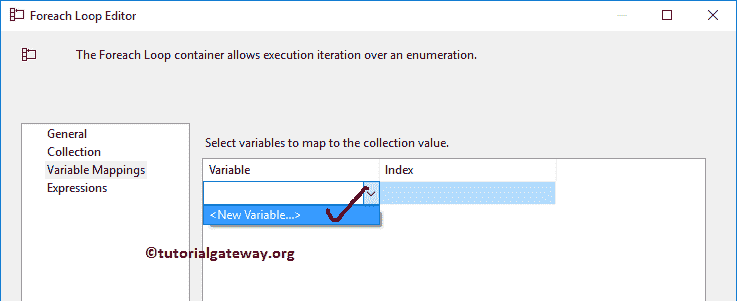

一旦点击<new variable..="">，添加变量窗口打开，创建一个新的变量。在这个例子中，我们需要变量来存储表名。因此，我们创建了一个字符串变量，并将名称指定为表名。单击“确定”完成创建字符串变量。</new>

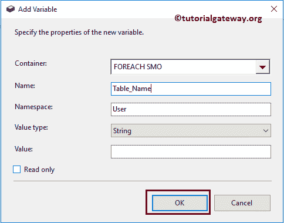

现在选择新创建的变量，并将其分配给索引 0。完成后，单击确定完成 Foreach 循环容器的配置。

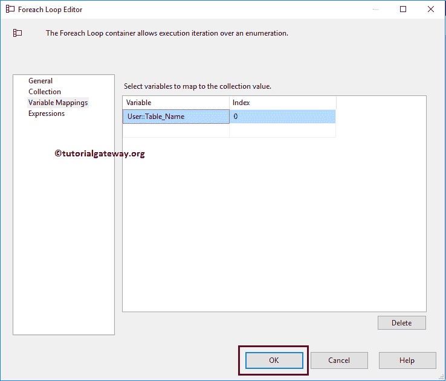

接下来，将执行 SQL 任务从工具箱拖放到 Foreach 循环容器中。该任务将帮助我们将新值插入到空表中。

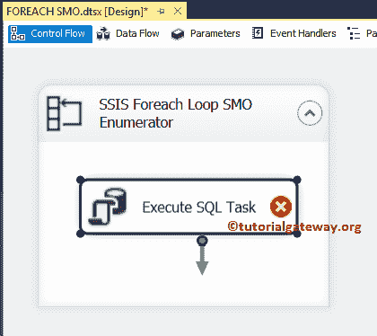

双击它将打开执行 SQL 任务编辑器窗口。从下面的截图可以观察到，我们选择了 [OLE DB](https://www.tutorialgateway.org/ole-db-connection-manager-in-ssis/) 作为连接类型，选择了现有的连接，指向的是【SSIS 教程】数据库。

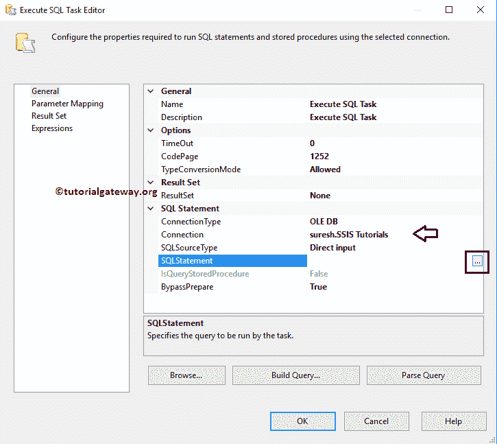

接下来，我们编写下面的 [SQL](https://www.tutorialgateway.org/sql/) 查询，将表名插入到 SMO _ 枚举器表中。

```
INSERT INTO SMO_Enumerator ([Table_Name])
VALUES (?)
```

这里问号将被参数代替。

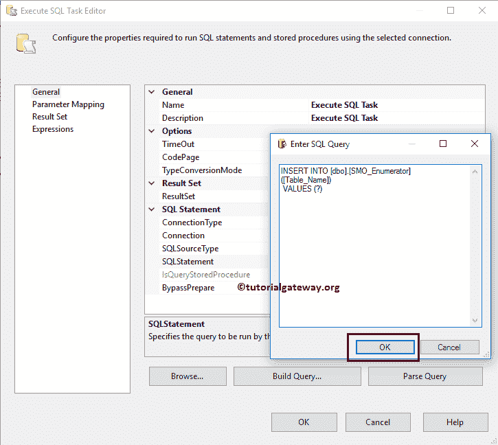

接下来，转到参数映射，并选择我们在 Foreach Loop 容器中分配的参数。这意味着 Foreach 循环容器将循环遍历 AdventureWorksDW 数据库中的表，并将表名存储在 User:: Table_name 变量中。接下来，我们将这些表名传递到执行 SQL 任务

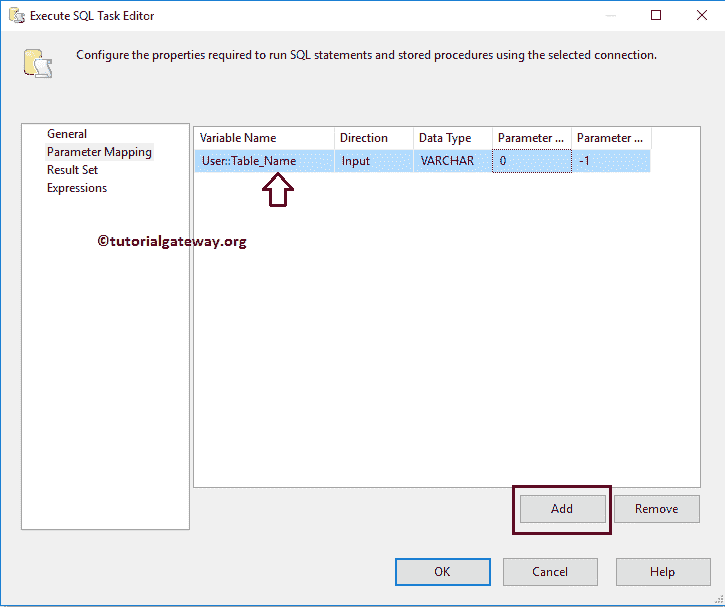

单击“确定”完成 SSIS ForEach 循环 SMO 枚举器包的配置。让我们运行包

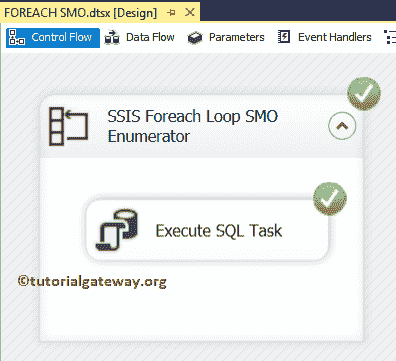

让我们打开 [SQL Server](https://www.tutorialgateway.org/sql/) 管理工作室，检查是否使用 SSIS ForEach Loop SMO 枚举器将表的名称插入到目标表中

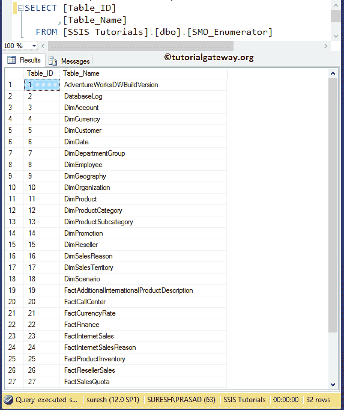