# SSIS 的批量插入任务

> 原文：<https://www.tutorialgateway.org/bulk-insert-task-in-ssis/>

SSIS 的大容量插入任务只能将数据从文本文件传输到 SQL Server 表或视图中，这类似于 SQL Server 中的大容量插入。如果目标表或视图已经包含数据，则在 SSIS 大容量插入任务运行时，新数据会追加到现有数据中。如果要替换数据，请在运行大容量插入任务之前，运行运行 DELETE 或 TRUNCATE 语句的执行 SQL 任务。

例如，我们正在处理股票市场数据，每天我们都会收到数十亿的数据。csv 格式(逗号分隔值)。我们的任务是复制里面的数据。csv 文件到 SQL 数据库表。在 SSIS，我们通常有两种方法来完成批量插入任务。

*   拖放数据流任务，并在数据流内拖放平面文件源和 OLE DB 目标并复制数据。如果我们想要执行任何 [SSIS](https://www.tutorialgateway.org/ssis/) 变换，这种方法是有用的。
*   使用 SSIS 批量插入任务。这种方法比前一种方法更强大，因为在内部，[大容量插入任务](https://www.tutorialgateway.org/bulk-insert-in-sql-server/)使用大容量复制(BCP)操作(在 [SQL Server](https://www.tutorialgateway.org/sql/) 中速度非常快)。

### SSIS 批量插入任务中的可用选项

单击大容量插入任务中的选项选项卡将提供以下选项

*   代码页:指定数据文件中数据的代码页。一般用于其他语言。
*   数据文件类型:指定要在加载操作中使用的数据类型值。
*   批处理大小:指定批处理中的行数。默认值是整个数据文件。如果将 BatchSize 设置为零，数据将在单个批处理中加载。例如，如果我们将批处理大小设置为 100，那么每个批处理充当一个事务，如果任务在一段时间后失败，那么成功加载的批处理将不会被回滚。
*   最后一行:指定要复制的最后一行。
*   第一行:指定开始复制的第一行。
*   SortedData:在大容量插入语句中指定 ORDER BY 子句。默认值为 false。
*   最大错误:指定在取消大容量插入操作之前可能发生的最大错误数。值为 0 表示允许无限数量的错误。

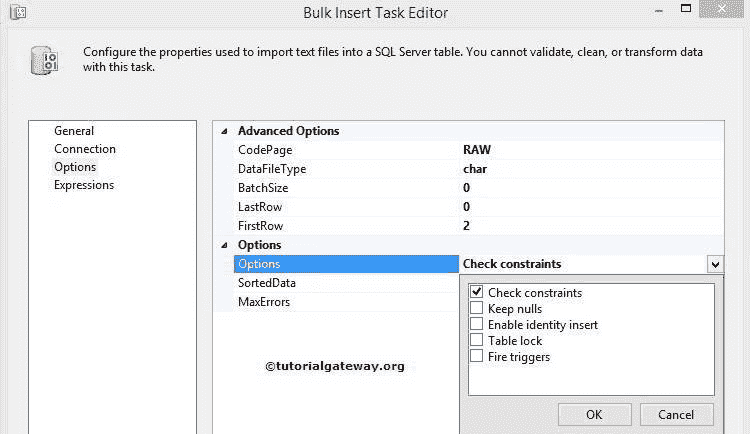

| 选择 | 术语定义 |
| 检查约束 | 检查列数据。 |
| 保留空值 | 选择在大容量插入操作期间保留空值，而不是为空列插入任何默认值。 |
| 启用身份插入 | 选择将现有值插入标识列。 |
| 表锁 | 选择以在大容量插入期间锁定表格。 |
| 火灾触发器 | 选择以触发表上的任何插入、更新或删除触发器。 |

## SSIS 的批量插入任务示例

在这个 SSIS 批量插入任务示例中，我们将把本地驱动器中的文本文件复制到 [SQL Server](https://www.tutorialgateway.org/sql/) 目标。

我们有一个名为 GEOGRAPHY.txt 的平面文件，包含 1000000 行。我们的任务是在 SSIS 使用批量插入任务插入所有行。

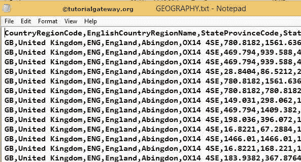

将 SSIS 批量插入任务从工具箱拖放到控制流区域

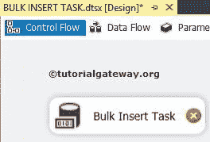

双击批量插入任务来配置源和目标连接字符串。在常规选项卡中，我们可以更改名称和描述

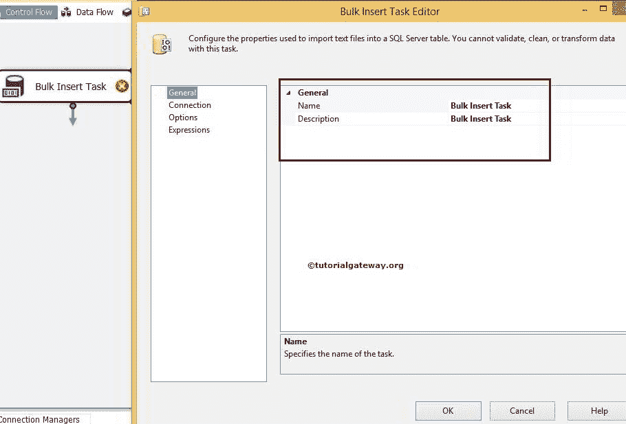

现在单击连接选项卡来设置源和目标连接。首先，我们必须配置源连接，因此选择文件选项

注意:我们必须提供访问本地或远程文本文件的凭据。

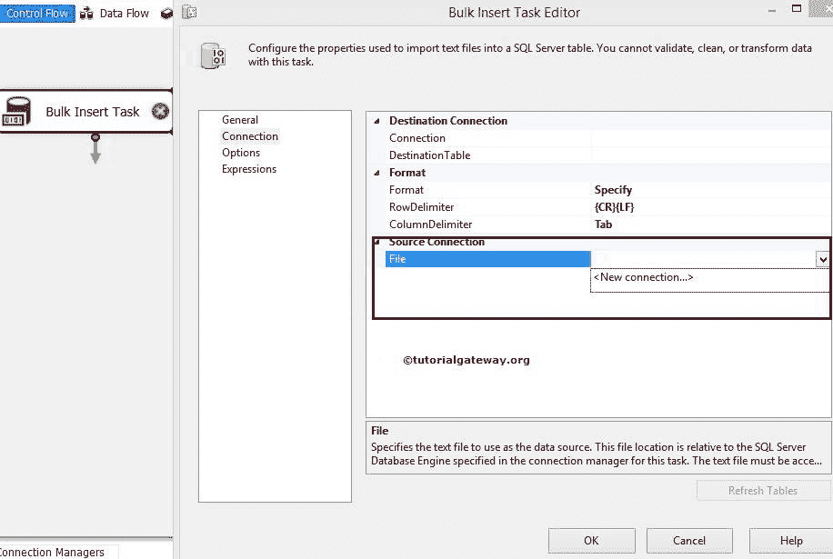

通过点击新建连接，我们可以选择我们想要使用的源文本文件。单击浏览按钮选择文本文件。这里我们选择了大小为 92，562 KB 的地理文本文件。

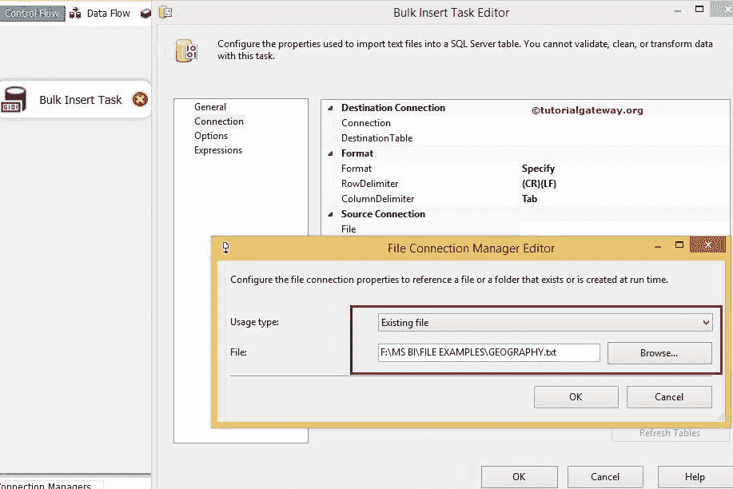

单击“确定”完成 SSIS 批量插入任务源配置

行分隔符属性选项将是{CR}{LF}(回车)。并且列分隔符属性将设置为逗号{'}，就像在我们的平面文件中一样，列由逗号分隔。

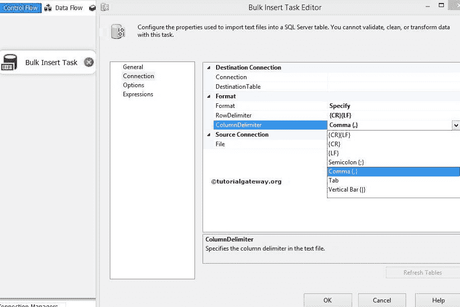

现在让我们通过点击<new connection="">来配置目的地连接。连接意味着选择 SQL server 数据库名称。这里我们选择 SSIS 教程数据库作为目标数据库。</new>

现在，通过从列表中选择 SSIS 批量插入任务目标表来配置它。这里我们选择地理表作为目标表

提示:目标表应该在 SQL 服务器中预先设计。

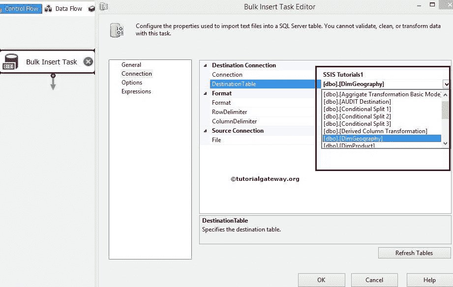

注意:SSIS 的大容量插入任务不会记录导致错误的行。如果要将不良记录写入错误文件或表，最好使用数据流任务。

点击【选项】

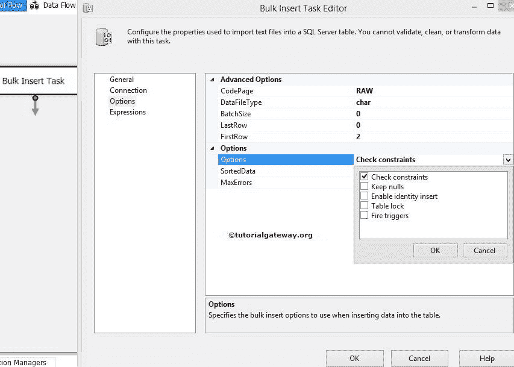

我们已经解释了每个选项的属性。目前，我们保留默认设置，但对于第一行，我们将值更改为 2。因为您可以观察到数据，我们在第一行有列名。

点击【确定】完成 SSIS 批量插入任务配置，运行

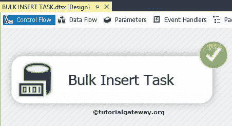

包

让我们打开 [SQL Server](https://www.tutorialgateway.org/sql/) 管理工作室，编写下面的 T-SQL 命令并检查结果

```
SELECT [CountryRegionCode] AS [Country Code]
      ,[EnglishCountryRegionName] AS [Country]
      ,[StateProvinceCode] AS [State Code]
      ,[StateProvinceName] AS [State]
      ,[City]
      ,[PostalCode]
      ,[UnitPrice]
      ,[ExtendedAmount] AS [ExtAmount]
      ,[ProductStandardCost] AS [StandardCost]
      ,[TotalProductCost] AS [ProductCost]
      ,[SalesAmount] AS [Sales]
      ,[TaxAmt]
  FROM [SSIS Tutorials].[dbo].[DimGeography]
```

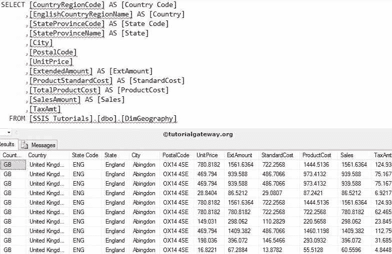

### SSIS 批量插入任务中需要记住的要点

*   SSIS 的批量插入任务只能将数据从文本文件传输到 [SQL Server 表](https://www.tutorialgateway.org/sql-create-table/)或 SQL Server [视图](https://www.tutorialgateway.org/views-in-sql-server/)中。
*   批量插入任务支持平面文件连接管理器选择文本文件。
*   SSIS 的批量插入任务只支持目标数据库在 SSIS 的 [OLE DB 连接管理器](https://www.tutorialgateway.org/ole-db-connection-manager-in-ssis/)。
*   在大容量插入任务中使用目标表之前，它必须存在
*   如果您的列名位于文本文件的第一行，请不要忘记将“第一行”选项更改为 2。
*   设置批量大小以插入大量数据始终是一种好的做法。