# SSIS 的数据分析任务

> 原文：<https://www.tutorialgateway.org/data-profiling-task-in-ssis/>

SSIS 的数据概要分析任务用于计算各种概要文件，帮助我们熟悉数据源并识别数据中需要修复的问题(如果有)。这里，我们通过示例向您展示如何使用 SSIS 的数据分析任务来分析源数据。

SSIS 的数据分析任务只能处理 SQL Server 中的数据。SSIS 数据分析任务不支持文件系统中的数据或第三方数据。

## SSIS 的数据分析任务示例

将 SSIS 数据分析任务拖放到控制流区域，如下图所示

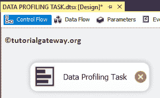

双击它将打开 SSIS 数据分析任务编辑器进行配置。

*   超时(秒):请以秒为单位指定连接超时。如果连接时间超过此时间，连接将失败。
*   覆盖定义:这个 [SSIS](https://www.tutorialgateway.org/ssis/) 数据分析任务属性有两个选项:真和假。如果我们将此属性设置为 true，文件系统任务将覆盖目标路径中的现有文件。
*   打开概要文件查看器:此按钮显示运行集成服务包后的概要文件数据。

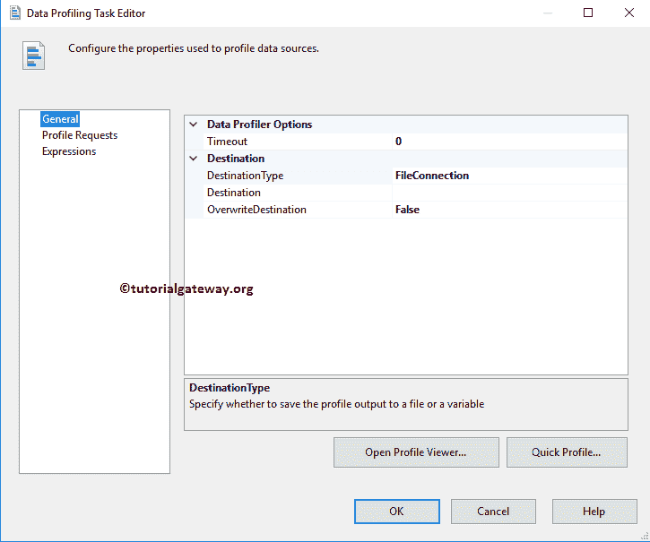

目标类型:这个 SSIS 数据分析任务属性有两个选项:文件连接和变量。如果我们将此变量设置为 true，目标数据存储在变量中如果我们设置为文件连接，请使用文件连接管理器手动选择目标文件。

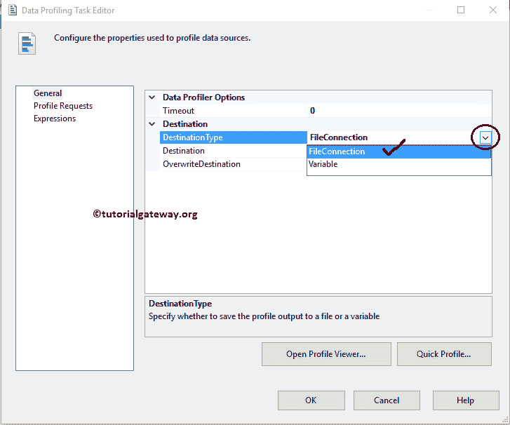

当您将目标类型设置为文件连接时，我们必须使用目标属性配置目标连接。如果已经创建了[文件连接管理器](https://www.tutorialgateway.org/file-connection-manager-in-ssis/)，可以从下拉列表中选择。

如果您之前没有创建任何连接管理器，您必须通过选择<new connection..="">来创建。</new>

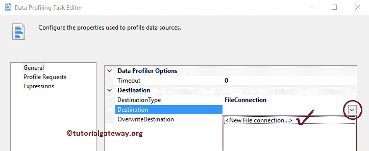

单击<new connection..="">选项后，将打开文件连接管理器编辑器来配置目标连接。</new>

如果您有任何现有文件，请从“使用类型”中选择“现有文件”选项。否则，选择创建文件选项，然后单击浏览按钮从文件系统中选择现有文件或创建新文件。

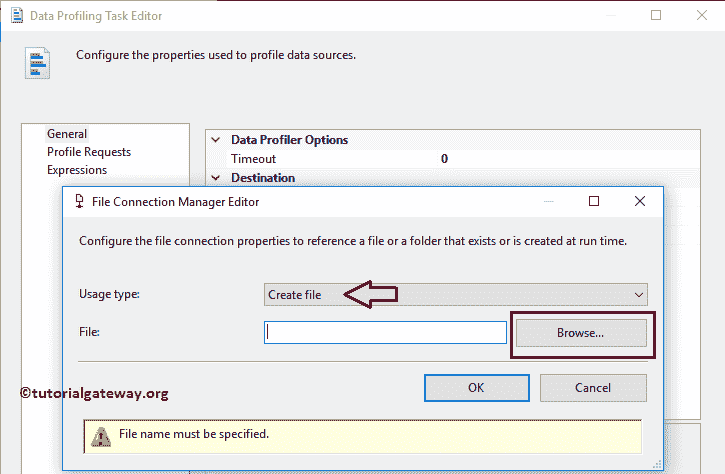

从上面的截图可以看到，我们在目标文件夹

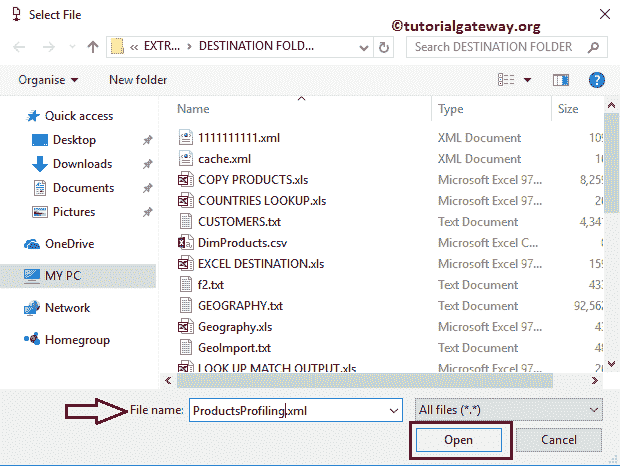

中创建了 ProductsProfiling.xml 文件

单击确定完成源连接的配置。如有理解困难，请参考[文件连接管理器](https://www.tutorialgateway.org/file-connection-manager-in-ssis/)一文。

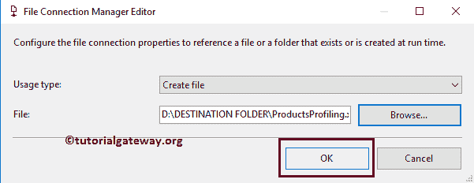

SSIS 的数据分析任务计算八种不同的数据分析。下表将显示 SSIS 数据分析任务中可用的列表。

| SSIS 的数据分析任务 | 描述 |
| 候选人关键资料 | 此 SSIS 数据分析任务将报告一列或一组列是近似的键，还是所选数据的键。识别数据中的问题(如键列中的重复数据)很有帮助。 |
| 列长分布 | 它报告我们所选列中可用的所有不同的字符串长度，以及表示相同长度的行的百分比。识别列数据是否有效是有益的。例如，如果我们选择英国的邮政编码，那么它应该是长度为 6 的字母和数字的组合，并发现大于 2 的值 |
| 列空比率 | 此 SSIS 数据分析任务配置文件将在一列中报告空值的百分比。有助于检查哪个列包含最高的空值(分析数据) |
| 列模式 | 这将报告一组正则表达式，覆盖字符串列中指定百分比的值。 |
| 列统计 | 此 SSIS 数据分析任务配置文件报告统计信息，如每个数值列的最小值、最大值、平均值和标准偏差，以及日期时间列的最小值和最大值。用于检查日期列是否包含正确的数据。 |
| 列值分布 | 报告所选列中所有可用的不同值以及每个值所代表的行的百分比。识别列数据是否有效至关重要。例如，如果您的列应该存储美国的州，并且您发现超过 50 个州，则您的数据是不正确的。 |
| 函数相关性 | 报告从属列中的值在多大程度上取决于决定列中的值(可能是一列或一组列)。便于识别列数据是否有效。例如，如果分析包含印度邮政编码的列和包含印度各州的列之间的相关性。如果您的依赖为同一个邮政编码找到多个州，那么您的数据无效。 |
| 价值包含 | 此 SSIS 数据分析任务配置文件将计算两列或两组列之间的重叠值。识别该列是否适合作为两列之间的外键。 |

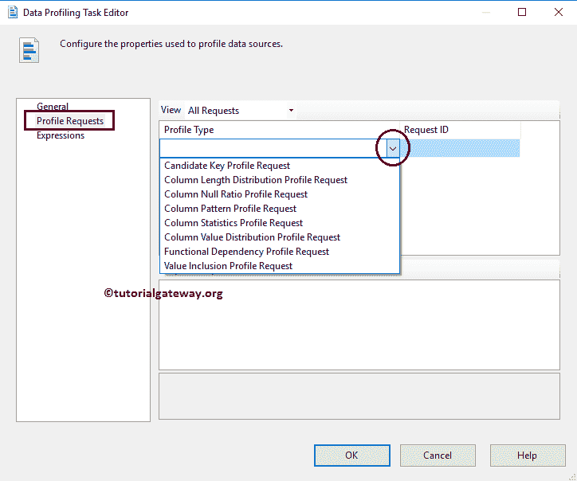

请转到 SSIS 数据分析任务常规选项卡，然后单击快速分析按钮创建新的数据分析任务。

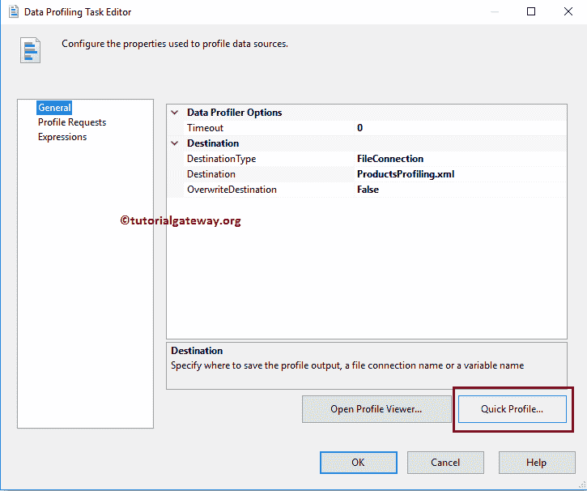

单击“快速配置文件”按钮后，将打开一个名为“单表快速配置文件表单”的新窗口。

单击新按钮打开另一个名为“连接管理器”的窗口，选择提供程序、服务器名称和数据库名称。如果我们在此之前创建了任何连接管理器，请从下拉列表中选择它。

在这里，我们选择已经创建的 ADO.NET 连接。如果您发现理解这些步骤有任何困难，请参考 SSIS 教程中的[ADO.NET 连接管理器。](https://www.tutorialgateway.org/ado-net-connection-manager-in-ssis/)

[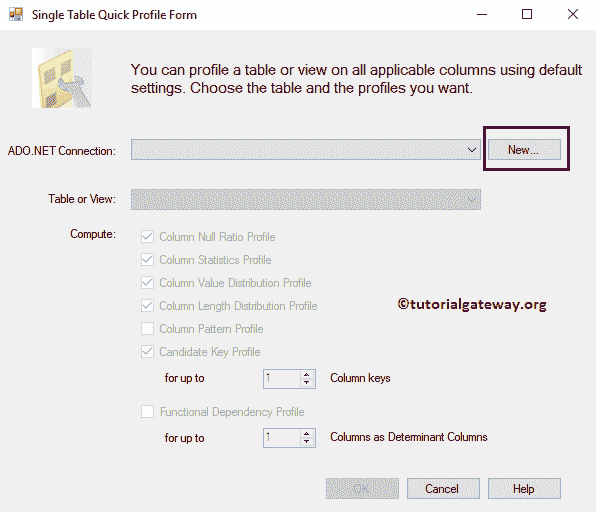](https://www.tutorialgateway.org/ado-net-connection-manager-in-ssis/)

这里，我们选择的是 [SQL](https://www.tutorialgateway.org/sql/) DimProduct 表。

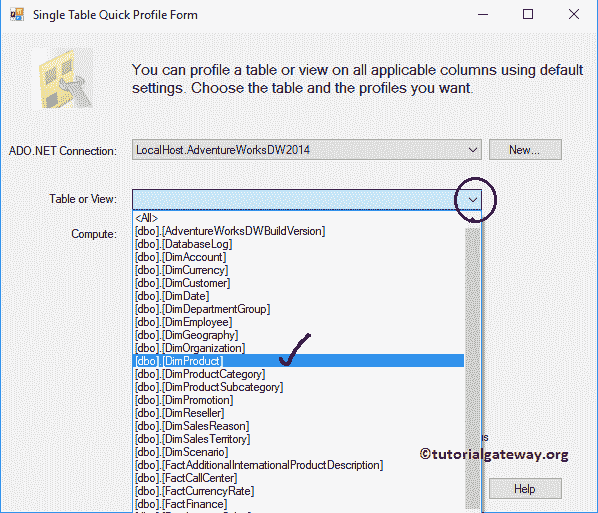

从上面的截图中，您可以观察到我们使用本地主机 windows 帐户作为服务器名称，使用[AdventureWorksDW2014]作为数据库名称。

注意:实时情况下，您必须选择“使用 SQL Server 身份验证”选项，并提供管理员提供的有效凭据。

这里，我们选择所有可用选项

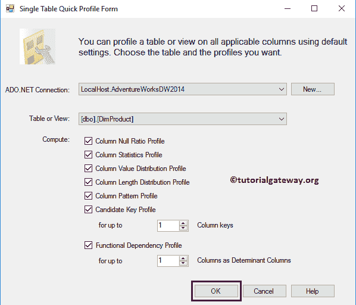

单击确定按钮后，SSIS 数据分析任务编辑器将导航至分析请求选项卡

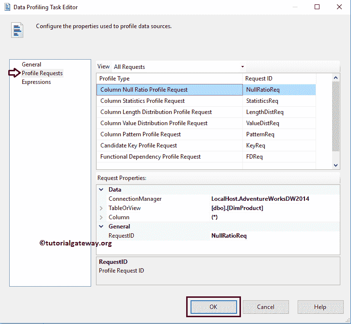

单击“确定”完成在 SSIS 编辑器中配置和关闭数据分析任务。让我们运行包，看看。

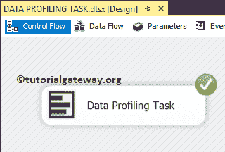

从上面的截图中可以看到，我们的 SSIS 数据分析任务包执行成功。要查看生成的 SSIS 数据分析任务，我们需要数据分析查看器。

请使用搜索栏并键入数据配置文件查看器或导航到 C:\ ProgramData \ Microsoft \ Windows \开始菜单\程序\ Microsoft SQL Server 2014 \集成服务，双击它将打开以下窗口。

要查看此内容，请单击打开文件夹并选择由 SSIS 的数据分析任务生成的 XML 文件。

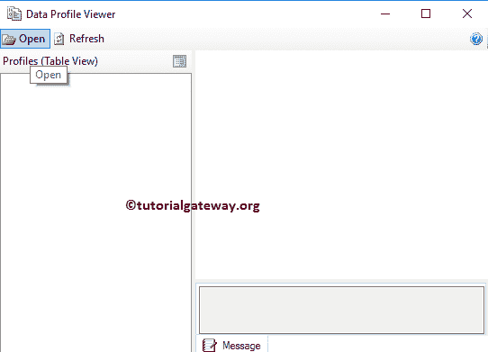

从下面的屏幕截图中，可以看到我们在配置 SSIS 数据分析任务包时选择的配置文件列表。

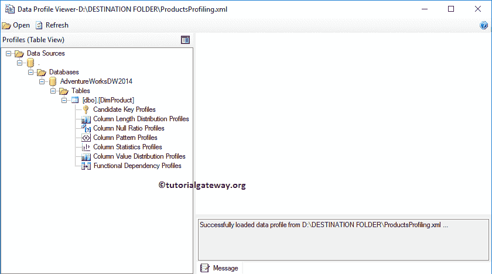

候选键配置文件:这将报告一列或一组列是近似键，还是所选数据的键。在我们选择的表中，产品键是键列。它的关键力量是 100%，这意味着数据是有效的。

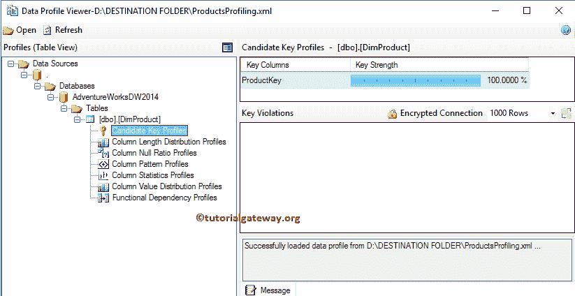

列长度分布配置文件:此 SSIS 数据分析任务报告有两个部分:

*   列长度分布配置文件:在此部分，报告将显示所选表中每列的最小和最大长度。
*   长度分布:这将报告我们所选列中可用的所有不同的字符串长度，以及表示相同长度的行的百分比。

这里，我们选择了阿拉伯语描述栏。你可以看到它有 17，18，19 的不同长度。、和 19、22 长度的百分比最高。这意味着在传输数据时，我们可以将目标字符串长度指定为 25(而不是给出 255)。

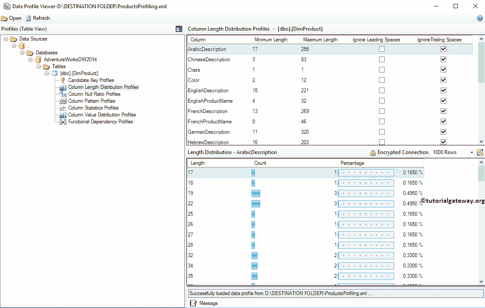

列空比率配置文件:这将报告列中空值的百分比。从下图中，可以看到结束日期的空值百分比最高，颜色、生产日期、英法产品名称、产品密钥、产品备用密钥、照片和成品标志没有空值。

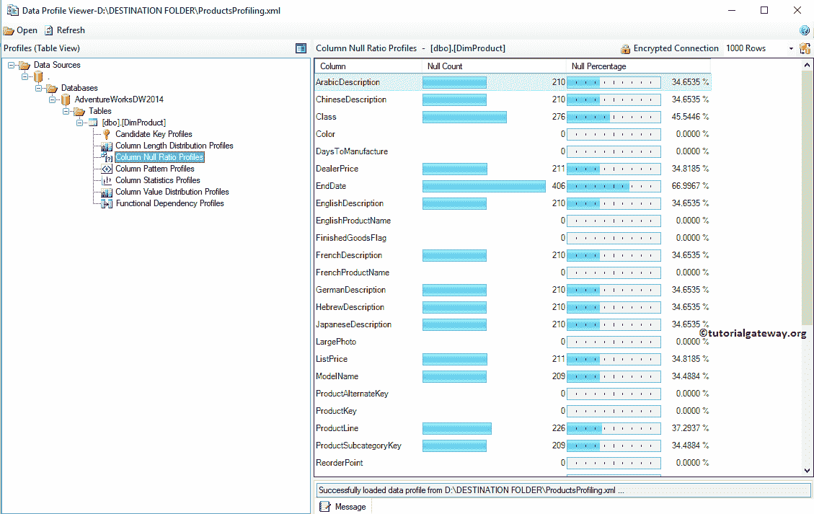

列统计概要:这将报告统计数据，例如每个数值列的最小值、最大值、平均值和标准偏差，以及日期时间列

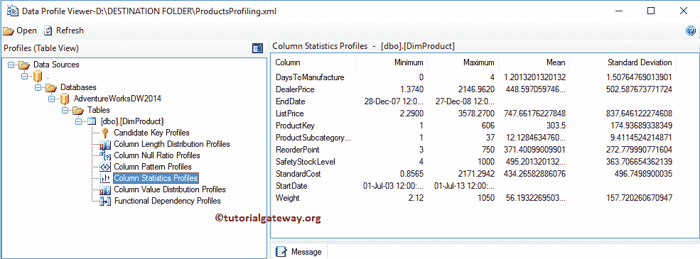

的最小值和最大值

列值分布配置文件:此 SSIS 数据分析任务报告有两个部分:

*   列值分布配置文件:在本节中，报告将显示所选表中每一列中可用的不同值的数量。
*   频繁值分布:此 SSIS 数据分析任务选项将报告我们所选列中所有可用的不同值，以及代表相同值的行的百分比。

从下面的截图中，您可以看到我们选择了颜色列，它有 10 个不同的值。这里 NA 行的百分比最高，其次是 Black 等。

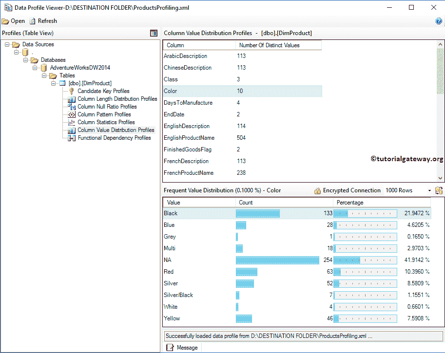

函数依赖:这将报告依赖列中的值依赖于决定列(可能是一列或一组列)中的值的程度。

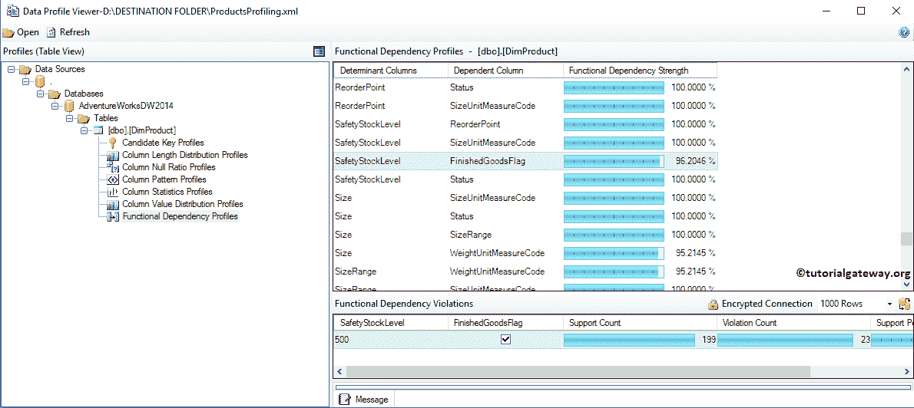