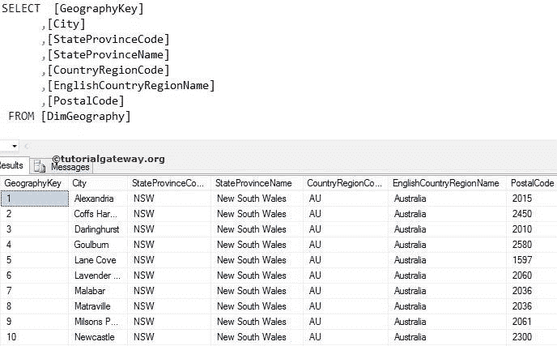
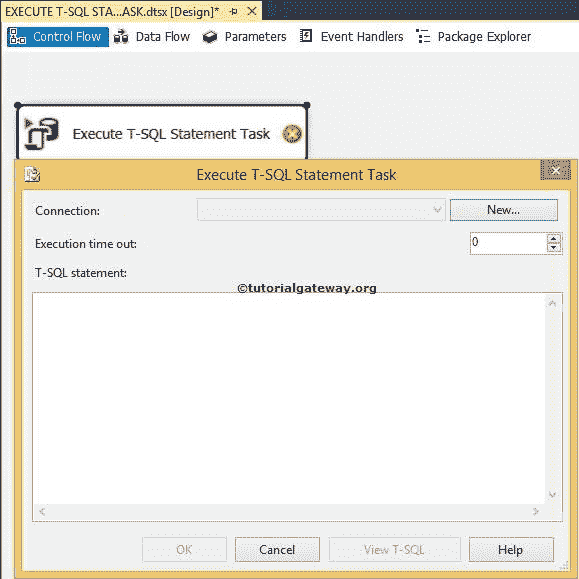
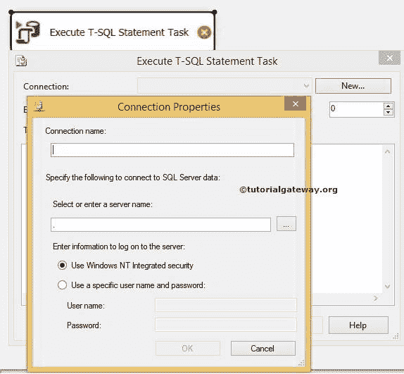
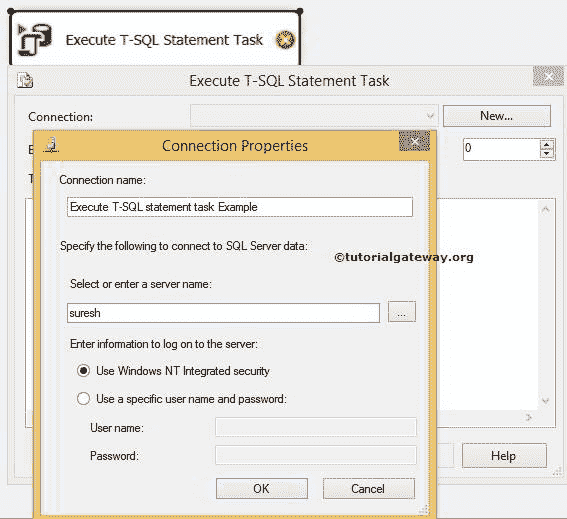
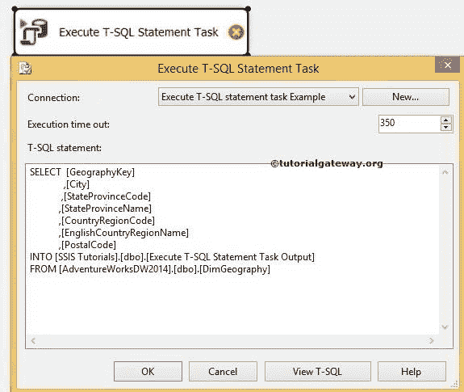
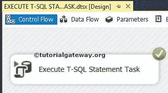
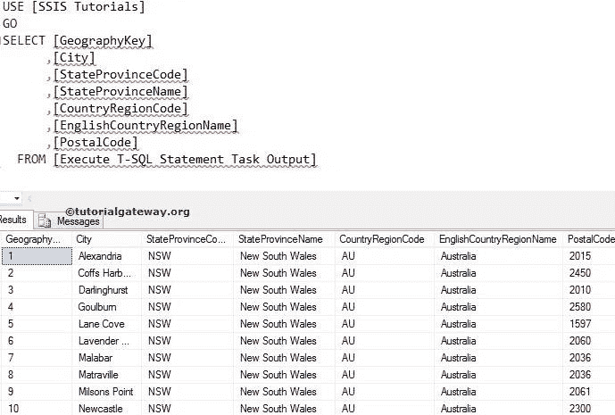

# 在 SSIS 执行语句任务

> 原文：<https://www.tutorialgateway.org/execute-t-sql-statement-task-in-ssis/>

SSIS 的执行语句任务仅用于运行语句。在本文中，我们将创建新表，并将以下数据发送到新创建的表中。



## 在 SSIS 执行语句任务

在这个例子中，我们将解释 SSIS 的执行语句任务的功能。在本演示中，我们将创建新表，并将以下数据发送到新创建的表中。

首先，将 [SSIS](https://www.tutorialgateway.org/ssis/) 工具箱中的执行 T-SQL 语句任务拖放到

T3

控制流区域

双击该任务将打开 SSIS 执行语句任务编辑器对其进行配置

*   连接:请指定服务器实例名称和凭据以登录到 SQL Server 数据库。
*   执行超时:在这里，您可以限制 T-SQL 查询的执行时间。如果查询超过此时间，则任务失败。
*   语句:写你想执行的语句。



如果您已经创建了连接，请选择它。否则，点击新建按钮指定连接属性



以下是执行语句任务的连接属性

连接名称:请为此连接提供唯一的名称。在本例中，我们将其更改为执行 T-SQL 语句任务示例

选择或输入服务器名称:通过单击您选择的…按钮，或者如果您知道您的服务器名称，请在文本框中键入它。

输入登录服务器的信息:指定如何连接 [SQL Server](https://www.tutorialgateway.org/sql/)

*   使用 Windows 集成安全性:如果选择此选项，它将使用 Windows 身份验证来连接 Microsoft SQL Server。
*   使用特定的用户名和密码:如果选择此选项，它将使用 SQL Server 身份验证来连接 Microsoft SQL Server。请提供用户名和密码以连接到服务器实例



从上面的截图中，您可以观察到我们正在使用 windows 安全连接到我们的服务器。

单击“确定”完成连接属性并编写以下语句

```
SELECT  [GeographyKey]
       ,[City]
       ,[StateProvinceCode]
       ,[StateProvinceName]
       ,[CountryRegionCode]
       ,[EnglishCountryRegionName]
       ,[PostalCode]
INTO [SSIS Tutorials].[dbo].[Execute T-SQL Statement Task Output]
FROM [AdventureWorksDW2014].[dbo].[DimGeography]
```

[SELECT 进入语句](https://www.tutorialgateway.org/sql-select-into-statement/)将创建一个新表，然后插入 SELECT 语句中的行。在本例中，我们在【SSIS 教程】数据库中创建新表，表名为【执行 T-SQL 语句任务输出】



单击“确定”完成配置执行语句任务。让我们运行一下，看看它是否在执行 T-SQL 语句



打开 [SQL Server](https://www.tutorialgateway.org/sql/) 管理工作室，查看结果



我们在 SSIS 使用执行语句任务成功地将选定的行插入到一个新表中。