# SSIS 的执行 SQL 任务

> 原文：<https://www.tutorialgateway.org/execute-sql-task-in-ssis/>

SSIS 的执行 SQL 任务用于运行 SSIS 包中的 SQL 查询(语句)或存储过程。您可以使用这个 SSIS 执行 SQL 任务来编写单个或多个可以顺序运行的 SQL 语句。

我们可以将此 SSIS 执行 SQL 任务用于以下目的:

*   创建、更改和删除[表](https://www.tutorialgateway.org/sql-create-table/)和[视图](https://www.tutorialgateway.org/views-in-sql-server/)。
*   在开始向表中插入数据之前，我们可以使用这个任务来截断表或视图
*   在将数据加载到维度表和事实数据表之前，重新创建维度表和事实数据表。
*   运行存储过程。
*   将结果集保存在变量中，以便我们可以在其他任务中使用该数据。

## 在 SSIS 属性中执行 SQL 任务

在本文中，我们将通过一个示例向您展示在 SSIS 配置执行 SQL 任务所涉及的步骤。首先，将 SSIS 工具栏中的执行 SQL 任务拖放到控制流区域

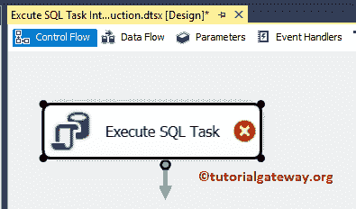

双击它将打开 SSIS 执行 SQL 任务编辑器来配置它。

### SSIS 执行 SQL 任务常规选项卡

此选项卡用于配置 SSIS 执行 SQL 任务属性。

*   名称:请提供唯一的名称
*   描述:简要描述 SQL 任务功能。提供有效的描述始终是一种良好的做法。

请实时将任务名称更改为适当的名称，并编写描述来解释任务功能。该描述有助于其他开发人员更好地理解 [SSIS](https://www.tutorialgateway.org/ssis/) 任务。

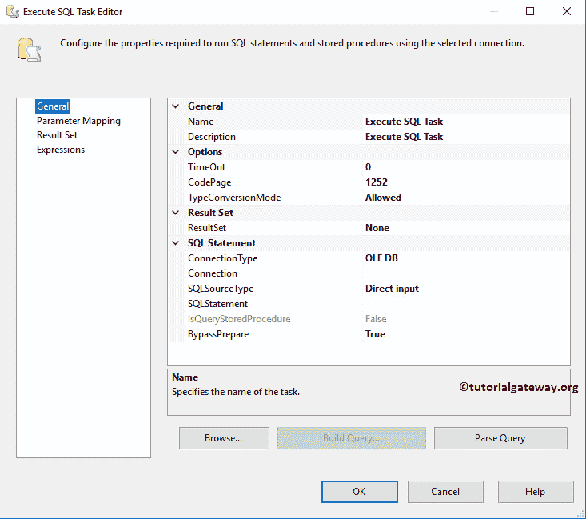

SSIS 执行 SQL 任务选项选项卡

*   超时(秒):请以秒为单位指定连接超时。如果连接花费的时间超过该时间，则连接将失败。默认为 0，表示无限秒。
*   代码页:请指定任务在转换变量中的 Unicode 值时要使用的代码页。默认情况下，它将使用本地计算机代码页。
*   类型转换模式:默认为允许，表示执行 SQL 任务会尝试将查询结果和输出参数转换为变量的数据类型

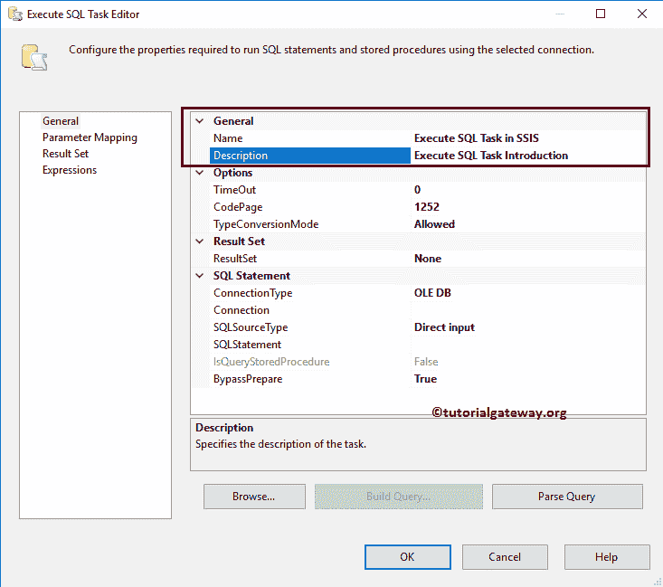

连接类型

请选择您要用于数据源的[连接管理器](https://www.tutorialgateway.org/ssis-connection-managers/)。通过单击向下箭头，您可以看到由 SSIS 的执行 SQL 任务提供的可用连接类型列表。分别是 [OLE DB](https://www.tutorialgateway.org/ole-db-connection-manager-in-ssis/) 、 [EXCEL](https://www.tutorialgateway.org/excel-connection-manager-in-ssis/) 、ODBC、 [ADO](https://www.tutorialgateway.org/ado-connection-manager-in-ssis/) 、[ADO.NET](https://www.tutorialgateway.org/ado-net-connection-manager-in-ssis/)、SQLMOBILE

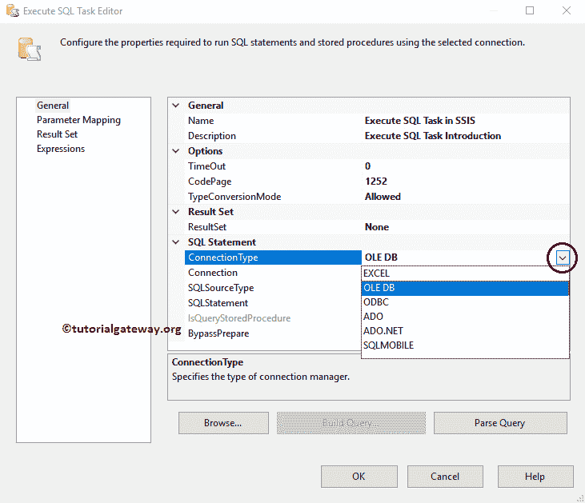

关系

为 SQL 语句配置连接管理器设置。如果您已经创建了连接，则从列表中选择，或者单击<new connection="">创建新连接。</new>

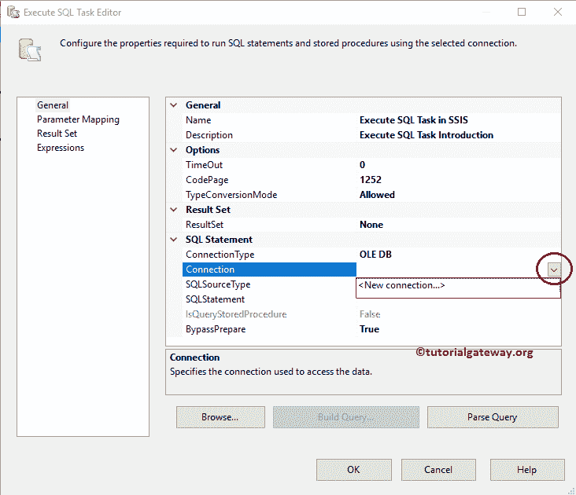

SQL 源类型

请指定您希望如何提供源数据。这个 SSIS 执行 SQL 任务提供了三个选项。

*   直接输入:如果你想直接写一个 SQL 语句，那么选择这个选项。
*   文件连接:如果您的 SQL 查询在文件系统中，请选择此选项
*   变量:如果您的查询在变量中，请选择此选项。

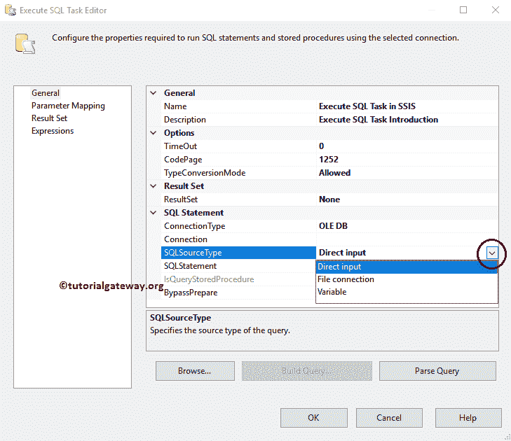

下一个属性完全基于“SQL 源类型”选项。例如，如果我们选择文件系统作为源类型，以下属性将更改为文件连接。我们可以用这个属性来定位选择文件。

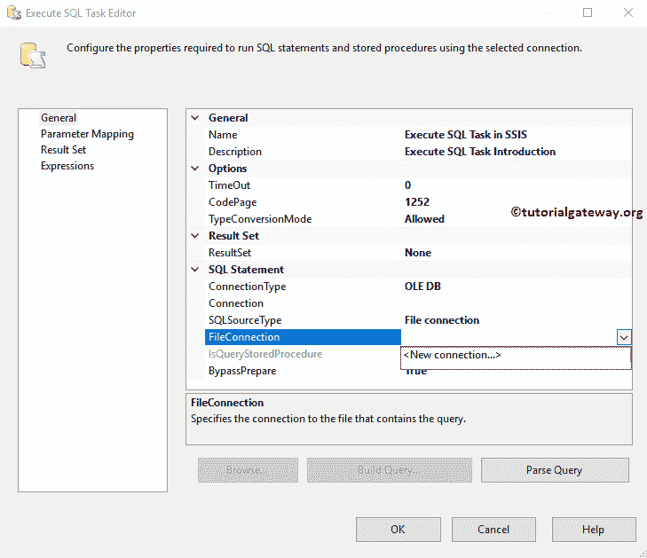

例如，如果我们选择直接输入作为源类型，下一个属性将更改为 [SQL](https://www.tutorialgateway.org/sql/) 语句。我们可以使用这个属性来编写 SQL 语句。为了演示，我们编写了以下查询。

```
SELECT [Id]
      ,[FirstName]
      ,[LastName]
      ,[Education]
      ,[Occupation]
      ,[YearlyIncome]
      ,[Sales]
      ,[HireDate]
FROM [SQL Tutorial].[dbo].[Employee Table]
WHERE [Sales]  > ?
```

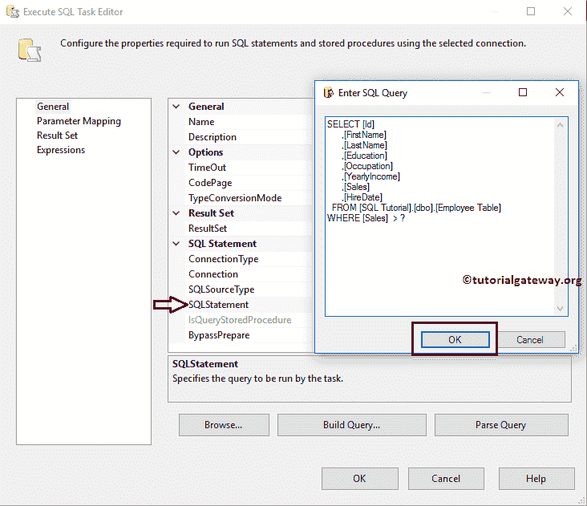

IsQueryStoredProcedure

如果您将连接类型选择为 ADO 或 ADO.NET，则仅启用属性值。如果查询是存储过程，请将属性值更改为“真”。

结果集

这个 SSIS 执行 SQL 任务属性帮助我们配置输出。它有四个属性:

*   无:如果不想返回任何内容，请选择此选项。例如，您正在使用执行 SQL 任务来截断表。那么返回任何值都没有意义。
*   单行:如果希望返回单行作为结果集，则可以使用此选项，例如，表中的记录总数或列数等。
*   完整结果集:如果希望返回多行作为结果集，则可以使用此选项。
*   XML:如果想要返回 XML 文件作为结果集，可以使用这个选项。

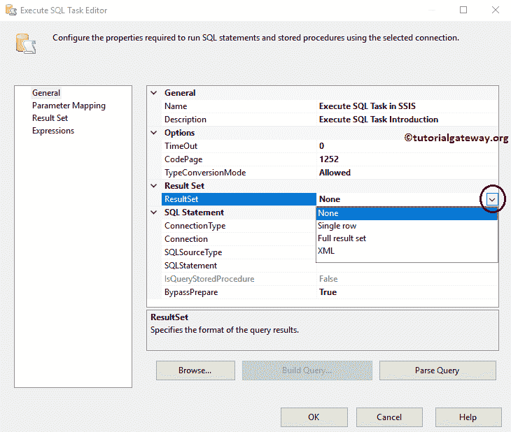

这里是我们配置的 SSIS 执行 SQL 任务

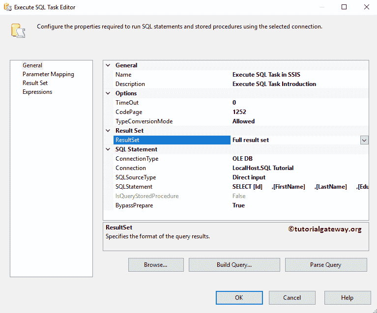

的最终外观

### SSIS 执行 SQL 任务参数映射选项卡

您必须使用这个 SSIS 执行 SQL 任务参数映射选项卡来映射我们在查询中指定的参数。如果查询中没有任何参数，请退出此部分。

如果您观察上面的 SQL 语句，我们将查询指定为 Sales >？。这意味着我们必须把值(或变量)传递给那个问号。因此，请点击添加按钮添加结果集名称。

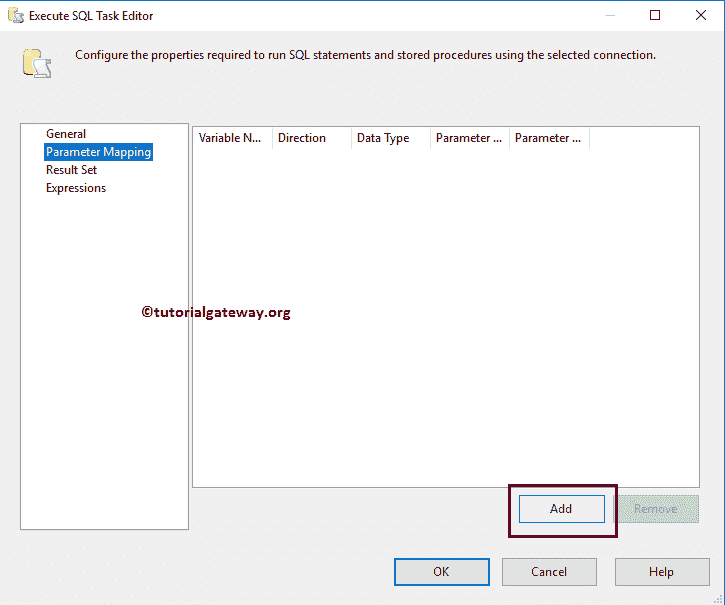

单击添加按钮后，您就可以将变量映射到参数。

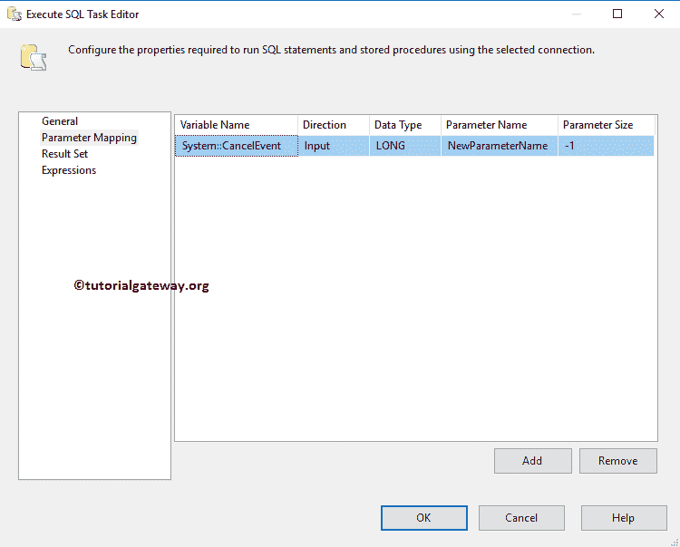

变量名称:此属性显示可用系统变量和用户变量(如果有)的列表，请选择适当的变量。如果您之前没有创建任何变量，请点击如下所示的

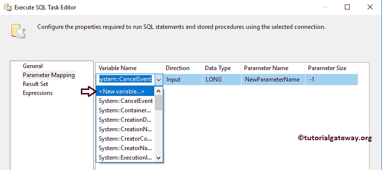

### 执行 SQL 任务结果集选项卡

您必须使用这个 SSIS 执行 SQL 任务结果集选项卡来映射我们从查询中获得的结果。请记住，如果您将结果集属性指定为“无”，则此选项卡将被禁用。

请单击添加按钮添加结果集名称。

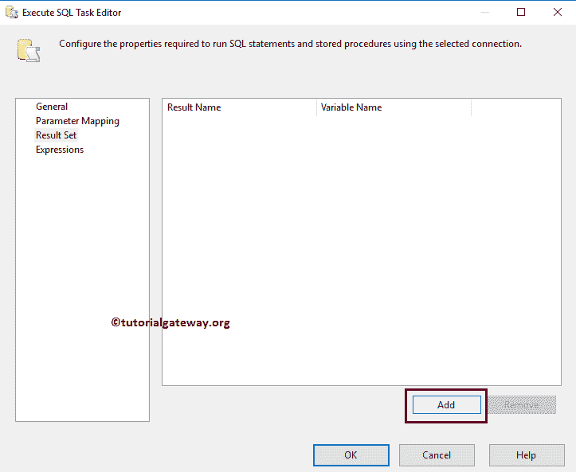

在这里，

*   结果名称:请指定要为结果集分配的有效名称。我建议您使用有意义的名称，因为我们将在后续任务中使用这个名称，该任务是与这个执行 SQL 任务的连接。
*   变量名:该属性显示可用用户变量的列表(如果有)。请选择适当的变量。如果您之前没有创建任何变量，请点击<new variable..="">。</new>

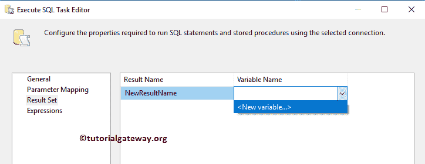

### 执行 SQL 任务表达式选项卡

它被用来写表达式。

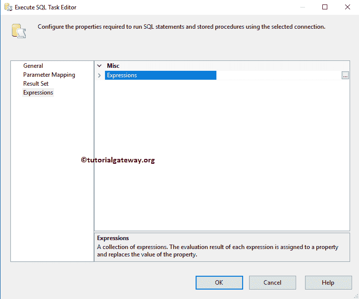