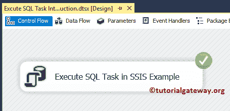

# SSIS 的执行 SQL 任务示例

> 原文：<https://www.tutorialgateway.org/execute-sql-task-in-ssis-example/>

如何使用 SSIS 的执行 SQL 任务截断 SQL 表，并举例说明。它还演示了结果集选项“无”。为此，我们将使用 SQL 教程数据库


中的雇员表

## 在 SSIS 执行 SQL 任务示例

将执行 SQL 任务从 [SSIS](https://www.tutorialgateway.org/ssis/) 工具栏拖放到控制流区域。在这里，我们将任务名称更改为[在 SSIS 执行 SQL 任务](https://www.tutorialgateway.org/execute-sql-task-in-ssis/)示例。


双击它将打开执行 SQL 任务编辑器进行配置。从下面的截图中可以看到，我们更改了描述来演示属性。


在这个例子中，我们使用 [OLE DB 连接管理器](https://www.tutorialgateway.org/ole-db-connection-manager-in-ssis/)来连接源数据。接下来，为 SQL 语句配置连接管理器设置。如果您已经创建了连接，则从列表中选择，或者单击<新连接… >创建新连接。


一旦点击<new connection="">，一个名为配置 OLE DB 连接管理器的新窗口将会打开。如果有任何数据连接，请选择相同的连接。否则，单击新建按钮创建新连接。</new>


这里，我们使用本地主机服务器名称选择 SQL 教程数据库。建议大家参考 [OLE DB 连接管理器](https://www.tutorialgateway.org/ole-db-connection-manager-in-ssis/)了解连接属性。


在这里，我们选择 SQL 源类型作为直接输入。接下来，在“SQL 语句”选项中，单击…按钮


单击…按钮后，将打开一个名为“输入 SQL 查询”的新窗口。这里我们编写[截断表](https://www.tutorialgateway.org/sql-truncate-table/)语句来截断表

在 SSIS 执行 SQL 任务的 SQL 代码示例

```
TRUNCATE TABLE [Employee Table2]
```


点击【确定】关闭【执行 SQL 任务编辑器】


让我们运行一下，看看是否成功截断了 SQL 表。



让我们打开 [SQL Server 管理工作室](https://www.tutorialgateway.org/sql/)，检查表数据是否被截断。

