# 在 SSIS 单个行集中执行 SQL 任务

> 原文：<https://www.tutorialgateway.org/execute-sql-task-in-ssis-single-rowset/>

如何使用 SSIS 的执行 SQL 任务从 SQL 表中返回单个行集(或单行)，并举例说明。它还演示了结果集选项单个行集。对于这个 SSIS 执行 SQL 任务单行集演示，我们将使用 SQL 教程数据库中的雇员表

在我们开始处理 SSIS 单个行集中的执行 SQL 任务之前，让我向您展示我们将在本例中使用的 SQL Server 中的雇员表:

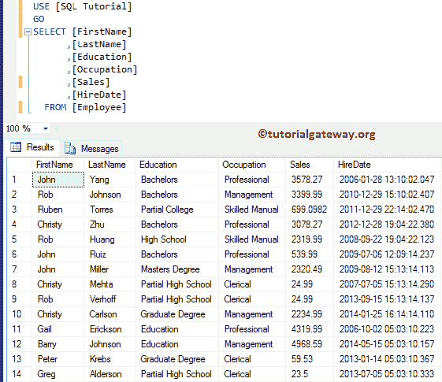

## 在 SSIS 单个行集中执行 SQL 任务

在本例中，我们将使用执行 SQL 任务从 Employee 表中选择第一行，并在消息框中显示返回的单行集。为此，请将执行 SQL 任务从 [SSIS](https://www.tutorialgateway.org/ssis/) 工具箱拖放到设计器空间。

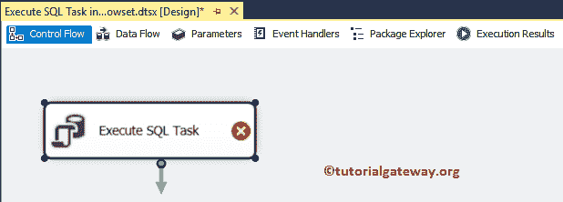

双击它将打开执行 SQL 任务编辑器进行配置。让我选择连接类型为 [OLE DB 连接](https://www.tutorialgateway.org/ole-db-connection-manager-in-ssis/)，连接到 SQL 教程数据库。接下来，我们使用直接输入作为 [SQL](https://www.tutorialgateway.org/sql/) 语句，所以点击。

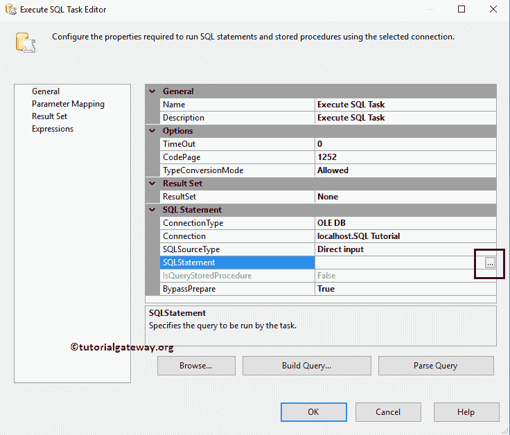

请在这里写下你的自定义 [SQL](https://www.tutorialgateway.org/sql/) 语句。从下面的截图中可以看出，我们正在编写一个带有 [TOP 子句](https://www.tutorialgateway.org/sql-top-clause/)的 [SQL Select 语句](https://www.tutorialgateway.org/sql-select-statement/)来选择表中的第一行。

```
-- Execute SQL Task in SSIS Single Rowset Example
SELECT TOP 1 [FirstName]
      ,[LastName]
      ,[Education]
      ,[Occupation]
      ,[Sales]
      ,[HireDate]
  FROM [Employee]
```

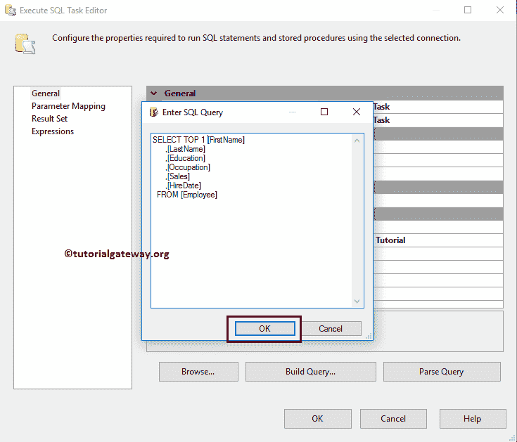

请将结果集从无(默认)更改为单行，因为我们的 select 语句将返回一行。

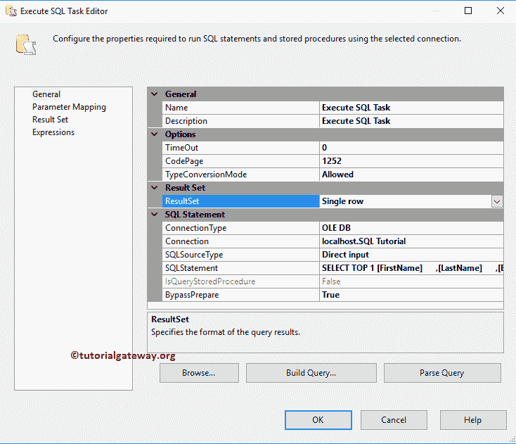

让我们创建保存返回记录所需的变量。首先，关闭执行 SQL 任务编辑器，右击设计将打开上下文菜单。请选择变量选项。

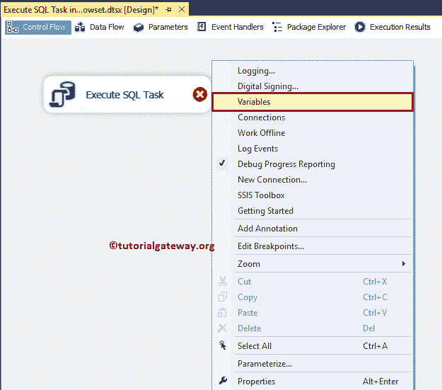

从下面的截图可以看出，我们创建了 7 个变量来保存 select 语句返回的 7 列。

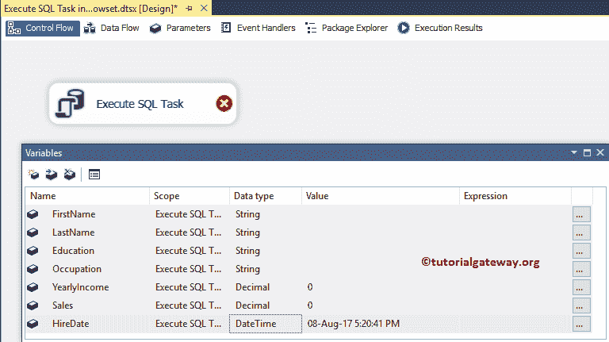

接下来，转到执行 SQL 任务编辑器中的结果集选项卡，并单击添加按钮为返回集分配变量。

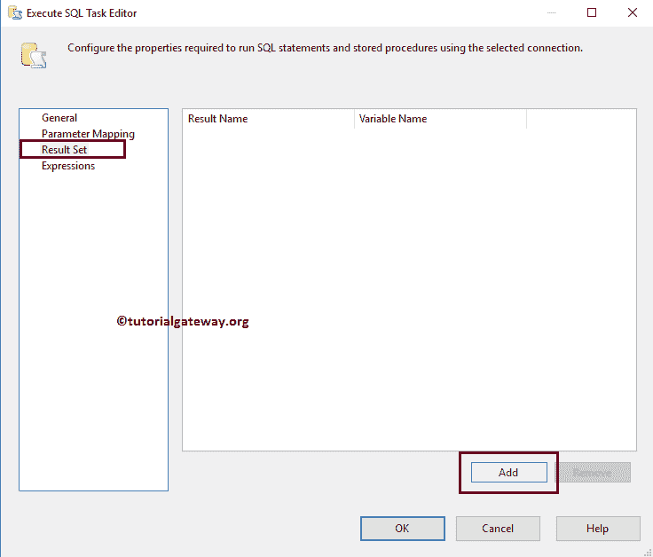

从下面的截图中可以看到，我们将之前创建的变量分配给了 [SQL](https://www.tutorialgateway.org/sql/) 语句返回的所有列。

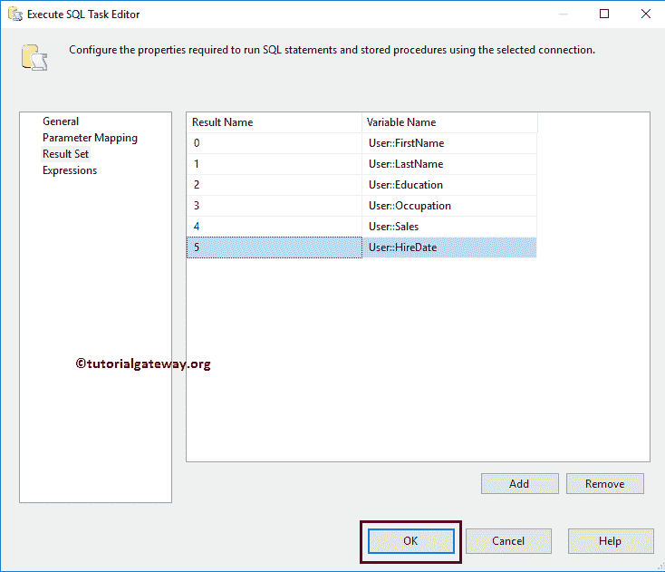

我们已完成配置 SSIS 执行 SQL 任务单个行集。让我在消息框中显示返回的结果。为此，将 [SSIS](https://www.tutorialgateway.org/ssis/) 工具箱中的[脚本任务](https://www.tutorialgateway.org/script-task-in-ssis/)拖放到控制流区域，并将执行 SQL 任务输出添加到[脚本任务](https://www.tutorialgateway.org/script-task-in-ssis/)中。

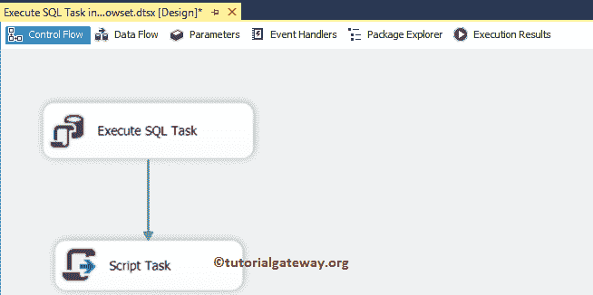

双击脚本任务将打开以下编辑器来配置脚本任务组件。这里我们选择所有用户定义的变量(我们之前创建的变量)作为读写变量。

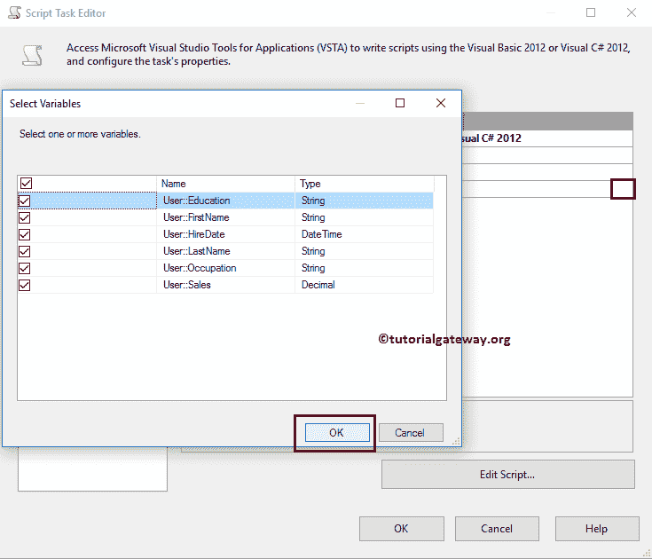

选择所需变量后，请单击编辑脚本..按钮编写实际的 C#或 VB 脚本

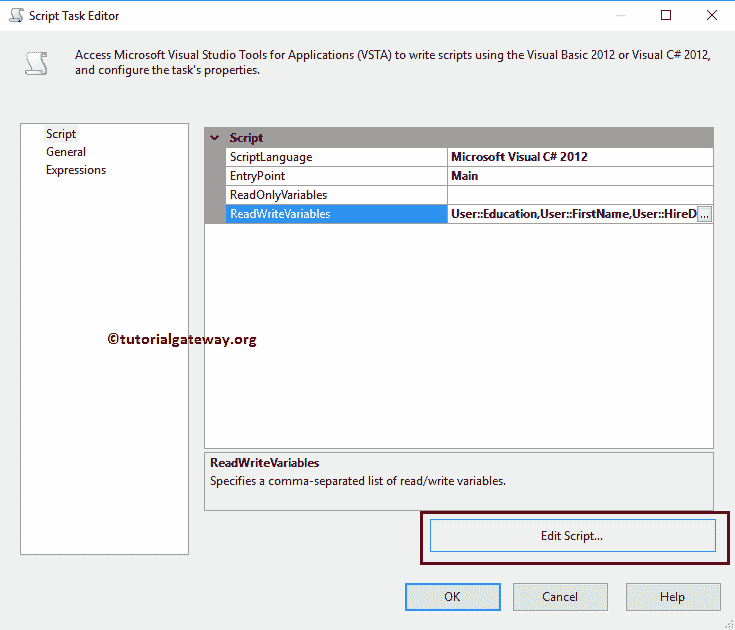

在这里，我们首先声明局部变量来保存我们从 SSIS 包中获得的用户定义变量。接下来，我们将该值与自定义文本(“名称:”等)连接起来

我们在下面截图中使用的 C#代码是:

```
-- Execute SQL Task in SSIS Single Rowset Example
String FullName = "Name: " + Dts.Variables["FirstName"].Value.ToString() + " " + 
                             Dts.Variables["LastName"].Value.ToString();
String Occupation = "Occupation: " + Dts.Variables["Occupation"].Value.ToString();
String Education = "Education: " + Dts.Variables["Education"].Value.ToString();
String Sales = "Sales: " + Dts.Variables["Sales"].Value.ToString();
String HireDate = "HireDate: " + Dts.Variables["HireDate"].Value.ToString();

MessageBox.Show(FullName + Environment.NewLine + Education + Environment.NewLine +
                 Occupation + Environment.NewLine + Sales + Environment.NewLine + HireDate);
```

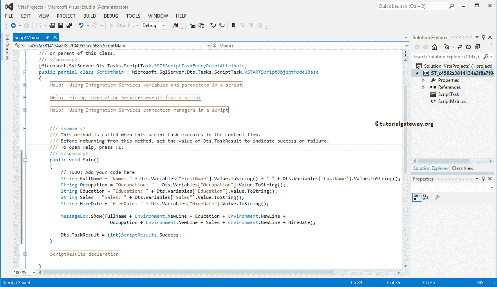

单击“确定”以完成在 SSIS 单个行集中配置执行 SQL 任务。让我们运行包

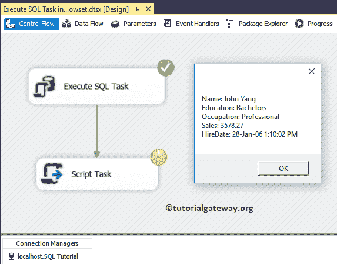

点击消息框上的【确定】按钮，完成

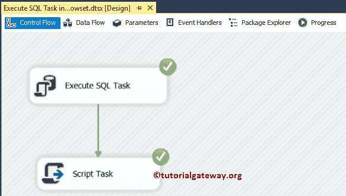

的执行过程