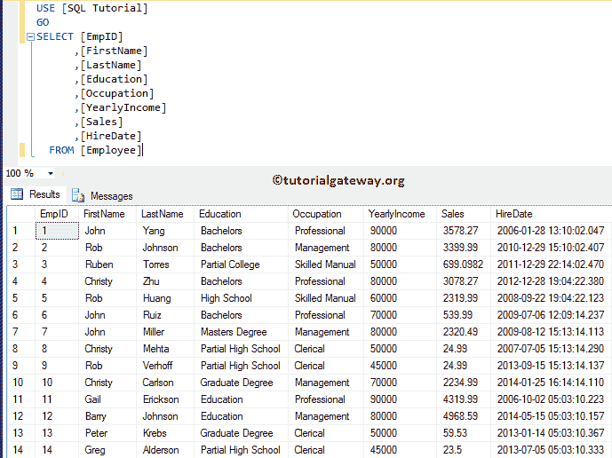
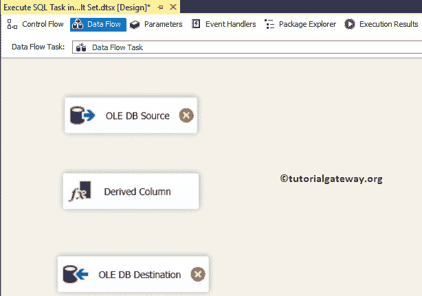

# 在 SSIS 全行集中执行 SQL 任务

> 原文：<https://www.tutorialgateway.org/execute-sql-task-in-ssis-full-row-set/>

如何使用 SSIS 执行 SQL 任务从 SQL 服务器返回完整的行集(或完整的表)，并举例说明。它还将演示结果集选项全行集。为此，我们将使用 SQL 教程数据库中的雇员表

在我们开始描述 SSIS 全行集中的执行 SQL 任务之前，让我向您展示我们在此示例中使用的 SQL Server 雇员表:



## 在 SSIS 全行集中执行 SQL 任务

在本例中，我们将使用 SSIS 执行 SQL 任务全行集选项来选择 Employee 表中的数据，并将返回的结果集保存在另一个表中。为此，请将[【SSIS】](https://www.tutorialgateway.org/ssis/)工具箱中的[执行 SQL 任务](https://www.tutorialgateway.org/execute-sql-task-in-ssis/)拖放到设计器空间。


在我们开始配置执行 SQL 任务之前，让我创建保存返回记录所需的变量。为此，右键单击设计区域将打开上下文菜单。请选择变量选项。


从下面的截图中可以看到，我们创建了 8 个变量。这里，对象类型的 ResultSet 变量将保存返回的结果集，其余七列将在另一个任务中使用。


现在，双击执行 SQL 任务编辑器将打开编辑器进行配置。让我选择连接类型为 [OLE DB 连接](https://www.tutorialgateway.org/ole-db-connection-manager-in-ssis/)，连接到 SQL 教程数据库。接下来，我们使用直接输入作为 [SQL](https://www.tutorialgateway.org/sql/) 语句，因此，单击…按钮来编写定制的 SQL 命令。


请在这里写下你的自定义 [SQL](https://www.tutorialgateway.org/sql/) 语句。从下面的截图可以看出，我们正在编写一个[选择语句](https://www.tutorialgateway.org/sql-select-statement/)来选择员工表中的所有记录。

```
-- SSIS Execute SQL Task Full Row Set Example
SELECT [FirstName]
      ,[LastName]
      ,[Education]
      ,[Occupation]
      ,[YearlyIncome]
      ,[Sales]
      ,[HireDate]
  FROM [Employee]
```


请将 SSIS 执行 SQL 任务结果集属性值从无(默认)更改为完整结果集。


接下来，转到结果集选项卡，单击添加按钮为返回集分配变量。


如前所述， [select 语句](https://www.tutorialgateway.org/sql-select-statement/)将返回一个完整的表。因此，我们将对象变量(结果集变量)指定为结果变量。


到目前为止，我们成功地配置了执行 SQL 任务。但是，我们打算将结果集保存在 SQL 数据库中。为此，我们需要一个针对每个循环的容器。因此，让我将 Foreach 循环容器拖放到控制流区域


双击它将打开 Foreach 循环编辑器进行配置。请自行导航到“集合”选项卡，并选择枚举器作为 Foreach ADO 枚举器。接下来，选择对象变量(结果集)作为 ADO 对象源。我们将为 Foreach ADO 枚举器做一篇单独的文章，所以盲目地遵循这些步骤。


接下来，我们必须映射变量，以便自己导航到变量映射选项卡。


我们的结果集将从雇员表中返回七列。因此，我们将之前创建的用户变量分配给这七列。


单击确定关闭 Foreach 循环容器。接下来，将数据流任务拖放到 Foreach 循环中。


双击数据流任务将打开数据流选项卡。将 OLE DB 源、[派生列转换](https://www.tutorialgateway.org/derived-column-transformation-in-ssis/)和 OLE DB 目标从工具箱拖放到数据流区域



双击 [OLE DB 源](https://www.tutorialgateway.org/ole-db-source-in-ssis/)，从 [SQL Server](https://www.tutorialgateway.org/sql/) 连接到 SQL 教程数据库。接下来，我们选择了 SQL 命令作为数据访问模式，并编写了一个简单的命令。此命令将行号返回为列，其值为 1。


[我们在上面截图中使用的 SQL](https://www.tutorialgateway.org/sql/) 命令是:

```
SELECT 1 AS RowNumber
```

接下来，双击或右键单击派生列转换，根据变量添加新列。首先，让我为名字变量添加一个新列。

从下面的截图可以看出，我们正在使用类型转换函数 DT_STR 将变量值转换为长度为 50 的字符串类型。


也请为剩余变量添加新列。


接下来，双击 [OLE DB 目标](https://www.tutorialgateway.org/ssis-ole-db-destination/)将这些新创建的列保存到 SQL Server 数据库中。


目前，我们正在连接到 SQL 教程数据库。我忘了在 [SQL Server](https://www.tutorialgateway.org/sql/) 中创建一个表，所以，让我单击新建按钮，以便 [OLE DB 目标](https://www.tutorialgateway.org/ssis-ole-db-destination/)编辑器将自动为我创建一个表。


它是由 Ole 数据库生成的表。请记住，我们从这个定义中删除了不需要的行号列。


单击“映射”选项卡，检查源列是否完全映射到目标列。


单击“确定”完成在 SSIS 全行集包中配置“执行 SQL 任务”。让我们运行这个包，看看我们是否使用【执行 SQL 任务】


传输了数据

让我们打开 [SQL Server](https://www.tutorialgateway.org/sql/) 管理工作室查询窗口预览数据。

