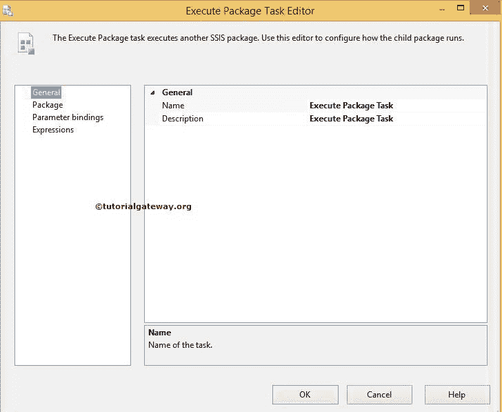

# SSIS 的执行打包任务

> 原文：<https://www.tutorialgateway.org/execute-package-task-in-ssis/>

SSIS 的执行打包任务在 SQL Server 集成服务中最有用，因为它允许我们从工作流中调用其他包。

以下是在 SSIS 使用执行打包任务的一些优点:

*   我们可以将复杂的包分解成多个包。然后，使用执行打包任务，我们可以随时调用它们。例如，不是在单个 SSIS 包中执行 10 次转换。我们可以把单个包裹分成 10 个包裹。然后使用执行打包任务，我们可以调用它们。
*   如果我们将复杂的包分解成多个包，我们可以多次重用它们。这意味着代码可用性。
*   如果我们将复杂的包分解成多个包，维护将变得容易和便宜。
*   如果我们将复杂的包分解成多个包，这有助于我们将工作划分给整个团队，每个人都可以在单个包上工作，模块领导可以通过创建父包来访问所有包。任何调用其他包(子包)作为父包的包。

## 在 SSIS 配置执行打包任务

双击 SSIS 执行打包任务将打开执行打包任务编辑器进行配置。

#### 常规页面

在“常规”页面中，您可以配置执行打包任务的名称和描述。

*   名称:请为执行打包任务提供唯一的名称。
*   描述:请解释一下这个 [SSIS](https://www.tutorialgateway.org/ssis/) 任务在做什么？

#### 包页面

参考类型:SSIS 的执行打包任务允许我们调用存在于同一项目、文件系统和 [SQL Server](https://www.tutorialgateway.org/sql/) 中的包。

*   如果选择“项目引用”的“引用类型”属性，则“执行包”任务允许我们选择包含父包的同一项目中的子包。请参考 [SSIS 执行打包任务项目引用](https://www.tutorialgateway.org/ssis-execute-package-task-project-reference/)文章，了解如何在同一个项目内部调用包。
*   如果选择“外部引用”的“引用类型”属性，“执行包”任务提供两个选项供选择:文件系统和 SQL Server
    *   文件系统:如果我们选择了文件系统，执行打包任务允许我们选择文件系统中的子包。要访问文件，它使用文件连接管理器。调用文件系统中的包请参考[使用 SSIS 执行打包任务](https://www.tutorialgateway.org/execute-packages-in-file-system-using-ssis-execute-package-task/)在文件系统中执行包
    *   如果我们选择了 SQL Server，执行打包任务将允许我们选择存储在我们的 SQL Server 内部的 MSDB 数据库中的子包。SSIS 的“执行包”任务使用 OLE DB 连接管理器来访问 SQL Server 中的包。调用 SQL Server 中的包请参考[使用 SSIS 执行打包任务](https://www.tutorialgateway.org/execute-packages-in-sql-server-using-ssis-execute-package-task/)在 SQL Server 中执行包。

密码:选择子包时，如果包受密码保护(这在实时中很常见)，请提供该子包的密码。

ExecuteOutOfProcess:指定希望子包在同一个进程中运行(与父包一起运行)还是在单独的进程中运行。如果将此选项设置为 False，父包和子包将在同一进程中运行。如果将此选项设置为“真”，父包和子包将在不同的进程中运行。