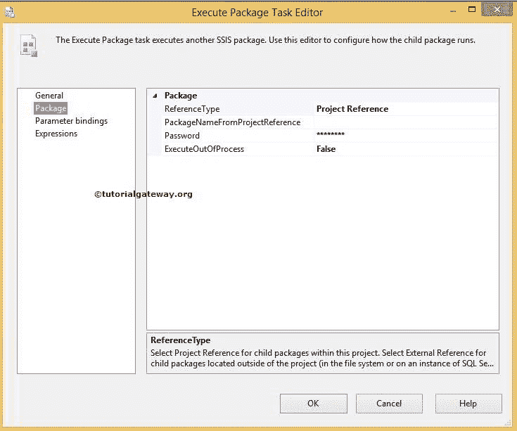
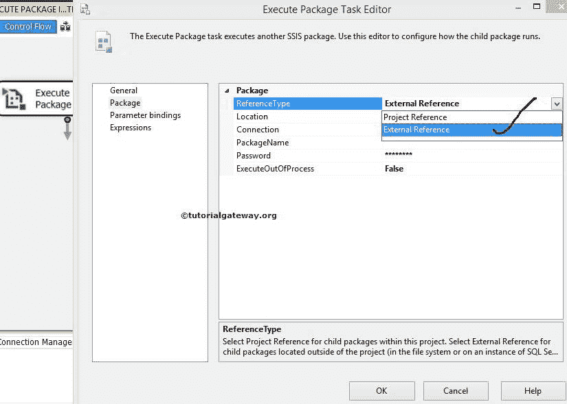
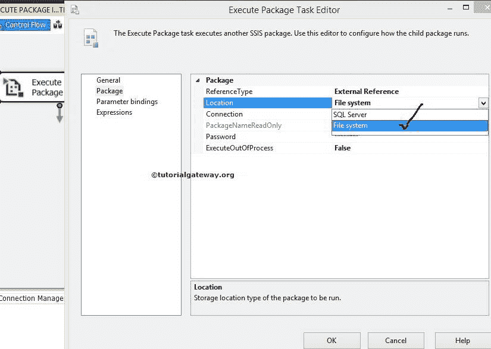

# 使用 SSIS 执行包任务在文件系统中执行包

> 原文：<https://www.tutorialgateway.org/execute-packages-in-file-system-using-ssis-execute-package-task/>

“执行包任务”允许我们调用存在于 SQL Server 或文件系统中的其他包，作为其执行的一部分。在本文中，我们使用 SSIS 执行包任务来执行文件系统中的包。

在本例中，我们将使用执行包任务来执行文件系统中的 SSIS 审计转换包。我们在上一篇文章中已经解释了这个[审计转换](https://www.tutorialgateway.org/audit-transformation-in-ssis/)包

从下面的截图可以看到，[审核目的地]表为空。如果没有，请使用 T-SQL 截断表或添加执行 SQL 任务。

## 使用 SSIS 执行包任务示例在文件系统中执行包

将[执行包任务](https://www.tutorialgateway.org/execute-package-task-in-ssis/)从工具箱拖放到控制流区域。

双击执行包任务来配置包。在常规选项卡中，我们可以更改名称和描述。到目前为止，我们将名称从文件系统更改为执行包任务，并保持描述不变。

点击套餐选项卡配置套餐位置和连接字符串

在这个例子中，我们正在执行文件系统中的包。因此，请将引用类型从项目引用更改为外部引用。调用同一个项目内部的包请参考 [SSIS 执行包任务项目参考](https://www.tutorialgateway.org/ssis-execute-package-task-project-reference/)一文，调用 SQL Server 中的包请参考[使用 SSIS 执行包 Tas](https://www.tutorialgateway.org/execute-packages-in-sql-server-using-ssis-execute-package-task/) k 在 SQL Server 中执行包。

这里让我们选择文件系统作为包源

单击新建连接，从文件系统中配置或选择文件。

一旦点击<new connection="">，将打开文件连接管理器编辑器，在文件系统中配置文件。</new>

从下面的截图可以看到，我们正在从 [SSIS](https://www.tutorialgateway.org/ssis/) 包列表中选择审核转换。

单击确定选择文件。如果审计转换包由密码保护(通常为“是”)，请提供适当的密码。

单击确定完成配置执行包任务。让我们运行包，看看我们是否使用执行包任务成功调用了文件系统中的包。

从上面，您可以观察到我们的执行包任务正在调用审计转换。转换成功后，将执行“执行包任务”。

让我们打开 [SQL Server 管理工作室](https://www.tutorialgateway.org/sql/)查看结果。

