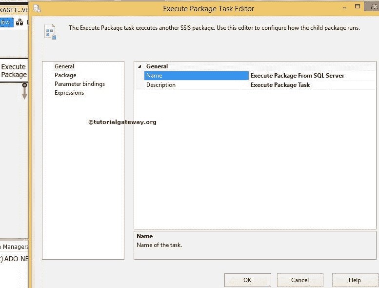

# 使用 SSIS 执行打包任务在 SQL Server 中执行包

> 原文：<https://www.tutorialgateway.org/execute-packages-in-sql-server-using-ssis-execute-package-task/>

[执行打包任务](https://www.tutorialgateway.org/execute-package-task-in-ssis/)允许我们调用存在于 SQL Server、文件系统中的其他包，以及作为其执行的一部分存在于同一项目中的包。在本文中，我们使用 SSIS 执行打包任务来执行存在于 SQL Server 中的包。

在本例中，我们将使用执行打包任务来执行存储在 SQL Server 中的 SSIS 聚合转换包。我们已经在基本模式中解释了这个[聚合转换。所以，请参考。](https://www.tutorialgateway.org/aggregate-transformation-in-ssis/)

从下面的截图中，您可以看到我们已经在 MSDB 数据库中发布了聚合转换。

从下面的截图可以看到，【聚合转换基本模式】表为空。如果没有，请使用 T-SQL 截断表或添加执行 SQL 任务。

## 使用 SSIS 执行打包任务示例在 SQL Server 中执行包

将执行打包任务从工具箱拖放到控制流区域。

双击执行打包任务来配置包。在常规选项卡中，我们可以更改名称和描述。从现在开始，我们把名称从 [SQL Server](https://www.tutorialgateway.org/sql/) 改成了“执行打包任务”。

点击套餐选项卡配置套餐位置和连接字符串

在本例中，我们正在执行位于 SQL Server 中的包，因此，请将引用类型从项目引用更改为外部引用。调用同一个项目内部的包请参考 [SSIS 执行打包任务项目引用](https://www.tutorialgateway.org/ssis-execute-package-task-project-reference/)一文，调用文件系统中的包请参考[使用 SSIS 执行打包任务](https://www.tutorialgateway.org/execute-packages-in-file-system-using-ssis-execute-package-task/)在文件系统中调用包请参考

这里让我们选择 SQL Server 作为包源

单击新建连接以配置或选择服务器设置。如果在此之前已经创建了连接，它将显示列表。您可以选择所需的连接。现在，点击

一旦点击<new connection="">，将打开连接管理器编辑器，选择提供者名称、服务器名称和数据库名称。</new>

单击确定完成选择数据库。现在我们必须选择要执行的包。因此，点击包装名称选项

旁边的浏览按钮(…)

它将打开“选择包”窗口来选择所需的包。从下面的截图中，您可以看到，我们正在从列表中选择 AGGREGATE BASIC。我们现在只有一个包裹。所以它正在显示一个，但实时的，它可能更多。

单击“确定”选择包。如果聚合转换包由密码保护(通常为“是”)，请输入适当的密码。

点击【确定】完成 [SSIS](https://www.tutorialgateway.org/ssis/) 执行打包任务的配置。让我们运行包，看看我们是否使用执行打包任务成功调用了存在于 SQL Server 中的包。

似乎我们的执行打包任务没有抛出任何错误。让我们打开 [SQL Server 管理工作室](https://www.tutorialgateway.org/sql/)查看结果。

我们使用 SSIS 执行打包任务成功地调用了存在于 SQL Server 中的包。