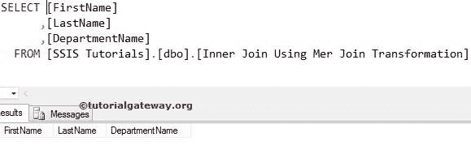
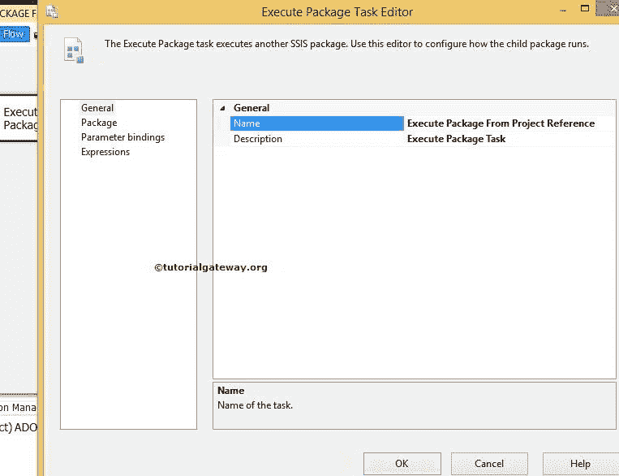
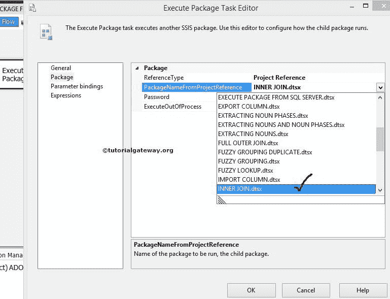
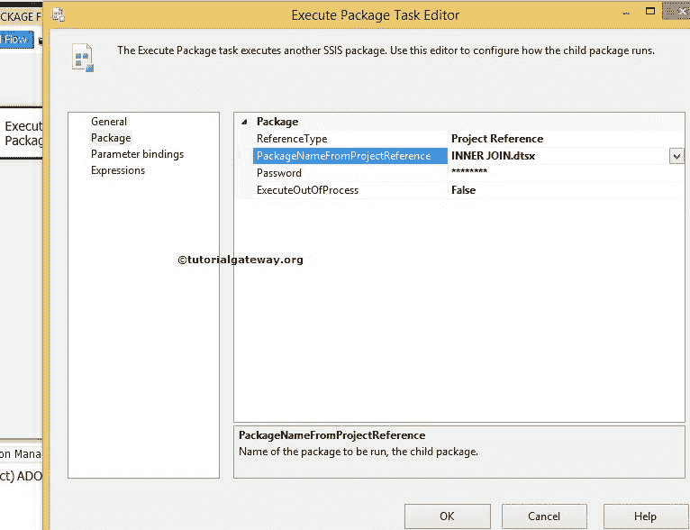
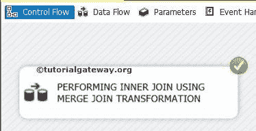
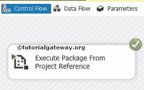
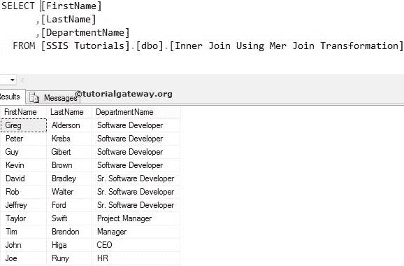

# SSIS 的执行打包任务项目引用

> 原文：<https://www.tutorialgateway.org/ssis-execute-package-task-project-reference/>

在本文中，我们将向您展示如何使用 SSIS 执行打包任务项目引用来执行同一项目中的包。

在这个例子中，我们将使用执行打包任务来执行同一个项目中的内部连接包。我们已经在[使用合并连接转换](https://www.tutorialgateway.org/merge-join-transformation-in-ssis/)执行内部连接的文章中解释了这个包。

从下面的截图可以看到，[使用合并连接转换的内部连接]表为空。如果没有，请使用 T-SQL 截断表或添加执行 SQL 任务。

## SSIS 执行打包任务项目引用

将[执行打包任务](https://www.tutorialgateway.org/execute-package-task-in-ssis/)从工具箱拖放到控制流区域。

双击执行打包任务来配置包。在常规选项卡中，我们可以更改名称和描述。在这个 SSIS 演示中，我们将“项目引用”中的“名称”更改为“执行打包任务”。

点击套餐选项卡配置套餐位置和连接字符串

在这个例子中，我们正在执行同一个项目中的包。因此，请将引用类型保留为项目引用。调用 SQL Server 中的包请参考[使用 SSIS 执行打包任务](https://www.tutorialgateway.org/execute-packages-in-sql-server-using-ssis-execute-package-task/)在 SQL Server 中执行包，调用文件系统中的包请参考[使用 SSIS 执行打包任务](https://www.tutorialgateway.org/execute-packages-in-file-system-using-ssis-execute-package-task/)在文件系统中执行包

现在，我们必须从项目中选择 dtsx 包，因此，选择 PackageNameFromProjectReference 选项。它将向您显示当前项目中所有可用的包。从下面的截图中，您可以看到，我们正在从列表中选择 INNER JOIN 包。

点击它选择包。如果内部连接包有密码保护(通常为“是”)，请提供密码。

单击确定完成配置执行打包任务。让我们运行这个包，看看我们是否使用 [SSIS](https://www.tutorialgateway.org/ssis/) 执行打包任务成功调用了同一个项目中的包。

从上面可以看到，我们的执行打包任务正在调用内部连接包。转换成功后，将执行“执行打包任务”。

似乎我们的执行打包任务没有抛出任何错误。让我们打开 [SQL Server 管理工作室](https://www.tutorialgateway.org/sql/)查看结果。

我们使用 SSIS 执行打包任务项目引用成功地调用了同一项目中的包。