# SSIS 的文件系统任务

> 原文：<https://www.tutorialgateway.org/file-system-task-in-ssis/>

SSIS 的文件系统任务用于对文件和文件夹(或目录)执行不同类型的操作。例如，如果您想将目录内容从一个位置移动到另一个位置，我们可以使用这个 SSIS 文件系统任务。

注意:SSIS 的文件系统任务使用[文件连接管理器](https://www.tutorialgateway.org/file-connection-manager-in-ssis/)来连接文件和文件夹。

## 在 SSIS 配置文件系统任务

将 SSIS 文件系统任务拖放到控制流区域

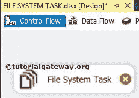

双击它将打开 SSIS 文件系统任务编辑器进行配置。

*   名称:请提供唯一的名称
*   描述:简要描述文件系统任务功能。

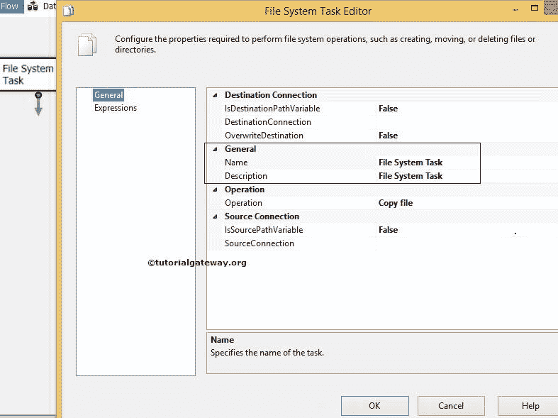

SSIS 的文件系统任务支持对文件和文件夹的十种不同操作。请查看下方 [SSIS](https://www.tutorialgateway.org/ssis/) 截图

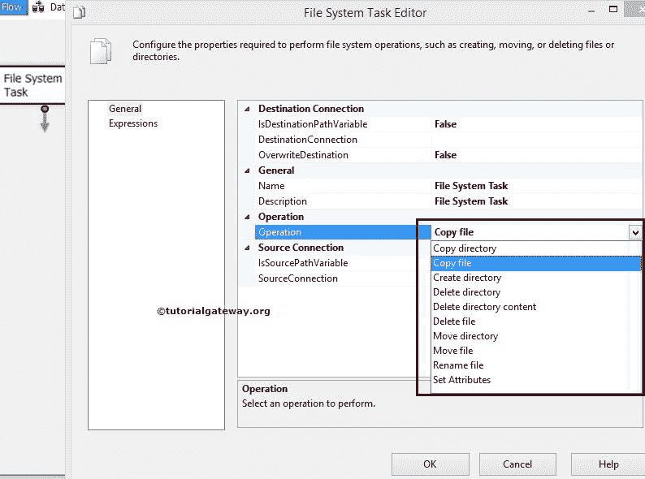T4】中的可用选项

| 操作 | 描述 |
| 复制目录 | 将文件夹从一个位置复制到另一个位置。请参考[使用文件系统任务复制目录](https://www.tutorialgateway.org/copy-directory-using-file-system-task-in-ssis/)一文，了解复制目录涉及的步骤 |
| 复制文件 | 将文件从一个位置复制到另一个位置。请参考[使用文件系统任务复制文件](https://www.tutorialgateway.org/copy-files-using-file-system-task-in-ssis/)一文，了解复制文件涉及的步骤 |
| 创建目录 | 使用这个选项，我们可以在指定的位置创建目录。 |
| 删除目录 | 删除指定位置的选定文件夹。请参考[使用文件系统任务删除目录](https://www.tutorialgateway.org/delete-directory-using-file-system-task-in-ssis/)一文，了解删除目录涉及的步骤 |
| 删除目录内容 | 它会删除选定文件夹中的内容。请参考[使用文件系统任务](https://www.tutorialgateway.org/delete-directory-content-using-file-system-task-in-ssis/)删除目录内容，了解删除目录内容涉及的步骤。 |
| 删除文件 | 删除指定位置的选定文件。请参考[使用文件系统任务](https://www.tutorialgateway.org/delete-file-using-file-system-task-in-ssis/)删除文件，了解删除文件的步骤 |
| 移动目录 | 将文件夹从一个位置移动到另一个位置。请参阅[使用文件系统任务移动目录](https://www.tutorialgateway.org/move-directory-using-file-system-task-in-ssis/)一文，了解移动目录所涉及的步骤 |
| 移动文件 | 它将文件从一个位置移动到另一个位置。请参阅[使用文件系统任务移动文件](https://www.tutorialgateway.org/move-file-using-file-system-task-in-ssis/)一文，了解移动文件涉及的步骤 |
| 重命名文件 | 将文件从一个位置移动到另一个位置，并重命名文件名。请参考[使用文件系统任务](https://www.tutorialgateway.org/rename-file-using-file-system-task-in-ssis/)重命名文件，了解重命名文件涉及的步骤 |
| 设置属性 | 使用此选项，我们可以设置文件和文件夹的属性。该选项包括(隐藏、只读、系统和归档选项)。请参考[使用文件系统任务设置属性](https://www.tutorialgateway.org/setting-attributes-using-file-system-task-in-ssis/)一文，了解设置或更改文件和文件夹属性的步骤。 |

### SSIS 文件系统任务源连接

IsSorcePathVariable:这个属性有两个选项:True 和 False。如果我们将此属性设置为 true，那么源路径将存储在一个变量中。而且，如果我们将此属性设置为 false，我们必须使用文件连接管理器手动选择源路径。

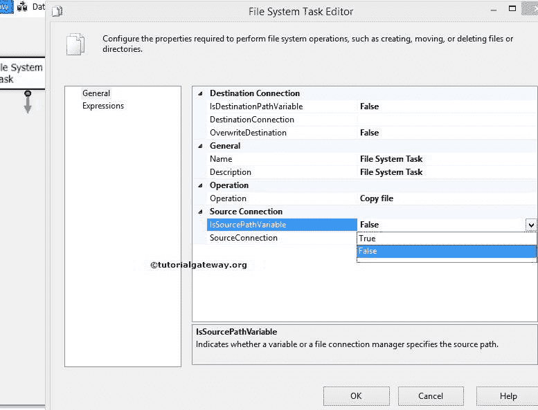

如果我们将 IsSorcePathVariable 设置为 true，就会出现一个名为 SourceVariable 的新属性。

源变量:此 SSIS 文件系统任务属性显示所有可用的系统和用户变量。请选择保存源路径(文件或文件夹路径)的适当变量。如果您之前没有创建任何变量，请点击<new variable..="">。</new>

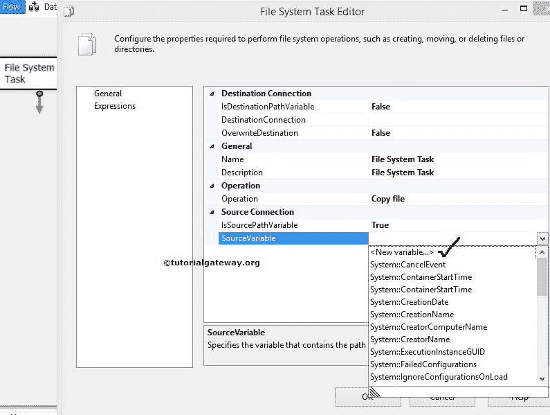

一旦点击<new variable..="">，就会打开一个名为添加变量的新窗口，创建新的变量。在这里，您可以创建保存源路径的新变量。</new>

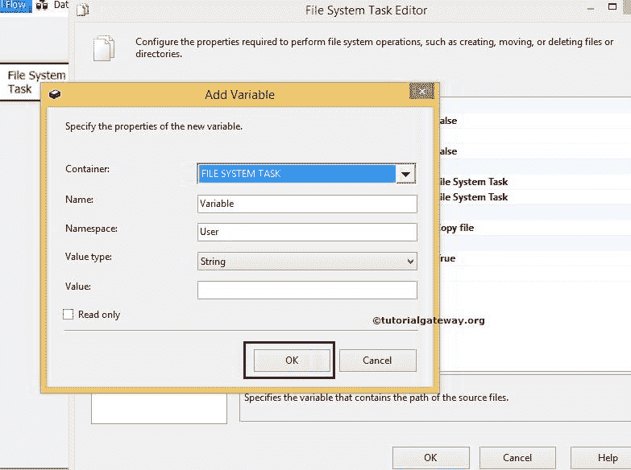

如果我们将 IsSorcePathVariable 设置为 False，则使用 Source Connection 属性配置源连接。如果您已经创建了[文件连接管理器](https://www.tutorialgateway.org/file-connection-manager-in-ssis/)，请从下拉列表中选择相同的文件连接管理器。

如果您之前没有创建任何连接管理器，您必须通过选择<new connection..="">来创建。</new>

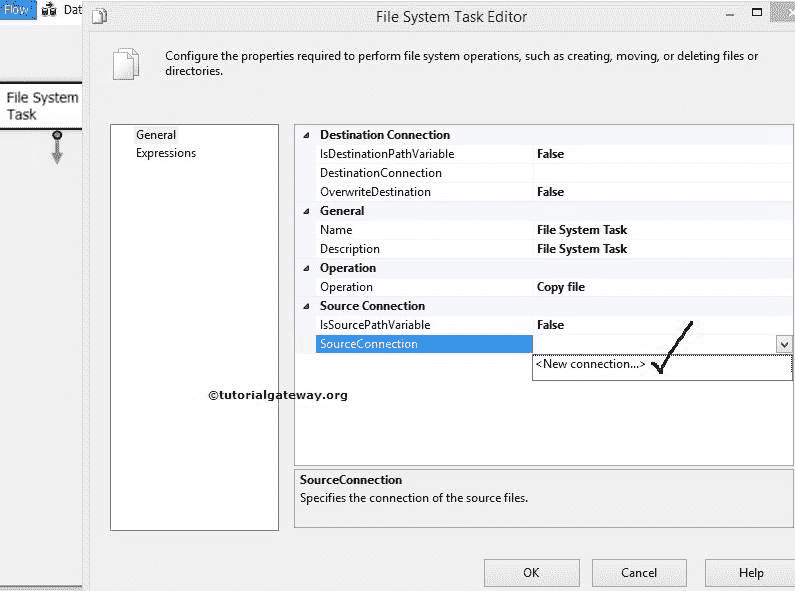

### 在 SSIS 配置文件系统任务的目标连接

IsDestinationPathVariable:这个 SSIS 文件系统任务属性有两个选项:True 和 False。如果我们将此属性设置为 true，目标路径将存储在变量中。如果我们将此属性设置为 false，请使用文件连接管理器手动选择目标路径。

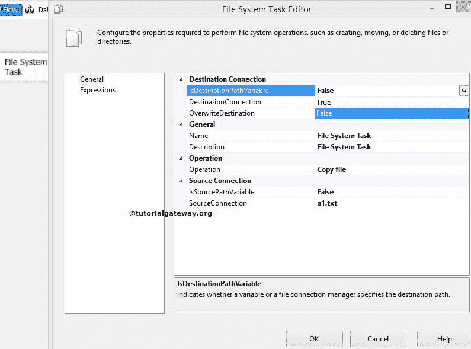

例如，如果我们将 isdestinationpath 变量设置为 False，我们必须使用 Destination Connection 属性配置目标连接。如果您之前创建了文件连接管理器，您可以从下拉列表中选择它。

如果您之前没有创建任何连接管理器，您必须通过选择<new connection..="">来创建。</new>

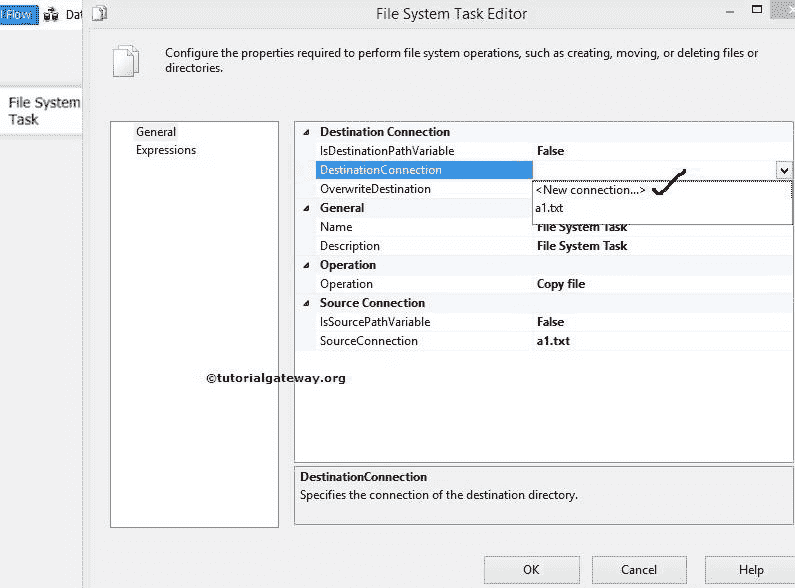

一旦点击<new connection..="">选项，一个名为文件连接管理器编辑器的新窗口打开。使用这个，我们必须配置目标连接。</new>

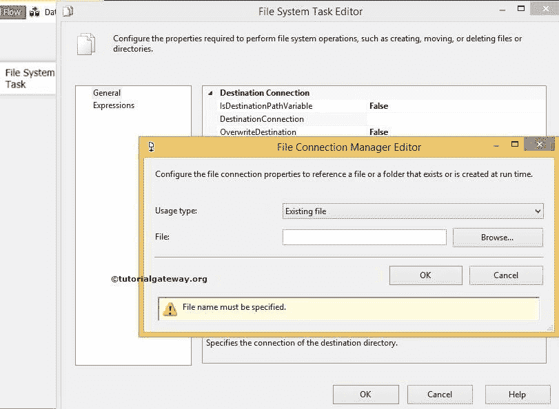

请参考[文件连接管理器](https://www.tutorialgateway.org/file-connection-manager-in-ssis/)一文了解配置。

覆盖定义:此 SSIS 文件系统任务属性有两个选项:真和假。如果我们将此属性设置为 true，文件系统任务将覆盖目标路径中的现有文件。

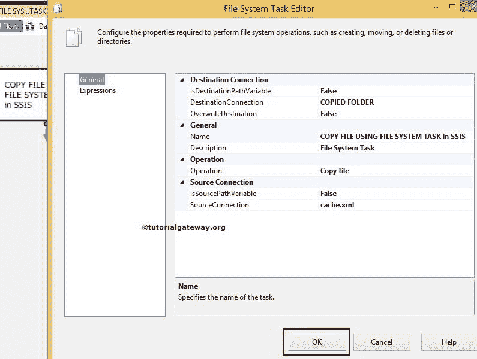

单击确定完成 SSIS 文件系统任务编辑器的配置。