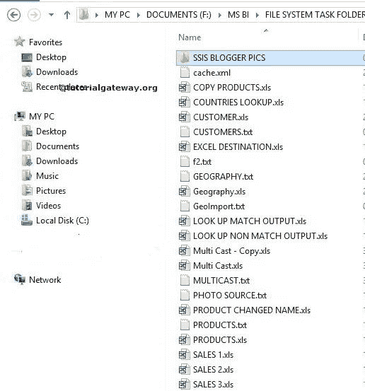

# 在 SSIS 使用文件系统任务复制目录

> 原文：<https://www.tutorialgateway.org/copy-directory-using-file-system-task-in-ssis/>

在本文中，我们通过示例向您展示了如何在 SSIS 使用文件系统任务将目录从一个位置复制到另一个位置。要移动完整的目录，请参考 [SSIS](https://www.tutorialgateway.org/ssis/) 页面中的[使用文件系统任务移动目录](https://www.tutorialgateway.org/move-directory-using-file-system-task-in-ssis/)一文。

我们在 MSBI 文件夹中有文件系统任务文件夹。我们的工作是将文件系统任务文件夹中的 SSIS 博主图片文件夹复制到 F 驱动器中的复制文件夹。

复制文件夹中的文件有:

## 在 SSIS 使用文件系统任务复制目录

将文件系统任务拖放到控制流区域，并在 SSIS

将其重命名为使用文件系统任务复制目录

双击打开[文件系统任务](https://www.tutorialgateway.org/file-system-task-in-ssis/)编辑器进行配置。

在这个例子中，我们正在复制目录。因此将操作属性更改为复制目录

让我们通过选择 Source Connection 属性来配置源连接。如果已经创建了文件连接管理器，请选择已创建的文件连接管理器。或者，如果将源连接存储在变量中，请将 IsSourcePathVariable 属性替换为 TRUE，并选择变量名。

这里，我们之前没有创建任何连接管理器，所以我们选择<new connection..="">。</new>

单击<new connection..="">选项将打开文件连接管理器。在这个例子中，我们正在复制一个现有的目录。所以我们从使用类型</new>

中选择现有文件夹选项

单击浏览按钮选择现有文件夹。

从上面的图片中，可以看到我们选择了文件系统任务文件夹

里面的 SSIS 博主 pics 文件夹

单击“确定”完成源连接的配置。

现在我们必须配置目标连接。因此，请选择 DestinationConnection 属性。如果您已经创建了文件连接管理器，请选择相同的选项。或者，如果将目标连接放在变量中，请将 IsDestinationPathVariable 属性更改为 TRUE，并选择变量名。

这里，我们没有创建任何目标连接管理器。所以，我们选择<new connection..="">。</new>

一旦点击<new connection..="">选项，将打开文件连接管理器编辑器进行配置。单击浏览按钮选择现有文件夹。</new>

从上面的截图中，观察到我们通过单击确定按钮选择了复制的文件夹。

单击“确定”完成目标的文件连接管理器配置。

单击“确定”完成在 SSIS 包中使用文件系统任务配置复制目录。让我们运行并看看是否使用文件系统任务成功复制了目录。

嗯，我们成功地将文件系统任务文件夹中的 SSIS 博主图片目录移动到复制文件夹目录。

