# 在 SSIS 使用文件系统任务复制文件

> 原文：<https://www.tutorialgateway.org/copy-files-using-file-system-task-in-ssis/>

在本文中，我们将通过示例向您展示如何在 SSIS 使用文件系统任务复制文件。要复制完整的目录，请参考[使用文件系统任务复制目录](https://www.tutorialgateway.org/copy-directory-using-file-system-task-in-ssis/)一文。

提示:在 [SSIS](https://www.tutorialgateway.org/ssis/) 请使用 [Foreach Container](https://www.tutorialgateway.org/ssis-foreach-loop-file-enumerator/) 将多个文件从一个位置复制到另一个位置。

我们在 MSBI 文件夹中有文件系统任务文件夹。我们的任务是将文件系统任务文件夹中的缓存. xml 文件复制到 F 驱动器中的复制文件夹。

复制文件夹中的文件有:

## 在 SSIS 使用文件系统任务复制文件

要在 SSIS 使用文件系统任务复制文件，首先将文件系统任务拖放到控制流区域，并将其重命名为在 SSIS 使用文件系统任务复制文件

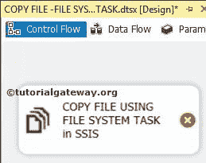

双击打开[文件系统任务](https://www.tutorialgateway.org/file-system-task-in-ssis/)编辑器进行配置。

在这个例子中，我们正在复制一个文件。因此，将操作属性更改为【复制文件】

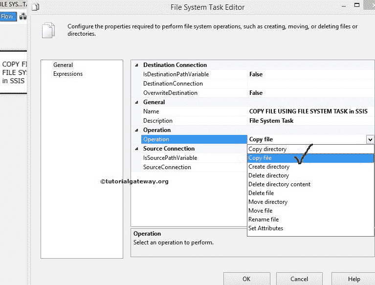

让我们通过选择 Source Connection 属性来配置源连接。如果您之前已经创建了文件连接管理器，请选择已创建的文件连接管理器，或者如果您将源连接存储在变量中，请将 IsSourcePathVariable 属性更改为真，并选择变量名。

这里，我们选择<new connection..="">。</new>

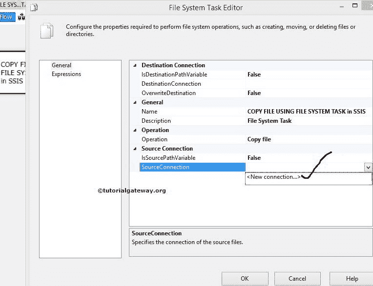

一旦点击<new connection..="">选项，文件连接管理器编辑器打开进行配置。这里，我们正在复制现有文件，因此从“使用类型”中选择“现有文件”选项。</new>

单击浏览按钮从文件系统中选择现有文件。

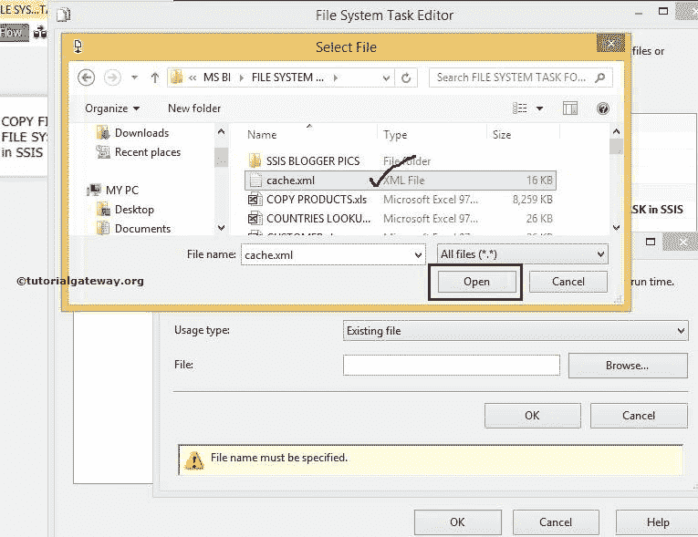

从上面的截图中，可以看到我们选中了

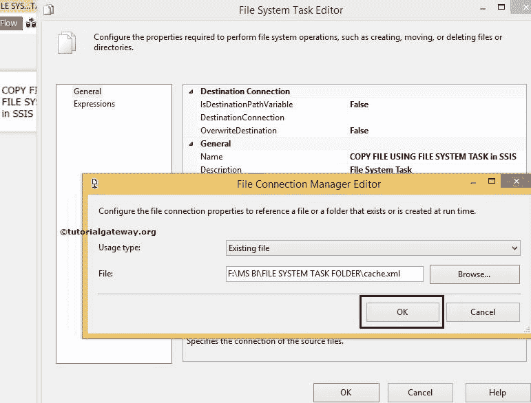

单击“确定”完成源连接的配置。现在我们必须设置目标连接。因此，选择 DestinationConnection 属性。如果您之前已经创建了文件连接管理器，请选择它。或者，如果您将目标连接保存在变量中，请将 IsDestinationPathVariable 字段更改为 TRUE，并选择变量名。

我们没有任何连接管理器。所以，我们选择<new connection..="">。</new>

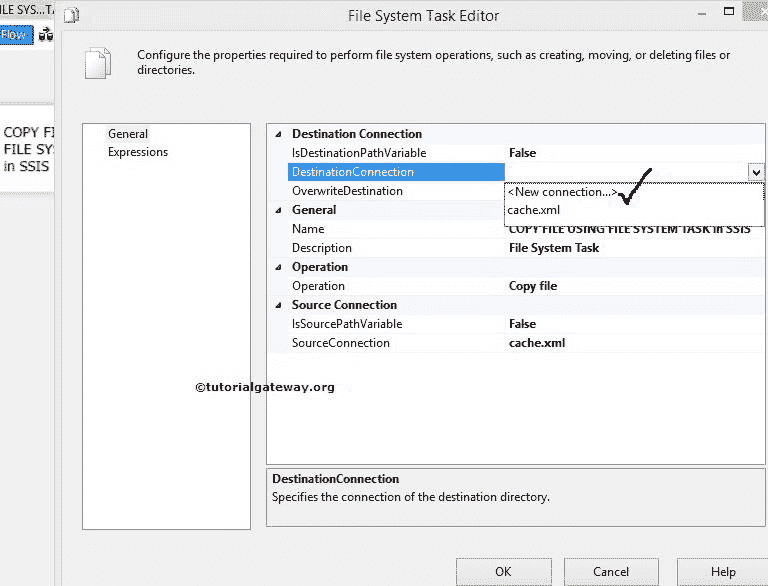

在本例中，我们将现有文件复制到一个已经存在的文件夹中。因此，从“使用类型”中选择“现有文件夹”选项。

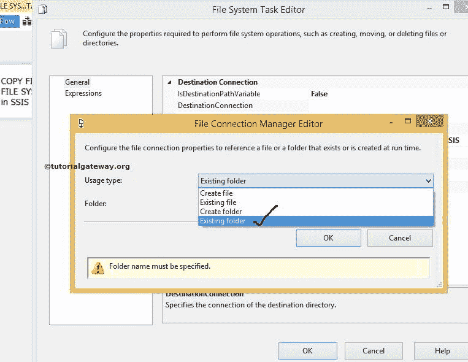

单击浏览按钮从文件系统中选择现有文件夹。

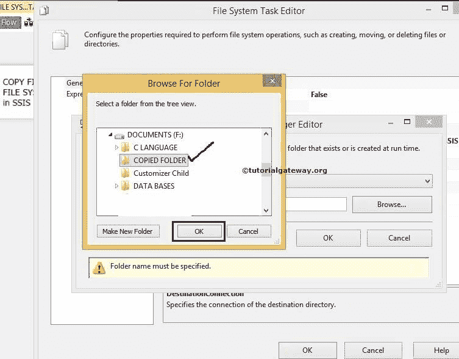

从前面的截图中，您可以看到我们选择了复制的文件夹作为目标文件夹。单击确定按钮选择它。

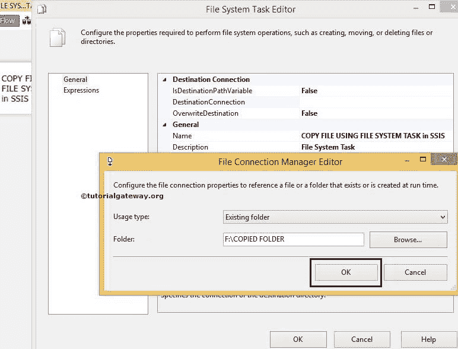

单击“确定”完成目标的文件连接管理器配置。

接下来，单击“确定”以完成在 SSIS 包中配置使用文件系统复制文件任务。让我们运行，看看我们是否使用文件系统任务成功复制了缓存. xml 文件。

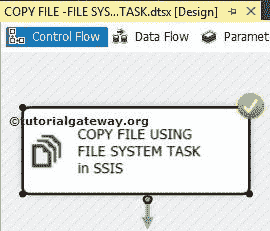

我们成功地将文件系统任务文件夹中的缓存. xml 文件复制到了复制的文件夹中。

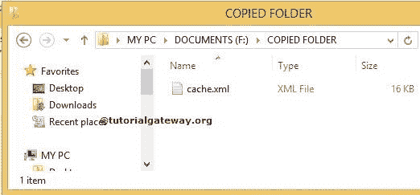